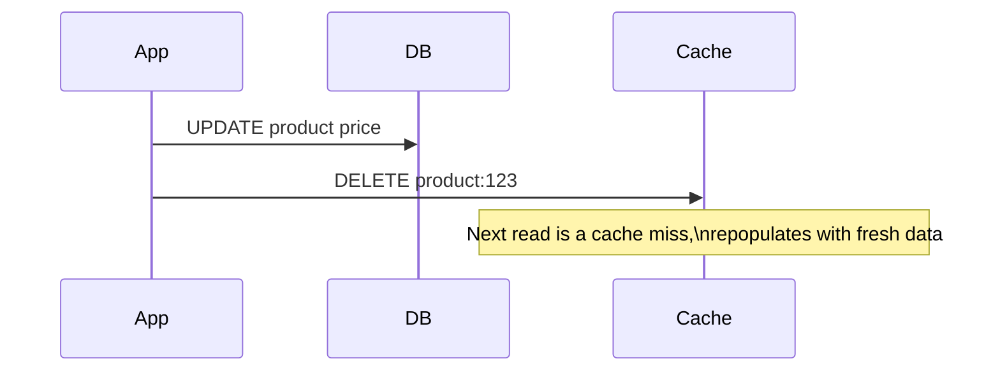
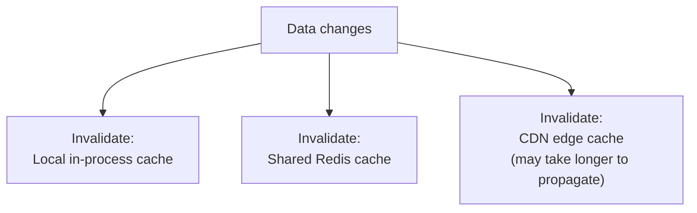

## Definition

Cache invalidation is the process of removing or updating cached data that's no longer valid — because the underlying source of truth has changed — so the cache doesn't keep serving stale data indefinitely.

## Why it exists

A cache's entire value comes from reusing previously fetched or computed data, but that value turns into a liability the moment the underlying data changes and the cache doesn't know about it. Cache invalidation exists to close that gap — giving the cache a reliable way to know when a cached value is no longer trustworthy.

## The problem it solves

Without invalidation, a cache would serve increasingly outdated data forever (or until a TTL happens to expire it) — a genuinely serious correctness bug for any data that changes. Phil Karlton's famous quip — "there are only two hard things in computer science: cache invalidation and naming things" — reflects how genuinely tricky it is to get this right in practice, especially across distributed caches.

## Real-world analogy

A store's printed price tag is a cache of the "true" price stored in the central system. If the true price changes but nobody updates the physical tag, customers keep seeing (and potentially paying) the old price — cache invalidation is the discipline of making sure the tag gets updated (or removed until it can be reprinted) the moment the true price changes, not sometime later when someone happens to notice.

## Simple explanation

There are two main strategies: **explicitly delete or update the cache entry the moment the source changes**, or **let it expire naturally after a set time** ([TTL](/docs/caching/ttl)) and accept a bounded window of staleness. Most real systems use both together.

## Technical explanation

### Invalidation approaches

- **Write-through invalidation**: the moment the source data is written, the application explicitly deletes (or updates) the corresponding cache key.
- **TTL-based expiry**: the cache entry is simply allowed to expire after a set duration, with no explicit action needed on write — simpler, but accepts staleness up to the TTL duration.
- **Event-driven invalidation**: a change to the source publishes an event (e.g. via a message queue), and any interested caches subscribe and invalidate the relevant keys — useful when multiple, independent caches need to be kept in sync with the same source.

### Delete vs. update

Explicitly deleting a cache key on write (rather than updating it directly) is usually safer — it avoids a race condition where a slower concurrent write could overwrite a newer value that another request already placed in the cache. Deleting simply forces the next read to go fetch the current truth.

## Internal working — invalidating across multiple cache nodes/layers

In systems with multiple cache layers (a local in-process cache, a shared Redis cache, a CDN edge cache), invalidation has to reach every layer that might be holding a stale copy — often the hardest part in practice, since it requires either explicit fan-out invalidation logic or accepting that some layers will only catch up once their own TTL expires.

## Advantages of getting invalidation right

- Ensures the cache doesn't serve meaningfully stale data beyond an acceptable, deliberately chosen window.
- Explicit, event-driven invalidation can achieve near-immediate consistency after a write, rather than waiting out a TTL.

## Disadvantages / challenges

- Explicit invalidation requires the application to reliably fire an invalidation on every single code path that changes the underlying data — miss one, and that specific path silently serves stale data indefinitely (until a TTL, if any, eventually catches it).
- Distributed invalidation (across multiple cache layers or regions) is genuinely hard to get perfectly consistent, especially under network partitions or delays.
- Overly aggressive invalidation (invalidating too broadly, or too often) can undermine the cache's effectiveness by causing excessive cache misses.

## Trade-offs

Explicit invalidation gives faster consistency after a write but requires more careful, comprehensive application logic to never miss a code path; TTL-based expiry is simpler and more robust (it doesn't depend on remembering to invalidate) but accepts staleness for up to the full TTL duration. Most production systems use TTL as a safety net *and* explicit invalidation for the common, known write paths.

## Complexity considerations

Invalidating a single cache layer for a single service is manageable. Invalidating consistently across multiple services, multiple cache layers, and multiple regions is a substantially harder problem, often requiring an event-driven approach (publishing change events that all interested caches subscribe to) rather than direct, synchronous invalidation calls.

## When to invest in explicit invalidation

- Data where staleness beyond a very short window is genuinely unacceptable (e.g. a price change that must be reflected immediately).
- Systems with multiple independent caches that all need to be kept reasonably in sync with the same underlying source.

## When TTL alone is sufficient

- Data where a bounded staleness window (seconds to minutes) is entirely acceptable, and the operational simplicity of "just let it expire" outweighs the benefit of more immediate invalidation.

## Common mistakes

- Relying solely on TTL for data where even brief staleness causes a real problem, without any explicit invalidation on the write path.
- Missing a code path that modifies data without triggering the corresponding cache invalidation — a very common, hard-to-catch class of bug.
- Overwriting a cache key directly instead of deleting it, risking a race condition where a slower write overwrites a newer value.

## Interview questions

- "Why is cache invalidation considered one of the hard problems in computer science?"
- "How would you invalidate a cache entry that exists across multiple regions or cache layers?"
- "Why might deleting a cache key on write be safer than updating it directly?"

## Practical example

In the [Caching Strategies](/docs/caching/caching-strategies) page's product-page example, updating a product's price explicitly deletes the `product:<id>` cache key immediately — ensuring the next read repopulates the cache with the correct, current price, rather than waiting out the full TTL and potentially showing the old price to customers in the meantime.

## Production example

Facebook's cache invalidation system (described in their Memcache scaling paper) uses a dedicated mechanism (originally called McSqueal) that hooks into database writes and automatically issues cache invalidations to relevant Memcached servers — explicitly built to handle invalidation reliably at their massive scale, rather than relying purely on TTL expiry.

## Best practices

- Combine explicit invalidation (for known write paths) with a TTL safety net (in case an invalidation is ever missed or fails).
- Delete cache keys on write rather than updating them directly, to avoid race conditions with concurrent writes.
- For multi-layer or multi-region caching, consider an event-driven invalidation approach rather than relying on direct, synchronous invalidation calls to every layer.

## Summary

Cache invalidation ensures a cache stops serving data once it's no longer accurate — via explicit invalidation on write, TTL-based expiry, or (commonly) both together as a belt-and-suspenders approach. It's genuinely difficult to get perfectly right, especially across multiple cache layers or services, which is exactly why it's famously cited as one of the hard problems in computer science.

## References

- Nishtala et al., "Scaling Memcache at Facebook" (2013)
- Phil Karlton's famous "two hard things" quote (widely cited, original source informal)

<Quiz questions={[
  {
    q: "Why is deleting a cache key on write generally safer than updating it directly with the new value?",
    options: [
      "Deleting is always faster",
      "Deleting avoids a race condition where a slower concurrent write could overwrite a newer value already placed by another request",
      "Updating a cache key is not supported by most caches",
      "There's no real difference"
    ],
    answer: 1,
    explanation: "If two writes happen concurrently, directly updating the cache risks the slower write overwriting a newer value from the faster one; deleting the key instead forces the next read to fetch current, correct data from the source of truth."
  }
]} />
