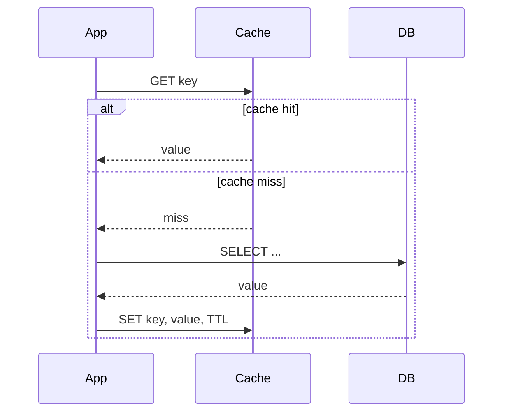

## Definition

A caching strategy is the specific protocol an application follows to keep a fast, temporary store (the cache) in sync with the slower, durable source of truth (usually a database). The five common strategies — **cache-aside**, **read-through**, **write-through**, **write-back**, and **refresh-ahead** — differ in *who* talks to the cache and *when* the cache is updated relative to the database.

## Why it exists

Databases are slow relative to memory — a disk-backed query might take 5-50ms, while an in-memory cache lookup takes under 1ms. As traffic grows, hitting the database for every single read becomes the bottleneck long before CPU or bandwidth does. Caching strategies exist to define exactly *how* a fast memory layer sits in front of that slow source of truth without silently serving wrong data forever.

## The problem it solves

Naively adding a cache without a clear strategy creates two classic bugs:

- **Stale reads** — the cache still has old data after the database changed.
- **Cache stampede** — many requests miss the cache at once (e.g. right after it's cleared) and all hit the database simultaneously, causing a spike that can take the database down.

Each strategy below is really a specific, deliberate answer to "how do we avoid these two problems, and what do we trade away to do it?"

## Real-world analogy

Think of a busy restaurant kitchen. The pantry (database) has every ingredient, but walking to the pantry for every dish is slow. The line cook keeps a small prep station (cache) with the ingredients used most often.

- **Cache-aside** is the cook checking the prep station first, and if it's empty, walking to the pantry themselves, grabbing the ingredient, and refilling the station for next time.
- **Write-through** is: whenever new stock arrives at the pantry, it's immediately also placed on the prep station.
- **Write-back** is: the cook updates the prep station immediately, and only walks the changes back to the pantry occasionally, in a batch — faster for the cook, riskier if the station is lost (a fire) before the pantry is updated.

## Simple explanation

| Strategy | Who updates cache on write? | Who reads first? | Main advantage | Main risk |
|---|---|---|---|---|
| Cache-aside | Application, on cache miss | App checks cache, falls back to DB | Simple, cache only holds requested data | Stale data until TTL expires |
| Read-through | The cache layer itself (transparent to app) | App only talks to cache | Simplifies app code | Cache library lock-in |
| Write-through | Cache layer writes to DB synchronously | — | Cache and DB never diverge | Slower writes (two systems updated per write) |
| Write-back (write-behind) | Cache writes immediately, DB updated later async | — | Very fast writes | Data loss risk if cache fails before flush |
| Refresh-ahead | Cache proactively refreshes before expiry | — | Avoids latency spike on expiry | Wastes work refreshing data nobody re-requests |

## Technical explanation

### Cache-aside (lazy loading)

The application owns the logic. This is the most common pattern in practice (e.g. a typical Redis-in-front-of-Postgres setup) because it's simple and the cache only ever holds data that's actually been requested.

### Write-through

Every write goes to the cache, which synchronously writes to the database before acknowledging. Reads are always fast and always fresh, but every write pays the latency cost of both systems.

### Write-back (write-behind)

Every write goes to the cache, which acknowledges immediately and flushes to the database asynchronously (batched, on a timer, or on eviction). Writes are extremely fast, but if the cache node crashes before flushing, unflushed writes are lost — this is the central trade-off.

### Refresh-ahead

The cache monitors keys nearing expiry and proactively re-fetches them from the database *before* they expire, so no request ever hits a cold cache for popular keys. This avoids the "thundering herd" problem where a hot key's expiry causes many simultaneous DB hits, at the cost of doing refresh work for keys that might not even be requested again.

## Internal working — cache-aside in detail

1. Application receives a read request for `user:1234`.
2. It checks Redis: `GET user:1234`.
3. **Hit**: return immediately, done in under a millisecond.
4. **Miss**: query the database, get the row, then `SET user:1234 <value> EX 300` (5-minute TTL), then return the value.
5. On a write (e.g. the user updates their profile), the application updates the database, then either deletes the cache key (`DEL user:1234`, forcing the next read to repopulate it) or updates it directly.

<Callout type="warning" title="Invalidate, don't just overwrite">
On writes, deleting the cache key is usually safer than overwriting it — overwriting risks a race where a slow write overwrites a newer value that arrived from a concurrent request. Deleting forces the next read to go fetch the current truth from the database.
</Callout>

## Advantages and disadvantages, by strategy

**Cache-aside**
- ✅ Cache only stores what's actually requested (memory-efficient); resilient to cache failures (app can always fall back to DB).
- ❌ First request for any key is always slow (cache miss penalty); risk of stale data between writes and TTL expiry.

**Write-through**
- ✅ Cache is never stale relative to the database.
- ❌ Every write is slower (pays both cache and DB latency); cache fills with data that may never be read.

**Write-back**
- ✅ Fastest possible writes.
- ❌ Real data-loss risk on cache failure; more complex to implement correctly (batching, retry, ordering).

**Refresh-ahead**
- ✅ Eliminates cold-cache latency spikes for hot keys.
- ❌ Wastes compute/bandwidth refreshing keys nobody re-requests; needs good prediction of what counts as "still popular."

## Trade-offs

The single axis every strategy trades along is **write latency vs. consistency guarantee vs. data-loss risk**. There's no strategy that's fast, always-consistent, and zero-risk simultaneously — pick the two that matter most for the specific data you're caching.

## Complexity considerations

Cache-aside is the simplest to reason about and debug, which is why it's the default choice unless you have a specific reason otherwise. Write-back is the most operationally complex — it requires careful handling of flush failures, ordering guarantees, and crash recovery.

## When to use

- **Cache-aside**: default choice for most read-heavy workloads (user profiles, product pages).
- **Write-through**: financial or inventory data where a stale cache read would cause real harm, and you can tolerate slightly slower writes.
- **Write-back**: extremely write-heavy workloads (e.g. counters, analytics events) where some risk of data loss on rare cache failure is acceptable.
- **Refresh-ahead**: a small number of very hot keys (e.g. a homepage config, a trending list) where cold-cache latency spikes are unacceptable.

## When NOT to use

- Don't use write-back for anything you can't afford to lose (payments, order state).
- Don't use refresh-ahead broadly across millions of keys — the background refresh cost scales with the number of keys you're proactively refreshing, not just the popular ones.
- Don't cache highly personalized or rarely-repeated data (e.g. a one-off computed report) — the cache miss rate will be near 100%, wasting memory for no benefit.

## Common mistakes

- Forgetting to set a TTL at all, so stale data lives forever until an explicit invalidation (which is easy to forget in some code path).
- Cache stampede: many requests missing a hot key simultaneously (e.g. right after eviction) all hammering the database at once — mitigated with request coalescing or a short-lived "locking" placeholder.
- Treating the cache as a durable store — always design assuming the cache can be wiped at any moment.

## Interview questions

- "Walk me through what happens on a cache miss with cache-aside."
- "Why might you choose write-back over write-through for a 'like counter' feature?"
- "How would you prevent a cache stampede on a very popular product page?"
- "What happens to your cache-aside cache if the cache cluster restarts?" (Good answer: cold cache, temporary spike in DB load, then it repopulates as reads occur — no data loss since the DB was always the source of truth.)

## Practical example

A product page for an e-commerce site: cache-aside with a 60-second TTL on `product:<id>`. On the (rare) product-price-update path, the app explicitly deletes the cache key so the next read repopulates it with the new price — cheaper and simpler than write-through for a low-write, high-read workload.

## Production example

Facebook's Memcache paper describes exactly this cache-aside pattern operating at massive scale — thousands of memcached servers in front of MySQL, with explicit invalidation on writes (called "leases" in their system to also prevent stampedes) rather than write-through, because their workload is overwhelmingly read-heavy.

## Best practices

- Always set a TTL, even a generous one, as a safety net against invalidation bugs.
- Use cache-aside by default; only reach for write-through/write-back when you have a specific, measured reason.
- Add jitter to TTLs (e.g. 300s ± 30s) so many keys don't expire at exactly the same moment and cause a stampede.
- Monitor cache hit rate — a low hit rate usually means you're caching the wrong things, not that you need a bigger cache.

## Summary

Caching strategies define who updates the cache and when, relative to the database. Cache-aside (lazy, app-driven) is the simple, resilient default. Write-through trades write latency for guaranteed freshness. Write-back trades data-loss risk for very fast writes. Refresh-ahead trades background compute for eliminating cold-cache latency on hot keys. None of them are free — choose based on which failure mode you can tolerate for the specific data you're caching.

## References

- Nishtala et al., "Scaling Memcache at Facebook" (2013)
- Redis documentation: caching patterns

<Quiz questions={[
  {
    q: "Which strategy has the biggest risk of data loss if the cache crashes?",
    options: ["Cache-aside", "Write-through", "Write-back", "Refresh-ahead"],
    answer: 2,
    explanation: "Write-back acknowledges writes immediately and flushes to the database asynchronously — if the cache crashes before flushing, those writes are lost."
  },
  {
    q: "On a write in a cache-aside setup, what's generally safer than overwriting the cache key directly?",
    options: [
      "Doing nothing and waiting for TTL",
      "Deleting the cache key so the next read repopulates it from the database",
      "Writing to two caches at once",
      "Disabling the cache temporarily"
    ],
    answer: 1,
    explanation: "Deleting avoids a race condition where a slow write could overwrite a newer value already placed by a concurrent request; the next read is guaranteed to fetch current truth from the database."
  }
]} />

<Flashcards cards={[
  { front: "Cache-aside", back: "App checks cache first; on miss, reads DB and populates cache itself." },
  { front: "Write-through", back: "Every write goes through the cache, which synchronously writes to the DB — always fresh, slower writes." },
  { front: "Write-back", back: "Cache acknowledges writes immediately, flushes to DB asynchronously — fastest writes, risk of data loss." },
  { front: "Refresh-ahead", back: "Cache proactively refreshes hot keys before they expire, avoiding cold-cache latency spikes." }
]} />
