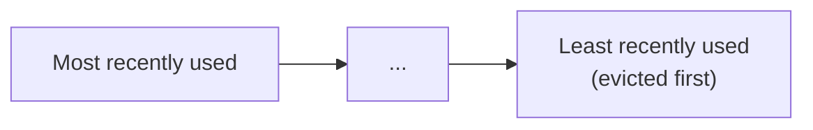

## Definition

An eviction policy is the rule a cache uses to decide which existing entries to remove when it's full and needs room for new data. Common policies include **LRU** (Least Recently Used), **LFU** (Least Frequently Used), and **FIFO** (First In, First Out).

## Why it exists

Cache memory is finite — a cache can't simply grow forever as new data is added. Eviction policies exist to answer the inevitable question: when the cache is full and a new entry needs to be stored, which existing entry should be sacrificed to make room?

## The problem it solves

A cache with no eviction strategy (or a poorly chosen one) either runs out of memory entirely, or keeps low-value entries around (rarely accessed) while evicting high-value ones (frequently accessed) — actively hurting the cache's hit rate and undermining its whole purpose. A good eviction policy keeps the cache's limited space filled with the entries most likely to be reused.

## Real-world analogy

A small kitchen fridge that's completely full and needs room for a new item forces a decision: throw out the science-fair-project leftovers that have been sitting untouched for three weeks (the entries nobody's accessed in a long time), not the milk you use every single morning. Eviction policies formalize exactly this instinct — different policies just use different signals for "which item is safest to throw out."

## Simple explanation

- **LRU (Least Recently Used)**: evict whichever entry hasn't been accessed for the longest time — assumes recently used data is likely to be used again soon.
- **LFU (Least Frequently Used)**: evict whichever entry has been accessed the fewest total times — assumes overall popularity matters more than recency.
- **FIFO (First In, First Out)**: evict whichever entry was added longest ago, regardless of how often or recently it's been accessed — simplest to implement, but ignores actual usage patterns entirely.

## Technical explanation

### LRU implementation (the most common choice)

LRU is typically implemented with a combination of a hash map (for O(1) lookups) and a doubly-linked list (to track recency order) — when an entry is accessed, it's moved to the "most recently used" end of the list; when eviction is needed, the entry at the "least recently used" end is removed.

### Comparing policies

| Policy | Assumes | Weakness |
|---|---|---|
| LRU | Recently accessed data will likely be accessed again | Can evict a genuinely popular item that just hasn't been accessed very recently (e.g. a weekly report) |
| LFU | Overall access frequency predicts future access | Can keep old, once-popular-but-now-irrelevant items around simply because of high historical count, while never giving new items a chance to build up frequency |
| FIFO | None specifically — just insertion order | Ignores actual usage entirely — can evict a very frequently accessed item just because it happened to be added early |

## Internal working — why LRU is the common default

LRU tends to work well in practice because many real-world access patterns exhibit **temporal locality** — data accessed recently is disproportionately likely to be accessed again soon (a user browsing a product, a post going through a burst of engagement). This isn't universally true for every workload, which is why LFU or a hybrid approach sometimes fits better for access patterns with strong, stable long-term popularity differences rather than short-term recency bursts.

## Advantages

- **LRU**: simple to reason about, works well for many common access patterns with temporal locality, well-supported natively by most caches (Redis, Memcached).
- **LFU**: better suited to workloads where overall long-term popularity is a stronger predictor than recent access.
- **FIFO**: simplest to implement, useful when access pattern doesn't meaningfully correlate with likely future access at all.

## Disadvantages

- **LRU**: can be tricked by a single burst of one-time scanning access (e.g. a full table scan) evicting genuinely valuable, frequently-used entries — a known weakness sometimes called "cache pollution."
- **LFU**: needs to track access counts over time, adding some overhead, and can unfairly disadvantage new entries that haven't had time to accumulate frequency yet.
- **FIFO**: ignores actual usage patterns entirely, often performing worse than LRU or LFU for typical, realistic workloads.

## Trade-offs

There's no universally "best" eviction policy — the right choice depends on whether recency (LRU), frequency (LFU), or neither (FIFO, simplicity) best matches your actual access pattern. Many production caches (Redis included) offer several eviction policy options specifically because different workloads genuinely benefit from different choices.

## Complexity considerations

LRU is well-supported natively in most caching systems and requires no extra thought to adopt. LFU (and more sophisticated hybrid policies) require more careful tuning and are usually only worth the added complexity when LRU has been observed to perform poorly for a specific, measured access pattern.

## When to use LRU

- The default, sensible choice for most general-purpose caching use cases, especially when access patterns show temporal locality (recently accessed data tends to be re-accessed soon).

## When to consider LFU or another policy

- Workloads with strong, stable long-term popularity differences that aren't well captured by short-term recency alone (e.g. a small set of consistently popular reference items, alongside a much larger set of rarely-accessed ones).

## Common mistakes

- Assuming LRU is always the right choice without considering whether the actual access pattern has strong temporal locality or not.
- Not accounting for cache pollution from one-off bulk scans evicting genuinely valuable frequently-used entries under a pure LRU policy.
- Setting cache size too small relative to the actual working set, causing constant eviction and low hit rate regardless of which eviction policy is chosen — the underlying capacity, not just the policy, is sometimes the real issue.

## Interview questions

- "Why might LRU be a poor fit for a workload with a one-time bulk scan operation mixed in with normal, popular-item access?"
- "When would you choose LFU over LRU for a cache eviction policy?"
- "How would you implement LRU with O(1) time complexity for both access and eviction?"

## Practical example

A CDN's edge cache commonly uses LRU (or a close variant) specifically because content popularity tends to have strong temporal locality — a newly published article getting a burst of traffic today is likely to keep getting traffic in the near term, and LRU naturally keeps it cached during that window.

## Production example

Redis supports several configurable eviction policies (`allkeys-lru`, `allkeys-lfu`, `volatile-ttl`, and others), letting operators choose the policy that best matches their specific workload's access pattern rather than being locked into a single default.

## Best practices

- Start with LRU as a sensible default for general-purpose caching, and only consider LFU or another policy if you have measured evidence that LRU is underperforming for your specific access pattern.
- Monitor cache hit rate as the real signal of whether your eviction policy (and cache size) is well matched to your workload — a declining hit rate is the clearest sign something needs adjusting.
- Size the cache appropriately for your actual working set — no eviction policy can compensate for a cache that's simply too small for the data that's genuinely being reused.

## Summary

Eviction policies determine which cached entries get removed when a cache is full and needs room for new data. LRU (evict least recently used) is the common, sensible default thanks to the temporal locality present in many real-world access patterns, while LFU (evict least frequently used) and FIFO (evict oldest) suit different, less common access patterns — the right choice depends on matching the policy to your actual, measured workload behavior.

## References

- Redis documentation: eviction policies
- Operating Systems textbooks on page replacement algorithms (LRU's origins predate caching for web applications)

<Quiz questions={[
  {
    q: "Why can a pure LRU eviction policy sometimes perform poorly during a one-time bulk data scan?",
    options: [
      "LRU doesn't support bulk operations at all",
      "The bulk scan touches many entries just once, which can push out genuinely popular, frequently-reused entries under a purely recency-based policy - a problem sometimes called cache pollution",
      "LRU only works with numeric keys",
      "This scenario never causes any issue with LRU"
    ],
    answer: 1,
    explanation: "Because LRU only tracks recency, not frequency, a burst of one-off accesses from a bulk scan can fill the 'recently used' end of the cache and evict entries that are actually accessed far more often overall, just less recently — this is the classic weakness LFU is sometimes chosen to address."
  }
]} />
