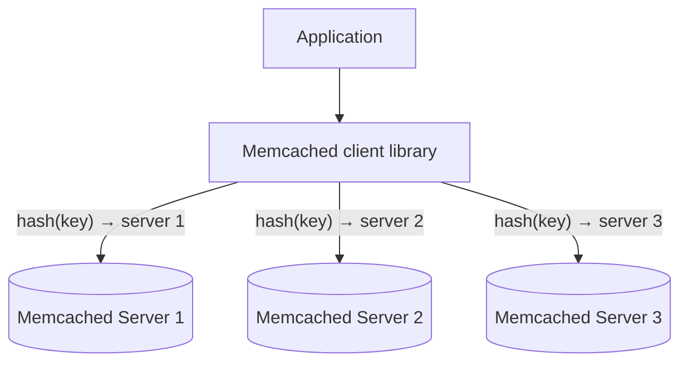

## Definition

Memcached is a simple, high-performance, distributed in-memory key-value cache. Unlike [Redis](/docs/caching/redis), it deliberately supports only a plain key-value model (no rich data structures) and provides no built-in persistence — it's designed to do one thing (fast, ephemeral caching) as simply and efficiently as possible.

## Why it exists

Before Redis's richer feature set became widely adopted, Memcached was created (originally at LiveJournal in 2003) to solve a specific, narrow problem: reduce database load by caching the results of expensive queries in memory. It exists as the simpler, more focused alternative in the caching space — deliberately avoiding the added complexity of persistence or advanced data structures in favor of doing the core caching job with minimal overhead.

## The problem it solves

High-traffic web applications were (and still are) commonly bottlenecked by repeated, expensive database queries for the same data. Memcached solves this directly: cache the query result in memory, keyed by something identifying the query, and serve subsequent identical requests from memory instead of hitting the database again.

## Real-world analogy

If Redis is a well-equipped workshop with many specialized tools for different jobs, Memcached is a single, extremely reliable, extremely fast basic tool that does exactly one job — store a labeled item, retrieve it by label — and does that one job about as efficiently as possible, with no extra features to configure or reason about.

## Simple explanation

Memcached stores key-value pairs entirely in memory across a cluster of servers, with no persistence to disk — if a Memcached server restarts, everything it held is gone, by design, since it's meant purely as a cache in front of a real, durable data source.

## Technical explanation

### Core operations

```
SET user:123 "<serialized user data>" 300  -- store with 300s TTL
GET user:123
DELETE user:123
```

That's essentially the whole interface — no lists, no sorted sets, no persistence configuration. Values are typically opaque byte blobs (often serialized objects) from Memcached's perspective; it doesn't understand or operate on their internal structure the way Redis's data structures do.

### Distributed architecture

Memcached clients typically use **consistent hashing** (see [Consistent Hashing](/docs/distributed-systems/consistent-hashing)) on the client side to determine which Memcached server in a cluster holds a given key — the servers themselves don't coordinate or know about each other; all the distribution logic lives in the client library.



## Advantages

- Extremely simple, focused design — fewer features means less operational complexity and a smaller surface area for things to go wrong.
- Multi-threaded by design, which can make better use of multiple CPU cores for very high-throughput workloads compared to Redis's largely single-threaded model.
- Minimal memory overhead per stored item, since there's no need to support complex internal data structures.

## Disadvantages

- No persistence at all — a restart loses everything, which is fine for pure caching but means Memcached can never serve as anything beyond a cache.
- No rich data structures — anything beyond simple key-value (like a sorted leaderboard) needs to be built entirely in application code.
- No built-in replication — losing a Memcached node loses that portion of the cached data outright (acceptable for a pure cache-aside setup, since the backing store still has the real data).

## Trade-offs

Memcached trades Redis's richer feature set (data structures, persistence, replication, Pub/Sub) for simplicity and a lean, highly efficient, purely in-memory caching model — the right trade when the use case is genuinely just "cache simple key-value results," and a limiting trade when richer data structures or any durability is actually needed.

## Complexity considerations

Memcached's minimal feature set makes it operationally simple to reason about — there's very little to configure or misconfigure. This simplicity is itself a deliberate design advantage for teams that specifically want "just a cache" without the broader capability (and corresponding complexity) Redis offers.

## When to use

- Simple, high-throughput caching of query results or computed values, where multi-threaded throughput and minimal overhead matter more than rich data structures or persistence.
- Environments already comfortable with client-side consistent hashing for distributing cache load across a cluster.

## When NOT to use

- Any use case needing data structures beyond simple key-value (leaderboards, queues) — Redis is a better fit.
- Any use case needing even limited persistence or built-in replication — Memcached deliberately doesn't provide this.

## Common mistakes

- Choosing Memcached and then reimplementing Redis-like data structures (sorted sets, lists) awkwardly in application code, when Redis would have been a more natural fit from the start.
- Assuming Memcached provides any durability — a restart or crash loses everything it held, by design, and application logic must always be able to fall back gracefully to the real data source (see [Caching Strategies](/docs/caching/caching-strategies)).
- Not accounting for uneven load distribution if the client-side hashing scheme doesn't handle "hot" keys well.

## Interview questions

- "When would you choose Memcached over Redis, or vice versa?"
- "What happens to cached data if a Memcached node crashes, and why is that an acceptable trade-off for a cache-aside setup?"
- "How does a Memcached client know which server holds a given key?"

## Practical example

A high-traffic web application caches the rendered HTML fragments of expensive-to-generate page sections in Memcached, keyed by a hash of the page's parameters — a pure, simple key-value caching use case that doesn't need any of Redis's richer data structures or persistence options.

## Production example

Facebook's well-known "Scaling Memcache at Facebook" paper describes running one of the largest Memcached deployments in the world, specifically chosen for its simplicity and multi-threaded throughput at their massive caching scale, layered with their own additional tooling (like leases, to help prevent cache stampedes) on top of Memcached's simple core.

## Best practices

- Choose Memcached specifically when the use case is simple key-value caching and doesn't need Redis's richer data structures or persistence.
- Design application logic to always gracefully handle a cache miss (or a Memcached node being unavailable) by falling back to the real data source — never treat Memcached as a durable store.
- Use a well-tested client library with solid consistent-hashing support to distribute load evenly across a Memcached cluster.

## Summary

Memcached is a simple, high-performance, purely in-memory key-value cache with no persistence and no rich data structures — a deliberately minimal design that trades Redis's broader feature set for operational simplicity and strong multi-threaded throughput. It remains an excellent choice specifically for straightforward, high-volume key-value caching, and a poor fit for anything needing more than that.

## References

- Memcached official documentation
- Nishtala et al., "Scaling Memcache at Facebook" (2013)

<Quiz questions={[
  {
    q: "What is a key structural difference between Memcached and Redis?",
    options: [
      "Memcached is not a cache at all",
      "Memcached supports only simple key-value storage with no persistence, while Redis offers rich data structures and optional persistence",
      "Redis cannot be used for caching",
      "There is no meaningful difference between them"
    ],
    answer: 1,
    explanation: "Memcached deliberately keeps a minimal, purely in-memory key-value model with no persistence, while Redis supports richer data structures (sorted sets, lists, hashes) and optional persistence, making it suitable for a broader range of use cases beyond simple caching."
  }
]} />
