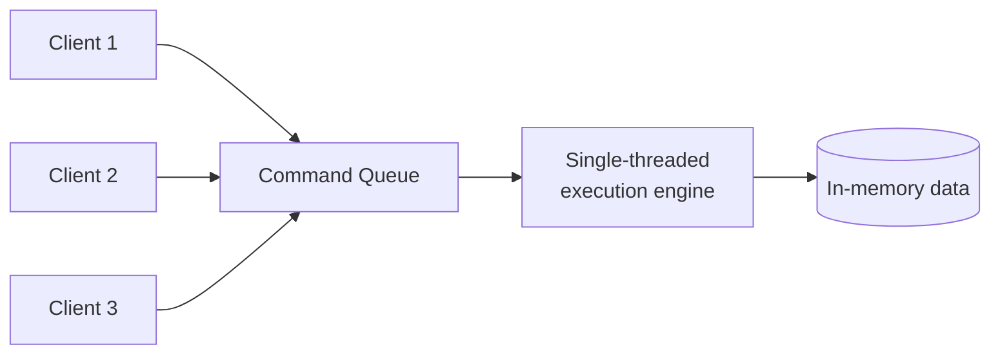

## Definition

Redis is an open-source, in-memory data store, commonly used as a cache, message broker, and lightweight database. Unlike a simple key-value cache, Redis supports rich data structures (lists, sets, sorted sets, hashes) natively, making it useful for more than just caching alone.

## Why it exists

Applications frequently need extremely fast access to frequently-used data, and often need more than a plain key→string mapping — a leaderboard needs sorted data, a feed needs a list, a set of unique visitor IDs needs set operations. Redis exists to provide a single, fast, in-memory store that handles these common data-structure needs directly, rather than every application reimplementing them on top of a plain key-value store.

## The problem it solves

A generic key-value cache forces applications to build higher-level data structures themselves, in application code, on top of simple get/set operations — inefficient and error-prone for things like maintaining a sorted leaderboard or a deduplicated set. Redis solves this by implementing these structures natively, in memory, with atomic operations the application can rely on directly.

## Real-world analogy

A plain key-value cache is like a wall of numbered lockers, each holding one labeled item. Redis is like that same wall of lockers, except some lockers can also hold an already-sorted stack of index cards, or a set of unique tokens with fast membership checks built in — the storage location itself understands more sophisticated structure, so you don't have to build that structure yourself every time you need it.

## Simple explanation

Redis stores data in memory (with optional persistence to disk) and supports commands to manipulate several core data types directly: strings, lists, sets, sorted sets, and hashes — each with operations (push, pop, increment, rank) that are fast and atomic.

## Technical explanation

### Core data structures

| Type | Example use case |
|---|---|
| String | Simple cached values, counters (`INCR`) |
| List | A queue or a recent-activity feed |
| Set | Unique visitor tracking, tag membership |
| Sorted Set | Leaderboards, rate limiting windows |
| Hash | Storing an object's fields (e.g. a user record) compactly |

```
SET user:123:name "Ada"
INCR page:456:views
ZADD leaderboard 1500 "player1"
ZREVRANGE leaderboard 0 9  -- top 10 scores
```

### Persistence options

Redis is primarily an in-memory store, but supports optional persistence:

- **RDB snapshots**: periodic point-in-time snapshots of the dataset written to disk.
- **AOF (Append-Only File)**: logs every write operation, allowing more precise recovery, at some added overhead.

<Callout type="note" title="Redis isn't purely a cache">
Because of its persistence options and rich data structures, Redis is often used for more than caching — session storage, rate limiting, real-time leaderboards, and even as a lightweight message broker (via Pub/Sub or Streams) — though it's not a replacement for a full-featured primary database for most transactional workloads.
</Callout>

## Internal working — single-threaded execution model

Redis famously processes commands on a single main thread (though newer versions offload some I/O to background threads) — this might seem limiting, but it actually simplifies reasoning about concurrent operations significantly, since individual commands are inherently atomic with no need for explicit locking, and Redis's raw speed (millions of simple operations per second) means single-threaded execution is rarely the actual bottleneck for typical use cases.



## Advantages

- Extremely fast — in-memory operations typically complete in sub-millisecond time.
- Rich, native data structures reduce the need for application-level reimplementation of common patterns (leaderboards, queues, deduplication).
- Atomic operations on these structures avoid race conditions that would otherwise require explicit application-level locking.

## Disadvantages

- Data is primarily memory-resident — total dataset size is limited by available RAM (though disk-backed persistence and clustering help scale this).
- Persistence options (RDB, AOF) involve trade-offs between performance and durability — neither gives the same durability guarantees as a proper ACID-compliant primary database.
- Single-threaded command execution means one very slow, expensive command can briefly block all other operations.

## Trade-offs

Redis trades some durability guarantees and memory-cost-per-byte-stored for extreme speed and rich, convenient data structures — an excellent fit for caching and ephemeral, frequently-accessed data, and a poor fit as the sole, primary system of record for data that must never be lost.

## Complexity considerations

Using Redis as a simple cache (get/set with a TTL) is straightforward. Using its more advanced features (Pub/Sub, Streams, Lua scripting for complex atomic operations, clustering for horizontal scale) requires more specific expertise and careful capacity planning around memory usage.

## When to use

- Caching (the most common use case) — see [Caching Strategies](/docs/caching/caching-strategies).
- Session storage, rate limiting counters, real-time leaderboards, and other use cases that benefit from Redis's native data structures and speed.

## When NOT to use

- As the sole, primary system of record for data requiring strong durability guarantees and complex relational queries — a proper relational or document database is a better fit for that role.
- Datasets far larger than what's reasonable to keep substantially in memory, without a clear caching (not full-storage) use case justifying it.

## Common mistakes

- Treating Redis as a fully durable primary database without understanding its persistence trade-offs.
- Running a single Redis instance with no replication or persistence for data that would be genuinely costly to lose on a restart or crash.
- Storing very large values or an enormous number of keys without monitoring memory usage, risking evictions or out-of-memory conditions.

## Interview questions

- "Why might you choose Redis's sorted set data structure for a leaderboard feature, instead of implementing sorting in application code?"
- "What are the durability trade-offs of using Redis as a cache versus as a primary data store?"
- "Why does Redis's single-threaded execution model not become a bottleneck for most use cases?"

## Practical example

A real-time gaming leaderboard uses a Redis sorted set (`ZADD`, `ZREVRANGE`), letting the application fetch the top 10 players by score in a single, fast, atomic operation — reimplementing this efficiently in application code on top of a plain key-value cache would be considerably more complex and error-prone.

## Production example

Twitter has publicly discussed using Redis extensively for use cases like caching and real-time counting, specifically leveraging its speed and native data structures (like sorted sets) for features requiring fast, frequently-updated ranked data.

## Best practices

- Use Redis's native data structures (sorted sets, hashes, lists) rather than reimplementing similar logic on plain string keys in application code.
- Enable appropriate persistence (RDB/AOF) and replication for any Redis use case where losing data on a restart or crash would be a real problem, and treat pure caching use cases (where data can be safely regenerated from the source of truth) differently.
- Monitor memory usage and set appropriate eviction policies (see [Eviction Policies](/docs/caching/eviction-policies)) to handle the case where the dataset approaches available memory.

## Summary

Redis is a fast, in-memory data store offering rich, native data structures (strings, lists, sets, sorted sets, hashes) beyond simple key-value caching, with optional persistence for use cases needing more durability than pure ephemeral caching. Its speed comes from in-memory storage and a simple, largely single-threaded execution model, at the trade-off of being memory-bound and requiring careful consideration before being used as a system's sole source of truth.

## References

- Redis official documentation
- Twitter Engineering Blog: Redis usage at scale

<Quiz questions={[
  {
    q: "Why is Redis's sorted set data structure well-suited for a leaderboard feature?",
    options: [
      "Sorted sets are the only data structure Redis supports",
      "Sorted sets maintain elements in ranked order natively, letting the application fetch top-N rankings directly without implementing sorting logic itself",
      "Sorted sets are slower but more durable",
      "Leaderboards require a relational database, not Redis"
    ],
    answer: 1,
    explanation: "Redis's sorted set keeps members ordered by score automatically, so operations like 'get the top 10 by score' are fast, native, atomic operations rather than something the application needs to implement itself on top of a simpler data type."
  }
]} />
