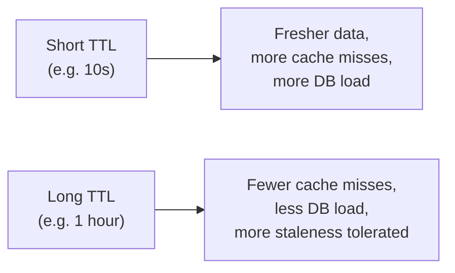

## Definition

TTL (Time To Live) is a duration set on a cached entry after which it automatically expires and is treated as no longer valid — the simplest and most common mechanism for bounding how stale cached data can become.

## Why it exists

Explicit [cache invalidation](/docs/caching/cache-invalidation) on every single write path is powerful but fragile — miss one code path that changes the underlying data, and that path silently serves stale data forever. TTL exists as a robust safety net: regardless of whether explicit invalidation happens or is ever missed, cached data is guaranteed to expire and be refreshed after, at most, the TTL duration.

## The problem it solves

Without any expiry mechanism, a cache entry could theoretically live forever, serving increasingly stale data if an invalidation is ever missed, buggy, or simply doesn't exist for a given code path. TTL solves this by putting a hard upper bound on staleness — no matter what else goes wrong, data is never more than TTL-seconds old.

## Real-world analogy

A "best by" date on a carton of milk is a TTL — even if nobody explicitly tells you the milk has gone bad, the printed date gives you a reliable, automatic bound on how long to trust it without checking further. You don't need a notification system telling you exactly when milk spoils; the date alone is a good-enough, simple, robust bound.

## Simple explanation

When you cache a value, you set a TTL (e.g. 300 seconds). After that time elapses, the cache entry is automatically considered expired — either actively removed, or simply treated as a miss the next time it's requested, forcing a fresh fetch from the source.

## Technical explanation

```
SET user:123 "<data>" EX 300   -- expires in 300 seconds
```

Most caches (Redis, Memcached) implement TTL natively — either through **active expiry** (a background process periodically scans for and removes expired keys) or **lazy expiry** (a key is checked for expiration at the moment it's accessed, and treated as a miss if expired), or commonly both, for efficiency.

## Internal working — choosing a TTL value

Choosing the right TTL is a direct, explicit trade-off:



The right value depends entirely on the specific data: how often it actually changes, and how costly a brief window of staleness is for that specific use case. There's no universal "correct" TTL — it's a per-data-type decision.

<Callout type="tip" title="Add jitter to prevent synchronized expiry stampedes">
If many cache keys are all set with the exact same TTL at roughly the same time (e.g. a cache warmed up all at once), they can all expire simultaneously, causing a spike of simultaneous cache misses hitting the database at once — a "thundering herd." Adding a small random jitter to each key's TTL (e.g. 300s ± 30s) spreads out expirations and avoids this synchronized spike.
</Callout>

## Advantages

- Extremely simple and robust — works as a safety net even if explicit invalidation is missed or has a bug somewhere.
- Requires no coordination with the write path at all — a TTL-only cache doesn't need the application to remember to invalidate anything.
- Naturally self-heals — even a "wrong" or missed invalidation is bounded and corrects itself once the TTL elapses.

## Disadvantages

- Guarantees only a bounded staleness window, not immediate consistency — data can be up to TTL-seconds stale, even under normal operation.
- Choosing a TTL that's too long risks meaningfully stale data being served for longer than acceptable; choosing one that's too short reduces the cache's effectiveness (more misses, more load on the source).
- Doesn't help at all in the moment right after a write, if the previous cached value hasn't expired yet — this is exactly why TTL is usually paired with explicit invalidation on known write paths, not relied on alone for data with strict freshness needs.

## Trade-offs

TTL trades some guaranteed freshness for simplicity and robustness against missed invalidations — the right approach as a baseline for essentially all cached data, and best combined with explicit invalidation specifically for write paths where staleness has a real, immediate cost.

## Complexity considerations

Setting a single TTL value is trivial. Choosing the *right* TTL for a specific piece of data — balancing staleness tolerance against cache effectiveness — requires understanding the actual data's change frequency and the real cost of staleness, which is a judgment call rather than a technical one.

## When to rely on TTL alone

- Data where a bounded staleness window (seconds to low minutes) is entirely acceptable, and where the operational simplicity of not needing explicit invalidation logic is valuable.

## When to combine TTL with explicit invalidation

- Data where staleness has real, immediate cost (e.g. a price change), where you want near-immediate consistency on writes, but still want the safety net of a TTL in case an invalidation is ever missed.

## Common mistakes

- Setting no TTL at all, letting a cache entry live indefinitely unless explicitly invalidated — risky, since a missed invalidation then has no bound at all.
- Setting the exact same TTL on many keys populated at the same time, causing a synchronized expiry spike (thundering herd) instead of adding jitter to spread it out.
- Choosing a TTL based on convenience or a round number, rather than the actual acceptable staleness window for that specific data.

## Interview questions

- "How would you choose an appropriate TTL for caching a product's price versus a user's profile picture?"
- "What problem can arise if many cache keys share the exact same TTL, and how would you prevent it?"
- "Why is TTL often used together with explicit cache invalidation, rather than as a replacement for it?"

## Practical example

In the [Caching Strategies](/docs/caching/caching-strategies) page's product-page example, a 60-second TTL provides a safety net bound on staleness even without explicit invalidation, while an explicit delete on price updates handles the common, known write path immediately — the two mechanisms working together.

## Production example

Most CDN and HTTP caching layers rely heavily on TTL-style expiry via `Cache-Control: max-age` headers, precisely because it's a simple, robust mechanism that doesn't require the origin server to explicitly and reliably notify every downstream cache of every change.

## Best practices

- Always set a TTL, even a generous one, as a baseline safety net — never rely purely on explicit invalidation with no expiry bound at all.
- Add jitter to TTLs for keys likely to be populated in bulk at similar times, to avoid synchronized expiry spikes.
- Choose TTL values based on the actual change frequency and staleness tolerance of the specific data, not a single default value applied uniformly everywhere.

## Summary

TTL sets an automatic expiration on cached data, providing a simple, robust bound on staleness that doesn't depend on the application correctly remembering to invalidate every write path. It's best used as a universal safety net, combined with explicit invalidation specifically for write paths where more immediate consistency matters, and should include jitter when many keys might otherwise expire simultaneously.

## References

- Redis documentation: Expiration
- Nishtala et al., "Scaling Memcache at Facebook" (2013)

<Quiz questions={[
  {
    q: "Why is adding random jitter to TTL values sometimes recommended?",
    options: [
      "It makes cache lookups faster",
      "It prevents many keys from expiring at exactly the same moment, which could otherwise cause a spike of simultaneous cache misses hitting the backing store at once",
      "It's required for TTL to work at all",
      "It reduces memory usage"
    ],
    answer: 1,
    explanation: "Without jitter, many keys populated around the same time with the same TTL would all expire simultaneously, causing a synchronized 'thundering herd' of cache misses; jitter spreads out these expirations to avoid that spike."
  }
]} />
