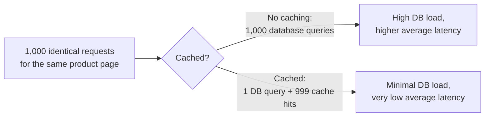

## Definition

Caching is storing a copy of data in a faster-to-access location (typically memory) so that future requests for that data can be served quickly, without repeating the slower original work (a database query, an expensive computation, a network call) needed to produce it the first time.

## Why it exists

Different storage and computation resources have wildly different speeds: reading from RAM takes nanoseconds; reading from an SSD takes tens of microseconds; a network round trip to a database takes milliseconds; a complex computation might take much longer still. Caching exists to exploit this gap directly — by keeping a copy of frequently-needed results in the fastest tier available, most requests never have to pay the cost of the slowest tier at all.

## The problem it solves

Without caching, every single request for a piece of data — even if a thousand other requests asked for the exact same thing moments ago — repeats the full cost of fetching or computing it from scratch. For data that's expensive to produce but doesn't change often, this is enormously wasteful, and quickly becomes the dominant bottleneck as traffic grows.

## Real-world analogy

A chef preparing a popular sauce from scratch for every single order, even though a hundred orders in the last hour all wanted the exact same sauce, is wasting enormous effort. A chef who prepares a batch once and keeps it warm and ready to serve for the next hour (until it needs refreshing) is caching — trading a small risk of the sauce going slightly stale for a massive reduction in repeated work.

## Simple explanation

If the same data is requested repeatedly, and doesn't change on every request, computing or fetching it once and reusing that result for subsequent requests is almost always faster than repeating the full work every single time.

## Technical explanation

### The concrete speed gap

| Operation | Approximate latency |
|---|---|
| RAM access | ~100 nanoseconds |
| SSD read | ~10-100 microseconds |
| Network round trip (same datacenter) | ~0.5 milliseconds |
| Database query (with disk I/O) | ~5-50 milliseconds |
| Network round trip (cross-region) | ~50-150 milliseconds |

A cache hit served from an in-memory cache like Redis can be **100-1000x faster** than a database query involving disk I/O — this order-of-magnitude gap is the entire reason caching exists as a discipline, and it's why even a modest cache hit rate can dramatically reduce average latency and database load.

## Internal working

The value of caching scales directly with how often the same data is requested repeatedly (its "reuse factor") — data requested once and never again gains nothing from caching, while data requested constantly by many users (a popular product page, a trending post) benefits enormously.

## Advantages

- Dramatically reduces latency for cached data — often by one or more orders of magnitude compared to the original source.
- Reduces load on the underlying database or service, protecting it from being overwhelmed by repeated identical requests.
- Can absorb sudden traffic spikes (a "hot" piece of content) without that spike ever reaching the slower backing store.

## Disadvantages

- Introduces the possibility of serving stale data — see [Cache Invalidation](/docs/caching/cache-invalidation) and [TTL](/docs/caching/ttl) for how this is managed.
- Adds an additional piece of infrastructure to run, monitor, and reason about.
- Only helps for data that's actually requested repeatedly — caching data that's rarely re-requested (a one-off, uniquely computed report) provides little to no benefit.

## Trade-offs

Caching trades a small, deliberately managed risk of serving slightly outdated data for a large reduction in latency and backing-store load — a trade that's almost always worth making for frequently-read, infrequently-changed data, and a poor trade for rarely-read or constantly-changing data.

## Complexity considerations

The core idea (store a copy, reuse it) is simple; the real complexity lives in managing the cache correctly — deciding what to cache, for how long ([TTL](/docs/caching/ttl)), how to evict old entries when the cache fills up ([Eviction Policies](/docs/caching/eviction-policies)), and how to keep it from serving badly stale data after the source changes ([Cache Invalidation](/docs/caching/cache-invalidation)).

## When to use

- Any data that's read far more often than it changes, and where a brief window of staleness is acceptable — product pages, user profiles, computed aggregates, API responses to common queries.

## When NOT to use

- Data that changes on nearly every read (caching provides no benefit — the cache would almost always be stale or immediately invalidated).
- Data with an extremely low reuse rate, where the overhead of managing the cache outweighs any benefit from the rare cache hit.

## Common mistakes

- Caching data that's rarely re-requested, adding cache management overhead for negligible benefit.
- Not considering how a cache should behave under failure — a well-designed cache-aside setup should degrade gracefully to the backing store if the cache itself is unavailable (see [Caching Strategies](/docs/caching/caching-strategies)).
- Treating caching as a substitute for actually addressing a slow underlying query or computation, rather than as a complementary optimization — sometimes the underlying slowness (e.g. a missing database index) should be fixed directly rather than papered over with a cache.

## Interview questions

- "Why does caching help so much for read-heavy workloads specifically?"
- "What kind of data would gain little to nothing from being cached?"
- "How would you decide what to cache in a system with a limited cache memory budget?"

## Practical example

In the [URL Shortener case study](/docs/case-studies/url-shortener), redirects are cached specifically because the same short link is often clicked many times shortly after being shared — caching converts what would otherwise be a database query on every single click into a fast, in-memory lookup for the vast majority of requests.

## Production example

Facebook's Memcache paper describes caching as foundational to their entire infrastructure specifically because their read-to-write ratio is so heavily skewed toward reads — without caching absorbing the vast majority of read traffic, their databases would need to be scaled to a degree far beyond what's actually necessary once caching is accounted for.

## Best practices

- Cache data with a high reuse factor (frequently read, infrequently changed) — this is where caching provides the most value.
- Measure cache hit rate as a key operational metric — a low hit rate usually signals the wrong data is being cached, not that a bigger cache is needed.
- Don't use caching to paper over a genuinely slow underlying query if fixing that query directly (e.g. adding a missing index) is possible and more sustainable.

## Summary

Caching exploits the enormous speed gap between memory and slower storage/network/computation, storing a copy of frequently-requested, infrequently-changed data so most requests can be served nearly instantly instead of repeating expensive original work. Its value scales directly with how often the same data is re-requested, and the real engineering challenge lies not in the basic idea but in managing staleness, eviction, and invalidation correctly.

## References

- Nishtala et al., "Scaling Memcache at Facebook" (2013)
- Latency numbers every programmer should know (widely cited reference table)

<Quiz questions={[
  {
    q: "Why does caching provide little benefit for data that's requested only once and never again?",
    options: [
      "Caching only works for numeric data",
      "Caching's value comes from reusing a previously computed/fetched result for subsequent requests - if there are no subsequent requests, there's nothing to reuse",
      "Once-requested data is always too large to cache",
      "There's no real reason - caching always helps equally"
    ],
    answer: 1,
    explanation: "The entire value proposition of caching is avoiding repeated work for repeated requests — data with no repeat requests never gets to benefit from a cache hit, so the cache adds overhead without ever paying it back."
  }
]} />
