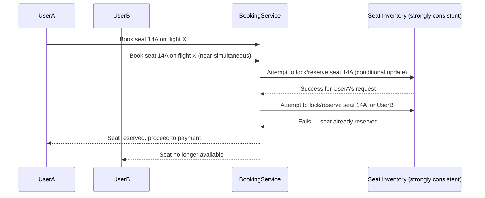
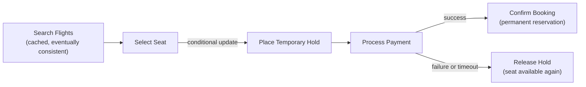
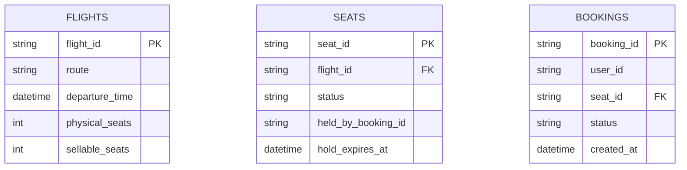
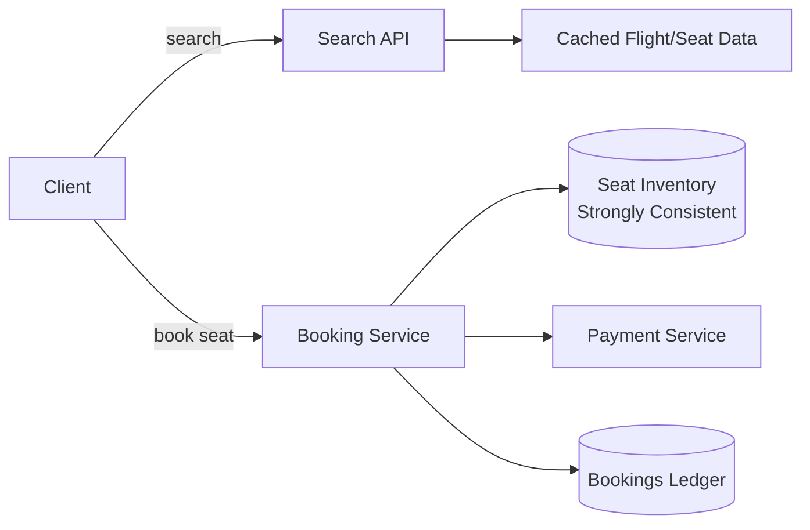

An airline reservation system is a classic system design question precisely because it's an inventory-with-extremely-limited-supply problem under real concurrency — dozens of people can try to book the last seat on a flight within the same second, and the system has to resolve that contention correctly, every time, with real money and real travel plans on the line.

## Requirements gathering

**Functional requirements**
- Users can search flights and view seat availability.
- Users can book a specific seat on a specific flight, completing payment as part of the flow.
- Users can cancel a booking, releasing the seat back to availability.

**Non-functional requirements**
- **Strong consistency on seat inventory** — the same seat must never be sold to two different passengers; this is one of the rare cases where correctness under concurrency dominates every other concern.
- **No lost bookings** — once a booking is confirmed and paid for, it must never be silently dropped.
- **Reasonable availability during search** — browsing flights and seat maps can tolerate slightly stale data far more easily than the actual booking transaction can.
- **Auditable transaction history**, similar in spirit to a [Payment Gateway](/docs/case-studies/payment-gateway)'s ledger requirements.

<Callout type="note" title="Separate the read-heavy search path from the write-critical booking path early">
Searching for flights and viewing seat maps is a high-read, tolerant-of-staleness workload well suited to caching; actually reserving a specific seat is a low-volume-but-zero-tolerance-for-error workload needing strong consistency. Conflating the two into one uniform design is the most common mistake in this question.
</Callout>

## Capacity estimation

Assume: 5,000 flights/day, average 150 seats per flight, peak booking traffic during flash sales reaching 10x average.

- **Seats managed**: 5,000 × 150 = 750,000 seat-inventory records actively in play on any given day — a modest number in absolute terms, confirming this isn't primarily a raw-scale problem.
- **Search QPS**: search and seat-map browsing volume vastly exceeds actual booking volume (most searches don't convert to a booking) — easily thousands of requests/second at peak, well suited to aggressive caching since exact real-time seat availability isn't required for browsing.
- **Booking QPS**: actual booking transactions are a much smaller number, but each one requires strict correctness — the interesting engineering constraint is concurrency correctness on a small number of contended seat records, not raw throughput.

The key insight: this is a **low-volume, high-correctness-requirement concurrency problem**, the opposite profile from most large-scale systems in this list — the design should optimize for correctness under contention, not for handling enormous throughput.

## Seat inventory and concurrency control

The core mechanism is a **conditional update** on the seat's inventory record (e.g. "update status to `reserved` only if current status is `available`"), enforced atomically at the database level so that of two near-simultaneous requests for the same seat, exactly one succeeds. This is functionally an [optimistic concurrency control](/docs/databases/acid) pattern: rather than locking the seat pessimistically for the duration of a whole user session, the system attempts the update and lets the database's atomicity guarantee decide the winner instantly.

<Callout type="warning" title="A hold/reserve step, separate from final confirmation, avoids abandoning seats to indecisive users">
Booking flows typically place a short-lived **hold** on a seat the moment a user selects it (e.g. for 10 minutes) rather than marking it permanently reserved — giving the user time to complete payment without either losing the seat to someone else mid-checkout or permanently locking it away from other buyers if the user abandons the flow. The hold automatically expires and releases the seat back to availability if payment isn't completed in time.
</Callout>

## Overbooking strategy

Airlines deliberately oversell a small percentage of seats on many flights, based on statistical no-show rates, to maximize revenue from seats that would otherwise fly empty. This means the system's seat inventory model needs an explicit distinction between **physical seat count** and **sellable inventory count** (which can exceed physical seats by a calculated overbooking margin), plus a defined process (compensation, rebooking) for the rare case where more passengers show up than there are physical seats — a deliberate, accepted business trade-off rather than a bug to be "fixed" by the system.

## Booking transaction flow

The booking transaction spans multiple steps and systems (seat inventory, payment processing) that each need to succeed or the whole booking needs to cleanly roll back — this is a natural fit for a **saga**-style pattern (see [Saga Pattern](/docs/microservices/saga-pattern)), where a failure at any step (e.g. payment declines) triggers compensating actions (releasing the seat hold) rather than leaving the system in an inconsistent, partially-completed state.

## Data model

`SEATS` is the strongly consistent, low-latency-critical table where the actual concurrency control happens; `BOOKINGS` provides the durable, auditable record of completed transactions, similar in spirit to the append-only ledger in a payment system.

## High-level architecture

## Scaling strategy

- **Search/browse path** scales through aggressive caching and read replicas, since slightly stale seat-map data during browsing is an acceptable trade-off — the actual booking step always re-validates against the strongly consistent source of truth regardless of what the cached search results showed.
- **Seat inventory** doesn't need to scale to enormous throughput (a single flight's ~150-300 seats is a small, well-bounded contention domain) — the design challenge is correctness under contention for a specific seat, not horizontal scale of the inventory data itself.
- **Booking service** can scale horizontally as a largely stateless orchestrator, since the actual consistency-critical state lives in the seat inventory store, not in the service layer.

## Bottlenecks

- **Contention on extremely popular flights** (e.g. a single remaining seat during a flash sale, with many simultaneous attempts): the conditional-update mechanism resolves this correctly, but a flight with unusually high simultaneous demand can still see many requests failing in quick succession — a UX consideration (clear "seat no longer available, try another" messaging) as much as a technical one.
- **Held-but-abandoned seats**: seats held during an incomplete checkout need reliable expiration (typically via a background sweep or TTL-based mechanism) so an abandoned session doesn't lock a seat away indefinitely.
- **Cross-system consistency between seat hold and payment**: the saga-style compensating-action flow needs to reliably release a hold if payment fails or times out, or a seat could be incorrectly stuck as held.

## Failure scenarios

- **Payment succeeds but the booking confirmation write fails**: this is the most dangerous failure mode for any transactional system involving money — mitigated with idempotent, retryable confirmation logic and reconciliation against the payment provider's own records, directly analogous to the idempotency concerns in a payment gateway.
- **Seat inventory database node failure**: since this data needs strong consistency, failover must preserve that guarantee (e.g. via a consensus-based replicated store) rather than falling back to a weaker, eventually-consistent replica for this specific data.
- **Hold-expiration sweep failure**: seats could remain incorrectly held past their intended expiration — mitigated by checking hold expiration inline (at read/write time) in addition to any background sweep, so correctness doesn't depend solely on the sweep running on schedule.

## Improvements

- **Waitlisting**: letting users join a waitlist for a fully booked flight, automatically notified if a held seat expires or a cancellation frees one up.
- **Dynamic overbooking margins**: adjusting the overbooking percentage per flight based on that specific route's historical no-show rate, rather than a single fixed margin across all flights.
- **Multi-leg/connecting itinerary booking as a single saga**, extending the same compensating-transaction pattern across multiple flight segments that must all succeed together or all roll back.

## Summary

An airline reservation system's defining challenge is correctness under real concurrency for a genuinely scarce resource — seat inventory — solved with atomic conditional updates that let exactly one of several simultaneous booking attempts for the same seat succeed, a temporary hold step that balances user checkout time against not locking seats away indefinitely, and a saga-style transaction flow that cleanly rolls back a seat hold if payment fails. It's a useful counterpoint to most large-scale system design questions: the hard problem here is airtight correctness on a small, contended dataset, not raw throughput at massive scale.

<Quiz questions={[
  {
    q: "Why does the booking flow place a temporary 'hold' on a seat rather than immediately marking it permanently reserved when a user selects it?",
    options: [
      "Holds serve no real purpose and are purely a UI detail",
      "A hold gives the user time to complete payment without either losing the seat to a competing booking mid-checkout or permanently locking the seat away if the user abandons the flow — it automatically expires and releases the seat if payment isn't completed in time",
      "Holds are required by international aviation law",
      "Permanent reservation and temporary holds behave identically in every respect"
    ],
    answer: 1,
    explanation: "A temporary hold balances two risks: giving the selecting user enough time to complete payment without the seat being taken by someone else, while ensuring an abandoned checkout doesn't permanently remove that seat from availability — the hold's automatic expiration is what resolves this trade-off cleanly."
  },
  {
    q: "Why is a conditional update ('update status to reserved only if currently available') the key mechanism for correct seat booking under concurrency?",
    options: [
      "Conditional updates have no effect on concurrent booking correctness",
      "It ensures that when two near-simultaneous requests target the same seat, the database's atomicity guarantees that exactly one update succeeds and the other fails, preventing the same seat from ever being sold to two different passengers",
      "Conditional updates are only useful for improving read performance",
      "This mechanism only works if there's just one user booking at a time"
    ],
    answer: 1,
    explanation: "By making the seat-status update conditional on its current state and relying on the database's atomic guarantee for that conditional check-and-set operation, only one of two simultaneous requests for the same seat can succeed — the other's condition check fails, correctly preventing a double-booking without needing an explicit, longer-held lock."
  }
]} />
