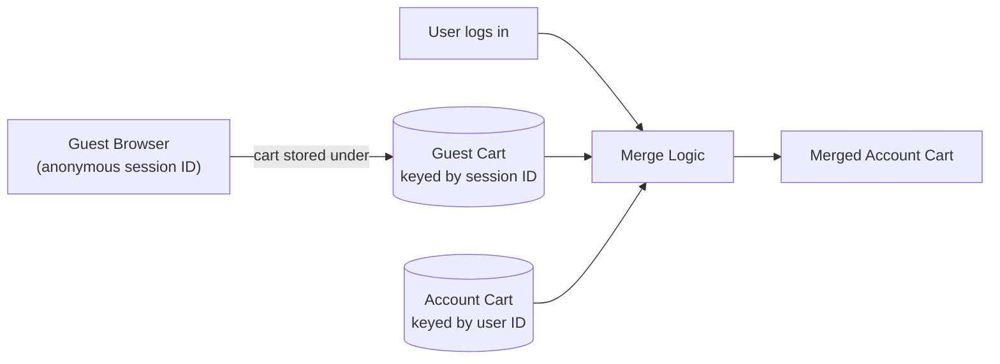
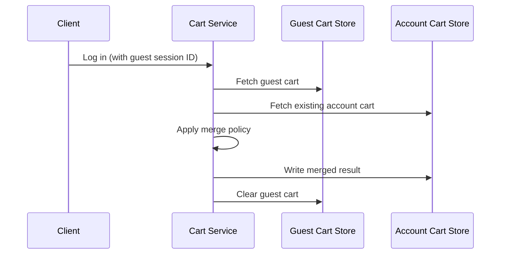
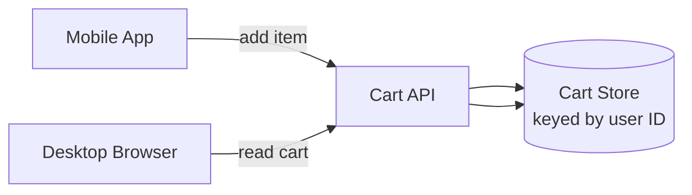
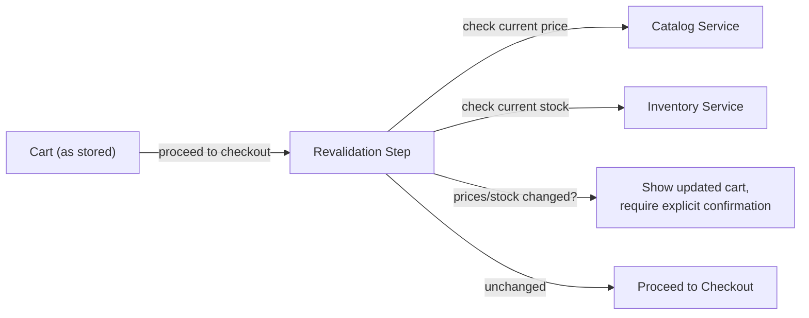
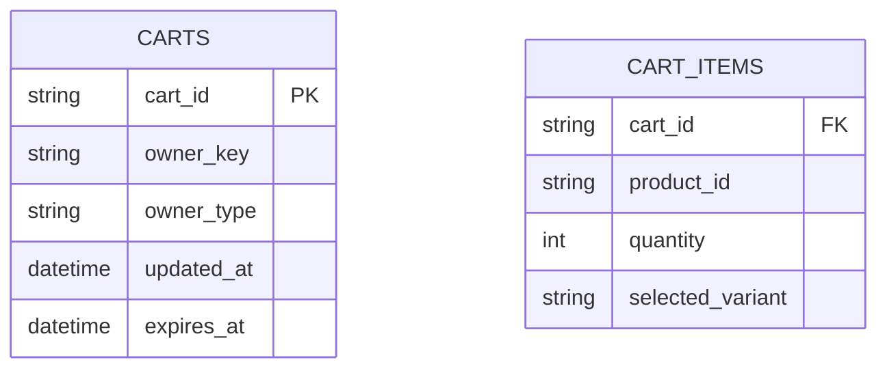
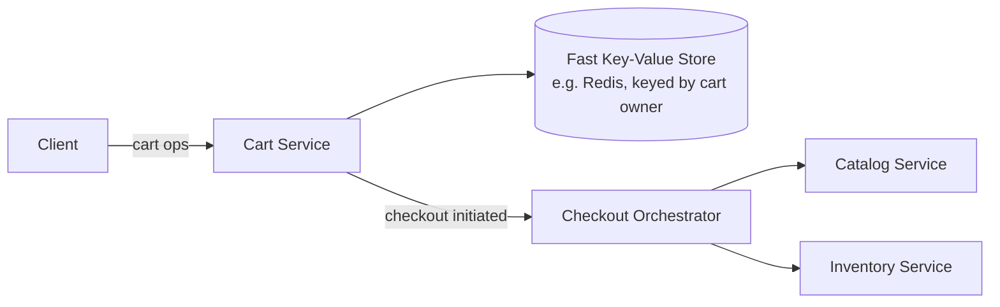

The [E-commerce Platform](/docs/case-studies/e-commerce) case study covers catalog, checkout, and inventory end to end. This one zooms into a single, deceptively tricky component: the cart itself — which turns out to be an interesting problem specifically because it has to work seamlessly *before* a user logs in, merge correctly the moment they do, and stay in sync across every device they own, all while the underlying product data (price, availability) keeps changing underneath it.

## Requirements gathering

**Functional requirements**
- Users can add, update the quantity of, and remove items from a cart, both as a guest and while logged in.
- A guest's cart persists and correctly merges into their account cart the moment they log in.
- The cart stays in sync across a user's devices (adding an item on mobile shows up when they open the site on desktop).
- At checkout, the cart reflects current, accurate prices and stock levels — not stale data from whenever items were added.

**Non-functional requirements**
- **Low latency** for cart reads/writes — the cart is touched extremely frequently during a shopping session and needs to feel instantaneous.
- **Durability across sessions** — a cart shouldn't be lost if a user closes their browser and returns hours or days later.
- **Consistent merge behavior** — merging a guest cart into an account cart needs clearly defined, predictable rules, not an ad hoc reconciliation.
- **No stale data proceeding to checkout** — price and availability shown in the cart must always be re-validated against current data before payment.

<Callout type="note" title="A cart is intent, not a commitment — treat it accordingly">
Unlike the strongly consistent inventory-locking problem in checkout itself, the cart is just a record of interest — it doesn't need to reserve stock or lock a price the moment an item is added. Framing it this way up front clarifies why the cart can be eventually consistent and cache-friendly, while checkout (a separate, later step) is where strong consistency actually matters.
</Callout>

## Capacity estimation

Assume: 300 million monthly active shoppers, average 8 cart operations (add/update/remove) per active session, average session touching a cart a handful of times before either checkout or abandonment.

- **Cart operations/sec**: with a large fraction of daily active shoppers browsing at any given time, cart read/write QPS is very high — comfortably in the tens of thousands of operations per second at peak, dominated by small, simple read-modify-write operations.
- **Cart size**: the overwhelming majority of carts hold a small number of items (typically single digits) — a small, bounded per-user data size, very different from, say, a media library or message history that grows unboundedly over time.
- **Abandonment rate**: a large majority of carts are never converted to a completed order — carts need a sensible retention/expiration policy rather than being kept indefinitely for every guest session ever created.

The key insight: this is a **high-frequency, small-payload, latency-sensitive workload** — a textbook fit for a fast key-value store, with the real design difficulty concentrated in merge semantics and checkout-time revalidation rather than in raw scale.

## Guest cart and cross-device sync

A guest's cart is keyed by an anonymous session identifier (often stored in a cookie), separate from the durable, user-ID-keyed cart used once someone is logged in. This split matters: it lets guest carts use a shorter retention policy and simpler infrastructure, while a logged-in user's cart is the durable, cross-device record that syncs whenever they access the site from any device.

## Merge semantics — the trickiest part of this problem

<Callout type="warning" title="Merging two carts needs an explicit, defined policy — 'just combine them' isn't actually well-defined">
If a guest had 2 units of an item in their cart before logging in, and their existing account cart already had 1 unit of the same item, should the merged cart show 3, or 2, or 1? There's no universally "correct" answer — real systems pick an explicit policy (commonly: sum quantities for matching items, keep the union of distinct items, and let the *more recent* cart's contents win for any conflicting non-quantity attributes like selected size/color) and apply it consistently, rather than leaving the behavior to fall out implicitly from whatever the merge code happens to do.
</Callout>

## Cross-device consistency

Because the account cart is keyed by user ID rather than device or session, any device the user logs into simply reads and writes the same underlying cart record — there's no separate per-device state to reconcile, which sidesteps a whole class of sync conflicts that a per-device cart model would otherwise introduce. The main subtlety is handling near-simultaneous edits from two devices at once (e.g. adding an item on mobile and removing a different item on desktop within the same second) — typically handled with either last-write-wins at the level of the whole cart object, or, more robustly, applying each individual item-level operation independently against the current stored state rather than overwriting the whole cart wholesale.

## Checkout-time revalidation

Since items can sit in a cart for hours, days, or longer before checkout, the price and availability shown in the cart at add-time can easily be stale by the time a user actually checks out. The cart itself never needs to reserve inventory or lock in a price — that would require the same strong-consistency machinery as actual checkout, for an action (browsing your cart) that doesn't warrant it. Instead, checkout always explicitly re-validates current price and stock against the authoritative catalog/inventory services, surfacing any changes to the user for confirmation before payment proceeds — the same principle discussed in the [E-commerce Platform](/docs/case-studies/e-commerce) case study's checkout flow.

## Data model

`owner_key` and `owner_type` distinguish a guest-session-keyed cart from a user-ID-keyed one, letting both share the same underlying schema and service logic rather than maintaining two entirely separate systems; `expires_at` supports automatic cleanup of abandoned guest carts after a defined retention window.

## High-level architecture

## Scaling strategy

- **Cart store** scales horizontally as a straightforward, sharded key-value workload (by user ID or guest session ID), since carts are small, independent, and don't need cross-cart coordination.
- **Guest cart cleanup** runs as a background expiration process (or relies on the store's native TTL support), keeping the guest cart dataset bounded despite an enormous number of abandoned sessions accumulating over time.
- **Checkout-time revalidation** scales as ordinary reads against the catalog and inventory services, no different in kind from a normal product-detail-page load, just triggered at the specific moment checkout begins.

## Bottlenecks

- **Flash-sale cart activity spikes**: a promotional event driving a surge of simultaneous cart additions is a straightforward high-QPS key-value workload that scales horizontally without the contention issues seen in actual inventory decrementing, since adding to a cart doesn't touch shared inventory state at all.
- **Merge logic complexity creep**: as more product attributes (size, color, gift-wrap options) need merge-conflict handling, the merge policy can become surprisingly intricate — kept manageable by treating merge as its own clearly specified, independently tested piece of logic rather than an incidental part of the login flow.
- **Checkout-time revalidation latency**: needs to check price/stock for every cart item without noticeably slowing down the transition into checkout — mitigated by batching these lookups into a small number of calls rather than one round trip per item.

## Failure scenarios

- **Cart store node failure**: a replicated key-value store with automatic failover limits this to a brief availability blip rather than actual data loss, and worst case, a user can simply re-add recently lost items, which is a low-stakes recovery compared to losing an actual order.
- **Merge logic failure during login**: rather than losing either cart outright, a safe fallback is preserving both carts' data (e.g. defaulting to a straightforward union) and surfacing anything genuinely ambiguous to the user, prioritizing "never silently drop items" over a perfectly clean merge.
- **Catalog/inventory service unavailable during checkout-time revalidation**: checkout should decline to proceed (fail closed) rather than let a customer complete a purchase against unverified, potentially stale price or stock data.

## Improvements

- **Save-for-later lists**, letting users move items out of the active cart without losing interest data, as a lightweight extension of the same underlying cart data model.
- **Cart-abandonment recovery** (e.g. a reminder notification for items left in cart), built on top of the existing cart expiration/retention data rather than a separate tracking system.
- **Price-drop and back-in-stock notifications** for cart items, using the same checkout-time revalidation logic proactively (checked periodically) rather than only at the moment of checkout.

## Summary

The shopping cart's core design principle is that it represents *intent*, not a commitment — it can be eventually consistent, cached aggressively, and stored in a simple key-value structure, because it never needs to reserve inventory or lock in pricing the way actual checkout does. The genuinely interesting problems are elsewhere: an explicit, well-defined policy for merging a guest cart into an account cart at login, keeping the cart correctly in sync across devices by keying it on user identity rather than device, and always re-validating price and stock against the authoritative source right before checkout rather than trusting whatever was true when items were originally added.

<Quiz questions={[
  {
    q: "Why doesn't adding an item to a cart need to reserve inventory or lock in its current price immediately?",
    options: [
      "Reserving inventory at add-to-cart time is actually the correct approach and most systems do this",
      "A cart represents a user's intent, not a commitment — reserving stock or locking price for every item added to any cart would require the same strong-consistency machinery as actual checkout, for an action that doesn't warrant it, and would tie up inventory for items that are frequently never purchased",
      "Inventory and pricing never change after a product is listed",
      "Carts are not associated with specific products at all"
    ],
    answer: 1,
    explanation: "Since most cart contents are never actually purchased, treating every add-to-cart action as a firm reservation would unnecessarily tie up inventory and require strong consistency for a low-stakes action. Instead, the cart stays lightweight and eventually consistent, and the strong-consistency inventory/price checks are deferred specifically to the checkout step, where they actually matter."
  },
  {
    q: "Why is an explicit, defined merge policy necessary when combining a guest cart into an account cart at login?",
    options: [
      "Cart merging never actually produces any ambiguous cases",
      "Combining two carts that might have overlapping items, differing quantities, or conflicting selected options (like size or color) has no single obviously 'correct' outcome, so the system needs an explicit, consistently applied policy (e.g. summing quantities, letting the more recent cart's selections win) rather than an implicit or ad hoc reconciliation",
      "Guest carts are always empty by the time a user logs in",
      "Account carts and guest carts always use completely separate product catalogs"
    ],
    answer: 1,
    explanation: "When the same product exists in both a guest cart and an existing account cart, or when conflicting variant selections exist, there's no universally correct way to combine them without a defined rule. A clear, explicit merge policy applied consistently avoids unpredictable or silently incorrect behavior that an ad hoc, implicit merge implementation could otherwise produce."
  }
]} />
