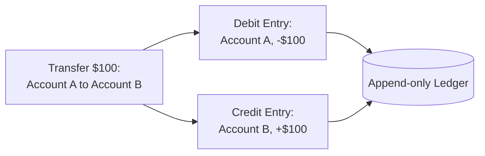
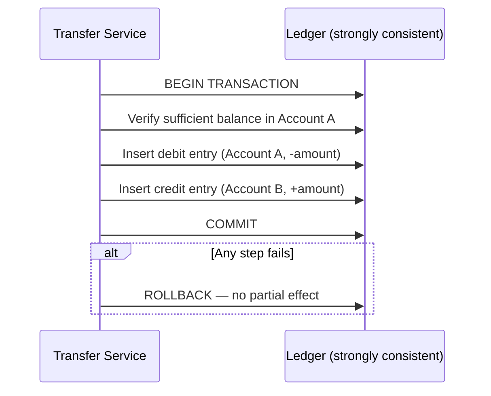
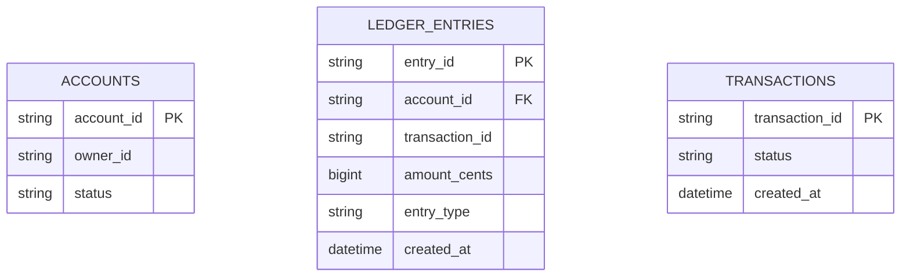
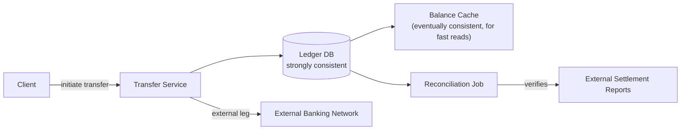

A banking system is a different problem from a [Payment Gateway](/docs/case-studies/payment-gateway), even though both deal with money: a payment gateway is mostly about moving money *between* external parties through authorize/capture flows, while core banking is about maintaining the actual **accounts and balances** themselves — the double-entry ledger that a payment gateway (and every other financial product) ultimately settles against.

## Requirements gathering

**Functional requirements**
- Users have one or more accounts, each with a balance.
- Users can transfer money between accounts (internal transfers, and to/from external institutions).
- Every transaction is recorded permanently and is auditable.

**Non-functional requirements**
- **Absolute correctness** — an account's balance must always be the exact, correct result of every transaction that's ever affected it; there is zero tolerance for drift or silent corruption.
- **Atomicity across accounts** — a transfer must either complete fully (debiting one account and crediting another) or not happen at all; a transfer that debits one account but fails to credit the other is a critical bug, not an acceptable edge case.
- **Full auditability** — regulators and the institution itself must be able to reconstruct the complete history behind any balance at any point in time.
- **Durability** — a confirmed transaction must never be lost, even in the face of hardware or process failure.

<Callout type="note" title="Lead with double-entry bookkeeping — it's the load-bearing idea in this whole design">
Double-entry bookkeeping (every transaction recorded as a debit in one account and an equal, offsetting credit in another) isn't an accounting formality — it's what makes the ledger self-verifying: the sum of all debits must always equal the sum of all credits, system-wide, and any discrepancy immediately signals an error somewhere. Introduce this concept early, since nearly everything else in the design supports it.
</Callout>

## Capacity estimation

Assume: 50 million accounts, average 20 transactions per account per month.

- **Transactions/sec**: 50,000,000 × 20 / (30 × 86,400) ≈ **~385 transactions/second** average — genuinely modest throughput, similar in profile to the payment gateway case study.
- **The dominant cost, again, is correctness overhead, not volume**: every transaction requires strongly consistent, atomic updates across (at least) two account balances, plus a durable, immutable ledger entry — the system is optimized around never getting this wrong, even at some cost to raw throughput.
- **Balance lookups**: reading an account's current balance is a far more frequent operation than transacting (checking your balance vastly outnumbers making transfers), and can be served from a fast, cached, eventually-consistent read path as long as the *authoritative* source for an actual transfer always uses the strongly consistent ledger.

The key insight: like a payment gateway, this is a **low-to-moderate-throughput, zero-tolerance-for-error system** — but the specific correctness property to protect is different: not "don't double-charge" but "the ledger must always balance, and every balance must always be reconstructable from history."

## The double-entry ledger

Every transaction produces exactly two ledger entries: a debit on the source account and an equal, offsetting credit on the destination account, both written as part of a single atomic operation. An account's current balance is never stored as an independently mutable field — it's always the sum of that account's ledger entries, computed on demand or maintained as a periodically-verified cached aggregate for read performance, but never treated as an independent source of truth that could silently drift from the actual transaction history.

<Callout type="warning" title="A balance field is a cache of the ledger, never the ledger itself">
It's tempting, for read performance, to maintain a running balance field on the account record that's incremented and decremented directly. That's fine as a performance optimization — but only if it's treated strictly as a derived cache, continuously reconciled against the actual ledger sum, with the ledger itself remaining the single, unambiguous source of truth. Treating the balance field as authoritative, rather than the ledger, is exactly the kind of shortcut that leads to unrecoverable discrepancies.
</Callout>

## Atomic transfers between accounts

A transfer between two accounts *within the same institution* is a natural fit for a single ACID database transaction (see [ACID](/docs/databases/acid)): the balance check, debit entry, and credit entry either all commit together or none do, guaranteeing there's never a state where money has left one account without correspondingly arriving in the other. Transfers to an *external* institution are a different, harder problem — since the external institution's ledger isn't part of the same transaction — and are typically handled with a saga-style pattern (debit locally, then reliably initiate and track the external transfer, with compensating logic if the external leg fails) similar in spirit to the multi-service transaction in [E-commerce](/docs/case-studies/e-commerce) checkout.

## Data model

`LEDGER_ENTRIES` is append-only and immutable — entries are never updated or deleted, only added; correcting an error means adding a new, offsetting entry (a reversal), never editing or removing the original one, so the full history always remains intact and auditable.

## High-level architecture

## Scaling strategy

- **The ledger itself** prioritizes strong consistency over raw horizontal scale — much like a payment gateway, a well-tuned relational database with strict transactional guarantees is generally favored over a horizontally sharded, eventually consistent store for this specific data.
- **Balance reads** (checking your balance, far more frequent than transacting) are served from a cached, derived balance store, kept in sync with the ledger, so the high-volume read path doesn't need to hit the strongly consistent ledger directly for every check.
- **Sharding by account** (once scale genuinely requires it) needs care to keep both legs of any single transfer within a transaction boundary that can still be committed atomically — a real design constraint on how accounts are partitioned across shards.

## Bottlenecks

- **Cross-shard transfers**: if accounts are sharded across multiple database instances, a transfer between accounts on different shards can no longer use a single local ACID transaction, requiring a distributed transaction protocol or a saga-style approach instead — a meaningfully harder problem than same-shard transfers.
- **External network latency and failure modes**: transfers to external institutions depend on a network that's outside the system's control, and must be designed to handle ambiguous outcomes (timeouts that might mean success or failure) without ever double-crediting or losing track of the transfer's true state.
- **Reconciliation at scale**: even a tiny mismatch rate between internal ledger state and external settlement reports produces real absolute numbers of discrepancies to review at high transaction volume, requiring the reconciliation process itself to scale with transaction growth.

## Failure scenarios

- **Process crash mid-transfer (same-shard)**: the underlying database transaction's atomicity guarantees that either both ledger entries exist or neither does — a crash mid-transaction simply results in a clean rollback, with no possibility of a half-completed transfer.
- **External transfer leg fails after the local debit succeeded**: the saga's compensating action credits the local account back, restoring the pre-transfer balance, rather than leaving the customer's account debited with no corresponding external transfer completed.
- **Ledger database outage**: the system should fail closed, declining new transfers rather than risking any transaction that isn't fully and durably committed — as with a payment gateway, an unavailable-but-correct system is far preferable to an available-but-wrong one.

## Improvements

- **Real-time fraud detection** consulted during transfer initiation, as a separate, pluggable service, keeping fraud logic decoupled from the core ledger's correctness guarantees.
- **Multi-currency ledgers**, maintaining strong consistency within each currency's ledger while handling currency conversion as an explicit, auditable step rather than folding it silently into a single balance figure.
- **Point-in-time balance reconstruction** tooling, letting auditors or support staff reconstruct an account's exact balance as of any historical moment directly from the ledger entries, rather than only trusting the current cached balance.

## Summary

A banking system's foundational idea is the double-entry ledger: every transaction is recorded as an equal, offsetting debit and credit, making the ledger self-verifying and turning "what's the balance" into a value always derivable from immutable history rather than an independently mutable field that could silently drift. Atomic, same-shard transfers lean on standard ACID transactions; transfers spanning shards or external institutions require saga-style coordination with real compensating actions — but in every case, the ledger, not any cached balance, remains the single, unambiguous source of truth.

<Quiz questions={[
  {
    q: "Why is the double-entry ledger described as 'self-verifying'?",
    options: [
      "It isn't — ledgers require external verification for every entry",
      "Because every transaction produces an equal, offsetting debit and credit, the sum of all debits must always equal the sum of all credits system-wide — any discrepancy immediately signals an error, without needing to trust any single balance figure in isolation",
      "Self-verification refers only to encryption of the ledger data",
      "Double-entry bookkeeping has no relationship to error detection"
    ],
    answer: 1,
    explanation: "Because every transaction's debit is matched by an equal credit elsewhere in the system, the total of all debits across every account must always equal the total of all credits. This built-in invariant means any accounting error shows up as an imbalance in that sum, providing a structural way to detect corruption or bugs that a system without this discipline wouldn't have."
  },
  {
    q: "Why must a cached account balance field always be treated as derived from the ledger, never as the source of truth itself?",
    options: [
      "Cached balance fields are always slower than reading the full ledger, so they should never be used",
      "A directly mutable balance field can drift from the true transaction history due to bugs or race conditions with no way to reconstruct what happened, whereas treating it strictly as a cache reconciled against the immutable ledger preserves the ledger as the one unambiguous, auditable source of truth",
      "Ledger entries are automatically deleted once a balance is cached",
      "There is no meaningful difference between a cached balance and the ledger itself"
    ],
    answer: 1,
    explanation: "If a mutable balance field is treated as authoritative, any bug or race condition that corrupts it has no path to recovery, since there's nothing else to check it against. Treating it purely as a performance-optimizing cache, continuously reconciled against the immutable, append-only ledger, means the ledger always remains available as the ground truth to detect and correct any discrepancy."
  }
]} />
