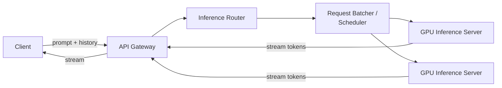
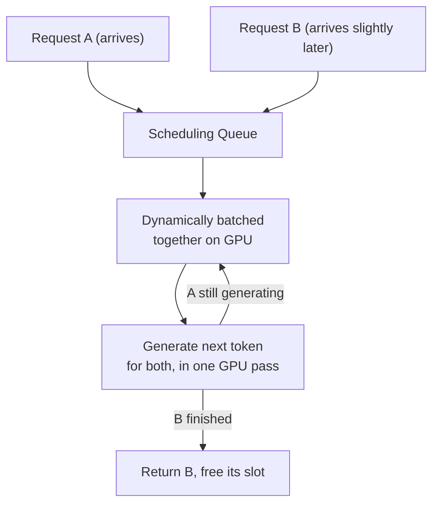
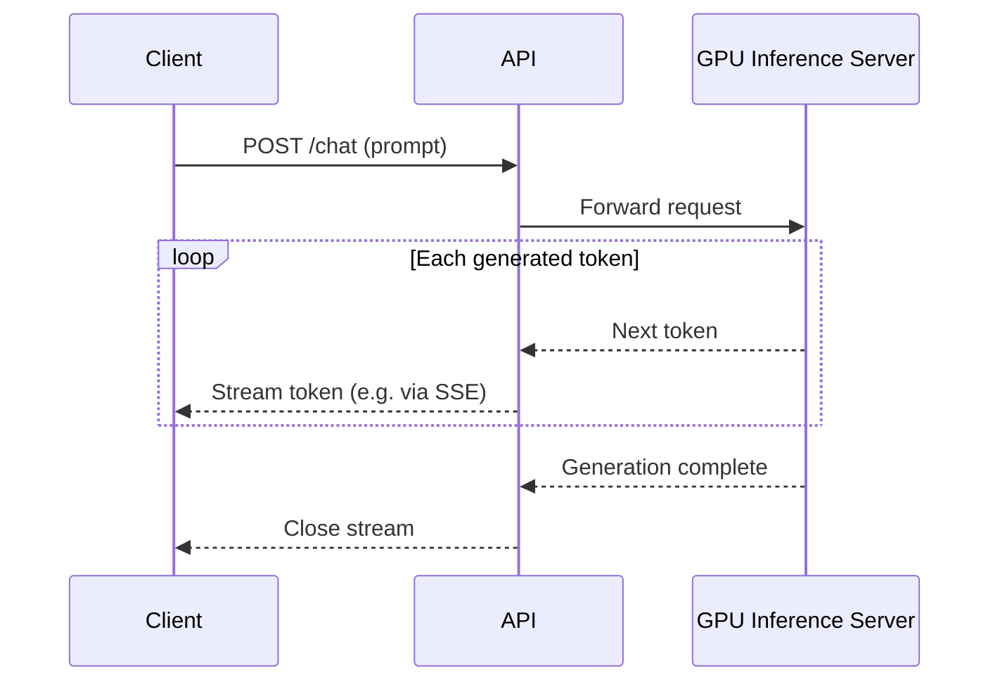
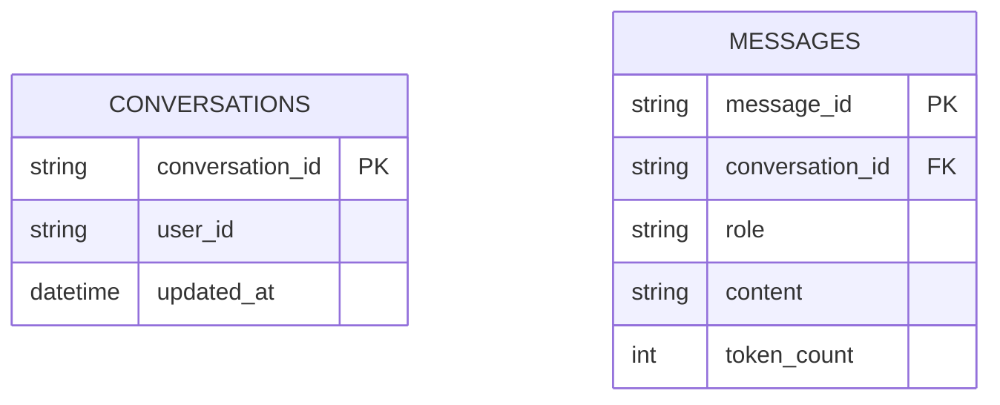

Designing a system like ChatGPT is a genuinely different flavor of system design question from most others in this list — the bottleneck isn't a database or a cache, it's an extremely expensive, GPU-bound computation (a forward pass through a large model) that has to be served interactively, at scale, while streaming output token by token.

## Requirements gathering

**Functional requirements**
- A user submits a prompt (with conversation history) and receives a generated response.
- Responses stream back incrementally (token by token) rather than all at once.
- Conversation history persists across turns within a session.

**Non-functional requirements**
- **Low time-to-first-token** — the user should see the response start appearing quickly, even if full generation takes several seconds.
- **High GPU utilization** — GPU inference capacity is extremely expensive; the system's cost-efficiency is dominated by how well it keeps GPUs busy doing useful work.
- **Fairness under load** — many concurrent users must share a limited pool of GPU capacity without any single long request starving others.
- **Context length limits** — the model can only attend to a bounded amount of conversation history at once, which shapes how conversation state is managed.

<Callout type="note" title="This is a compute-scheduling problem wearing a chat-app costume">
Frame the problem correctly early: the actual hard engineering here is efficiently scheduling and batching expensive GPU computation across many concurrent users, not building yet another CRUD chat backend. Nearly every distinctive design decision below follows from treating GPU inference capacity as the scarce, expensive resource it is.
</Callout>

## Capacity estimation

Assume: 10 million daily active users, average 10 messages per session, each generating a response of roughly 300 tokens.

- **Requests/sec**: 10,000,000 × 10 / 86,400 ≈ **~1,150 generation requests/second** average, with sharp peaks.
- **Tokens generated/sec**: 1,150 × 300 ≈ **~345,000 tokens/second** system-wide — this, not raw request count, is the number that actually determines GPU capacity needed, since token generation is the unit of GPU work.
- **GPU memory per request**: serving a large model requires the model weights resident in GPU memory (often across multiple GPUs for the largest models) plus a per-request **KV cache** (intermediate attention state) that grows with conversation length — this per-request memory footprint, not request count alone, is often the binding constraint on how many concurrent conversations one GPU (or GPU cluster) can serve.

The key insight: unlike most web systems, capacity here is bound by **GPU memory and compute per token**, not by request count or database throughput — the entire serving architecture is built around maximizing useful GPU work per unit time.

## High-level architecture

## Inference serving — batching for GPU efficiency

Running one request through the GPU at a time badly underutilizes it, since GPUs are efficient at processing many things in parallel but a single sequential request doesn't exercise that parallelism. Real inference servers use **continuous (dynamic) batching**: multiple in-flight requests are processed together, generating one token per request per GPU pass, with completed requests dropping out of the batch and new ones joining continuously — rather than the older, cruder approach of only batching requests that happened to arrive at exactly the same instant and start together.

<Callout type="warning" title="A single slow or long request can hurt throughput for everyone sharing its batch">
Because requests are batched together for GPU efficiency, one unusually long generation (a very long response) occupies a batch slot for longer, and naive scheduling can let it disproportionately affect others sharing that batch. Real systems address this with careful scheduling policies — sometimes capping maximum generation length, prioritizing fairness across users, or dynamically rebalancing batches — treating it explicitly as a scheduling fairness problem, not just a raw throughput one.
</Callout>

## Streaming responses

Responses are generated one token at a time (the model produces the next token conditioned on everything generated so far) and streamed to the client as each token is produced — typically over Server-Sent Events or a similar streaming transport — rather than waiting for the entire response to finish generating before sending anything, which is what keeps time-to-first-token low even though total generation time for a long response can still be several seconds.

## Conversation state and context management

Each new request needs the relevant prior conversation history included as context for the model, but the model has a **fixed maximum context length** — as a conversation grows, older messages may need to be truncated, summarized, or otherwise managed to fit within that limit while preserving the parts of the conversation that still matter for generating a coherent response.

## Scaling strategy

- **GPU inference servers** scale horizontally across many machines, each hosting one or more model replicas (for smaller models) or holding a sharded slice of a very large model split across multiple GPUs.
- **The router/scheduler** distributes incoming requests across available GPU capacity, ideally load-balancing not just by raw request count but by current batch occupancy and estimated remaining generation length per GPU.
- **Conversation storage** (message history) is a comparatively conventional, much lower-throughput database workload, decoupled entirely from the GPU-bound generation path.
- **Caching** of common prompt prefixes (e.g. a shared system prompt across many requests) can avoid redundant computation, since the model's early processing of an identical prefix produces identical intermediate state that can sometimes be reused.

## Bottlenecks

- **GPU memory pressure from long conversations**: the per-request KV cache grows with context length, directly limiting how many concurrent conversations a given GPU can serve — mitigated with context truncation/summarization strategies and techniques that reduce KV cache memory footprint.
- **Head-of-line blocking in batches**: a very long generation sharing a batch with shorter ones can affect overall batch throughput — addressed with scheduling policies designed explicitly around this, as noted above.
- **Cold model loading**: loading a large model's weights onto a fresh GPU instance takes real time, making naive reactive autoscaling (see [Autoscaling](/docs/cloud/autoscaling)) less responsive than for typical stateless web workloads — often mitigated by keeping a warm baseline of loaded model instances rather than scaling fully from zero.

## Failure scenarios

- **GPU inference server crash mid-generation**: the client's in-flight stream is lost; the request is retried against another available GPU server, restarting generation (there's generally no cheap way to resume a partially generated response from where a crashed instance left off).
- **Router/scheduler failure**: a redundant, load-balanced set of routers prevents any single router instance from being a hard single point of failure for directing traffic to GPU capacity.
- **Conversation store outage**: new message generation can often still proceed using only the context already provided in the current request, degrading gracefully to a stateless single-turn experience rather than failing outright, if conversation history temporarily can't be persisted or retrieved.

## Improvements

- **Speculative decoding**: using a smaller, faster "draft" model to propose several tokens ahead, which the larger model then verifies in a single pass — reducing the effective number of expensive full-model steps needed per response.
- **Prompt caching**: reusing computed intermediate state for repeated shared prefixes (like a common system prompt) across many different users' requests, avoiding redundant GPU work.
- **Tiered model routing**: routing simpler queries to a smaller, cheaper, faster model and only invoking the largest model for requests that genuinely need its full capability, improving both average latency and cost.

## Summary

Serving an LLM-based chat system at scale is fundamentally a GPU-scheduling problem: continuous batching keeps expensive GPU capacity efficiently utilized across many concurrent conversations, token-by-token streaming keeps perceived latency low even for long responses, and per-request GPU memory (dominated by the growing KV cache) — not raw request count — is usually the binding constraint on how much concurrent load a given amount of GPU capacity can actually serve. Nearly every distinctive design decision in this system traces back to treating GPU compute as the genuinely scarce, expensive resource it is.

<Quiz questions={[
  {
    q: "Why do real LLM inference servers use continuous (dynamic) batching instead of processing one request at a time?",
    options: [
      "Batching has no effect on GPU efficiency",
      "GPUs are efficient at parallel work, and a single sequential request badly underutilizes that parallelism — dynamically batching multiple in-flight requests together, generating one token per request per GPU pass, keeps GPU utilization (and therefore cost-efficiency) far higher",
      "Batching is only used to simplify the client-side API",
      "Continuous batching eliminates the need for GPUs entirely"
    ],
    answer: 1,
    explanation: "A GPU's strength is parallel computation; running one request at a time wastes most of that capacity. Continuous batching processes many in-flight requests together — generating the next token for each in the same GPU pass, with completed requests dropping out and new ones joining — which is what makes serving many concurrent users cost-efficient."
  },
  {
    q: "Why is per-request GPU memory (via the KV cache) often the binding constraint on concurrent capacity, rather than raw request count?",
    options: [
      "GPU memory has no relationship to conversation length",
      "Each in-flight conversation requires GPU memory proportional to its context length to store intermediate attention state (the KV cache), so longer conversations directly reduce how many concurrent requests a given GPU's memory can hold, regardless of request count alone",
      "Request count is always the only relevant capacity metric",
      "KV cache memory usage is fixed and identical for every request"
    ],
    answer: 1,
    explanation: "The KV cache grows with how much conversation context a request carries, and it must stay resident in GPU memory for the duration of that request's generation. This means a handful of requests with very long context can consume as much GPU memory as many more requests with short context — making per-request memory footprint, not raw request count, the real capacity constraint."
  }
]} />
