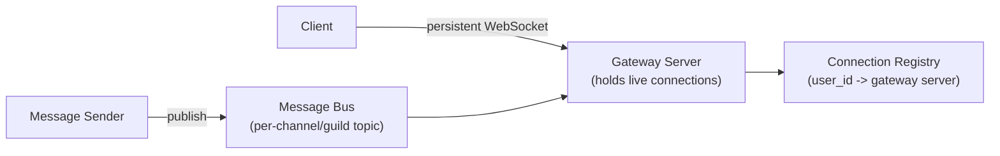
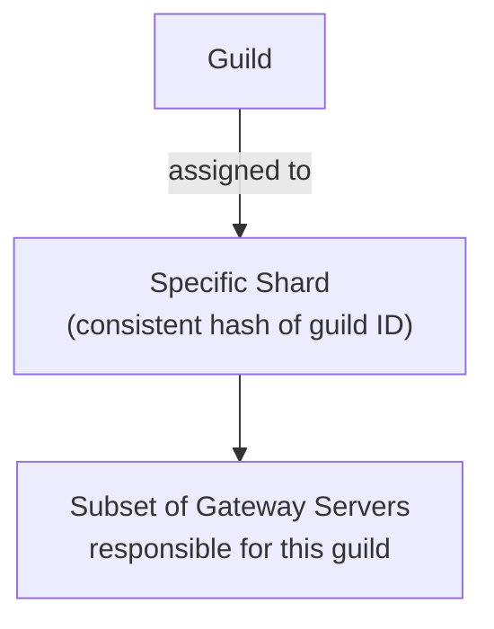
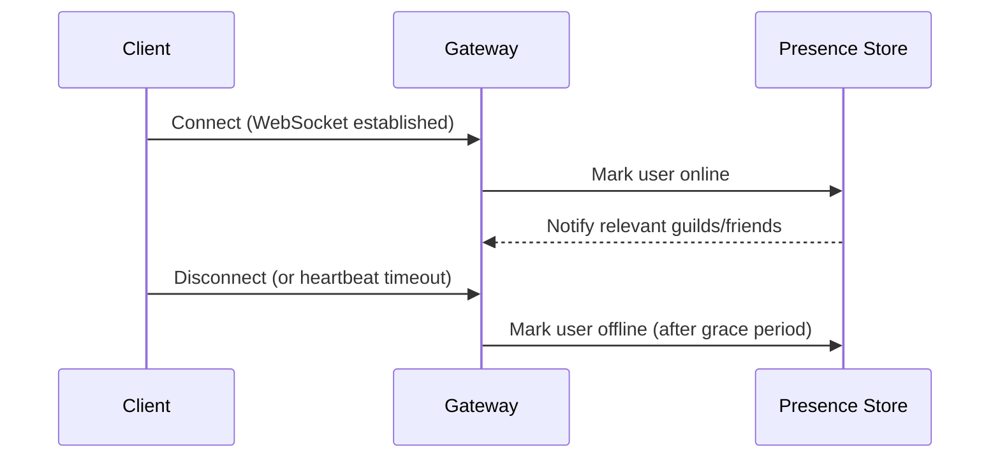
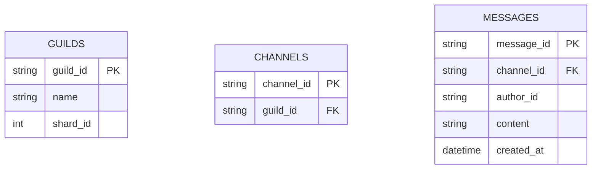
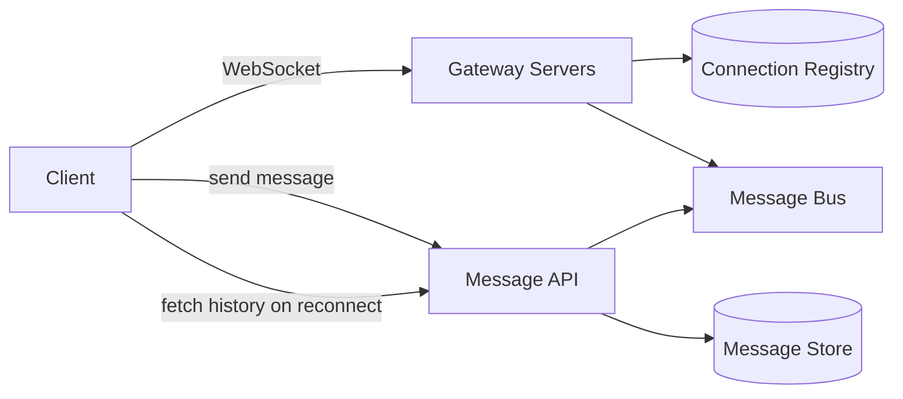

Discord is a great system design question because it combines two genuinely different real-time problems: low-latency, persistent WebSocket connections for millions of simultaneously-online users, and message routing that has to scale not by total user count alone, but by how those users are clustered into servers ("guilds") and channels.

## Requirements gathering

**Functional requirements**
- Users send and receive text messages in real time within channels, grouped into servers ("guilds").
- Users see which of their contacts are currently online ("presence").
- Users can join voice channels for real-time audio communication.

**Non-functional requirements**
- **Low-latency message delivery** — a sent message should appear for other online members almost instantly.
- **Massive concurrent connection count** — millions of users maintain long-lived, persistent connections simultaneously, not just brief request/response calls.
- **Guild-scale variance** — a guild can range from 2 members to hundreds of thousands, and the architecture needs to handle both without redesigning per guild size.
- **Message durability** — messages sent while a user is offline must still be delivered/visible when they reconnect.

<Callout type="note" title="This is a connection-management problem as much as a messaging one">
The distinctive hard part isn't storing messages (a fairly standard database problem) — it's efficiently managing millions of long-lived, stateful WebSocket connections and routing events to exactly the right subset of them in real time. Framing the problem this way up front sets up the rest of the design well.
</Callout>

## Capacity estimation

Assume: 20 million concurrent connected users, average sending 5 messages/minute among active users, guilds ranging from a handful to hundreds of thousands of members.

- **Concurrent WebSocket connections**: ~20 million simultaneously open, persistent connections — this alone rules out a traditional stateless request/response architecture and requires a connection layer specifically designed to hold many long-lived sockets per machine.
- **Messages/sec**: assuming roughly 10% of connected users are actively chatting at any moment, 2,000,000 users × 5/60 ≈ **~167,000 messages/second** system-wide.
- **Fan-out per message**: unlike a direct message (fan-out of 1), a message in a large guild's channel may need to reach thousands of currently-online members simultaneously — similar in shape to the fan-out problem in [Twitter/X Timeline](/docs/case-studies/twitter-timeline), but real-time rather than asynchronous.

The key insight: this system needs a **stateful connection layer** that's a first-class architectural component in its own right — not just an application server behind a load balancer — because knowing which specific server currently holds a given user's live connection is essential for routing messages to them.

## Real-time connection architecture

Gateway servers hold the actual live WebSocket connections; a **connection registry** (a fast, shared key-value store) tracks which gateway server currently holds each connected user's socket, since a user's connection could be on any one of many gateway servers at a given time. When a message needs delivering, the system doesn't need to know about every user's connection directly — it publishes to a per-channel topic on a message bus, and only the gateway servers actually holding connections for members of that channel who are subscribed receive and forward it.

## Guild and channel sharding

Rather than sharding purely by user, Discord-style systems shard largely by **guild** — all activity for a given guild is handled by a consistent, assigned subset of infrastructure, since most message traffic and fan-out naturally happens within a single guild's channels. This means an extremely large guild can be given proportionally more resources, while the vast majority of small guilds share infrastructure efficiently — a deliberate response to the enormous guild-size variance in the requirements.

<Callout type="warning" title="A small number of enormous guilds need explicit special-casing">
A guild with hundreds of thousands of concurrent members generates far more fan-out load per message than thousands of small guilds combined. Systems at this scale typically detect unusually large guilds and give them dedicated sharding/resources, rather than trying to make one uniform sharding strategy work equally well for every guild size — directly analogous to how a celebrity account needs special handling in a social feed's fan-out design.
</Callout>

## Presence

Presence (online/offline/idle status) is updated when a connection opens or closes, with a brief grace period before marking a user offline (to smooth over short network blips or reconnects) rather than flipping status instantly on every momentary disconnect. Presence updates are then fanned out only to guilds and friends actually interested in that specific user's status, not broadcast globally.

## Voice channel signaling

Voice communication itself doesn't route audio through the same messaging infrastructure — text messaging needs reliable, ordered delivery, while voice needs low latency far more than perfect reliability, so it uses a different transport (typically UDP-based real-time media protocols) with dedicated media relay servers geographically close to participants. The Discord-style architecture uses its WebSocket/messaging layer only for **signaling** — coordinating who's in a voice channel and negotiating the connection — while actual audio flows over a separate, latency-optimized media path.

## Data model

Message storage itself is a comparatively standard, high-write-volume, time-ordered data problem — partitioned by channel or guild — decoupled from the real-time delivery path; a client reconnecting after being offline simply fetches recent messages from this store directly, rather than needing them replayed through the live gateway/message-bus path.

## High-level architecture

## Scaling strategy

- **Gateway servers** scale horizontally, each holding a large but bounded number of concurrent connections; the connection registry lets any part of the system find which gateway currently holds a given user without broadcasting to all of them.
- **Guild-based sharding** distributes both storage and real-time load in a way that matches the system's actual traffic pattern (mostly intra-guild), rather than a purely user-based partitioning that wouldn't localize guild activity as well.
- **Message storage** scales via straightforward time-based and channel-based partitioning, since messages are largely independent, append-only records.

## Bottlenecks

- **Enormous guilds**: explicitly special-cased with dedicated sharding, as discussed above, since a single guild's fan-out can otherwise dominate shared infrastructure.
- **Reconnection storms**: a regional network blip causing many users to reconnect simultaneously can spike load on gateway servers and the connection registry at once — mitigated with staggered/jittered reconnect logic on the client side and headroom in gateway capacity.
- **Presence fan-out for very large friend lists or guilds**: mitigated by batching presence updates and only pushing them to genuinely interested, currently-connected observers rather than eagerly to everyone.

## Failure scenarios

- **Gateway server crash**: affected clients' WebSocket connections drop and reconnect to a different gateway server; the connection registry is updated accordingly, and any messages sent during the brief gap are still durably stored and retrieved via normal history fetch on reconnect.
- **Message bus outage**: real-time delivery degrades (messages aren't pushed live), but messages are still durably written to the message store and appear on the next fetch/reconnect — a graceful degradation rather than data loss.
- **Connection registry unavailability**: routing new messages to specific online users is impaired, but already-established connections and basic message persistence continue to function.

## Improvements

- **Read-state tracking** (per-user, per-channel "last read message") to support unread indicators without requiring every client to track this itself.
- **Edge-located gateway servers** geographically distributed to reduce WebSocket round-trip latency for globally distributed users.
- **Adaptive voice media relay selection**, routing each voice participant to the geographically nearest relay server to minimize audio latency.

## Summary

Discord's architecture centers on treating the real-time connection layer as a first-class, stateful system component — a connection registry tracks which gateway server holds each user's live socket, and guild-based sharding aligns infrastructure partitioning with the system's actual traffic pattern (mostly intra-guild), with explicit special-casing for unusually massive guilds. Text messaging and voice deliberately use different transports suited to their different needs (reliability vs. latency), while message storage itself remains a comparatively standard, decoupled persistence problem behind the real-time delivery layer.

<Quiz questions={[
  {
    q: "Why does a Discord-style system need a connection registry mapping users to gateway servers?",
    options: [
      "It doesn't — any gateway server can reach any connected user directly without tracking anything",
      "A user's live WebSocket connection could be held by any one of many gateway servers, so the registry lets the system know exactly which server to route a message through to reach that specific user",
      "The registry is only used for offline users",
      "Connection registries are only needed for voice channels, not text messaging"
    ],
    answer: 1,
    explanation: "With many gateway servers each holding a subset of live connections, the system needs a fast lookup to determine which specific gateway server currently holds a given user's socket — otherwise it would have no way to route a message directly to that user's live connection."
  },
  {
    q: "Why does the system shard primarily by guild rather than purely by individual user?",
    options: [
      "Guild-based sharding has no advantage over user-based sharding",
      "Most message traffic and fan-out happens within a single guild's channels, so keeping a guild's activity localized to a consistent subset of infrastructure matches the actual traffic pattern better than distributing users independently of which guilds they belong to",
      "Users can only belong to one guild at a time",
      "Sharding by guild eliminates the need for a connection registry"
    ],
    answer: 1,
    explanation: "Since messages fan out mostly within the guild/channel they're posted in, partitioning primarily by guild keeps that fan-out traffic localized to a consistent set of infrastructure, which is a better match for the system's actual access pattern than sharding purely by individual user identity."
  }
]} />
