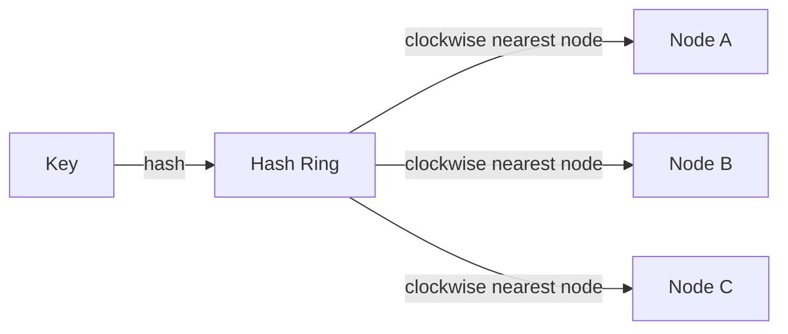
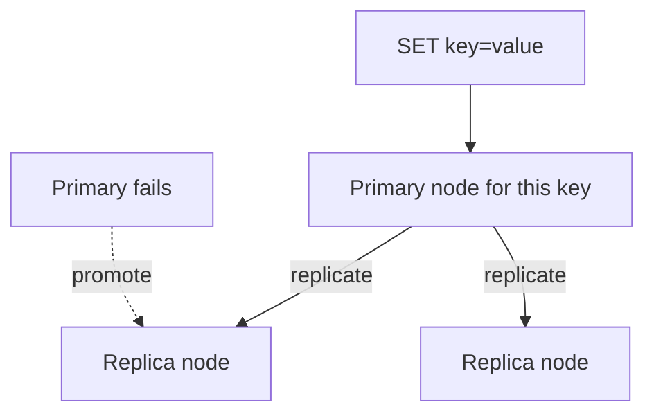
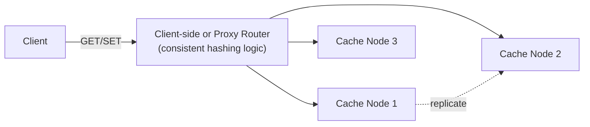

Most case studies use a cache as a supporting piece of a larger system. This one flips that around: the cache *is* the system being designed — something like Redis or Memcached itself — which surfaces a different set of problems: partitioning keys across many nodes, rebalancing when nodes join or leave, and deciding what to evict when memory runs out.

## Requirements gathering

**Functional requirements**
- Clients can `GET`, `SET`, and `DELETE` key-value pairs.
- Keys can have an optional expiration (TTL).
- The cache scales horizontally across many nodes as data volume and load grow.

**Non-functional requirements**
- **Very low latency** — this is the entire point of a cache; a slow cache is worse than no cache at all.
- **High availability**, tolerating individual node failures without losing the whole cache.
- **Even load distribution** across nodes, avoiding hotspots.
- **Graceful behavior under memory pressure** — a well-defined eviction policy rather than simply running out of memory and crashing.

<Callout type="note" title="Distinguish this from 'design a system that uses a cache'">
State explicitly up front that this question is about building the distributed cache infrastructure itself — the partitioning, replication, and eviction mechanics — not about deciding where to add a cache in front of a database in some other system.
</Callout>

## Capacity estimation

Assume: 1 TB of total data to cache, average value size 1KB, 500,000 reads/sec and 50,000 writes/sec at peak.

- **Total keys**: roughly 1 billion keys (1TB / 1KB), far more than a single machine's memory could hold — this alone establishes that the cache must be partitioned across many nodes.
- **Per-node capacity**: with nodes holding, say, 64GB of usable cache memory each, roughly 16 nodes are needed just to hold the data (before accounting for replication overhead).
- **QPS per node**: 550,000 total ops/sec spread relatively evenly across ~16 nodes is roughly 34,000 ops/sec per node — well within what a single well-tuned in-memory node can handle, confirming that the actual bottleneck is capacity (memory) and even distribution, not raw per-node throughput.

The key insight: this is a **partitioning and distribution problem** more than a raw-throughput one — a single machine can serve enormous QPS for in-memory operations; the hard part is spreading both data and load evenly, and handling node membership changes gracefully.

## Partitioning with consistent hashing

Naive partitioning (`hash(key) % number_of_nodes`) is a trap here: adding or removing even one node changes the modulus, remapping nearly every key and effectively invalidating the entire cache at once. [Consistent hashing](/docs/distributed-systems/consistent-hashing) solves this by placing both nodes and keys on a conceptual ring (via hashing), with each key owned by the nearest node clockwise from it — adding or removing a node then only remaps the small share of keys that were between that node and its neighbor, leaving the rest of the cache undisturbed.

<Callout type="tip" title="Virtual nodes smooth out uneven ring distribution">
With only a few real nodes placed randomly on a hash ring, load can be quite uneven — one node might end up owning a disproportionate arc of the ring. Real implementations assign each physical node many "virtual node" positions on the ring, which averages out to a much more even distribution of keys across physical nodes, even with a small number of them.
</Callout>

## Eviction policies

| Policy | Behavior |
|---|---|
| LRU (Least Recently Used) | Evicts the key that hasn't been accessed in the longest time |
| LFU (Least Frequently Used) | Evicts the key accessed the fewest times |
| TTL-based | Evicts keys once their explicit expiration time passes, independent of access pattern |

LRU is the most common default, implemented efficiently with a hash map (for O(1) key lookup) combined with a doubly linked list (for O(1) reordering on access and O(1) eviction of the least-recently-used tail) — giving constant-time operations for get, set, and eviction alike.

## Replication for availability

Each key's data is replicated to one or more additional nodes (often the next N nodes clockwise on the same consistent-hashing ring), so a single node failure doesn't lose that data entirely — a replica can be promoted to primary for the affected key range, and the ring's ownership is updated accordingly.

## Handling hot keys

A small number of extremely popular keys can receive vastly disproportionate traffic, overwhelming the single node responsible for them even though the overall cluster has ample aggregate capacity. Common mitigations include:
- **Client-side caching** of very hot keys for a short duration, absorbing repeat requests before they even reach the cache cluster.
- **Key replication for hot keys specifically**, deliberately storing extremely popular keys on multiple nodes (beyond normal replication) and having clients read from any of them, spreading the hot key's load across more than one node.

## High-level architecture

Routing logic (mapping a key to its owning node via consistent hashing) can live in a smart client library, a lightweight proxy layer, or the cache nodes themselves gossiping membership — different real systems make different choices here, trading client complexity against an extra network hop through a proxy.

## Scaling strategy

- **Adding nodes**: a new node takes its position on the hash ring and only the keys that now map to it (from its immediate neighbor) are migrated — the rest of the cluster is undisturbed, keeping the operation's cost proportional to roughly `1/N` of total data rather than a full rebalance.
- **Virtual nodes** smooth load distribution as the cluster grows or shrinks, avoiding the uneven ring coverage that a small number of raw physical node positions would produce.
- **Read scaling** for hot data can lean on replicas, letting reads for a popular key be served from any of its replica nodes rather than only the primary.

## Bottlenecks

- **Hot keys**, as discussed above — the single most distinctive challenge for a distributed cache compared to a distributed database, since cache access patterns tend to be far more skewed (a small number of keys accessed enormously more often than the rest).
- **Rebalancing during scale events**: even with consistent hashing minimizing the *proportion* of keys that move, migrating that data still takes real time and bandwidth, temporarily increasing latency or miss rates for the affected key range.
- **Memory fragmentation**: variable-size values in a long-running in-memory store can lead to fragmented memory that's technically free but not usable for a new allocation of a different size — mitigated with careful memory allocator design (e.g. size-class-based slab allocation, as used in Memcached).

## Failure scenarios

- **Node failure**: a replica is promoted for the affected key range, and the consistent-hashing ring is updated to reflect new ownership — clients querying stale ownership information get redirected or retried against the correct current owner.
- **Network partition** between cache nodes: depending on the system's chosen consistency model (see [CAP Theorem](/docs/fundamentals/cap-theorem)), the cache typically favors availability — serving potentially slightly stale data from an isolated replica rather than refusing to serve at all, since caches are usually not the system of record and staleness is a more acceptable trade-off here than in a primary database.
- **Cache stampede on a popular key's expiration**: many concurrent requests all miss simultaneously when a hot key's TTL expires and all attempt to recompute/refetch it at once — mitigated with request coalescing (only one request actually recomputes the value; others wait on that result) or staggered expiration times to avoid many keys expiring in the same instant.

## Improvements

- **Tiered caching** (a small, extremely fast local in-process cache in front of the distributed cache) for the very hottest keys, reducing network hops for the most valuable cache hits entirely.
- **Adaptive eviction policies** that blend recency and frequency (e.g. LFU with a recency-aware adjustment) rather than pure LRU, better matching real-world access patterns that pure recency doesn't always capture well.
- **Write-through vs. write-back policies** for how the cache interacts with an underlying source-of-truth database, trading consistency freshness against write latency depending on the use case.

## Summary

Building a distributed cache is fundamentally a partitioning and availability problem layered on top of otherwise simple, fast in-memory key-value operations: consistent hashing (with virtual nodes) keeps data evenly distributed and minimizes disruption when nodes join or leave, replication provides availability against node failure, and LRU-style eviction handles memory pressure gracefully. The most distinctive ongoing challenge, compared to most other distributed systems, is the highly skewed nature of cache access patterns — hot keys and cache stampedes require deliberate handling that a more uniformly accessed data store wouldn't need to worry about nearly as much.

<Quiz questions={[
  {
    q: "Why is naive `hash(key) % number_of_nodes` partitioning a poor choice for a distributed cache?",
    options: [
      "It's actually a fine approach with no real downsides",
      "Adding or removing even a single node changes the modulus, remapping nearly every key to a different node at once — effectively invalidating the entire cache and causing a massive spike in cache misses",
      "The modulo operator is too slow for cache lookups",
      "This approach only works for caches with fewer than 10 keys"
    ],
    answer: 1,
    explanation: "Because the modulus changes whenever the node count changes, `hash(key) % N` remaps almost every key to a different node the moment a node is added or removed — a small membership change causes a nearly complete cache invalidation. Consistent hashing avoids this by only remapping the small share of keys near the changed node's position on the ring."
  },
  {
    q: "What makes 'hot keys' a particularly distinctive challenge for a distributed cache compared to a typical distributed database?",
    options: [
      "Caches don't actually experience uneven access patterns",
      "Cache access patterns tend to be far more skewed than typical database access, so a small number of extremely popular keys can overwhelm the single node responsible for them even when the cluster has ample aggregate capacity",
      "Hot keys are only a concern for databases, never for caches",
      "Distributed caches automatically balance hot key load with no additional design needed"
    ],
    answer: 1,
    explanation: "Cache workloads are often characterized by strongly skewed popularity (a small number of keys accessed enormously more than the rest), which can create a genuine hotspot on the single node responsible for a hot key even though the cluster overall has plenty of spare capacity — requiring deliberate mitigations like hot-key replication or client-side caching."
  }
]} />
