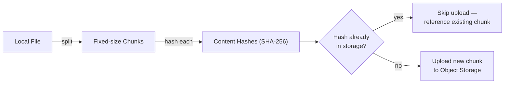
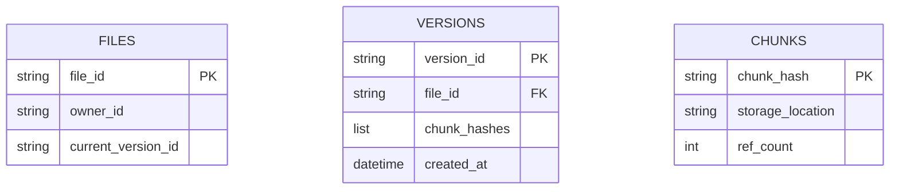
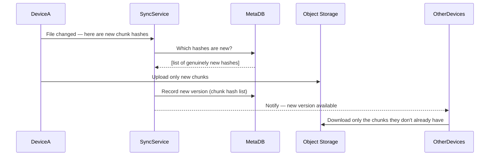
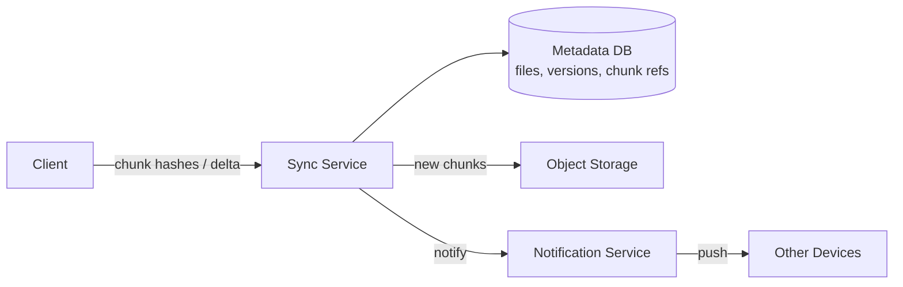

Dropbox-style file sync is a great system design question because the interesting part isn't really "storing files" (that's largely [object storage](/docs/storage/object-storage)) — it's efficiently detecting *what changed*, transferring only that delta across potentially many devices, and handling the inevitable conflicts when the same file changes in two places before it can sync.

## Requirements gathering

**Functional requirements**
- Users can upload files/folders, which sync automatically across all their devices.
- Changes to a file on one device propagate to all other devices.
- Users can share files/folders with others.
- Version history: recover a previous version of a file.

**Non-functional requirements**
- **Consistency across devices** — eventually all devices should converge to the same state, though brief periods of divergence during sync are expected and acceptable.
- **Bandwidth efficiency** — re-uploading an entire large file after a tiny edit is unacceptable; only the changed portion should transfer.
- **Durability** — files must never be silently lost.
- **Conflict handling** — the same file edited offline on two devices needs a defined, non-destructive resolution.

<Callout type="note" title="Chunking is the single detail that unlocks this whole design">
Once you establish that files are split into fixed-size chunks and identified by content hash, nearly every other requirement (bandwidth efficiency, deduplication, delta sync, versioning) falls out naturally. Lead with this decision early in the interview.
</Callout>

## Capacity estimation

Assume: 500 million users, average 5GB stored per user, average file edited generates a delta of a few chunks rather than the whole file.

- **Total storage**: 500,000,000 × 5GB = **2.5 exabytes** — this scale alone rules out anything but object storage designed for near-limitless capacity.
- **Chunk size**: assume 4MB fixed-size chunks. A 100MB file is ~25 chunks; editing a small part of it only requires re-uploading the handful of chunks that actually changed, not all 25.
- **Sync events/sec**: with hundreds of millions of users making frequent small edits, sync-check and delta-upload requests are a very high-QPS, mostly-small-payload workload — very different from the bulk-transfer profile of the initial upload.

The key insight: this is fundamentally a **metadata and delta-detection problem** layered on top of commodity object storage — the hard engineering is in efficiently figuring out what changed, not in storing bytes at scale.

## Chunking, hashing, and deduplication

Each file is split into fixed-size chunks, and each chunk is hashed (e.g. SHA-256). Before uploading a chunk, the client checks whether a chunk with that exact hash already exists in storage — if so, it just references the existing chunk instead of re-uploading identical bytes. This gives two benefits for free: **delta sync** (editing part of a file only changes a few chunks' hashes, so only those chunks need uploading) and **deduplication** (if two users store the exact same file, or the same chunk appears in multiple files, it's only stored once).

## Data model

A file's current state is a list of chunk hashes, in order — reconstructing the file just means fetching those chunks and concatenating them. Version history is nearly free with this model: each version is just a different ordered list of chunk hashes, many of which are shared with the previous version, so storing 50 versions of a mostly-unchanged large file costs far less than 50x the file size.

## Sync protocol

Other devices are notified of a change (often via a persistent connection or push notification, see [WebSockets](/docs/networking/websockets)), then compare the new version's chunk list against what they already have locally and download only the missing chunks — the same delta principle applies symmetrically on both upload and download.

## Conflict handling

When the same file is edited on two devices while offline, both devices eventually try to sync a new version built from the same prior version — a genuine conflict. Rather than silently picking one side's edit and losing the other's, the system detects the conflicting version lineage and keeps **both** as separate files (e.g. `report.docx` and `report (conflicted copy from DeviceB).docx`), letting the user manually reconcile — a deliberately non-destructive resolution, since silently discarding a user's edit is far worse than a mildly annoying duplicate file.

<Callout type="warning" title="Never silently resolve a real conflict by picking a winner">
It's tempting to resolve conflicts automatically (e.g. "last write wins"), but for arbitrary file content, the system has no way to know which change actually matters more to the user. Preserving both versions as separate files trades a small amount of user annoyance for the much more important guarantee that no edit is ever silently lost.
</Callout>

## High-level architecture

- **Metadata service** tracks files, their version history, and which chunks belong to which version — this is the system's source of truth for "what changed."
- **Object storage** holds the actual chunk bytes, keyed by content hash, deduplicated automatically across the entire user base.
- **Notification service** informs other devices that a change occurred, so they know to check in rather than polling constantly.

## Scaling strategy

- **Metadata database** is sharded by user or file ID, since metadata operations (checking hashes, recording versions) are frequent, small, and largely independent per user.
- **Object storage** scales close to limitlessly by design; deduplication further reduces actual stored bytes relative to logical data.
- **Notification fan-out** for shared folders with many collaborators uses the same fan-out-style thinking as a social feed — most shares have few collaborators, but a small number of heavily shared folders need to avoid a notification storm on every edit.

## Bottlenecks

- **Chunk hash lookup at scale**: checking whether a chunk already exists needs to be a fast, low-latency lookup even against billions of chunks — typically solved with a well-indexed key-value store rather than a relational table.
- **Large folder sync**: syncing a folder with hundreds of thousands of small files means many small metadata operations rather than one large one — batching metadata checks reduces round-trip overhead significantly.
- **Popular shared chunk contention**: a chunk referenced by an extremely large number of files (rare, but possible) needs its reference count updates to avoid becoming a write hotspot — mitigated with sharded counters, similar to other high-contention counter problems.

## Failure scenarios

- **Upload interrupted mid-sync**: since chunks are uploaded individually and a version is only recorded once all its chunks are confirmed durable, a partial upload simply resumes from the last successfully uploaded chunk rather than restarting the whole file.
- **Metadata database node failure**: replicated metadata storage with failover ensures version history and chunk references aren't lost; object storage itself is unaffected since chunk bytes live separately.
- **Notification service outage**: devices fall back to periodic polling for changes until push notifications recover — slower propagation, but no data loss or corruption.

## Improvements

- **Delta compression within a chunk** (not just whole-chunk deduplication) for files with small edits that don't happen to align with chunk boundaries, using a rolling-hash chunking scheme (like rsync's algorithm) instead of naive fixed-size chunks.
- **Client-side encryption** before chunking, trading away server-side deduplication across different users' identical files in exchange for stronger privacy guarantees.
- **Selective sync**, letting a device only download the specific folders/files a user actually wants locally, reducing local storage and bandwidth for large accounts.

## Summary

Dropbox-style sync is fundamentally about splitting files into content-hashed chunks, so that both bandwidth usage and storage naturally shrink to just what's actually changed or unique — turning "sync this file" into "sync the handful of chunks that differ" and turning "store 50 file versions" into "store the union of their chunks." The genuinely hard parts are efficient hash-based change detection at scale and handling real conflicts honestly, by preserving both sides rather than silently discarding a user's work.

<Quiz questions={[
  {
    q: "Why does splitting files into content-hashed chunks make both delta sync and deduplication possible?",
    options: [
      "It doesn't — chunking is only for organizing files visually",
      "A chunk's hash only changes if its content changed, so unchanged chunks (across versions, or across different files/users) can be detected and skipped or shared automatically, rather than always transferring or storing an entire file",
      "Chunking makes every file exactly the same size",
      "Hashing chunks removes the need for any storage system"
    ],
    answer: 1,
    explanation: "Because a chunk's content hash is a direct function of its bytes, identical chunks — whether from an earlier version of the same file or from an entirely different file/user — produce identical hashes, letting the system skip re-uploading or re-storing anything that already exists."
  },
  {
    q: "Why does the system keep both copies of a file instead of automatically picking a 'winner' when a real edit conflict occurs?",
    options: [
      "Storage is free, so there's no reason not to",
      "For arbitrary file content, the system has no reliable way to know which conflicting edit matters more to the user, so silently discarding either one risks losing real work — keeping both trades minor user annoyance for a stronger no-data-loss guarantee",
      "It's a legal requirement in most countries",
      "Conflicts never actually occur in file sync systems"
    ],
    answer: 1,
    explanation: "Automatically resolving a genuine content conflict (e.g. 'last write wins') risks silently discarding a user's real edit, which is a far worse outcome than a duplicated 'conflicted copy' file the user can manually reconcile."
  }
]} />
