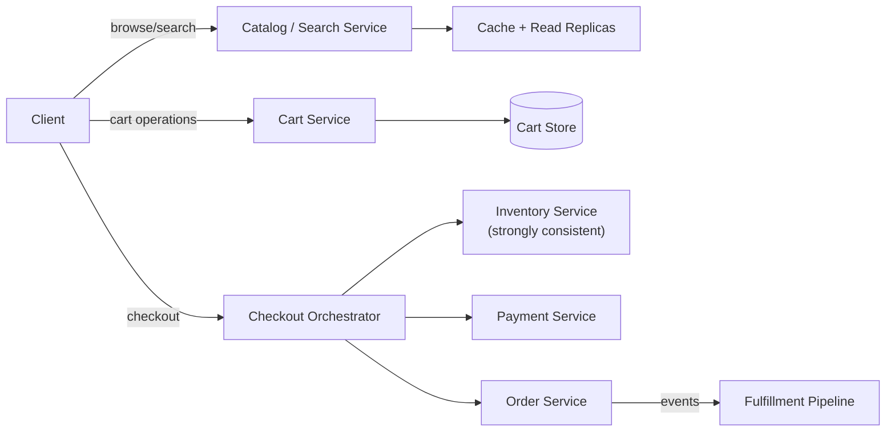
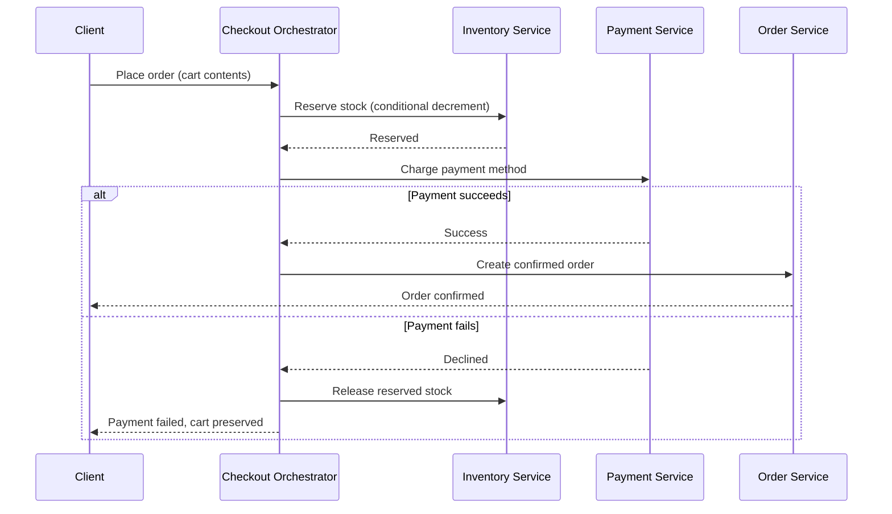
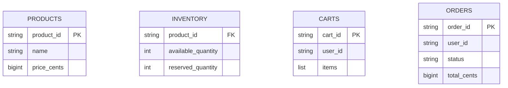

An e-commerce platform is a good capstone system design question because it's genuinely a system of systems — catalog browsing, cart management, inventory, checkout, and fulfillment each have different consistency needs and different scale profiles, and the interesting design work is in how they're decomposed and where consistency boundaries are drawn.

## Requirements gathering

**Functional requirements**
- Users browse a product catalog, search and filter products, and view product detail pages.
- Users add items to a cart and complete checkout, including payment.
- Orders are tracked through fulfillment (processing, shipped, delivered).

**Non-functional requirements**
- **High availability and low latency for browsing** — the catalog is the top of the funnel and needs to feel fast, even under heavy read load (flash sales, seasonal peaks).
- **Correct inventory accounting** — never sell more of an item than actually exists in stock, especially during high-demand events.
- **Reliable order processing** — an order, once placed and paid for, must reliably progress through fulfillment without being lost.
- **Elastic scale for traffic spikes** — sales events can produce order-of-magnitude traffic increases over a very short window.

<Callout type="note" title="Different parts of this system want different consistency models — say so explicitly">
Catalog browsing is happily eventually consistent and heavily cached; inventory decrementing during checkout needs strong consistency; order status needs durability and reliable async processing. Stating this up front, and designing each part accordingly rather than applying one uniform consistency model everywhere, is the single most important framing move in this question.
</Callout>

## Capacity estimation

Assume: 50 million monthly active users, 10 million product catalog items, average conversion rate meaning orders are a small fraction of total browsing traffic, with flash-sale peaks reaching 10-20x normal load.

- **Browse/search QPS**: with the vast majority of traffic being browsing rather than purchasing, catalog and search endpoints see the highest QPS by a wide margin — easily tens of thousands of requests/second at peak, dominated by reads.
- **Checkout QPS**: substantially lower than browse QPS (only a fraction of sessions convert to a purchase), but each checkout request is far more consistency-sensitive and touches more subsystems (inventory, payment, order creation) than a simple catalog read.
- **Inventory contention**: during a flash sale, a small number of heavily discounted SKUs can see extreme concurrent demand relative to limited stock — structurally similar to the seat-contention problem in [Airline Reservation](/docs/case-studies/airline-reservation), just for product inventory instead of seats.

The key insight: this system needs **two very different architectural postures within the same platform** — a heavily cached, horizontally scaled, eventually-consistent read path for browsing, and a strongly consistent, carefully orchestrated write path for checkout and inventory.

## High-level architecture

Each of these is a genuinely separate service with its own scaling and consistency profile — a [microservices](/docs/microservices/database-per-service) decomposition that mirrors the natural boundaries in the problem, rather than a single monolithic data model trying to serve every use case at once.

## Catalog and search

The product catalog is read overwhelmingly more than it's written, and slightly stale data (a product's price updated a few seconds ago not yet reflected everywhere) is generally an acceptable trade-off for the enormous gains in read scalability that come from aggressive caching and denormalized, search-optimized indexes (see [Denormalization](/docs/databases/denormalization)). Search specifically is typically backed by a purpose-built search index (supporting full-text search, faceted filtering) rather than querying a normalized relational schema directly.

## Cart

A cart is per-user, relatively small, and frequently read/written during an active shopping session — a natural fit for a fast key-value store, with the cart's contents persisted so it survives across sessions and devices, but not requiring the strong consistency guarantees inventory does, since a cart itself doesn't commit to anything until checkout begins.

## Checkout, inventory, and the order transaction

This is a multi-step transaction spanning independent services — inventory reservation, payment, and order creation — that must either all succeed together or cleanly roll back, making it a natural fit for the [Saga Pattern](/docs/microservices/saga-pattern): each step has a corresponding compensating action (releasing reserved inventory if payment fails), so the system never ends up with, say, payment charged but no order created, or inventory decremented with no corresponding sale.

<Callout type="warning" title="Inventory reservation must use the same conditional-update discipline as scarce-seat booking">
Just as with airline seats, checking "is this in stock?" and then separately decrementing inventory in two unguarded steps creates a race condition where two near-simultaneous checkouts can both pass the check and oversell the item. Inventory reservation needs an atomic conditional decrement (only succeed if current stock is sufficient), the same underlying principle as seat-booking concurrency control, just applied to quantity rather than a single unique unit.
</Callout>

## Order fulfillment

Once an order is confirmed, fulfillment (warehouse picking, packing, shipping, delivery tracking) is handled as a series of asynchronous state transitions, driven by events (see [Event-Driven Architecture](/docs/messaging/event-driven-architecture)) rather than the checkout request waiting synchronously on any of it — the customer-facing checkout only needs the order *confirmed*, not fully shipped, before returning a response.

## Data model

`INVENTORY` is deliberately separated from the broader `PRODUCTS` catalog data — inventory needs strong consistency and frequent, contended updates, while product catalog data (name, description, images) is read-heavy and rarely written, and the two shouldn't share the same consistency and scaling profile.

## Scaling strategy

- **Catalog/search** scales horizontally behind caches and read replicas, comfortably absorbing very high read QPS since staleness there is an acceptable trade-off.
- **Cart service** scales horizontally as a straightforward key-value workload, sharded by user ID.
- **Inventory service** doesn't need to scale to enormous throughput system-wide, but individual hot SKUs (flash-sale items) need the same contention-handling discipline as a scarce-resource booking system.
- **Order/fulfillment pipeline** scales via asynchronous, queue-driven processing, decoupled entirely from the synchronous checkout request path.

## Bottlenecks

- **Flash-sale inventory contention**: a small number of extremely popular, deeply discounted SKUs can see contention far exceeding the system's average load — mitigated with the same conditional-decrement discipline as seat booking, plus request queuing/rate limiting at checkout for the specific hot SKU to avoid overwhelming the inventory service.
- **Checkout orchestration failure mid-flow**: without careful saga-style compensating actions, a failure partway through (inventory reserved, payment not yet attempted, service crashes) can leave inventory incorrectly held — mitigated with reliable timeout-based release logic, independent of whether the orchestrator itself recovers cleanly.
- **Cache staleness for price/availability shown during browsing**: acceptable for browsing, but checkout must always re-validate current price and stock against the authoritative, strongly consistent source rather than trusting whatever was shown during browsing.

## Failure scenarios

- **Payment succeeds, order creation fails**: handled with the same idempotency and reconciliation discipline discussed in [Payment Gateway](/docs/case-studies/payment-gateway) — retryable, idempotent order creation, plus reconciliation against payment records to catch and correct any rare mismatch.
- **Inventory service outage during checkout**: checkout should fail closed (decline to complete the order) rather than proceeding without a reliable stock check, since risking an oversold item is worse than a temporarily unavailable checkout.
- **Fulfillment pipeline backlog**: since fulfillment is asynchronous and event-driven, a temporary backlog delays shipment updates but doesn't block or lose already-confirmed orders — a queue absorbs the burst and processes it as capacity allows.

## Improvements

- **Personalized search ranking and recommendations**, layered on top of the base catalog/search service as an additional, independently scaled component.
- **Pre-emptive inventory pre-allocation for known upcoming flash sales**, reducing contention at the exact moment of a sale's start by reserving a portion of inventory ahead of time for the sale's specific pricing/promotion flow.
- **Multi-warehouse fulfillment routing**, choosing the optimal warehouse per order based on proximity and current stock distribution, extending the order/fulfillment pipeline with an additional routing decision.

## Summary

An e-commerce platform's core design insight is that different parts of the system genuinely need different consistency and scaling postures — catalog and search favor heavy caching and eventual consistency for massive read scale, while checkout and inventory require strong consistency and careful concurrency control to avoid overselling, coordinated through a saga-style transaction across independent services. Order fulfillment, once an order is confirmed, becomes an asynchronous, event-driven pipeline entirely decoupled from the synchronous checkout path — letting each part of the system scale and fail independently according to its own actual requirements.

<Quiz questions={[
  {
    q: "Why does the catalog/search path use a different consistency model than the checkout/inventory path?",
    options: [
      "There's no real reason — both paths should use identical consistency models",
      "Catalog browsing is read-heavy and tolerates slight staleness well, benefiting enormously from caching, while checkout must never oversell an item and therefore needs strong consistency on inventory even at the cost of some scalability",
      "Checkout doesn't actually require any consistency guarantees",
      "Search indexes cannot be made consistent under any circumstances"
    ],
    answer: 1,
    explanation: "Catalog browsing can tolerate a few seconds of staleness in exchange for very high read scalability via caching, since showing a slightly outdated price or description rarely causes real harm. Checkout and inventory, by contrast, must guarantee correctness — selling more of an item than exists in stock is a real, costly error — so that path deliberately trades some scalability for strong consistency."
  },
  {
    q: "Why is the checkout flow (inventory reservation, payment, order creation) implemented as a saga rather than a single database transaction?",
    options: [
      "A saga is used purely for historical reasons with no technical justification",
      "The steps span independent services (inventory, payment, order), so a single ACID transaction across all of them isn't practical — a saga coordinates the steps with explicit compensating actions (like releasing reserved inventory) if a later step fails",
      "Sagas are only used when payment is not involved",
      "A single database transaction would actually work just as well and is simpler"
    ],
    answer: 1,
    explanation: "Because inventory, payment, and order creation are handled by independent services (often with their own databases), a traditional single-database ACID transaction spanning all of them isn't feasible. A saga instead coordinates the sequence of steps and defines compensating actions for each one, so a failure partway through (like a payment decline) triggers a clean rollback (releasing the reserved inventory) rather than leaving the system in an inconsistent state."
  }
]} />
