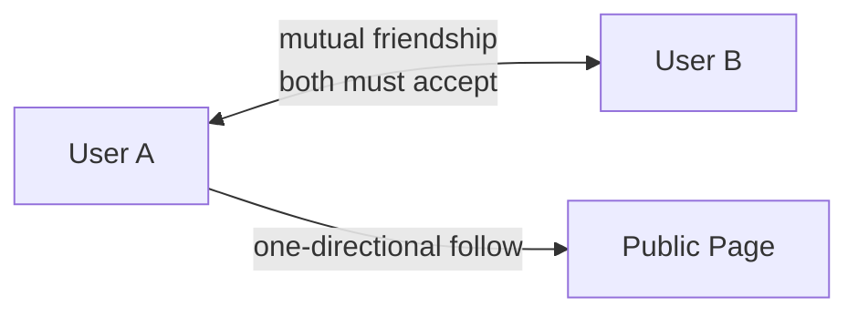
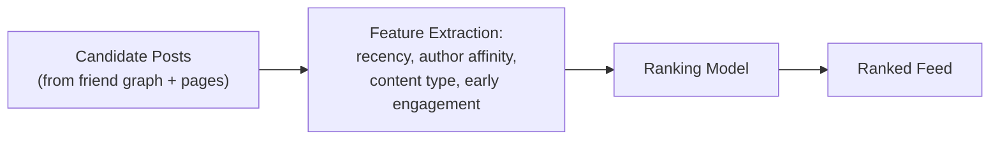
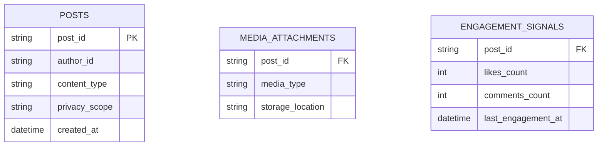
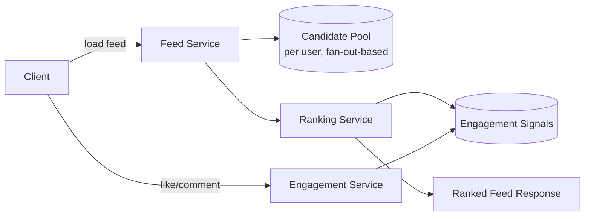

Facebook's News Feed shares the fan-out foundation of [Twitter/X Timeline](/docs/case-studies/twitter-timeline), but the defining difference is what actually gets shown: a **ranked** feed built from a bidirectional friend graph and multiple content types (photos, videos, links, life events), rather than a purely reverse-chronological feed from a one-directional follower graph. That ranking requirement changes the shape of the whole system.

## Requirements gathering

**Functional requirements**
- Users see a feed of posts from friends and followed pages, ordered by relevance rather than strictly by recency.
- Posts can be of mixed content types (text, photo, video, shared link), each with different rendering and engagement signals.
- Privacy settings determine who can see a given post (public, friends only, custom lists).

**Non-functional requirements**
- **Relevance over recency** — the feed's core value proposition is surfacing what a user is likely to care about, not simply the newest content first.
- **Low latency feed loads**, despite ranking being a meaningfully more expensive operation than a simple chronological merge.
- **Respect for the friend graph's bidirectionality** and privacy settings — unlike a public follow, friendship implies mutual visibility rules that must be enforced consistently.
- **Freshness of ranking signals** — engagement (likes, comments) needs to factor into ranking without requiring a full feed recomputation on every single interaction anywhere in the network.

<Callout type="note" title="Ranking is the central design challenge here, not fan-out">
The fan-out mechanics (push vs. pull, handling high-degree nodes) are structurally similar to Twitter's timeline problem and can be covered more briefly. The genuinely distinctive, harder problem is: given a candidate set of possible posts, how do you score and order them well, quickly, per user? Spend the interview's depth there.
</Callout>

## Capacity estimation

Assume: 2 billion daily active users, average 300 friends per user, average 5 feed loads per user per day.

- **Feed loads/sec**: 2,000,000,000 × 5 / 86,400 ≈ **~115,000 feed requests/second** — a massive, sustained read volume, since checking your feed is one of the most frequent actions in the entire product.
- **Candidate posts per feed generation**: with an average of 300 friends each posting periodically, a single feed request may need to rank across many hundreds to a few thousand candidate posts from the user's network before selecting and ordering the best ones to actually show.
- **Ranking cost per request**: unlike Twitter's largely precomputed-then-served timeline, meaningfully incorporating engagement signals and personalized relevance requires either a moderately expensive scoring step per feed load, or a hybrid of precomputation plus a lighter final re-ranking — this per-request ranking cost is the system's central scaling challenge.

The key insight: this system needs to combine **fan-out for candidate generation** (structurally similar to Twitter) with a **separate, genuinely expensive ranking step** layered on top — the two are different problems solved by different parts of the architecture.

## Friend graph vs. follower graph



A friendship is bidirectional and mutually consented to (both people must accept), unlike Twitter's one-directional follow — this affects both privacy defaults (friend-only posts are visible to a symmetric relationship) and candidate-generation logic (a user's feed candidates come from a graph where they're guaranteed to have a mutual relationship, distinct from the asymmetric, often-celebrity-skewed follower graph). Pages and groups add a third, more Twitter-like one-directional following relationship layered alongside the core friend graph.

## Candidate generation (fan-out)

```mermaid
flowchart TD
    NewPost["New Post"] --> FanOut{"Author's friend count?"}
    FanOut -->|typical| Push["Push post reference into\nfriends' candidate pools"]
    FanOut -->|very high (page/public figure)| Pull["Handle via read-time pull,\nsame principle as a celebrity account"]
```

Candidate generation follows the same push/pull hybrid principle established for high-follower-count accounts in Twitter's timeline design: a typical user's post is pushed into a candidate pool for each friend, while an extremely high-reach page or public account is instead merged in at read time — avoiding the same fan-out write storm problem, just triggered here by "very large audience" rather than specifically "celebrity."

## Ranking — the core distinctive problem



Each candidate post is scored using a combination of signals: how recent it is, the user's historical affinity with the post's author (how often they've engaged with that person before), the content type (some users engage more with photos than links, for instance), and early engagement velocity (a post already gathering likes/comments quickly is a signal of broader relevance). These features feed into a ranking model whose output determines final feed order — meaningfully more expensive per request than a simple chronological merge, which is exactly why this ranking step, not fan-out, is the system's central engineering investment.

<Callout type="warning" title="Ranking model complexity trades relevance quality against latency and cost">
A more sophisticated ranking model can produce a more genuinely relevant feed, but every added feature or model complexity increases the per-request compute cost at a scale of well over 100,000 requests/second. Real systems typically use a cheaper, coarser ranking pass to narrow a large candidate set down first, followed by a more expensive, precise re-ranking only on the smaller shortlist that's actually about to be shown — avoiding the cost of running the most expensive model against every single candidate.
</Callout>

## Handling mixed content types



Posts are modeled with a common core schema (author, privacy scope, timestamp) plus type-specific attachments (photo/video pointing to [object storage](/docs/storage/object-storage), similar to media handling in [YouTube](/docs/case-studies/youtube) or [Instagram](/docs/case-studies/instagram)) — the ranking step operates over this common core plus engagement signals, largely independent of the underlying media type, while rendering the actual feed item does depend on content type.

## High-level architecture



## Scaling strategy

- **Candidate generation** scales via the same push/pull fan-out hybrid as Twitter's timeline, since it's structurally the same underlying problem.
- **Ranking** scales through the coarse-then-precise two-pass approach described above, plus caching ranked results briefly (a user reloading their feed seconds later doesn't need a full re-rank from scratch).
- **Engagement signal updates** (likes, comments) are extremely high-volume writes but individually cheap — handled as an independent, horizontally scalable stream, decoupled from the feed-serving path so a burst of engagement activity on a viral post doesn't slow down feed loads for unrelated users.

## Bottlenecks

- **Ranking compute cost at scale**: the single largest cost driver in the system, mitigated with the coarse-filter-then-precise-rerank pattern and result caching for recently loaded feeds.
- **Viral posts generating extreme engagement-signal write volume**: a single very popular post can receive an enormous burst of likes/comments — mitigated with the same sharded-counter and asynchronous aggregation techniques used for any hot-key write problem, rather than updating one contended counter row synchronously per engagement.
- **Very large friend counts or page follower counts**: handled via the pull-at-read-time path, same as a celebrity account in a follower-graph system.

## Failure scenarios

- **Ranking service outage or degradation**: the feed can gracefully fall back to a simpler, cheaper ranking heuristic (or even chronological order for the affected request) rather than failing to load a feed entirely — a degraded but still functional experience.
- **Engagement store lag**: ranking proceeds using slightly stale engagement signals rather than blocking on fully up-to-date counts, since a few seconds of staleness in a "how popular is this post right now" signal is an acceptable trade-off.
- **Candidate pool generation failure for a specific user**: the feed service falls back to fetching directly from the friend graph and recent posts table on demand (slower, but correct) rather than showing an empty feed.

## Improvements

- **Diversity constraints in ranking**, deliberately avoiding a feed dominated by a single highly active friend or content type, even if that content scores highest on raw relevance signals alone.
- **Real-time ranking model updates** that incorporate very recent engagement more quickly, rather than relying solely on periodically retrained models.
- **Explicit user feedback signals** ("see less of this," "why am I seeing this post") feeding directly back into personalized ranking adjustments for that specific user.

## Summary

Facebook's News Feed builds on the same fan-out foundations as a follower-based timeline, but its defining engineering investment is the ranking step: scoring a candidate set of posts using recency, author affinity, content type, and engagement signals, typically via a cheap coarse pass followed by a more precise re-rank on a smaller shortlist to keep the enormous request volume affordable. The bidirectional friend graph (versus a one-directional follow) shapes both privacy defaults and candidate generation, while engagement signals are handled as a decoupled, independently scalable write stream so viral-post activity never slows down feed loading for everyone else.

<Quiz questions={[
  {
    q: "Why is ranking described as the central engineering challenge for a News Feed, more so than fan-out itself?",
    options: [
      "Fan-out doesn't apply to this kind of system at all",
      "Fan-out mechanics are structurally similar to a chronological timeline system, but producing a genuinely relevant, non-chronological ordering requires scoring many candidate posts per request using multiple signals — a meaningfully more expensive, and more product-defining, computation than a simple chronological merge",
      "Ranking is actually simpler to implement than fan-out",
      "Ranking and fan-out are the same operation performed twice"
    ],
    answer: 1,
    explanation: "Candidate generation (fan-out) follows much the same push/pull pattern established for chronological timelines. What's genuinely different and harder is scoring and ordering those candidates by relevance rather than recency — a meaningfully more expensive per-request computation, and the part of the system most directly responsible for the feed's actual quality."
  },
  {
    q: "Why do real ranking systems typically use a cheap coarse pass followed by a more expensive precise re-rank, rather than running the most sophisticated model against every candidate?",
    options: [
      "Coarse ranking passes always produce better results than precise models",
      "Running an expensive, sophisticated model against every single candidate post, for every one of well over 100,000 feed requests per second, would be prohibitively costly — narrowing the candidate set with a cheaper pass first, then applying the expensive model only to the smaller shortlist, keeps this affordable at scale",
      "Precise re-ranking is only used for public pages, never for friend posts",
      "There is no real cost difference between coarse and precise ranking models"
    ],
    answer: 1,
    explanation: "At this request volume, applying the most expensive, highest-quality ranking model to every candidate post for every feed load would be computationally prohibitive. A cheaper first pass narrows hundreds or thousands of candidates down to a much smaller shortlist, and only that shortlist goes through the more expensive, precise ranking step — balancing relevance quality against real compute cost."
  }
]} />
