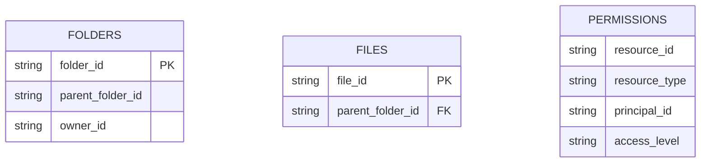
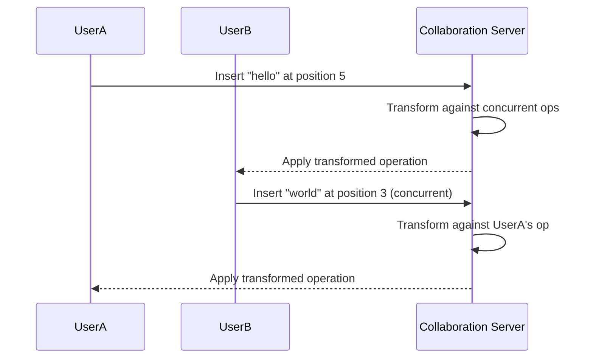
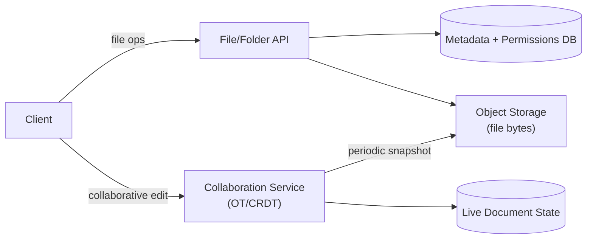

Google Drive shares file storage fundamentals with [Dropbox](/docs/case-studies/dropbox), but its defining engineering challenges lie elsewhere: a genuine folder hierarchy with inherited permissions, real-time multi-user collaborative editing within a single document, and flexible sharing (specific people, or "anyone with the link") layered on top of storage. Where Dropbox's hard problem is efficient sync and honest conflict handling, Drive's is concurrent collaboration and access control.

## Requirements gathering

**Functional requirements**
- Users organize files into a nested folder hierarchy, and can share individual files or entire folders with specific people or via a shareable link.
- Multiple users can simultaneously edit the same document in real time, seeing each other's changes live.
- Permission changes (revoking access, changing a folder's sharing settings) apply consistently, including to nested content.

**Non-functional requirements**
- **Correct, consistent permission enforcement** — a user must never retain access to content after it's been revoked, and nested content must correctly inherit (or override) folder-level permissions.
- **Low-latency collaborative editing** — concurrent edits from multiple users need to converge to the same correct document state quickly, without one user's typing blocking another's.
- **Durability**, as with any storage system — a file must never be silently lost.
- **Flexible sharing scopes**, from a single named collaborator to a public "anyone with the link" access level.

<Callout type="note" title="Split this into two genuinely different sub-problems up front">
State clearly that "storing and syncing files" (well covered by the same principles as Dropbox — chunking, object storage, delta sync) is a largely solved sub-problem here, and spend the bulk of the design time on the two things that are actually distinctive to Drive: the permission/hierarchy model and real-time collaborative editing.
</Callout>

## Capacity estimation

Assume: 1 billion users, average 500 files per user, a meaningful fraction of documents actively co-edited by multiple people at any given time.

- **Total files**: ~500 billion file records — overwhelmingly metadata-heavy at this count, reinforcing that the *metadata and permission* layer, not just raw file bytes, needs to scale independently and efficiently.
- **Permission checks/sec**: every single file access (open, edit, list a folder) requires a permission check, often needing to walk up a folder hierarchy to resolve inherited permissions — this check happens far more often than files are actually modified, and needs to be fast.
- **Concurrent editing sessions**: a comparatively small fraction of all files are being actively co-edited at any moment, but each such session requires low-latency, real-time synchronization of every keystroke among all active editors — a fundamentally different workload profile from simple file storage.

The key insight: this system has **three different scaling problems layered together** — bulk file storage (largely a solved problem, shared with Dropbox), a permission/hierarchy resolution system that must be fast despite deep nesting, and a real-time collaborative editing protocol for the comparatively small set of actively co-edited documents.

## Folder hierarchy and permission model

Permissions can be set directly on a file or folder, and by default are **inherited** down the folder tree — a file inside a shared folder is accessible to everyone the folder is shared with, unless an explicit override exists on the file itself. Resolving "can this user access this file" in the general case means walking up the folder hierarchy checking for the nearest applicable permission entry, which needs to be fast even for deeply nested structures.

<Callout type="tip" title="Materializing effective permissions avoids walking the hierarchy on every check">
Rather than recomputing a folder-tree walk on every single access check, many systems precompute and cache each resource's **effective** permission set (the resolved result of walking the hierarchy) whenever an ancestor's permissions change, propagating that update down to affected descendants asynchronously. This turns a potentially expensive, deep hierarchy walk on the hot read path into a single fast lookup, at the cost of needing a reliable propagation mechanism whenever a folder's sharing settings change.
</Callout>

## Real-time collaborative editing

Concurrent edits from multiple users are reconciled using either **Operational Transformation (OT)** or **CRDTs (Conflict-free Replicated Data Types)** — both are techniques for taking concurrent edits made against slightly different views of a document and transforming or merging them so every collaborator's view converges to the same final, correct state, without requiring a central lock that would force users to take turns editing. OT transforms each incoming operation against any concurrent operations it wasn't aware of when created; CRDTs instead design the document's underlying data structure so that concurrent operations are inherently, mathematically guaranteed to merge consistently regardless of the order they're applied in.

<Callout type="warning" title="This is genuinely hard, well-trodden research territory — not something to improvise">
Building a correct OT or CRDT implementation from scratch is notoriously easy to get subtly wrong (edge cases around concurrent inserts/deletes at overlapping positions are a classic source of bugs). Real systems build on well-established algorithms and libraries rather than inventing new conflict-resolution logic — in an interview, it's enough to correctly explain *why* naive last-write-wins editing breaks down for concurrent text edits and *what class* of solution (OT or CRDT) addresses it, without needing to derive the transformation logic itself.
</Callout>

## Sharing links and access levels

Beyond named-user sharing, a resource can be shared via a link with a configurable access level (view, comment, edit) and scope (anyone with the link, or restricted to a specific organization/domain). This is modeled as a special kind of permission entry (a "link-based" principal rather than a specific user ID), checked the same way as any other permission during access resolution — keeping link sharing and named-user sharing as variations of one underlying permission model rather than two entirely separate systems.

## High-level architecture

The collaboration service is architecturally distinct from the general file storage/metadata system — it holds live, in-memory document state for actively-edited documents and periodically persists snapshots back to durable storage, rather than treating every keystroke as a separate durable write to the primary file store.

## Scaling strategy

- **File storage** scales via the same object-storage and chunking principles as Dropbox, since bulk byte storage is a largely shared problem across both systems.
- **Permission resolution** scales through materialized/cached effective-permission lookups, avoiding expensive hierarchy walks on the common read path.
- **Collaboration service** scales by sharding actively-edited documents across many collaboration server instances, since each editing session is largely independent of every other document's session — a document being actively co-edited needs a consistent server holding its live state, but different documents' sessions don't need to coordinate with each other at all.

## Bottlenecks

- **Deep folder hierarchies with frequent permission changes**: mitigated by the materialized effective-permission cache described above, with asynchronous propagation on ancestor permission changes rather than synchronous recomputation on every read.
- **Extremely large, heavily co-edited documents**: many simultaneous collaborators on one document concentrate load on a single collaboration session — mitigated by the underlying OT/CRDT algorithm being efficient per-operation, and by limiting practical concurrent-editor counts where genuinely necessary.
- **Permission revocation propagation delay**: if effective permissions are cached, revoking access needs to propagate promptly, or a user could retain access briefly after being removed — real systems bias toward fast, reliable invalidation specifically for revocation events, even if other permission-cache updates can be slightly more relaxed.

## Failure scenarios

- **Collaboration server crash mid-session**: the live in-memory document state for affected sessions needs periodic snapshotting (as shown in the architecture) so a crash loses at most the changes since the last snapshot, not the whole document; clients reconnect to another instance and resync from the last durable state.
- **Metadata/permission database outage**: file browsing and permission-dependent operations are impaired, but already-open collaborative editing sessions (using their own separately-held live state) can often continue briefly, buffering changes until the metadata layer recovers.
- **Object storage outage**: similar to Dropbox, uploads/downloads of file bytes are affected, but metadata operations (renaming, permission changes, folder structure) can continue independently, since they don't depend on the storage layer being available.

## Improvements

- **Presence indicators** (showing which collaborators are currently viewing/editing a document and where their cursor is), layered on top of the same collaboration service's live session state.
- **Offline editing with merge-on-reconnect**, extending the OT/CRDT approach to handle a client that was disconnected for an extended period, needing to reconcile a larger batch of offline changes against everything that happened while it was away.
- **Granular, expiring share links**, adding time-limited or view-count-limited access as additional constraints on the existing link-based permission model.

## Summary

Google Drive shares its bulk file-storage foundation with a system like Dropbox, but its genuinely distinctive engineering challenges are a folder hierarchy with inherited, materializable permissions that must resolve quickly even when deeply nested, and a real-time collaborative editing layer (built on OT or CRDT techniques) that lets multiple users concurrently edit the same document and reliably converge to the same correct state without a central lock. Both problems are handled by dedicated subsystems — a permission-resolution layer and a collaboration service — that are architecturally separate from, and layered on top of, the comparatively standard file storage and metadata system underneath.

<Quiz questions={[
  {
    q: "Why do systems typically materialize and cache a resource's 'effective' permissions rather than walking the folder hierarchy on every access check?",
    options: [
      "Walking the hierarchy on every check is actually just as fast",
      "Every single file access requires a permission check, and recomputing a potentially deep folder-tree walk on each one would be too slow for the hot read path — precomputing and caching the resolved result turns this into a single fast lookup, updated asynchronously when an ancestor's permissions change",
      "Materialized permissions eliminate the need for any permission checks at all",
      "Folder hierarchies never actually affect permission resolution"
    ],
    answer: 1,
    explanation: "Since permission checks happen on essentially every file access — far more often than permissions actually change — recomputing a hierarchy walk each time would add unnecessary latency to the most common operation in the system. Precomputing and caching the effective, resolved permission set turns each check into a fast lookup, with the more expensive recomputation only needed when an ancestor's permissions actually change."
  },
  {
    q: "Why can't concurrent document edits from multiple users simply use a 'last write wins' approach?",
    options: [
      "Last write wins works perfectly fine for real-time collaborative text editing",
      "Two users editing different parts of a document concurrently would have one user's changes silently overwritten or corrupted by the other's, since naive last-write-wins doesn't account for how concurrent, position-based text operations interact — OT or CRDT techniques are needed to correctly merge concurrent edits",
      "Last write wins is only a problem for image files, not text documents",
      "Concurrent editing never actually happens in practice"
    ],
    answer: 1,
    explanation: "In a real-time collaborative document, multiple users can be inserting or deleting text at overlapping or nearby positions simultaneously. A naive last-write-wins approach would simply let one user's entire update overwrite another's, corrupting the document — Operational Transformation or CRDT techniques are specifically designed to correctly reconcile such concurrent, fine-grained edits so every collaborator converges to the same correct result."
  }
]} />
