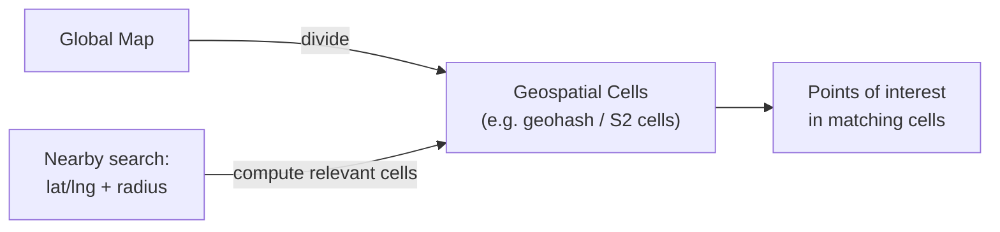
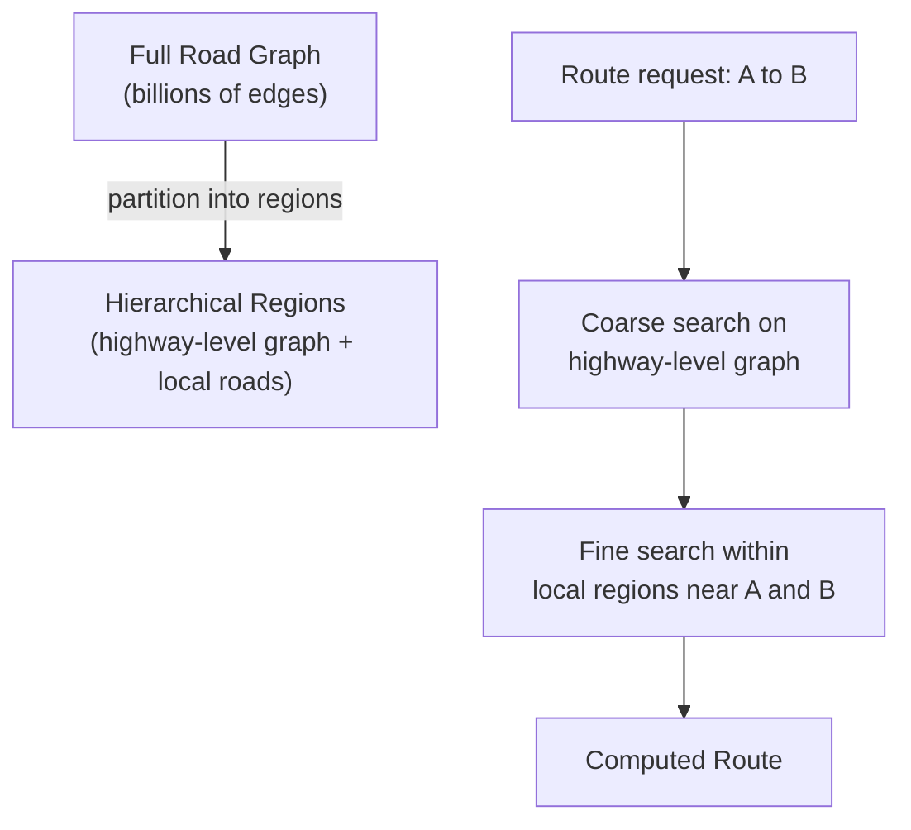
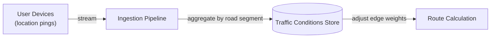
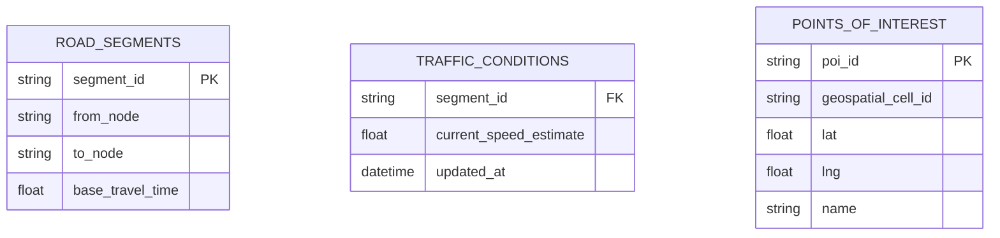
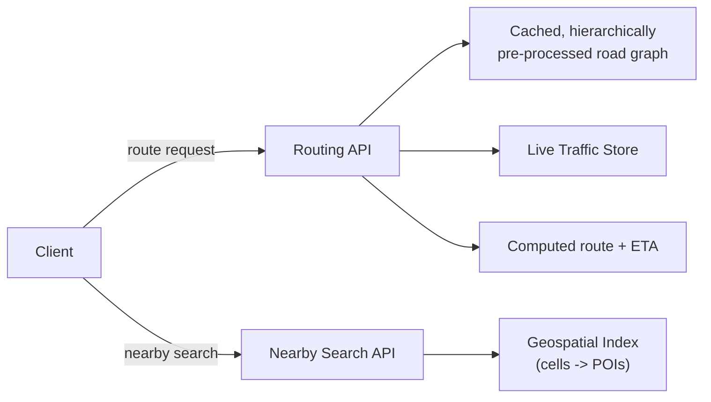

Google Maps is a distinctive system design question because it isn't really one problem — it's three genuinely different ones stacked together: efficiently storing and querying massive geospatial data, computing shortest/fastest paths across a graph with billions of edges, and folding in real-time, constantly-changing traffic conditions without recomputing everything from scratch.

## Requirements gathering

**Functional requirements**
- Users can search for a location and get directions between two points.
- Routes should reflect real-time traffic conditions and provide an ETA.
- Users can view nearby points of interest (restaurants, gas stations) around a location.

**Non-functional requirements**
- **Low latency route computation** — directions need to return in a second or two, not minutes, despite the underlying graph being enormous.
- **Freshness of traffic data** — conditions change constantly (an accident, congestion), and routes/ETAs need to reflect that quickly without being recalculated from nothing on every request.
- **Massive geospatial scale** — road networks and points of interest span the entire globe.
- **High read volume, relatively low write volume** for the map data itself (though traffic data is a genuinely high-volume, high-frequency write stream).

<Callout type="note" title="Separate the map graph from the traffic layer early">
A clean way to structure this interview is to explicitly split the problem into a mostly-static **road graph** (nodes and edges representing the physical road network) and a highly dynamic **traffic layer** (live conditions affecting edge weights) that sits on top of it. Nearly every design decision that follows falls out of that separation.
</Callout>

## Capacity estimation

Assume: 1 billion daily active users, average 5 direction requests per active user per day, road network graph with billions of edges globally.

- **Requests/sec**: 1,000,000,000 × 5 / 86,400 ≈ **~58,000 direction requests/second** average, with sharp regional peaks during local rush hours.
- **Graph size**: representing the world's road network as nodes (intersections) and edges (road segments) easily reaches billions of edges — far too large to run a naive shortest-path algorithm over on every single request.
- **Traffic data volume**: with hundreds of millions of location-reporting devices (phones running the app) continuously reporting position, the traffic-layer write volume is enormous and constant — this is a genuinely high-throughput streaming ingestion problem in its own right.

The key insight: route computation **cannot** run a general shortest-path search over the full global graph per request — the graph must be pre-processed and partitioned so that a query only ever touches a small, relevant slice of it.

## Geospatial indexing

To answer "what's near this point" efficiently, the world is divided into a hierarchy of geospatial cells (using a scheme like **geohashing** or Google's own **S2 geometry library**, which maps regions of the Earth's surface to compact identifiers). A location is stored tagged with its cell ID, and a "nearby" query computes which cells cover the search radius and looks up only points of interest within those specific cells — turning an otherwise expensive geometric search into a fast, indexed lookup.

## Route calculation at scale

Running Dijkstra's or A* directly over a graph with billions of edges per request would be far too slow. Real systems use **hierarchical route planning**: the graph is pre-processed into layers — a coarse, high-speed "highway" layer for the long middle portion of a route, and detailed local layers only near the actual start and end points — so a query only searches in detail where detail actually matters, and traverses the abstracted, much smaller highway-level graph for the bulk of the distance. This is conceptually similar to how a human plans a long drive: think in detail about local streets near home and near the destination, but just think "take the highway" for the long stretch in between.

<Callout type="tip" title="Pre-processing the graph is what makes real-time queries possible">
The actual routing algorithm run per-query (a variant of Dijkstra's or A*) isn't the hard part — it's well understood. The hard part, and the actual engineering achievement, is the offline pre-processing that restructures the graph hierarchically so the per-query search only ever has to explore a tiny, relevant fraction of the global graph.
</Callout>

## Real-time traffic layer

Anonymized, aggregated location pings from user devices are streamed into an ingestion pipeline (see [Event-Driven Architecture](/docs/messaging/event-driven-architecture)) and aggregated per road segment to estimate current speed/congestion. These aggregated traffic conditions adjust the *weight* of the corresponding edges in the road graph (a congested segment becomes a more "expensive" edge to traverse) — route calculation then naturally favors less congested paths, without needing a fundamentally different algorithm, just dynamically updated edge weights layered on top of the static graph structure.

## Data model

The static road graph (`ROAD_SEGMENTS`) changes rarely (new roads, closures) and can be cached aggressively; `TRAFFIC_CONDITIONS` changes constantly and is kept in a fast, frequently-updated store, joined against the static graph at query time to produce current effective travel times.

## High-level architecture

## Scaling strategy

- **Road graph** is largely static and read-only at request time, so it's heavily cached and replicated close to compute regions — pre-processing (hierarchical partitioning) is done offline and periodically refreshed, not recomputed per request.
- **Traffic ingestion** scales horizontally as a streaming pipeline, aggregating a very high-volume stream of location pings down to a much smaller number of per-segment condition updates.
- **Geospatial index** is naturally shardable by region (cells map cleanly to geographic areas), so different regions' load can be handled independently.
- **Route computation** benefits from regional compute — a route request between two nearby points only needs the local region's detailed graph data, not the entire global graph loaded anywhere.

## Bottlenecks

- **Recomputing routes on every minor traffic change**: mitigated by only refreshing an active route's ETA periodically (not on every single traffic update) and only fully recalculating the path itself if conditions change enough to meaningfully affect the best route.
- **Global graph size for route pre-processing**: solved by regional partitioning — pre-processing and hierarchy-building can happen per region and be updated independently, rather than as one enormous global batch job.
- **Extremely popular locations (hot POIs)**: a small number of extremely popular destinations receive a disproportionate share of nearby-search and routing traffic — mitigated with caching at the application layer for frequently requested routes and locations.

## Failure scenarios

- **Traffic data pipeline outage**: routing falls back gracefully to the static graph's base travel-time estimates (no live traffic adjustment) rather than failing outright — a degraded but still functional experience.
- **Regional routing service failure**: requests fail over to a nearby region's service, at the cost of slightly higher latency, since the underlying map data itself is broadly replicated.
- **Geospatial index node failure**: replicated, sharded-by-region indexing means a single node failure affects only nearby-search queries for that specific region, not globally.

## Improvements

- **Personalized routing** (e.g. avoiding highways for a driver who's indicated that preference), layered on top of the same base route computation as an additional constraint or cost adjustment.
- **Predictive traffic modeling**, forecasting likely congestion (e.g. typical rush-hour patterns) rather than reacting purely to already-observed conditions, improving ETA accuracy for longer routes.
- **Multi-modal routing** (combining driving, walking, and public transit segments into a single route), requiring the graph model to represent multiple transport-mode layers, not just roads.

## Summary

Google Maps' core engineering challenge is making enormous-scale geospatial and graph problems tractable at low latency: geospatial cell indexing turns "what's nearby" into a fast, sharded lookup instead of a geometric scan, and hierarchical graph pre-processing turns "shortest path across billions of edges" into a query that only ever touches a small, relevant slice of the graph. Real-time traffic is folded in not as a separate routing algorithm, but as dynamically updated edge weights layered on top of that same pre-processed structure.

<Quiz questions={[
  {
    q: "Why can't route calculation run a standard shortest-path algorithm directly over the entire global road graph on every request?",
    options: [
      "Shortest-path algorithms don't work on road networks",
      "The global graph has billions of edges, so a naive search over the whole thing would be far too slow for a real-time query — hierarchical pre-processing restructures the graph so each query only explores a small, relevant portion",
      "Road graphs change too frequently to be searched at all",
      "There's no actual difference between searching the full graph and a hierarchically pre-processed one"
    ],
    answer: 1,
    explanation: "Running Dijkstra's or A* over a graph with billions of edges per request would be computationally far too slow for real-time use. Hierarchical pre-processing (a coarse highway-level layer plus detailed local layers only near the endpoints) means each query only searches a small, relevant fraction of the graph, which is what actually makes low-latency routing possible."
  },
  {
    q: "How does real-time traffic get incorporated into route calculation without a fundamentally different routing algorithm?",
    options: [
      "It doesn't — a completely separate algorithm is used whenever traffic data is available",
      "Aggregated traffic conditions adjust the weight (effective cost) of the corresponding edges in the graph, so the same shortest-path-style algorithm naturally favors less congested routes using the updated weights",
      "Traffic data is ignored entirely in route calculation",
      "Every traffic update triggers a full recomputation of the global graph's structure"
    ],
    answer: 1,
    explanation: "Rather than changing the routing algorithm itself, live traffic conditions adjust the weight of the relevant graph edges (a congested segment becomes more 'expensive' to traverse). The same underlying shortest-path computation then naturally routes around congestion using these updated weights."
  }
]} />
