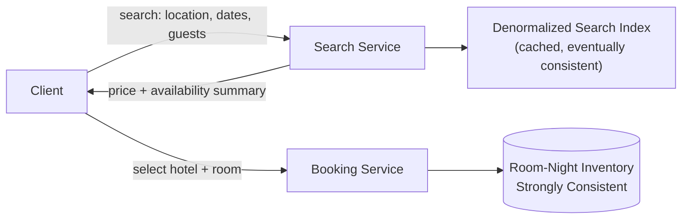
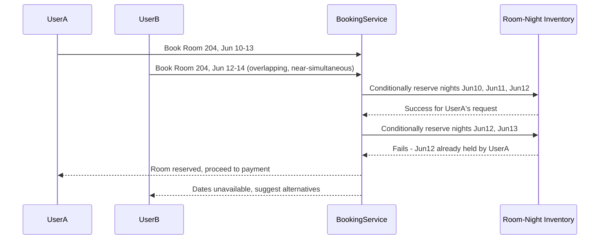
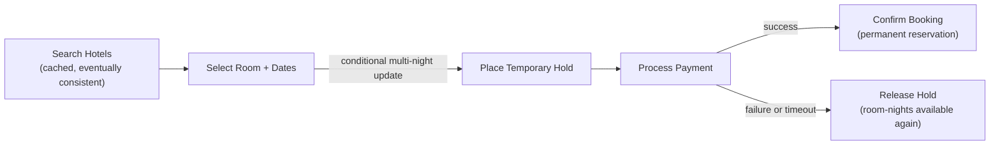
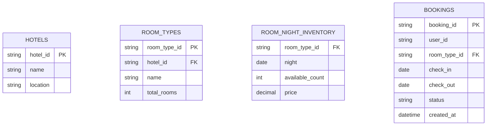
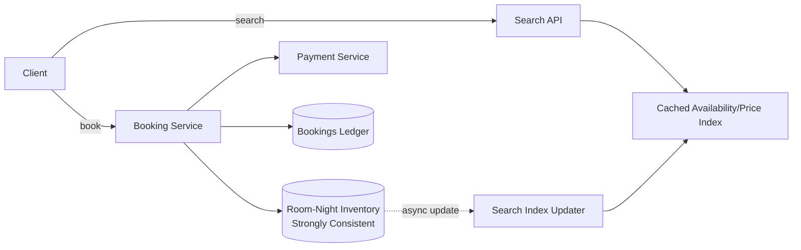

A hotel booking system looks similar to an [Airline Reservation System](/docs/case-studies/airline-reservation) on the surface — both are inventory-with-limited-supply problems under real concurrency — but the shape of the inventory is different in a way that changes the design: a flight seat is a single indivisible unit, while a hotel room is booked for a **date range**, so two requests only conflict if their date ranges overlap. That shift, from "is this seat taken" to "is this room free for these nights," is the core modeling challenge.

## Requirements gathering

**Functional requirements**
- Users can search hotels by location, date range, and guest count, and see availability and price.
- Users can book a specific room type at a specific hotel for a specific date range, completing payment as part of the flow.
- Users can cancel a booking, releasing the inventory back to availability for those dates.
- Hotels (partners) can manage room inventory and pricing.

**Non-functional requirements**
- **Strong consistency on room-night inventory** — the same room must never be double-booked for overlapping dates; like seat inventory, this is a case where correctness under concurrency outweighs almost everything else.
- **No lost bookings** — a confirmed, paid booking must never silently disappear.
- **High availability and low latency on search**, since browsing and price comparison happen far more often than actual bookings and directly drive conversion.
- **Auditable transaction history**, similar in spirit to a [Payment Gateway](/docs/case-studies/payment-gateway)'s ledger requirements.

<Callout type="note" title="Model inventory as room-nights, not rooms">
The natural unit of contention isn't "the room" — it's "this room type, on this specific night." A multi-night stay touches several separate room-night records that must all be available; this framing is what makes range-based booking tractable with the same conditional-update techniques used for simpler unit-inventory problems.
</Callout>

## Capacity estimation

Assume: 500,000 hotels on the platform, averaging 100 rooms each, with search traffic far exceeding booking traffic.

- **Room-nights under management**: 500,000 hotels × 100 rooms × 365 days ≈ 18 billion room-night records per year — a large but bounded, naturally shardable-by-hotel dataset.
- **Search QPS**: search dominates booking QPS by orders of magnitude, since users compare many hotels and dates before committing — this path is read-heavy and highly cacheable, much like flight search.
- **Booking QPS**: comparatively low, but each request needs strict correctness across a date range rather than a single record — the interesting engineering problem is correctness on a small, contended set of room-night rows per hotel, not raw throughput.

The key insight: like airline booking, this is a **low-volume, high-correctness booking path sitting behind a massive-volume, latency-sensitive search path** — the two need very different consistency strategies and should be decoupled early.

## Search & availability

Search results are served from a **denormalized, eventually-consistent index** (hotel metadata, room types, an availability summary, and current price), rebuilt or updated asynchronously as bookings and cancellations occur. This is a deliberate trade-off: it's acceptable for search to occasionally show a room as available when it was just booked seconds earlier, because the actual booking step always re-validates against the strongly consistent inventory before confirming — the same pattern as flight search versus flight booking.

<Callout type="tip" title="Price and availability are related but separable concerns">
Pricing (often dynamic, based on demand, seasonality, and length of stay) can be computed or cached largely independently of the strict availability check. Treating them as one tightly coupled operation makes the read-heavy search path unnecessarily slow; separating them lets pricing be aggressively cached while only the final availability check hits the consistent source of truth.
</Callout>

## Room-night inventory and concurrency control

The core mechanism, as with seat inventory, is a **conditional update** — but applied across every room-night row a booking touches, ideally within a single atomic transaction so a multi-night stay is never left partially reserved. A common approach keeps a per-room-night counter of remaining inventory (useful when a hotel sells multiple identical rooms of the same type) and decrements it only if the count is still positive for every night in the requested range; if any single night in the range fails the check, the whole reservation attempt is rolled back rather than left half-booked.

<Callout type="warning" title="A short hold step still matters, just like seat booking">
Selecting a room and proceeding to payment isn't instantaneous, so the system places a short-lived hold across the requested date range the moment a user starts checkout, giving them time to pay without either losing the room mid-checkout or permanently locking those nights away if they abandon the flow. The hold expires automatically and releases the room-nights back to availability.
</Callout>

## Booking transaction flow

As with airline booking, this spans multiple systems — inventory and payment — that must all succeed together or cleanly roll back, making it a natural fit for a **saga**-style pattern (see [Saga Pattern](/docs/microservices/saga-pattern)): a payment failure triggers a compensating action that releases the held room-nights rather than leaving the system in a partially-committed state.

## Data model

`ROOM_NIGHT_INVENTORY` is the strongly consistent, contention-sensitive table (one row per room type per night) where the actual booking logic operates; `BOOKINGS` is the durable, auditable record of completed and cancelled stays, analogous to the append-only ledger in a payment system.

## High-level architecture

## Scaling strategy

- **Search/browse path** scales through caching and a denormalized index kept fresh asynchronously — slightly stale availability during browsing is an acceptable trade-off, since booking always re-validates against the source of truth.
- **Room-night inventory** shards naturally by hotel (or hotel group), since a single hotel's rooms are the actual contention domain — cross-hotel scale is handled by adding more shards, not by making any one shard bigger.
- **Booking service** scales horizontally as a largely stateless orchestrator, since the consistency-critical state lives in the inventory store and the auditable state lives in the bookings ledger, not in the service layer itself.

## Bottlenecks

- **High-demand dates at popular hotels** (e.g. a citywide event driving simultaneous booking attempts for the same limited room-nights): the conditional-update mechanism resolves this correctly, but many rapid failed attempts still need clear "no longer available" UX, same as flash-sale flight bookings.
- **Held-but-abandoned bookings**: room-nights held during an incomplete checkout need reliable expiration (TTL or background sweep) so an abandoned session doesn't lock out otherwise-available inventory.
- **Multi-night atomicity**: a stay spanning many nights touches many rows; ensuring the whole range succeeds or fails together (rather than partially reserving some nights) needs a genuine atomic transaction, not several independent conditional updates.

## Failure scenarios

- **Payment succeeds but booking confirmation write fails**: the highest-risk failure mode for any system handling money — mitigated with idempotent, retryable confirmation logic and reconciliation against the payment provider's records, the same pattern used in payment gateway design.
- **Inventory database node failure**: since room-night data needs strong consistency, failover must preserve that guarantee (e.g. via a consensus-based replicated store) rather than degrading to a weaker, eventually-consistent replica for this specific data.
- **Hold-expiration sweep failure**: room-nights could stay incorrectly held past their intended expiration — mitigated by checking hold expiration inline at read/write time in addition to any background sweep, so correctness doesn't depend solely on the sweep running on schedule.

## Improvements

- **Waitlisting**: letting a user join a waitlist for a fully booked date range at a specific hotel, notified automatically if a held reservation expires or a cancellation frees up those nights.
- **Dynamic pricing**: adjusting price per night based on real-time demand and remaining inventory, computed on the cached pricing path so it doesn't add latency to the strict availability check.
- **Overbooking with managed risk**, mirroring the airline industry's approach: selectively overselling a small margin of rooms based on historical no-show/cancellation rates, with a defined compensation process for the rare case where demand exceeds physical rooms.

## Summary

A hotel booking system's defining challenge is correctness under concurrency over a **date range** rather than a single unit — solved by modeling inventory as room-nights and applying atomic, conditional updates across every night a booking touches, with a temporary hold step that balances checkout time against not locking out other guests indefinitely. It shares its core concurrency-control and saga-style transaction pattern with airline reservation systems, but the range-based inventory model is what makes it a distinct and slightly harder variant of the same underlying problem.

<Quiz questions={[
  {
    q: "Why is hotel inventory modeled as 'room-nights' (one record per room type per night) rather than a single record per room?",
    options: [
      "Room-night modeling has no real benefit over per-room modeling",
      "Since a booking spans a date range, two requests only conflict when their ranges overlap — modeling each night separately lets the system apply the same atomic conditional-update technique used for single-unit inventory across every night a stay touches",
      "It's required by hotel industry regulations",
      "It only matters for hotels with exactly one room"
    ],
    answer: 1,
    explanation: "Framing availability as room-nights turns a date-range conflict problem into a set of independent, atomically-checkable records — a multi-night booking succeeds only if every room-night it touches is available, checked and reserved together in one atomic transaction."
  },
  {
    q: "Why does the booking flow keep search results in an eventually-consistent cache instead of always querying the strongly consistent inventory store directly?",
    options: [
      "Search doesn't need to be fast, so consistency doesn't matter",
      "Search traffic vastly exceeds booking traffic and can tolerate brief staleness, so serving it from a cached, denormalized index avoids overloading the consistency-critical inventory store — the actual booking step still re-validates against the source of truth before confirming",
      "Eventually-consistent caches are always more accurate than the source of truth",
      "The inventory store cannot be queried for search purposes at all"
    ],
    answer: 1,
    explanation: "Decoupling the high-volume, staleness-tolerant search path from the low-volume, correctness-critical booking path lets each scale and be optimized independently — search stays fast via caching, while booking still guarantees correctness by checking the strongly consistent inventory at the moment of reservation."
  }
]} />
