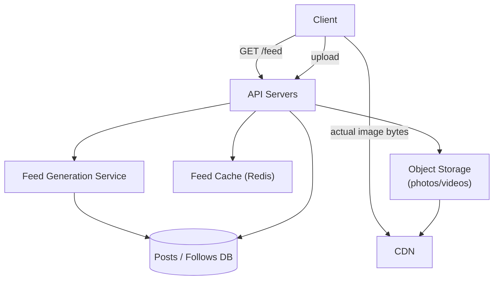
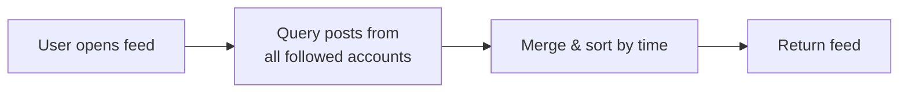
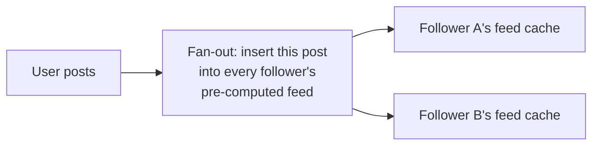

Instagram combines several problems this course has already covered individually — media storage, caching, feed generation — into one system, making it an excellent case study for seeing how they compose together.

## Requirements gathering

**Functional requirements**
- Users can upload photos/videos with captions, and follow other users.
- Users see a feed of recent posts from accounts they follow.
- Users can like and comment on posts.

**Non-functional requirements**
- **Extremely read-heavy** — viewing the feed and posts vastly outnumbers uploading new content.
- **Low latency feed loading** — the feed is the core, constantly-used part of the product.
- **High availability** for reads — an unavailable feed is immediately, visibly broken to users.
- **Eventual consistency is acceptable** for things like like-counts and follower counts — a brief delay in an updated count is a non-issue.

## Capacity estimation

Assume: 500 million daily active users, each viewing their feed an average of 10 times/day, and 100 million photos uploaded per day.

- **Feed reads/day**: 500,000,000 × 10 = 5 billion feed loads/day ≈ **~58,000 reads/second** average, several times that at peak.
- **Uploads/day**: 100 million ≈ **~1,150 uploads/second** average — dramatically smaller than the read volume, confirming this is a read-heavy system by a wide margin (roughly 50:1 read-to-write).
- **Storage**: assume an average photo is 200KB (after compression/resizing into multiple sizes). 100 million/day × 200KB ≈ 20TB/day of new media — clearly a job for [Object Storage](/docs/storage/object-storage), not a traditional database.

The 50:1 read-to-write ratio is the single most important number here — it immediately implies caching and pre-computation matter enormously more than optimizing the write path.

## API design

```
POST /posts                     → upload a new post (photo + caption)
GET  /feed                       → get the current user's home feed
GET  /users/:id/posts             → get a specific user's posts
POST /posts/:id/like              → like a post
POST /posts/:id/comments          → add a comment
```

## Database design

- **Posts**: post ID, user ID, media URL (pointing to object storage), caption, timestamp — a straightforward relational or document shape.
- **Follows**: a simple `follower_id, followee_id` relationship table — but at scale, this table (and querying "everyone user X follows") becomes a key input to feed generation.
- **Media files**: stored in object storage, with the database only storing a reference URL, not the media itself (see [Blob Storage](/docs/storage/blob-storage)).
- **Likes/comments counts**: frequently updated, high-write columns — often cached or maintained as approximate, eventually-consistent counters rather than exact real-time counts recalculated on every read.

## High-level architecture



Note the split: metadata (who posted what, who follows whom) lives in a conventional database, while the actual media bytes are served through object storage fronted by a CDN — the same media-vs-metadata separation seen in the [Blob Storage](/docs/storage/blob-storage) page, applied at real scale.

## Detailed architecture — feed generation: push vs. pull

This is the single most interesting design decision in the whole system.

**Pull model (fan-out on read)**: when a user opens their feed, the system queries posts from everyone they follow, in real time, and merges/sorts them.



- ✅ Simple, no wasted work for content nobody ever looks at.
- ❌ Slow for users following many accounts (querying and merging many accounts' recent posts on every single feed load).

**Push model (fan-out on write)**: when a user posts, the system immediately pushes that post into the pre-computed feed of every one of their followers.



- ✅ Feed reads become nearly instant — just fetch the already-assembled feed.
- ❌ A very popular account (millions of followers) posting causes an enormous fan-out burst — this is the well-known **celebrity problem**.

<Callout type="tip" title="The hybrid approach real systems use">
Most large-scale feed systems (Instagram included, based on published engineering accounts) use a hybrid: push-based fan-out for the vast majority of accounts with normal follower counts, but pull-based (computed at read time) specifically for accounts with an enormous number of followers, where push-based fan-out would be prohibitively expensive to do on every single post.
</Callout>

## Scaling strategy

- **CDN for all media delivery**, since photos/videos are the overwhelming majority of total bandwidth and are highly cacheable, unchanging content.
- **Aggressive caching of feed data and post metadata**, given the 50:1 read-to-write ratio — a cache miss rate that's even slightly too high directly translates into significant unnecessary database load.
- **Sharding the posts/follows database** by user ID as the platform grows past what read replicas and caching alone can absorb (see [Sharding](/docs/databases/sharding)).
- **Hybrid push/pull feed generation** specifically to handle the celebrity-account fan-out problem gracefully.

## Bottlenecks

- **The celebrity problem**: as described above — solved via the hybrid push/pull approach, computing feed inclusion for extremely popular accounts at read time rather than fanning out on every post.
- **Hot posts**: a single viral post can receive a disproportionate share of all like/comment/view traffic — handled with the same caching and hot-key techniques discussed in [Caching Strategies](/docs/caching/caching-strategies) and [Consistent Hashing](/docs/distributed-systems/consistent-hashing).
- **Like/comment count consistency**: exact, always-up-to-the-second counts aren't actually necessary — approximate, eventually-consistent counters (updated asynchronously) are a deliberate, acceptable trade-off given the data's actual tolerance for brief staleness.

## Failure scenarios

- **Feed cache miss/unavailable**: falls back to computing the feed from the underlying database directly (slower, but functional) — a graceful degradation rather than an outage.
- **Object storage or CDN edge issue for a specific piece of media**: affects only that specific content, not the broader feed or API functionality, given the architectural separation between metadata and media delivery.
- **Fan-out service backlog during a very popular post**: fan-out can be processed asynchronously via a queue (see [Queues](/docs/messaging/queues)), so a temporary backlog delays (rather than loses) feed updates for followers, who'll see the post slightly late rather than not at all.

## Improvements

- Personalized feed ranking (not just reverse-chronological) using a dedicated ranking/ML service, layered on top of the same underlying fan-out infrastructure.
- Pre-fetching and caching likely-to-be-viewed content on the client side during idle time, reducing perceived load latency further.
- More granular hybrid thresholds for the push/pull decision, tuned based on actual measured follower-count distribution rather than a single fixed cutoff.

## Summary

Instagram's design is dominated by its roughly 50:1 read-to-write ratio, which makes caching, CDN delivery, and feed pre-computation the central design decisions — far more so than the write path. The most interesting architectural decision is the push-vs-pull trade-off in feed generation, solved in practice with a hybrid approach that fans out proactively for typical accounts while computing feed inclusion at read time specifically for extremely popular ones, avoiding the "celebrity problem" that a purely push-based design would suffer from.

<Quiz questions={[
  {
    q: "What is the 'celebrity problem' in feed generation, and how is it typically addressed?",
    options: [
      "It refers to celebrities needing special account verification, unrelated to feed architecture",
      "A purely push-based (fan-out on write) feed design would require an enormous, expensive fan-out operation every time an account with millions of followers posts; it's typically addressed with a hybrid approach that computes feed inclusion at read time specifically for such high-follower accounts",
      "It only affects the database's storage capacity, not feed generation logic",
      "There is no known solution to this problem"
    ],
    answer: 1,
    explanation: "A pure push (fan-out on write) model would need to insert a new post into millions of individual followers' pre-computed feeds the instant a very popular account posts — prohibitively expensive at that scale. The common solution is a hybrid: push-based fan-out for typical accounts, but pull-based (computed at read time) specifically for very high-follower accounts."
  },
  {
    q: "Why is Instagram's roughly 50:1 read-to-write ratio the single most important number driving its architecture?",
    options: [
      "It has no real architectural implication",
      "It means caching, CDN delivery, and pre-computed feed generation provide far more value than optimizing the comparatively small write path, directly shaping where engineering effort and infrastructure investment should focus",
      "It means the write path needs to be optimized above all else",
      "Read-to-write ratio only matters for financial systems"
    ],
    answer: 1,
    explanation: "With reads vastly outnumbering writes, the biggest wins come from making reads fast and cheap (caching, CDN, pre-computed feeds) — this is exactly the same principle discussed in Caching Strategies and Why Cache, applied at the scale of a major social platform."
  }
]} />
