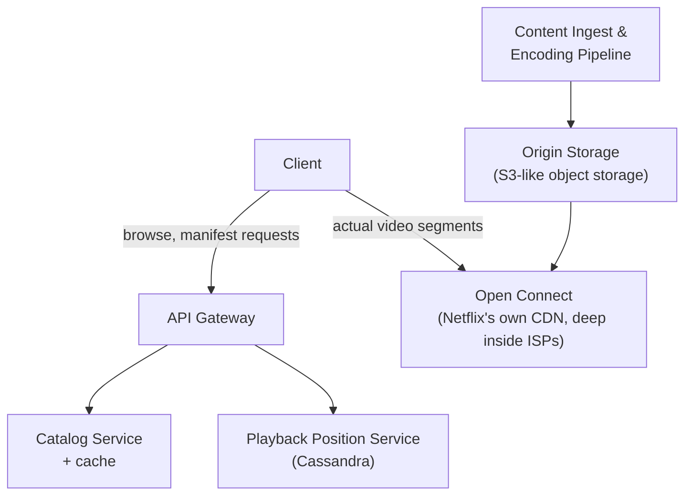

Video streaming at global scale is one of the richest system design case studies, because the dominant cost and bottleneck isn't compute or a database — it's raw bandwidth, and the entire architecture follows from that single fact.

## Requirements gathering

**Functional requirements**
- Users can browse a catalog and stream video content, with playback that adapts to their network conditions.
- Users can resume playback where they left off, across devices.
- Content is uploaded once (by Netflix) and made available globally.

**Non-functional requirements**
- **Massive read (playback) volume, tiny write volume** — millions of people watching, a comparatively small catalog being uploaded.
- **Low startup latency and no buffering** — a video that stutters or takes a long time to start is the core failure mode users notice immediately.
- **Global scale** — users on every continent, with wildly different network conditions.
- **High availability** — streaming is Netflix's entire product; downtime is maximally visible.

<Callout type="note" title="The core insight driving this design">
Video data is enormous compared to almost any other kind of content this course has covered — a single movie can be many gigabytes. This one fact — huge payloads, read-dominated, latency-sensitive — is what makes CDN strategy the central design decision, more so than the database or application server layer.
</Callout>

## Capacity estimation

Assume: 250 million subscribers, 100 million daily viewing hours total, average bitrate 5 Mbps (a reasonable HD average across a mix of quality levels).

- **Concurrent streams at peak**: if viewing is concentrated into a few evening hours, perhaps 15-20 million concurrent streams globally at peak.
- **Bandwidth at peak**: 15,000,000 streams × 5 Mbps ≈ **75 Tbps** of sustained bandwidth at peak — an enormous number that immediately rules out serving all of this from a small number of centralized data centers; it has to be distributed close to users.
- **Storage**: each title is encoded into many different bitrates and formats (for adaptive streaming across different devices and network conditions) — a single 2-hour movie might become 50-100+ actual stored files across all encodings. With tens of thousands of titles, total storage is in the multiple-petabyte range, though this is a comparatively easy problem next to the bandwidth number above.

The key insight from this math: **this system is bandwidth-bound, not compute or storage-bound** — the entire architecture should be read from that fact first.

## API design

```
GET  /catalog/browse                  → titles, metadata, thumbnails
GET  /titles/:id/manifest              → adaptive streaming manifest (available bitrates/resolutions)
GET  /titles/:id/playback-position      → resume position for this user
POST /titles/:id/playback-progress      → update watched progress
```

The actual video segments themselves are not served through this API at all — the manifest just tells the client where (which CDN edge) to fetch the actual video segments from.

## Database design

- **Catalog metadata** (titles, cast, genres, thumbnails): read-heavy, relatively small, well-suited to a relational or document database with caching in front.
- **Playback position / "continue watching"**: a simple key-value shape (`user_id + title_id → timestamp`), extremely high write volume (updated every few seconds during playback) but tiny payload — a great fit for a wide-column or key-value store like Cassandra, chosen specifically for its write-throughput characteristics (see [NoSQL](/docs/databases/nosql)).
- **Viewing history / recommendations data**: high-volume event stream, typically processed through a pipeline like [Kafka](/docs/messaging/kafka) into analytics/ML systems, rather than a traditional transactional database.

## High-level architecture



The critical architectural decision: video segment delivery is completely separated from the "control plane" (catalog browsing, manifests, playback position) — the enormous bandwidth-heavy traffic goes through a purpose-built CDN, while the comparatively lightweight metadata and API traffic goes through conventional application services.

## Detailed architecture — encoding and adaptive bitrate streaming


Each title is encoded into multiple bitrate/resolution combinations (e.g. 240p through 4K) and split into short segments. The client's player continuously measures its actual network throughput and requests the next segment at whichever quality level it can sustain without stalling — this is **adaptive bitrate streaming**, and it's what lets the same title play smoothly on a poor mobile connection and a fast home fiber connection alike, without any server-side decision-making per request.

## Scaling strategy

- **CDN-first for bandwidth**: Netflix built and operates its own CDN (Open Connect), placing cache servers physically inside ISP networks around the world — the vast majority of video traffic never has to leave the user's own ISP network at all, dramatically reducing both latency and the load on the broader internet backbone.
- **Cache warming**: popular new releases are proactively pushed to edge caches globally *before* release, rather than waiting for organic demand to populate the cache reactively — avoiding a massive wave of simultaneous cache misses at launch.
- **Catalog/API services scale horizontally** behind load balancers like any other read-heavy web service, using the caching and database techniques covered earlier in this course.

## Bottlenecks

- **Encoding pipeline throughput**: encoding a single title into dozens of bitrate/format combinations is computationally expensive; this is handled as a highly parallelized batch pipeline, decoupled entirely from the real-time playback path.
- **Origin bandwidth for cache misses**: if content isn't yet cached at a nearby edge (a very long-tail, rarely-watched title), that request falls back to origin storage — proactive cache warming for popular content specifically minimizes how often this expensive path is hit.
- **"Continue watching" write volume**: updated frequently during every single playback session across tens of millions of concurrent streams — handled via a write-optimized store and often batched/throttled updates rather than writing on every single second of playback.

## Failure scenarios

- **An edge cache location fails**: clients are redirected (via DNS or client-side logic) to the next-nearest healthy edge location — a graceful degradation to slightly higher latency, not an outage.
- **Encoding pipeline failure**: doesn't affect currently streaming content at all, since it's entirely decoupled from the playback path — it only delays availability of newly uploaded content.
- **A region-wide outage**: Netflix's famous internal Chaos Monkey tooling (see [Fault Tolerance](/docs/fundamentals/fault-tolerance)) exists specifically to continuously validate that failures like this are handled gracefully, by deliberately triggering them in production.

## Improvements

- Personalized encoding profiles per title (encoding animated content differently from live-action, since their compression characteristics differ) to reduce bandwidth for the same perceived quality.
- Predictive pre-fetching of likely-next-episode content to a user's device during idle time, reducing perceived buffering at the start of the next episode.
- Continued expansion of Open Connect's physical footprint deeper into more ISP networks, further reducing the fraction of traffic touching the broader public internet at all.

## Summary

Netflix's system design is fundamentally shaped by one fact: video delivery is bandwidth-bound at a scale that rules out serving it from a small number of centralized locations. The architecture splits cleanly into a lightweight, conventional "control plane" (catalog, playback position, recommendations) and a purpose-built, massively distributed CDN (Open Connect) for the actual bandwidth-heavy video delivery — with adaptive bitrate streaming letting the same content serve every device and network condition without server-side per-request decisions.

<Quiz questions={[
  {
    q: "Why does Netflix operate its own purpose-built CDN (Open Connect) rather than relying solely on third-party CDN providers?",
    options: [
      "Third-party CDNs cannot serve video content",
      "At Netflix's massive, sustained video bandwidth scale, placing cache servers deep inside ISP networks specifically reduces both latency and the load on the broader internet backbone more effectively than general-purpose CDN infrastructure",
      "Open Connect is only used for catalog metadata, not video",
      "This has no real technical justification"
    ],
    answer: 1,
    explanation: "Given the sheer scale of Netflix's video bandwidth needs, placing cache infrastructure directly inside ISP networks (rather than at more general, less deeply embedded CDN points of presence) meaningfully reduces both latency for users and the amount of traffic that needs to traverse the broader internet backbone at all."
  },
  {
    q: "Why is adaptive bitrate streaming necessary rather than just picking one fixed video quality for everyone?",
    options: [
      "Fixed quality would be simpler and is generally preferred",
      "Users have wildly varying network conditions and devices; the client continuously measures its own throughput and requests whichever quality level it can sustain without stalling, avoiding both wasted bandwidth and buffering",
      "Adaptive bitrate streaming is only relevant for live content",
      "All Netflix content is delivered at exactly the same bitrate regardless of network conditions"
    ],
    answer: 1,
    explanation: "A single fixed quality would either be unwatchable (buffering constantly) for users with poor connections or unnecessarily low quality for users with fast ones — adaptive bitrate streaming lets each client's player pick the best sustainable quality for its own current network conditions, continuously, without any server-side per-request logic."
  }
]} />
