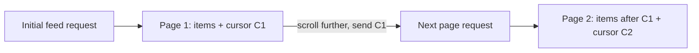
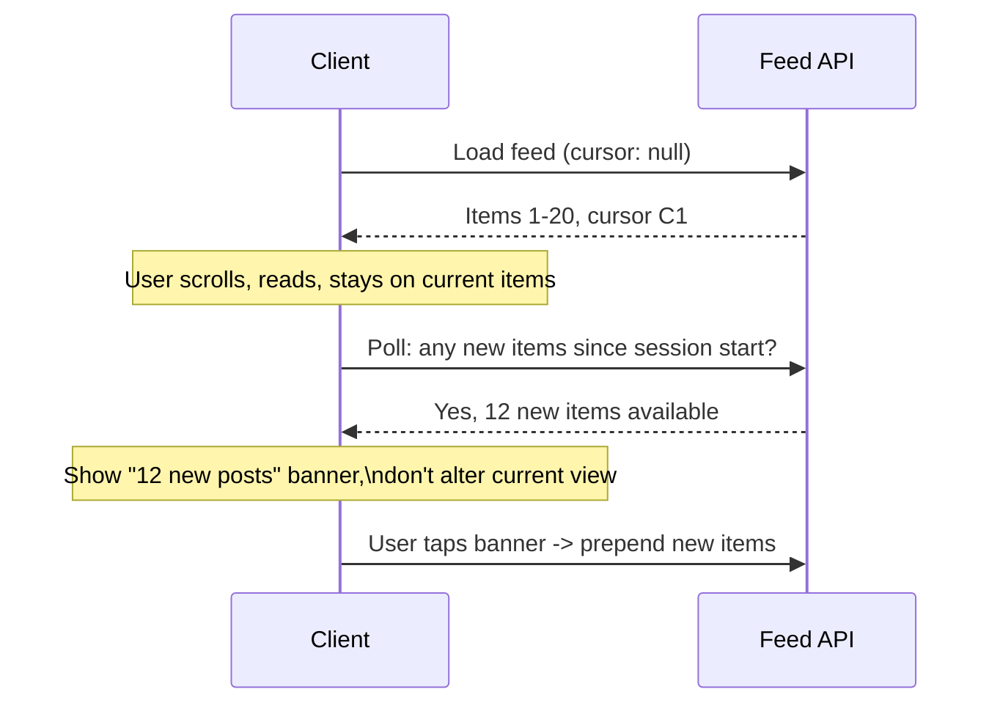
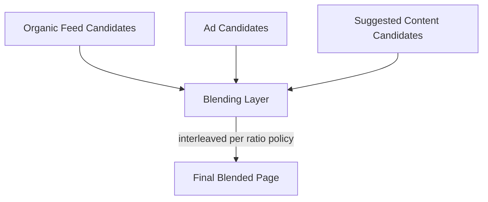
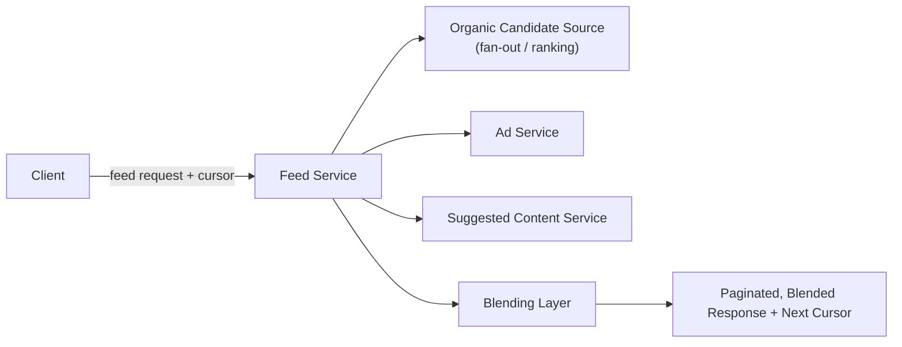

[Twitter/X Timeline](/docs/case-studies/twitter-timeline) covers fan-out and [Facebook News Feed](/docs/case-studies/facebook-feed) covers ranking. This case study focuses on a problem common to both, and often glossed over: how do you paginate a feed that keeps changing underneath the user while they're scrolling through it, and how do you blend genuinely different kinds of content — organic posts, ads, suggested items — into what feels like one seamless stream?

## Requirements gathering

**Functional requirements**
- Users scroll through a feed that loads more content as they reach the bottom ("infinite scroll").
- New content posted by people they follow appears, ideally surfaced without disrupting their current scroll position.
- The feed interleaves organic content with ads and algorithmically suggested items in a controlled ratio.

**Non-functional requirements**
- **Pagination stability** — scrolling further shouldn't show duplicate items or skip items, even though new content is constantly being created by other users in the background.
- **Low latency per page load** — each additional "page" of feed content, fetched as the user scrolls, needs to load quickly.
- **Predictable content blending** — ads and suggested content need to appear at a controlled, consistent rate, not randomly or inconsistently.
- **Fresh-content awareness** — the client should be able to tell the user "new posts available" without silently altering what's currently on screen.

<Callout type="note" title="The core tension: a feed is a live, ever-changing stream being paginated as if it were a fixed list">
Traditional pagination (page 1, page 2, page 3 of a fixed dataset) assumes the underlying data doesn't change between page loads. A feed violates that assumption constantly — new posts arrive continuously. State this tension explicitly, since the whole design revolves around resolving it.
</Callout>

## Capacity estimation

Assume: 500 million daily active users, average 8 feed page loads per session (initial load plus scrolling further), average page size of 20 items.

- **Page loads/sec**: at meaningful daily active usage spread across a day with real-time peaks, feed pagination requests easily reach tens of thousands of requests/second.
- **New content rate**: with a large, active user base continuously posting, new candidate feed items are being created at a high, constant rate — meaning the "same" feed genuinely does not exist as a stable dataset between one page load and the next, even seconds apart.
- **Ad/suggested content insertion rate**: if, say, one ad is shown per 5 organic items, every page of 20 items needs roughly 4 ad slots correctly interleaved — a comparatively small computational cost, but one that needs careful positional bookkeeping across page boundaries.

The key insight: the central challenge here isn't raw throughput (well handled by the caching and fan-out techniques covered elsewhere) — it's correctly and efficiently paginating something that's fundamentally a live stream, not a static list.

## Cursor-based pagination

Rather than offset-based pagination ("give me items 20 through 40"), feed pagination uses a **cursor** — an opaque token (often encoding a timestamp or a ranking score plus a tiebreaker ID) marking exactly where the previous page ended. The next page's request includes that cursor and returns items strictly after that point, according to whatever ordering (chronological or ranked) the feed uses.

<Callout type="warning" title="Offset-based pagination breaks visibly on a live feed">
With offset pagination ("skip 20, take 20"), if 5 new items are posted between page loads, the next "page" shifts by those 5 items — causing either duplicate items to reappear (if new items were inserted before the offset point) or items to be silently skipped entirely (if the ordering shifted past them). Cursor-based pagination anchors to the actual last-seen item's position, not a numeric offset, so it isn't affected by how much new content has appeared elsewhere in the feed since the previous page load.
</Callout>

## Handling new content without disrupting scroll position

New content arriving while a user is actively scrolled into their feed is deliberately **not** spliced into their current view automatically — doing so would shift everything they're currently looking at, a jarring and disorienting experience. Instead, the client periodically checks whether new items exist since the feed was first loaded, and if so, surfaces a lightweight "N new posts" indicator that the user can tap to explicitly load and prepend that new content — keeping the user in control of when their current view changes.

## Blending multiple content sources

Ads and suggested content are generated by entirely separate subsystems from the organic feed (different ranking models, different data sources, often different teams' services), and a **blending layer** is responsible for interleaving them into the final feed according to a defined policy (e.g. "no more than one ad per five organic items, never as the very first item"). This blending needs to be **position-aware across page boundaries** — if page 1 ended with an ad in the last slot, page 2's blending logic needs to know that, so it doesn't place another ad immediately at the start of page 2 and violate the intended spacing.

<Callout type="tip" title="Blending state travels with the cursor, not as separate client-side bookkeeping">
A clean way to solve the cross-page blending consistency problem is encoding the relevant blending state (e.g. "how many organic items since the last ad") directly into the opaque cursor token itself, alongside the position information. This keeps the blending logic entirely server-side and stateless between requests — the client doesn't need to track or report anything about ad placement itself, and a client refreshing or resuming a session naturally picks up correctly from wherever the cursor indicates.
</Callout>

## High-level architecture

## Scaling strategy

- **Feed pagination requests** scale horizontally behind the same caching and fan-out infrastructure discussed in the Twitter Timeline and Facebook Feed case studies — this component isn't reinventing that part.
- **The blending layer** is comparatively lightweight computationally (simple interleaving logic), so it scales easily alongside the feed service itself without being a distinct bottleneck.
- **New-content polling** (checking "is there anything newer than my session's starting point") is a cheap, simple query against the same underlying data, and can be batched or rate-limited client-side (e.g. polling every 30 seconds rather than continuously) to avoid excessive request volume.

## Bottlenecks

- **Cursor encoding correctness under ranking changes**: if the feed is ranked (not purely chronological) and the ranking model or its inputs change between page loads, a cursor based purely on rank score can behave inconsistently — mitigated by including a stable secondary tiebreaker (like item ID or creation timestamp) in the cursor, and accepting that a full page-load session generally reflects a roughly fixed ranking snapshot for consistency.
- **Ad/suggested-content service latency**: since the blending layer needs responses from multiple independent services (organic, ads, suggested) before producing a page, a slow one can bottleneck the whole page load — mitigated with per-source timeouts and graceful degradation (serving a page with fewer or no ads rather than blocking the whole response on a slow ad service).
- **Excessive "new posts" polling at scale**: naive frequent polling from hundreds of millions of active sessions adds significant load — mitigated with reasonable client-side polling intervals and, where available, push-based notification instead of polling.

## Failure scenarios

- **Ad service outage**: the blending layer serves an organic-only page (or falls back to a cached/default ad) rather than failing the entire feed load — ads are a strict "nice to have" relative to actually loading the user's feed.
- **Cursor becomes invalid** (e.g. references a deleted item, or is malformed): the feed service falls back to treating the request as if no cursor were provided beyond a safety check, effectively restarting pagination gracefully rather than erroring out to the user.
- **New-content check service degraded**: the "N new posts" indicator simply doesn't update as promptly, a minor, low-stakes degradation that doesn't affect the user's ability to keep scrolling their already-loaded feed.

## Improvements

- **Session-consistent ranking snapshots**, explicitly pinning a user's feed ranking for the duration of a scrolling session (even as the underlying ranking model or candidate set evolves elsewhere), further improving pagination stability beyond what cursor-based pagination alone guarantees.
- **Adaptive ad density**, adjusting the ad-insertion ratio per user or per session based on engagement signals, requiring the blending layer to become somewhat more sophisticated than a fixed ratio policy.
- **Prefetching the next page** proactively as a user nears the bottom of their current page, trading a little extra, potentially wasted server work for a smoother, lower-perceived-latency scrolling experience.

## Summary

Paginating a news feed is fundamentally different from paginating a static dataset, because the underlying content keeps changing while a user is actively scrolling — cursor-based pagination (anchored to a specific item's position rather than a numeric offset) is what keeps that experience stable and free of duplicated or skipped items. Blending multiple independent content sources (organic, ads, suggested) into one coherent stream adds a second, related challenge: maintaining a consistent interleaving policy across page boundaries, cleanly solved by encoding that blending state directly into the same cursor token used for pagination itself.

<Quiz questions={[
  {
    q: "Why does offset-based pagination ('skip 20, take 20') break down for a live, constantly-updated feed?",
    options: [
      "Offset-based pagination works perfectly fine for feeds and is commonly used",
      "If new items are created between page loads, the numeric offset no longer points to a consistent position in the underlying data — causing items to be duplicated or silently skipped, since the offset doesn't account for content that shifted the list's positions in the meantime",
      "Offset-based pagination is only a problem for chronological feeds, never for ranked ones",
      "There's no meaningful difference between offset-based and cursor-based pagination"
    ],
    answer: 1,
    explanation: "An offset assumes the underlying list is stable between requests. On a live feed, new items are constantly being added, which shifts what's actually at any given numeric offset by the time the next page is requested — this causes either duplicate items (if content was inserted ahead of the offset) or skipped items (if the list shifted past what would have been shown). A cursor anchored to the actual last-seen item avoids this by design."
  },
  {
    q: "Why is newly arrived content surfaced via a 'N new posts' banner instead of being automatically spliced into the user's current view?",
    options: [
      "Automatically inserting new content is technically impossible",
      "Automatically altering what's currently on screen while a user is actively scrolled into their feed would be a jarring, disorienting experience — surfacing new content as an explicit, user-triggered action keeps the user in control of when their current view changes",
      "New content is never actually shown to users under any circumstances",
      "Banners are purely a stylistic choice with no functional purpose"
    ],
    answer: 1,
    explanation: "If new items were silently inserted into a feed the user is currently scrolled through, it would shift the position of everything they're looking at, which is disorienting. Presenting new content as an optional, user-initiated action (tapping a banner) avoids disrupting their current scroll position while still keeping them informed that fresher content exists."
  }
]} />
