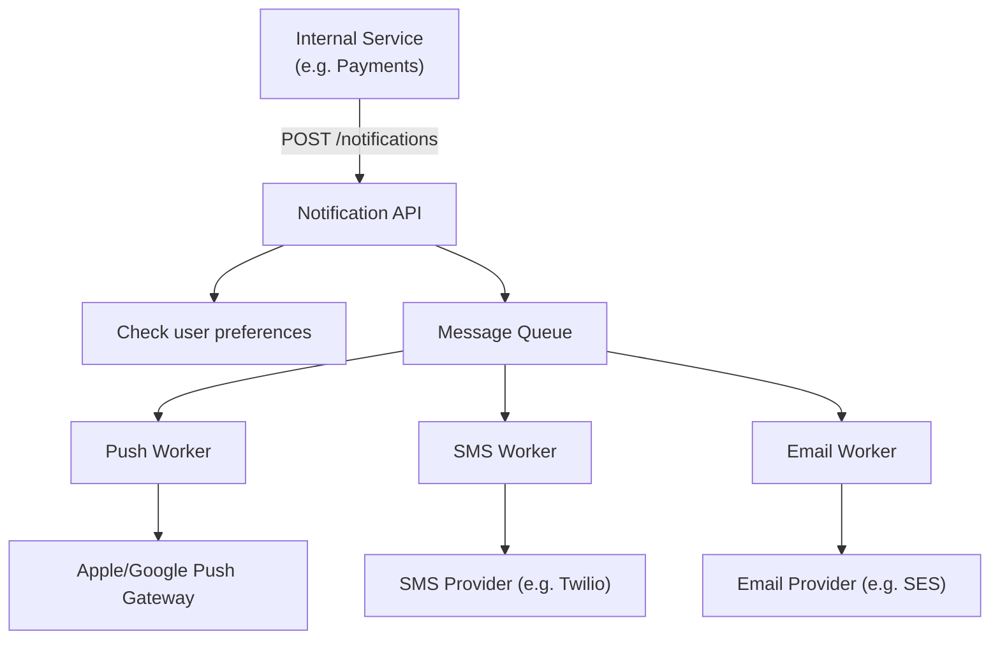
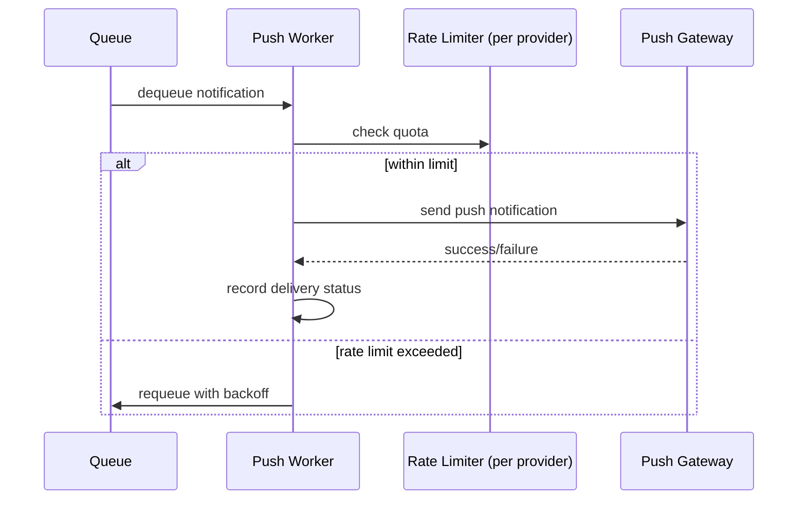

A notification system is a great case study specifically because it's almost entirely about orchestrating third-party dependencies (push notification services, SMS gateways, email providers) reliably, rather than about a novel core algorithm — resilience patterns take center stage.

## Requirements gathering

**Functional requirements**
- Other internal services can request a notification be sent to a user via one or more channels: push notification, SMS, email, in-app.
- Users can configure their notification preferences (which channels, which types of notifications).
- Notifications should not be duplicated or sent excessively to the same user in a short period.

**Non-functional requirements**
- **High reliability** — a "your payment failed" or "your flight is delayed" notification genuinely needs to arrive.
- **Scalability** — potentially millions of notifications triggered by a single event (e.g. "server maintenance tonight" to every user).
- **Respect for third-party rate limits** — push/SMS/email providers all impose their own rate limits that must be respected.
- **Asynchronous, non-blocking** — the internal service triggering a notification shouldn't be blocked waiting for actual delivery.

## Capacity estimation

Assume: 200 million users, average 5 notifications/user/day, with occasional broadcast notifications reaching all users at once.

- **Steady-state notifications/day**: 200,000,000 × 5 = 1 billion/day ≈ **~11,500/second** average.
- **Broadcast burst**: a single "all users" notification means 200 million individual sends need to happen — clearly cannot be synchronous, and needs to be spread out over some reasonable window (respecting third-party rate limits) rather than fired all at once.
- **Multi-channel multiplier**: if a notification type is configured to go out on 2 channels (push + email) on average, actual individual send operations are roughly double the raw notification count.

The key numbers here are the burst multiplier (broadcast events) and the multi-channel fan-out — both point directly toward a queue-based, asynchronous architecture as the only sane approach.

## API design

```
POST /notifications
  { userId, type: "payment_failed", channels: ["push", "email"], data: {...} }
  → 202 Accepted (queued, not yet necessarily delivered)

GET /users/:id/notification-preferences
PUT /users/:id/notification-preferences
```

The `202 Accepted` response (rather than `200 OK`) is a deliberate signal that the notification has been accepted for processing, not necessarily delivered yet — an important, honest distinction for an inherently asynchronous system.

## Database design

- **Notification requests/log**: notification ID, user ID, type, channels, status (queued/sent/failed), timestamps — used for tracking delivery status and debugging, high write volume.
- **User preferences**: which channels/types a user has opted into — small, read-heavy, cached aggressively since it's checked on every single notification.
- **Delivery receipts**: per-channel delivery status, often received asynchronously from third-party providers via webhooks.

## High-level architecture



Every notification request is decoupled from actual delivery via a [Queue](/docs/messaging/queues) — the internal service triggering it gets an immediate response, and dedicated workers per channel pull from the queue and handle the actual, potentially slow or rate-limited, third-party delivery.

## Detailed architecture — per-channel workers and rate limiting



Each channel-specific worker respects its own third-party provider's rate limits (see [Rate Limiting](/docs/security/rate-limiting)), requeuing (with backoff) rather than dropping notifications that can't currently be sent due to quota — trading some delivery latency for not violating provider agreements or getting the whole account throttled/banned.

## Scaling strategy

- **Separate queues per channel** let each channel's workers scale independently based on that channel's specific volume and rate limits — push notification volume and email volume don't need to compete for the same worker pool.
- **Broadcast notifications are expanded into individual per-user messages asynchronously**, spread across a longer time window rather than attempting to enqueue 200 million messages instantaneously.
- **Deduplication logic** (e.g. via a short-lived cache keyed by user + notification type) prevents the same event from accidentally triggering duplicate notifications if an upstream service retries its request.

## Bottlenecks

- **Third-party provider rate limits**: the single hardest constraint in this whole system — internal architecture can be arbitrarily scaled, but the actual delivery rate is capped by what Apple/Google/Twilio/SES allow, requiring careful, respectful rate limiting and backoff on the sending side.
- **Broadcast event fan-out**: expanding one "notify all users" request into 200 million individual queued messages is itself a non-trivial batch operation, usually handled as its own background job rather than inline in the API request path.
- **User preference lookups**: checked on every single notification — this needs aggressive caching, since even a small added latency here multiplies across billions of daily notification checks.

## Failure scenarios

- **A third-party provider is temporarily down or erroring**: the relevant channel's worker backs off and retries (see [Retry](/docs/microservices/retry)) rather than failing the notification outright — and ideally, a [Circuit Breaker](/docs/microservices/circuit-breaker) prevents workers from continuing to hammer a clearly failing provider.
- **A worker crashes mid-processing**: since messages are pulled from a queue and only removed after successful processing/acknowledgment, an in-progress notification that fails to complete simply becomes available for another worker to pick up (see [Queues](/docs/messaging/queues)).
- **Duplicate notification requests from an upstream service retry**: deduplication logic (keyed by a unique identifier for the triggering event, not just user + type) prevents the user from receiving the same notification twice due to an upstream retry.

## Improvements

- Notification batching/digesting — combining multiple individually-triggered notifications into a single periodic digest for less urgent notification types, reducing total send volume and improving user experience.
- Smart channel selection — falling back to SMS automatically if a push notification fails to deliver (e.g. the user's device is offline for an extended period), for genuinely time-sensitive notifications.
- A/B testing notification content and timing, layered on top of the same delivery infrastructure.

## Summary

A notification system's core architecture is a straightforward, asynchronous fan-out through a message queue to channel-specific workers — the real complexity lives almost entirely in gracefully handling third-party providers' rate limits and failures (via retries, circuit breakers, and backoff), managing the burst load from broadcast-style notifications, and preventing duplicate delivery. It's a strong example of a system where resilience patterns, not novel algorithms, are the main engineering challenge.

<Quiz questions={[
  {
    q: "Why does a notification service typically return a 202 Accepted response rather than 200 OK when a notification request is received?",
    options: [
      "202 and 200 are functionally identical and the choice doesn't matter",
      "202 Accepted signals that the request has been accepted for processing but not necessarily delivered yet, an honest distinction for a fundamentally asynchronous system where actual delivery happens later via a queue and worker",
      "202 is required for all POST requests regardless of context",
      "This indicates the notification was definitely delivered successfully"
    ],
    answer: 1,
    explanation: "Since actual delivery happens asynchronously (queued, then processed by a worker, then sent through a third-party provider that might itself be rate-limited or temporarily failing), returning 200 OK would incorrectly imply delivery is already confirmed - 202 Accepted more honestly reflects that the request has just been queued for future processing."
  },
  {
    q: "What is the single hardest constraint shaping a notification system's architecture, regardless of how much the internal infrastructure is scaled?",
    options: [
      "The size of the user preferences database",
      "Third-party provider rate limits (push gateways, SMS providers, email services) - internal scaling can't bypass these external constraints on actual delivery rate",
      "The number of notification types supported",
      "There is no meaningful external constraint on this kind of system"
    ],
    answer: 1,
    explanation: "No matter how much the internal queueing and worker infrastructure is scaled, the actual rate at which notifications can be delivered is ultimately capped by what each third-party provider (Apple/Google push gateways, SMS providers, email services) allows - making respectful, well-designed rate limiting and backoff on the sending side an unavoidable, central design concern."
  }
]} />
