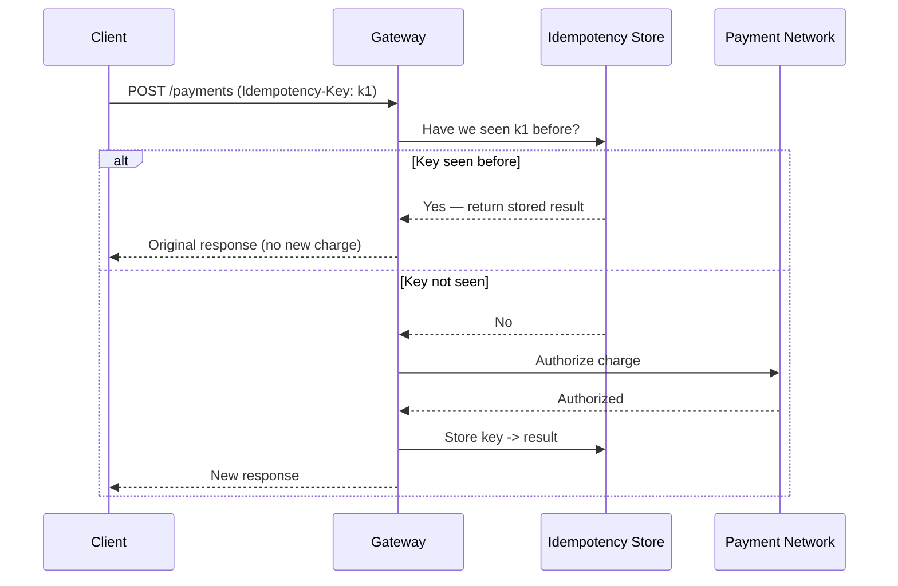
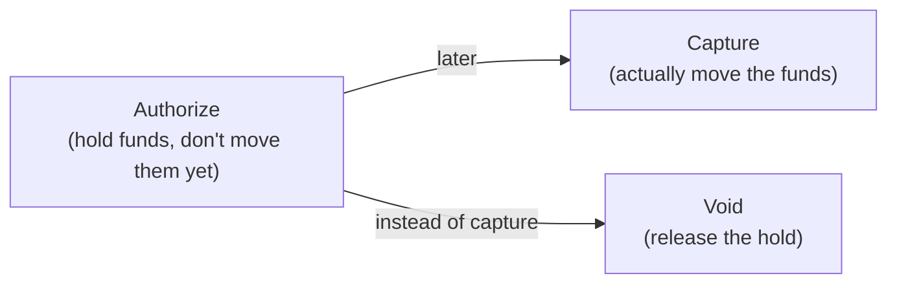
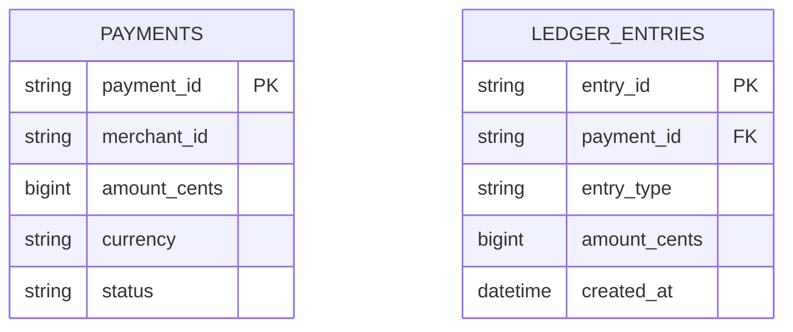
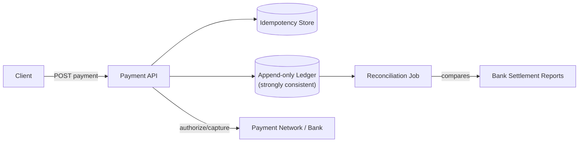

A payment gateway is one of the few system design questions where "eventually consistent, mostly available" — the default answer for most systems — is explicitly the wrong instinct. Money must never be double-charged, never silently lost, and every state transition must be auditable. This is a strong-consistency, idempotency-first design.

## Requirements gathering

**Functional requirements**
- Merchant submits a payment request (amount, currency, payment method).
- The gateway authorizes the payment with the underlying payment network/bank, then later captures (settles) the funds.
- Support refunds and voided/cancelled authorizations.

**Non-functional requirements**
- **Exactly-once effect** — a retried request (due to a network timeout, a client crash) must never result in a double charge, even though the request itself might be retried multiple times.
- **Strong consistency on balances and transaction state** — this is one of the rare systems where [CAP Theorem](/docs/fundamentals/cap-theorem) trade-offs should lean firmly toward consistency over availability for the core money-movement path.
- **Auditability** — every state transition must be recorded immutably; balances must always be reconstructable from the transaction log.
- **High reliability** — but never at the cost of correctness; an unavailable gateway that refuses a request cleanly is far better than one that silently corrupts financial state.

<Callout type="note" title="Name the core principle before designing anything else">
State explicitly: "The single most important property here is idempotency — every operation must be safe to retry without changing the outcome." This one sentence should visibly drive almost every subsequent design decision, and calling it out early signals you understand what makes this problem different from a typical CRUD service.
</Callout>

## Capacity estimation

Assume: 10 million transactions per day, with retries adding roughly 20% more requests on top of that.

- **Requests/sec**: 10,000,000 / 86,400 ≈ **~115 transactions/second** average — genuinely modest in raw throughput terms compared to a system like a social feed.
- **The interesting number isn't throughput, it's correctness overhead**: every request needs an idempotency check, a strongly consistent state transition, and a durable, append-only log entry — the cost per request is dominated by these correctness guarantees, not by raw data volume.

The key insight: this system is **low-to-moderate throughput but zero-tolerance for correctness errors** — the entire design optimizes for that, even at some cost to raw speed or availability.

## API design

```
POST /api/v1/payments
  headers: { "Idempotency-Key": "client-generated-uuid" }
  body: { "amount": 4999, "currency": "USD", "paymentMethodToken": "..." }
  response: { "paymentId": "p_123", "status": "authorized" }

POST /api/v1/payments/:paymentId/capture
POST /api/v1/payments/:paymentId/void
POST /api/v1/payments/:paymentId/refund
  body: { "amount": 4999 }
```

Every mutating request carries a client-generated **idempotency key**. If the same key is submitted again (because the client didn't receive the first response and retried), the gateway returns the *original* result rather than processing the payment a second time.

## Idempotency — the core mechanism



The idempotency key check and the actual charge must happen atomically (e.g. within the same database transaction that inserts the idempotency record) — if there's a gap between checking and recording, two near-simultaneous retries could both slip through and both charge the customer, defeating the entire purpose.

## Two-phase authorize/capture flow



Payments typically separate **authorization** (confirming the customer has sufficient funds/credit and placing a hold, without actually transferring money yet) from **capture** (actually settling the transfer, often once an order ships or a service is delivered). This two-phase design lets a merchant confirm funds are available immediately at checkout while deferring the actual money movement until the point where the transaction is truly final — and lets an authorization be voided cleanly (releasing the hold) if the order is cancelled before capture, without ever having moved real money in the first place.

## Data model — the append-only ledger



The ledger is **append-only** — state transitions (authorized, captured, refunded, voided) are recorded as new entries, never as in-place updates to a mutable balance field. A payment's current status and any account balance are always *derived* by replaying or summing its ledger entries, not stored as an independently mutable value that could drift out of sync with the actual history of events.

<Callout type="warning" title="Never store a mutable balance as the source of truth">
A single mutable "balance" field that's incremented and decremented in place is a common and dangerous shortcut — it's vulnerable to race conditions, and once it drifts from the actual transaction history there's no way to reconstruct what happened. An append-only ledger of immutable entries, with balance always computed from that history, is what makes the system auditable and recoverable from any bug or incident.
</Callout>

## High-level architecture



A background **reconciliation process** periodically compares the internal ledger against settlement reports from the actual payment network/bank, flagging any discrepancy for manual investigation — an essential safety net, since even a well-designed system should assume rare external failures (a bank-side timeout, a dropped webhook) can cause momentary disagreement that needs to be caught and corrected.

## Scaling strategy

- **The ledger database** prioritizes strong consistency over horizontal read scaling — this is one system where a well-tuned, vertically capable relational database with strict transactional guarantees is usually preferred over a horizontally-sharded, eventually consistent store.
- **Idempotency store** can be sharded by idempotency key with strong consistency per key, since keys are independent of each other.
- **Read-heavy reporting/analytics** (dashboards, statements) can run against read replicas or a separate derived reporting store, keeping load off the core transactional ledger without weakening its consistency guarantees.

## Bottlenecks

- **Idempotency-check contention**: a client aggressively retrying the same key in a tight loop needs the check-and-store step to be fast and properly locked — solved with a unique constraint on the idempotency key at the database level, so a concurrent duplicate insert fails cleanly rather than racing.
- **External payment network latency**: authorization calls to an external bank/network are inherently slower and less reliable than internal calls — the system must handle timeouts distinctly from explicit declines (a timeout means "unknown," not "failed," and must not be treated as safe to blindly retry without idempotency protection).
- **Reconciliation drift**: at high volume, even a very small mismatch rate between internal state and external settlement reports produces real absolute numbers of discrepancies needing manual review — the reconciliation process itself needs to scale with transaction volume.

## Failure scenarios

- **Client never receives the response (network drop after the bank already authorized)**: the client retries with the same idempotency key; the gateway recognizes the key and returns the already-completed result rather than authorizing a second charge.
- **Gateway crashes mid-request, after charging the bank but before recording the idempotency result**: this is the most dangerous failure mode, and is why the authorization call and the idempotency/ledger write must be designed so a crash between them is either recoverable (via reconciliation against the bank) or structurally prevented (e.g. checking the bank for an existing authorization tied to the idempotency key before blindly retrying).
- **Ledger database outage**: the system should fail closed — refusing new payment requests rather than risking any write that isn't fully, durably confirmed — since an unavailable-but-correct system is vastly preferable to an available-but-wrong one for money movement.

## Improvements

- **Webhooks with signed payloads** to reliably notify merchants asynchronously of payment state changes, with the same idempotency principles applied to webhook delivery itself.
- **Fraud detection** as a separate, pluggable service consulted during authorization, keeping fraud-scoring logic decoupled from the core ledger correctness guarantees.
- **Multi-currency and multi-region ledgers**, each maintaining strong consistency locally while reconciling globally on a longer cycle.

## Summary

A payment gateway's defining design constraint is that correctness dominates every other concern — idempotency keys make retries safe, an append-only ledger makes balances always reconstructable and auditable, and the authorize/capture split lets funds be confirmed without being moved until a transaction is truly final. Unlike most large-scale systems, the right instinct here is to lean toward strong consistency and fail closed on ambiguity, rather than optimize for availability or throughput at the risk of ever double-charging or losing track of money.

<Quiz questions={[
  {
    q: "Why must the idempotency-key check and the actual charge happen atomically, rather than as two separate steps?",
    options: [
      "Atomicity has no bearing on this design",
      "If there's a gap between checking whether a key was seen before and recording that it now has been, two near-simultaneous retries with the same key could both slip through the check and both result in a charge",
      "It's only a performance optimization, not a correctness requirement",
      "Idempotency keys are optional and rarely used in practice"
    ],
    answer: 1,
    explanation: "A race condition between the check and the write is exactly what idempotency is meant to prevent. If two retries can both pass the 'have we seen this key' check before either one records it, both proceed to charge — atomicity (e.g. a unique database constraint enforced within one transaction) is what closes that gap."
  },
  {
    q: "Why does the ledger use append-only entries instead of a single mutable balance field?",
    options: [
      "Append-only storage is always faster than mutable fields",
      "A mutable balance updated in place can drift from the true transaction history due to race conditions or bugs, with no way to reconstruct what actually happened — an append-only ledger keeps the full history, so balance is always derivable and any discrepancy is auditable",
      "Mutable fields aren't supported by relational databases",
      "It has no real benefit over a mutable balance"
    ],
    answer: 1,
    explanation: "With a mutable balance, a bug or race condition can silently corrupt the value with no way to trace what went wrong. An append-only ledger keeps every state transition as an immutable record, so balance is always a derived, reconstructable value, and any error can be traced and corrected against the full history."
  }
]} />
