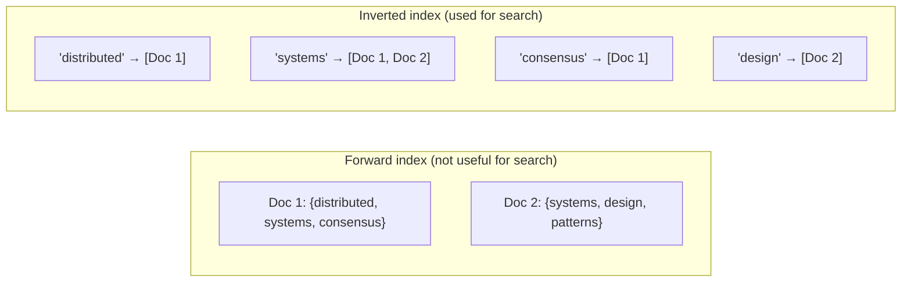
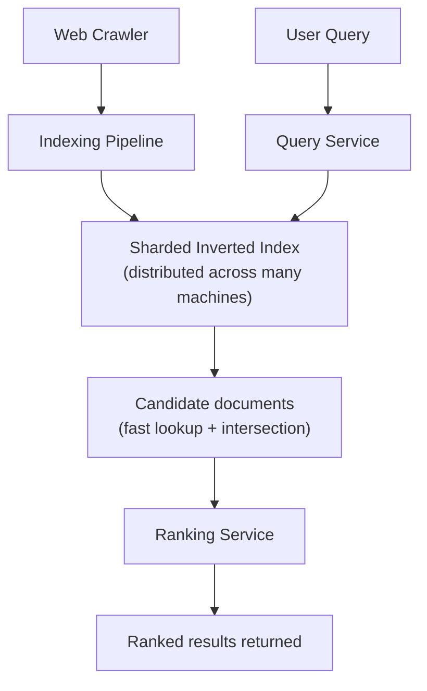
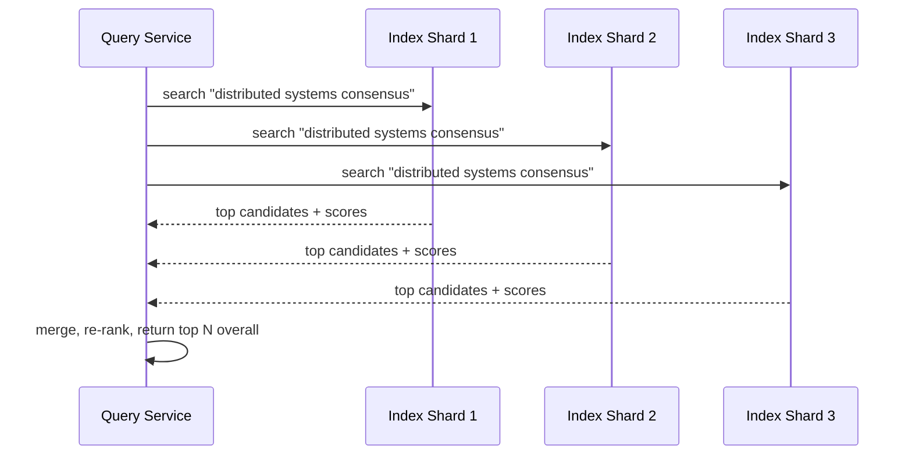

A search engine introduces the one genuinely new core data structure this course hasn't covered: the **inverted index** — the mechanism that makes "find all documents containing this word" fast across billions of documents, rather than requiring a full scan of every document on every query.

## Requirements gathering

**Functional requirements**
- Given a text query, return a ranked list of relevant documents (web pages, in this case) within a time budget.
- The index of documents is built from a large, continuously updated corpus (see the [Web Crawler](/docs/case-studies/web-crawler) case study for how that corpus is gathered).
- Support basic query features: multi-word queries, phrase matching, and reasonable ranking by relevance.

**Non-functional requirements**
- **Extremely low query latency** — users expect results in well under a second.
- **Massive scale** — billions of documents, many billions of distinct terms.
- **High query throughput** — search engines handle enormous concurrent query volume.
- **Freshness** — the index needs to be updated as the underlying content changes, though perfect real-time freshness usually isn't required.

## Capacity estimation

Assume: 50 billion indexed web pages, average page has 1,000 unique meaningful words, 100,000 search queries/second globally at peak.

- **Index size**: 50 billion pages × 1,000 terms each (with heavy overlap in vocabulary across pages, so this isn't 50 trillion unique terms, but a very large number of (term, page) associations) — clearly requires a distributed index spread across many machines, no single machine can hold this.
- **Query latency budget**: to feel "instant," an individual query needs to resolve in well under 200-300ms end to end, including ranking — an enormous constraint given the index size involved.
- **Query throughput**: 100,000/second requires the index to be replicated and sharded extensively, since a single query touches only a fraction of the total index (the specific terms in that query) but the read concurrency itself is massive.

The core tension: an enormous, continuously growing dataset, queried an enormous number of times, each requiring a response in a tiny latency budget — this combination is exactly what the inverted index and its supporting infrastructure is built to solve.

## API design

```
GET /search?q=distributed+systems+consensus
  → { results: [ { url, title, snippet, score }, ... ] }
```

The simplicity of the public API belies the complexity underneath — nearly all of the interesting engineering happens in how that single query is resolved internally.

## The inverted index

A traditional ("forward") index maps documents to the words they contain — useless for "which documents contain the word X" without scanning every document. An **inverted index** flips this: it maps each word directly to the list of documents containing it.



Answering "which documents contain both 'systems' AND 'consensus'" becomes a fast intersection of two already-computed lists (`[Doc 1, Doc 2]` ∩ `[Doc 1]` = `[Doc 1]`), rather than scanning every document's full text on every query.

## High-level architecture



## Detailed architecture — sharding the index and query fan-out

The inverted index is far too large for one machine, so it's sharded — commonly by **document** (each shard holds the full index for a subset of documents) rather than by term, since document-sharding lets each shard be queried and ranked somewhat independently, with results merged afterward.



This is essentially the [API Composition](/docs/microservices/api-composition) pattern applied to index shards specifically — fanning out a query in parallel to every shard and merging the results, since the query's latency budget only allows for the slowest shard's response time, not the sum of all of them.

## Ranking

Once candidate documents are identified via the inverted index, they need to be ranked by relevance — combining signals like term frequency (how often the query terms appear), document authority (e.g. PageRank-style link analysis, covered conceptually in the [Web Crawler](/docs/case-studies/web-crawler) case study), and freshness. This ranking computation is often the most computationally expensive part of resolving a query, which is why candidate *retrieval* (via the inverted index) is optimized to quickly narrow down to a manageable candidate set before the more expensive ranking step runs only on those candidates, not the entire corpus.

## Scaling strategy

- **Document-based index sharding** lets the system scale by simply adding more shards as the corpus grows, with each shard remaining a manageable size.
- **Heavy caching of popular queries** — a huge fraction of real-world search traffic is a relatively small set of very common queries, making query-result caching (see [Caching Strategies](/docs/caching/caching-strategies)) enormously effective in practice.
- **Replication of index shards** for both read throughput (many replicas can each serve query traffic) and fault tolerance (losing one replica doesn't lose that shard's data).

## Bottlenecks

- **Long-tail, rare queries**: can't benefit from caching the way popular queries do, and may need to touch a larger fraction of the index — these represent the genuine worst-case latency scenario the system must still handle within budget.
- **Index update latency**: continuously incorporating newly crawled/changed pages into a live, queryable index without disrupting ongoing query traffic requires careful, incremental index update strategies rather than periodically rebuilding the entire index from scratch.
- **Ranking computation cost**: sophisticated ranking (especially anything ML-based) is expensive; this is exactly why it's applied only to a narrowed-down candidate set from the inverted index, not the full corpus, on every query.

## Failure scenarios

- **An index shard becomes unavailable**: query results are computed from the remaining available shards (an acceptable, graceful degradation — some results might be temporarily missing, rather than the entire search failing) while the unavailable shard's replicas are used or it recovers.
- **The ranking service is slow or fails**: a reasonable fallback is to return unranked (or simply-ranked, e.g. by term frequency alone) candidate results rather than failing the query entirely.
- **A crawler outage delays index freshness**: existing search results continue to work normally from the current index; only newly published or changed content is affected, and only until crawling resumes.

## Improvements

- Query understanding (synonyms, typo correction, intent classification) layered in front of the raw inverted-index lookup, to improve result relevance beyond exact term matching.
- Personalized ranking based on a user's search history or context, applied as an additional ranking signal on top of the base relevance score.
- More sophisticated caching strategies for the "middle" segment of queries — not popular enough for aggressive caching, but common enough that some caching still meaningfully helps.

## Summary

A search engine's core technical challenge is answering "which of billions of documents contain these terms" within a tight latency budget — solved by the inverted index (mapping terms directly to documents, avoiding any full-corpus scan) combined with document-based sharding and parallel query fan-out across shards. Ranking is deliberately applied only to the narrowed candidate set the index retrieval produces, not the full corpus, keeping the most computationally expensive step tractable within the overall latency budget.

<Quiz questions={[
  {
    q: "Why is an inverted index essential for a search engine, rather than scanning documents directly for each query?",
    options: [
      "Inverted indexes are only useful for very small document collections",
      "An inverted index maps each term directly to the documents containing it, turning 'which documents contain this word' into a fast, pre-computed lookup instead of scanning every document's full text on every single query",
      "Forward indexes are actually faster for search purposes",
      "Search engines don't actually use indexing of any kind"
    ],
    answer: 1,
    explanation: "Without an inverted index, answering a query would require scanning the full text of every document in the corpus - completely infeasible at billions of documents. The inverted index pre-computes, for every term, exactly which documents contain it, turning multi-term queries into fast intersections of already-computed lists."
  },
  {
    q: "Why is the inverted index typically sharded by document rather than by term?",
    options: [
      "Term-based sharding is always superior and never used differently",
      "Document-based sharding lets each shard be queried and partially ranked independently in parallel, with results merged afterward - fitting the query latency budget better than alternative approaches",
      "Sharding by document is not actually possible for search indexes",
      "The choice of sharding strategy has no effect on query performance"
    ],
    answer: 1,
    explanation: "Document-based sharding lets a query fan out to all shards in parallel, each independently retrieving and scoring candidates from its own subset of documents, with results merged at the end - keeping the overall query latency close to the slowest single shard's response time rather than requiring some more complex coordination across term-based partitions."
  }
]} />
