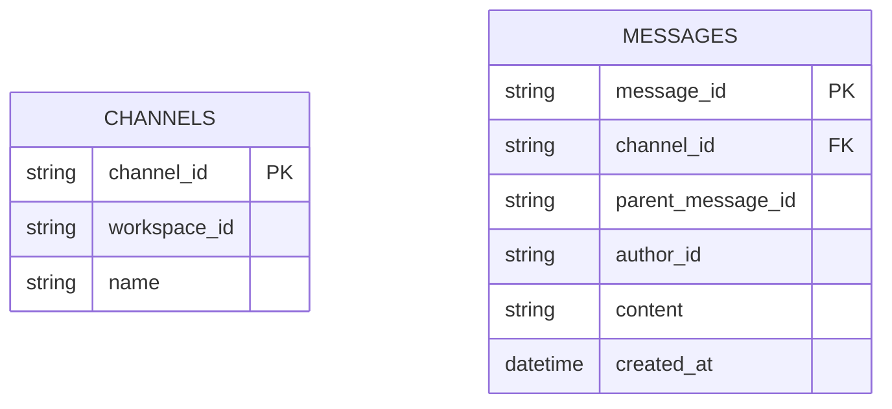
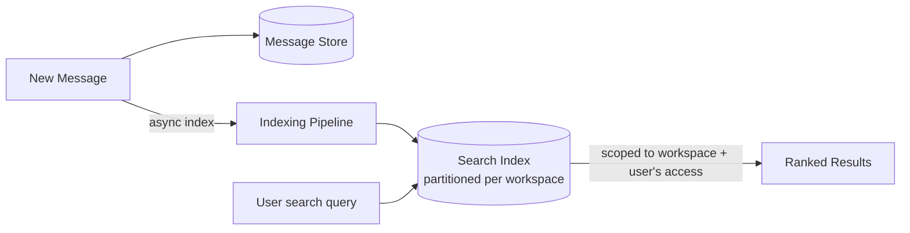
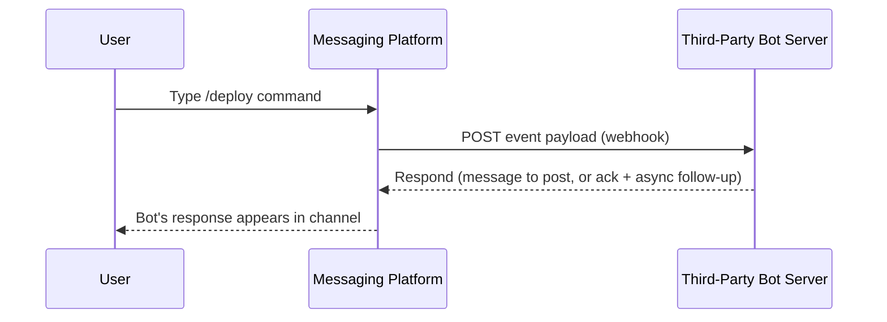
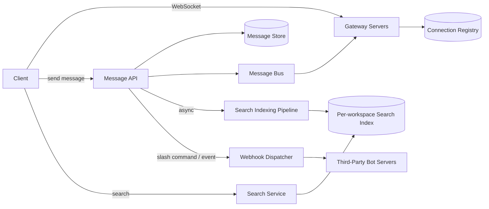

Slack shares its real-time messaging foundation with [Discord](/docs/case-studies/discord), but its distinctive engineering challenges lie elsewhere: enterprise-grade full-text search across a workspace's entire message history, a first-class threading model layered on top of flat channels, and a bot/integration ecosystem that treats third-party apps as full participants in a workspace.

## Requirements gathering

**Functional requirements**
- Users send messages in channels (public/private) and direct messages within a workspace.
- Users can reply in threads attached to a specific message, without cluttering the main channel view.
- Users can search across all messages they have access to within a workspace, including old history.
- Third-party bots and integrations can post messages, respond to slash commands, and react to events.

**Non-functional requirements**
- **Real-time delivery** for online members, similar to any chat system.
- **Fast, comprehensive search** across potentially years of workspace history — this needs to feel instant, not like a batch report.
- **Workspace-level isolation** — one workspace's data and search results must never leak into another's, even though many workspaces share underlying infrastructure.
- **Reliable delivery to bots/integrations** — a webhook-based integration failing shouldn't silently drop events or destabilize the rest of the workspace.

<Callout type="note" title="Treat search as a first-class system, not an add-on query">
Given how central "search your team's history" is to Slack's actual value proposition, design the search subsystem as deliberately as the messaging path itself — a bolted-on `LIKE '%query%'` against the message table won't come close to meeting real latency or relevance expectations at scale.
</Callout>

## Capacity estimation

Assume: 20 million daily active users across many workspaces, average workspace size a few hundred members, average 50 messages/user/day, with some workspaces holding years of accumulated history.

- **Messages/sec**: 20,000,000 × 50 / 86,400 ≈ **~11,600 messages/second** system-wide — real-time delivery volume is comparable in shape to Discord's, just generally smaller-scale per individual workspace (hundreds of members rather than sometimes hundreds of thousands).
- **Search index size**: with years of retained history across potentially millions of workspaces, the searchable corpus is enormous in aggregate, even though any single search query only ever needs to search within one specific workspace's slice of it.
- **Search QPS**: substantially lower than message-send volume, but each search query is comparatively expensive (full-text matching, relevance ranking) versus a simple message write — the cost profile of search is fundamentally different from the messaging path.

The key insight: this system needs **two genuinely different data-access patterns layered on the same underlying messages** — fast, real-time delivery for the live chat experience, and a separately optimized, workspace-scoped full-text search index for historical retrieval.

## Message and thread data model

A thread reply is simply a message whose `parent_message_id` points to the message it's replying to — the main channel view shows only top-level messages (where `parent_message_id` is null) plus a reply count, while opening a thread fetches all messages sharing that same parent. This keeps the data model simple (still just one `MESSAGES` table) while cleanly supporting threading as a first-class feature rather than a bolted-on separate structure.

## Full-text search at scale

Messages are written to the primary message store synchronously (so the send path stays fast), and **asynchronously** indexed into a dedicated full-text search system (an inverted-index-based engine, conceptually similar to what powers a general-purpose [Search Engine](/docs/case-studies/search-engine), just scoped to a workspace rather than the whole web). The search index is partitioned per workspace, both for query performance (a search never needs to scan other workspaces' data) and for the strict isolation guarantee that one workspace's content must never appear in another's results.

<Callout type="warning" title="Search must respect access control, not just workspace boundaries">
Within a single workspace, users often have access to different subsets of channels (private channels, restricted DMs). Search results must be filtered according to what the *querying user* actually has access to, not just scoped to the workspace as a whole — returning a private channel's content in another member's search results would be a serious access-control failure, not just a relevance problem.
</Callout>

## Bot and integration architecture

Slash commands and event subscriptions are delivered to third-party integrations via webhooks — an outbound HTTP call from the platform to the integration's own server. Because an integration's server is entirely outside the platform's control, the platform needs to handle it failing, timing out, or responding slowly without that affecting the rest of the workspace: typically via a strict timeout on the webhook call, retries with backoff for transient failures, and treating a failed or slow integration as an isolated, contained failure rather than one that can degrade core messaging.

## High-level architecture

The real-time connection layer here follows the same gateway-server-plus-connection-registry pattern as Discord's architecture, since the underlying problem (routing live events to whichever server holds a given user's connection) is the same regardless of the product built on top of it.

## Scaling strategy

- **Messaging/gateway layer** scales the same way as any real-time chat system — horizontally across gateway servers, with a connection registry tracking live socket ownership.
- **Search indexing** scales as an asynchronous pipeline decoupled from the message send path, and the index itself is partitioned per workspace, so indexing and querying load for one large workspace doesn't affect others.
- **Webhook dispatch** scales horizontally and independently of core messaging, since a burst of slash-command usage or a slow third-party integration shouldn't be able to create backpressure on the message-sending path itself.

## Bottlenecks

- **Search indexing lag**: since indexing is asynchronous, there's an inherent (usually small) delay between a message being sent and it becoming searchable — acceptable for the vast majority of use cases, but worth stating explicitly as a deliberate eventual-consistency trade-off in an otherwise real-time-feeling product.
- **Very large, long-lived workspaces**: a workspace with years of dense history accumulates a large per-workspace search index — mitigated by the same per-workspace partitioning that keeps other workspaces unaffected, plus tiered storage (older, rarely-searched history can live in cheaper, slightly slower storage tiers).
- **Misbehaving third-party integrations**: a slow or failing webhook endpoint could, without safeguards, tie up dispatcher resources — mitigated with strict per-integration timeouts, circuit breakers, and isolating a failing integration's impact to itself.

## Failure scenarios

- **Search indexing pipeline outage**: message sending and real-time delivery continue unaffected (since indexing is decoupled and asynchronous); search results simply become increasingly stale until the pipeline recovers and catches up on the backlog.
- **Gateway server crash**: identical failure mode and recovery to Discord's — affected clients reconnect to another gateway server, with the connection registry updated, and no message loss since the message store itself is unaffected.
- **Webhook dispatcher failure for a specific integration**: contained to that integration; other bots/integrations and, more importantly, core human-to-human messaging continue functioning normally.

## Improvements

- **Cross-workspace search** for users who are members of multiple workspaces (e.g. via Slack Connect-style shared channels), requiring careful access-control-aware federation across otherwise isolated per-workspace indexes.
- **Smarter thread notification logic**, distinguishing "new reply in a thread you're part of" from general channel activity to reduce notification fatigue in busy channels.
- **Rate-limited, tiered webhook delivery guarantees**, offering integrations stronger delivery guarantees (e.g. guaranteed at-least-once delivery with dead-letter queues) for events that matter more than a simple slash-command response.

## Summary

Slack's architecture shares its real-time delivery mechanics with any modern chat system, but its distinctive engineering investment goes into three areas: a simple parent-message-pointer model that supports full threading without complicating the core message schema, a per-workspace-partitioned full-text search index that has to respect not just workspace boundaries but individual channel-level access control, and a webhook-based integration architecture designed so a slow or failing third-party bot can never degrade core messaging. The recurring theme is deliberate decoupling — search indexing and webhook dispatch both run asynchronously and independently of the message-send path, so neither can become a bottleneck or failure point for the core chat experience.

<Quiz questions={[
  {
    q: "Why must Slack's search results be filtered by the querying user's actual channel access, not just scoped to the workspace as a whole?",
    options: [
      "Workspace-level scoping is already sufficient for all access control needs",
      "Within a single workspace, different users have access to different subsets of channels (e.g. private channels), so returning content from a channel the querying user isn't a member of would leak information they're not authorized to see, regardless of workspace boundaries",
      "Search results are never actually restricted by any access rules",
      "Channel-level access control only applies to message sending, not searching"
    ],
    answer: 1,
    explanation: "Workspace isolation alone isn't enough, since a workspace typically contains channels with varying access levels (public, private, restricted DMs). Search must additionally filter results according to what the specific querying user has access to, or it risks surfacing private content to users who shouldn't be able to see it."
  },
  {
    q: "Why is message search indexing done asynchronously rather than synchronously as part of the message-send request?",
    options: [
      "Asynchronous indexing is purely a legacy technical limitation with no real benefit",
      "Keeping indexing decoupled and asynchronous means the message-send path stays fast and isn't affected by search-indexing latency or any indexing pipeline issues, at the acceptable cost of a small delay before new messages become searchable",
      "Synchronous indexing is actually faster and preferred whenever possible",
      "Search indexing has no relationship to message send latency"
    ],
    answer: 1,
    explanation: "If indexing were synchronous, any slowness or failure in the search-indexing system would directly slow down or block sending messages. Decoupling it asynchronously means the core chat experience stays fast and resilient to indexing-pipeline issues, accepting a small, generally unnoticeable delay before new messages appear in search results."
  }
]} />
