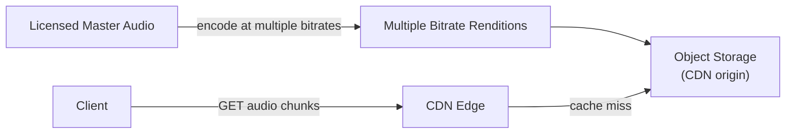
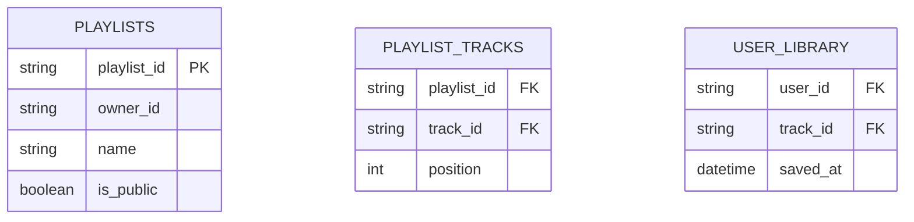
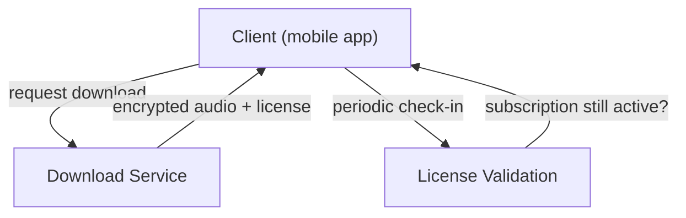
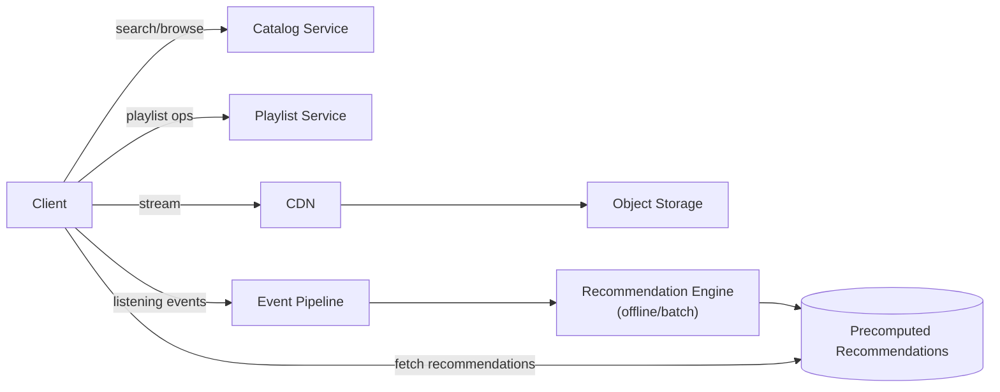

Spotify shares some DNA with a video platform like [YouTube](/docs/case-studies/youtube), but the interesting differences are what make it worth designing separately: a catalog that's largely fixed and licensed (rather than user-uploaded), a strong requirement for offline playback, and playlists/recommendations as first-class, heavily-used data structures rather than an afterthought.

## Requirements gathering

**Functional requirements**
- Users search for and stream songs, with playback starting quickly and continuing smoothly.
- Users create and edit playlists, and follow other users' public playlists.
- Users can download songs for offline playback.
- The system recommends songs/playlists based on listening history.

**Non-functional requirements**
- **Low playback start latency** and uninterrupted streaming even on variable network conditions.
- **Massive read scale** on a comparatively fixed, licensed catalog — unlike user-generated video, the catalog grows in a controlled, curated way rather than via unbounded public uploads.
- **Offline availability** for downloaded content, including respecting licensing constraints (e.g. periodic re-validation that a subscription is still active).
- **Personalization at scale** — recommendations need to reflect each user's listening history without recomputing everything on every request.

<Callout type="note" title="The catalog being licensed, not user-uploaded, changes the shape of this problem">
Unlike YouTube, there's no large-scale, unpredictable transcoding pipeline for a constant stream of new uploads — the catalog grows through a comparatively controlled ingestion process. This shifts the interesting engineering challenges toward playback delivery, playlist data modeling, offline sync, and recommendations, rather than upload/transcoding scale.
</Callout>

## Capacity estimation

Assume: 600 million monthly active users, 100 million licensed tracks, average 2 hours of listening per active user per day.

- **Concurrent streams**: with a meaningful fraction of users actively listening at any given moment globally, concurrent stream count easily reaches tens of millions — dominated by CDN delivery, much like video, just with far smaller per-item file sizes.
- **Storage**: 100 million tracks at a few multiple bitrate-encoded versions each (for adaptive quality, similar in spirit to video's resolution ladder) is a large but very manageable storage footprint compared to a user-generated video platform, since audio files are orders of magnitude smaller than video.
- **Playlist operations**: with hundreds of millions of users each maintaining multiple playlists, playlist reads (displaying a playlist) vastly outnumber playlist writes (adding/removing a song) — a read-heavy pattern well suited to caching, much like the catalog itself.

The key insight: this is a **read-heavy, CDN-driven streaming problem with a comparatively small, controlled catalog** — the hard engineering effort shifts toward playlist/library data modeling, offline sync correctness, and recommendation generation rather than ingesting and transcoding a firehose of new user uploads.

## Audio storage and streaming

Similar to video, audio is encoded at multiple bitrates (allowing adaptive quality based on network conditions) and served through a CDN, with the vast majority of playback traffic served from edge caches rather than hitting origin storage directly — since a relatively small number of tracks (current hits, popular catalog items) account for a disproportionate share of total plays, caching is extremely effective here.

## Playlist and library data model

A playlist is essentially an ordered list of track references — `PLAYLIST_TRACKS` stores each track's position within a playlist explicitly, so reordering, inserting, or removing a track only touches the affected rows rather than requiring a full rewrite. Since playlists (especially large, popular public ones) are read far more often than edited, they're aggressively cached, with cache invalidation scoped narrowly to just the affected playlist on an edit.

<Callout type="tip" title="Position as a sortable value, not just a sequential integer, avoids expensive reordering">
Storing each track's position as a simple sequential integer means inserting a track in the middle requires renumbering every subsequent track. Using a sortable fractional or gap-based position value (e.g. inserting a new track at the midpoint between its neighbors' position values) lets most insertions and reorders touch only the single row being moved, avoiding cascading updates across the whole playlist.
</Callout>

## Offline downloads

Downloaded tracks are stored locally in an encrypted form, decodable only alongside a license that the client periodically re-validates against the user's current subscription status — this is what lets offline playback work without network access most of the time, while still enforcing that access depends on an active subscription, since the license (not just the audio bytes) is what actually gates playback. If a subscription lapses and the client's periodic re-validation detects this, offline playback for that content stops working until the subscription is restored.

## Recommendation pipeline

Recommendations are generated largely **offline/asynchronously**, not computed fresh on every request: user listening history feeds into a batch or near-real-time pipeline that periodically produces updated recommendation sets (e.g. collaborative filtering based on what similar listeners enjoy, or content-based similarity between tracks), which are then simply read — quickly, from a precomputed store — when a user opens the app, rather than triggering an expensive computation live on every visit.

## High-level architecture

## Scaling strategy

- **CDN-backed audio delivery** absorbs the overwhelming majority of streaming traffic, the same core lever as in a video platform, just at a smaller per-item data size.
- **Catalog and playlist reads** scale via caching and read replicas, since both are read far more often than written.
- **Recommendation computation** scales as a batch/offline pipeline, decoupled entirely from the live request path — expensive to compute, cheap and fast to serve once precomputed.
- **Listening-event ingestion** (which songs were played, skipped, finished) is a high-volume streaming write workload, handled separately from the playback path itself so logging a listening event never adds latency to actual playback.

## Bottlenecks

- **New release spikes**: a hugely anticipated album release can generate an enormous, concentrated spike in demand for a small number of tracks — mitigated with pre-warming CDN caches ahead of a known release time, rather than relying purely on reactive caching.
- **Popular public playlist edits**: an extremely popular public playlist (millions of followers) being edited needs cache invalidation to propagate efficiently without a full playlist re-read storm — scoped, targeted invalidation (only the changed portion) rather than invalidating the whole playlist's cache entry.
- **Recommendation staleness vs. compute cost**: recomputing recommendations too infrequently makes them feel stale; recomputing too often for every user is computationally wasteful — mitigated with tiered refresh frequency (e.g. more frequent updates for highly active users).

## Failure scenarios

- **CDN edge failure**: requests fail over to another edge location or, in the worst case, origin storage directly, following the same resilience pattern as any CDN-backed system.
- **Recommendation engine outage**: falls back to showing cached, slightly stale recommendations (or a simpler fallback like "popular right now") rather than failing to show any recommendations at all.
- **License validation service outage**: offline playback can typically continue for a grace period using the last successfully validated license state, rather than immediately blocking playback the moment validation is briefly unreachable.

## Improvements

- **Cross-device playback state sync** (resuming a queue or position across devices), requiring a small amount of low-latency, strongly consistent state layered on top of the otherwise read-heavy, cache-friendly architecture.
- **Real-time collaborative playlists**, allowing multiple users to edit the same playlist simultaneously, which introduces genuine concurrent-editing considerations beyond the simpler single-owner playlist model.
- **Context-aware recommendations** (time of day, activity, device type) blended into the otherwise largely offline-computed recommendation pipeline for finer personalization.

## Summary

Spotify's architecture leans heavily on the same CDN-driven delivery principle as video platforms, but its distinctive engineering challenges lie elsewhere: a relatively fixed, licensed catalog shifts effort away from upload/transcoding scale and toward playlist data modeling (position-based ordering that avoids expensive reordering), offline playback gated by periodically re-validated licenses rather than raw file access, and a recommendation pipeline that's computed largely offline and simply served fast, rather than generated fresh on every request.

<Quiz questions={[
  {
    q: "Why is offline playback gated by a periodically re-validated license rather than simply restricting access to the downloaded audio file?",
    options: [
      "Licenses have no real function in offline playback",
      "Because the audio file itself is stored locally and encrypted, playback needs a separate license the client periodically re-validates against subscription status — this is what lets the service revoke effective access (once a subscription lapses) without needing network access to delete the file directly",
      "Encrypted audio files can never be played offline",
      "License validation only matters for online streaming, not offline playback"
    ],
    answer: 1,
    explanation: "Since the encrypted file lives on the device, the service can't simply delete it the moment a subscription lapses without network access. Instead, the license the client periodically re-validates is what actually gates whether the downloaded audio can be decoded and played, letting access be effectively revoked even for content already stored locally."
  },
  {
    q: "Why does storing an explicit, sortable position value for each track in a playlist matter, rather than relying on row insertion order alone?",
    options: [
      "Position values have no practical benefit over insertion order",
      "A sortable position value lets a track be inserted or reordered by only updating the single row being moved, whereas relying on sequential integer positions would require renumbering every subsequent track on each insertion",
      "Databases cannot preserve insertion order under any circumstances",
      "Position values are only relevant for private playlists, not public ones"
    ],
    answer: 1,
    explanation: "With a sortable position scheme (e.g. inserting at the midpoint value between two neighboring tracks), reordering or inserting a track touches only that one row. A naive sequential-integer position, by contrast, would require shifting every subsequent track's position value on each insertion — a much more expensive operation, especially for long playlists."
  }
]} />
