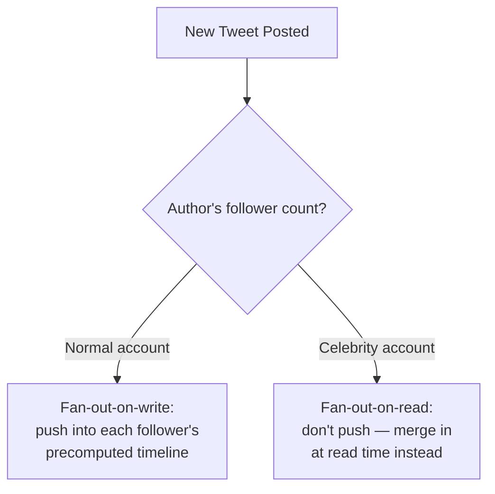
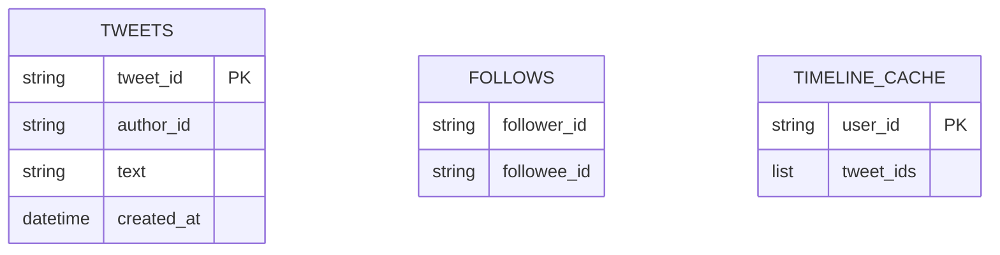
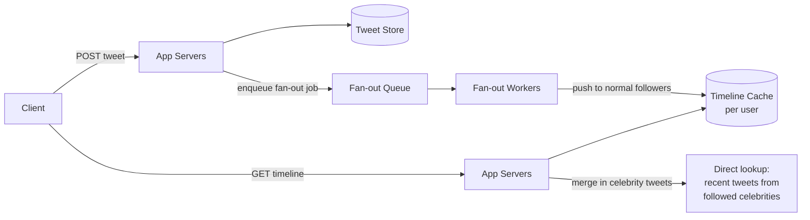

Designing a Twitter/X-style timeline is one of the best interview questions for testing whether a candidate understands **fan-out** — the trade-off between doing work at post-time versus at read-time — because the naive solution breaks down almost immediately at realistic scale, and the fix reveals a genuinely interesting design trade-off.

## Requirements gathering

**Functional requirements**
- Users can post short text updates ("tweets").
- Users follow other users, and see a reverse-chronological (or ranked) timeline of tweets from accounts they follow.
- Optionally: likes, retweets, replies, media attachments.

**Non-functional requirements**
- **Low latency timeline reads** — loading your timeline needs to feel instant.
- **High write throughput** at peak (viral moments, breaking news cause enormous tweet-per-second spikes).
- **Eventual consistency is acceptable** — a tweet appearing in a follower's timeline a few seconds late is a non-issue; this system does not need strong consistency.
- Read-heavy overall, but with an extreme, uneven distribution: some accounts have hundreds of millions of followers.

<Callout type="note" title="State the celebrity-account problem explicitly">
Call out early that follower counts are extremely skewed (a small number of accounts have huge followings) — this detail is what makes the "obvious" solution insufficient, and naming it up front shows you understand where the real difficulty lives.
</Callout>

## Capacity estimation

Assume: 500 million tweets posted per day, average 200 followers per account, but with some accounts having 100+ million followers.

- **Writes/sec**: 500,000,000 / 86,400 ≈ **~5,800 tweets/second** average, with peaks several times higher during major events.
- **Timeline reads/sec**: with far more timeline views than tweets posted, read volume is easily an order of magnitude or more above write volume.
- **Fan-out writes**: if every tweet were pushed into every follower's timeline at post-time, an average tweet (200 followers) means ~200 fan-out writes — but a tweet from an account with 100 million followers means **100 million** fan-out writes from a single post. This asymmetry is the crux of the whole design.

The key insight: a uniform strategy (always fan-out-on-write, or always fan-out-on-read) is wrong in different ways for average accounts versus celebrity accounts — the right design treats them differently.

## API design

```
POST /api/v1/tweets
  body: { "text": "...", "mediaUrls": ["..."] }
  response: { "tweetId": "t123", "createdAt": "..." }

GET /api/v1/timeline
  response: { "tweets": [ { "tweetId": "...", "authorId": "...", "text": "...", "createdAt": "..." }, ... ] }

POST /api/v1/follow/:userId
```

The timeline endpoint is where nearly all the design complexity lives — everything above is a simple CRUD-shaped API.

## Fan-out strategies



- **Fan-out-on-write (push model)**: when a tweet is posted, immediately write it into a precomputed timeline (e.g. a per-user list in a cache) for every one of that author's followers. Reading a timeline is then just one fast lookup of an already-assembled list. This is efficient for typical accounts, but catastrophic for a celebrity account, since one post triggers a write storm proportional to follower count.
- **Fan-out-on-read (pull model)**: don't precompute anything at post-time; instead, when a user requests their timeline, query the recent tweets of everyone they follow and merge them on the fly. This avoids the celebrity write-storm problem entirely, but makes every timeline *read* more expensive, since it has to fan out across every followed account at read time instead.
- **Hybrid approach (used in practice)**: use fan-out-on-write for the vast majority of normal accounts (cheap writes, fast reads), but treat celebrity/high-follower accounts as an exception — their tweets are *not* pushed to every follower's precomputed timeline; instead, they're merged in at read time for any user who follows them, combining the precomputed timeline with a small number of "pull" lookups for celebrity accounts specifically.

<Callout type="warning" title="The hybrid model is the actual answer, not a compromise to apologize for">
Candidates sometimes present the hybrid approach as a fallback if they "can't decide." It's the correct answer: pure push and pure pull each solve one side of a genuinely skewed distribution poorly, and treating the long tail of normal accounts differently from the small number of extreme outliers is exactly the kind of design judgment this question is testing for.
</Callout>

## Data model



`TIMELINE_CACHE` is the precomputed, fan-out-on-write structure — typically a capped-length list (e.g. the most recent ~800 tweet IDs) held in a fast in-memory store like Redis, since it's read constantly and needs to stay fast; the full tweet content is fetched separately (often from cache as well) using those IDs.

## High-level architecture



Fan-out itself is asynchronous — a tweet is durably stored and acknowledged to the author immediately, and the (potentially large) fan-out to followers' timeline caches happens via a background job pulled from a [queue](/docs/messaging/queues), so posting never blocks on how many followers an account has.

## Scaling strategy

- **Timeline cache** is sharded by user ID across many cache nodes, since it's the hottest read path in the whole system.
- **Fan-out workers** scale horizontally and process the queue in parallel; a celebrity account simply generates a queue entry that's handled by the read-time merge path instead of a worker fan-out job.
- **Tweet storage** itself scales via straightforward horizontal partitioning (e.g. by tweet ID or author ID), since tweets are largely independent, immutable records.
- **Read replicas / caching** absorb the read volume for anything not already served directly from the timeline cache (e.g. tweet content lookups).

## Bottlenecks

- **Celebrity tweet storms**: solved specifically by excluding high-follower accounts from the push fan-out path, as described above.
- **Hot timeline cache nodes**: a user with unusually high timeline-read frequency, or a shard holding many active users, can become a hotspot — mitigated with consistent hashing (see [Consistent Hashing](/docs/distributed-systems/consistent-hashing)) to spread load evenly and rebalance gracefully.
- **Fan-out queue backlog**: a burst of high-follower-count posts (even excluding pure celebrities, "medium-influencer" accounts still fan out to tens of thousands) can create a temporary backlog — acceptable since a few seconds of delay before a tweet appears in followers' timelines is within the system's eventual-consistency tolerance.

## Failure scenarios

- **Timeline cache node failure**: falls back to reconstructing that user's timeline via the read-time merge path (slower, but correct) until the cache node recovers — a graceful degradation rather than an outage.
- **Fan-out worker crash mid-job**: the job is safely retried from the queue; at worst, some followers see a tweet slightly later than others, which is acceptable given the eventual-consistency requirement.
- **Tweet storage partition failure**: replicated storage with automatic failover ensures tweet data itself is never lost, independent of any timeline-cache issue.

## Improvements

- **Ranking instead of pure reverse-chronological order**, surfacing more relevant tweets first — a substantial additional system (a ranking/recommendation service) layered on top of the same underlying fan-out architecture.
- **Precomputing partial celebrity merges** for very active followers of celebrity accounts, trading a little extra write work for faster reads on the highest-value read paths.
- **Push notifications** for real-time engagement, built on the same fan-out infrastructure rather than a separate system.

## Summary

A Twitter/X-style timeline is fundamentally a fan-out problem: pushing new content into every follower's precomputed timeline (fan-out-on-write) makes reads fast and writes proportional to follower count, while computing timelines on demand (fan-out-on-read) makes writes cheap but reads proportional to how many accounts you follow. Because real follower distributions are extremely skewed, the correct design is a hybrid — push for the long tail of normal accounts, pull for the small number of extreme outliers — combined with asynchronous fan-out via a queue so posting never blocks on follower count.

<Quiz questions={[
  {
    q: "Why does a pure fan-out-on-write (push) model break down for celebrity accounts?",
    options: [
      "It doesn't break down — push is always fine",
      "A single post from a very high-follower-count account triggers a write to every follower's precomputed timeline, which can mean tens or hundreds of millions of writes from one tweet",
      "Push models don't support text content",
      "Celebrity accounts can't post tweets at all"
    ],
    answer: 1,
    explanation: "Fan-out-on-write means every tweet is proactively written into every follower's timeline cache. For an account with 100 million followers, that's 100 million writes triggered by a single post — a write storm that a hybrid model avoids by excluding high-follower accounts from the push path."
  },
  {
    q: "Why is fan-out processed asynchronously via a queue rather than synchronously during the post request?",
    options: [
      "Because databases can't handle synchronous writes",
      "So that posting a tweet returns quickly and doesn't block on how many followers the author has, since fan-out work (especially for high-follower accounts) can take real time to complete",
      "Queues are required by the Twitter API specification",
      "It has no real benefit"
    ],
    answer: 1,
    explanation: "Decoupling the post acknowledgment from the fan-out work means the author's post request returns immediately regardless of follower count, while the potentially large fan-out to followers' timeline caches happens in the background, tolerant of a few seconds of delay."
  }
]} />
