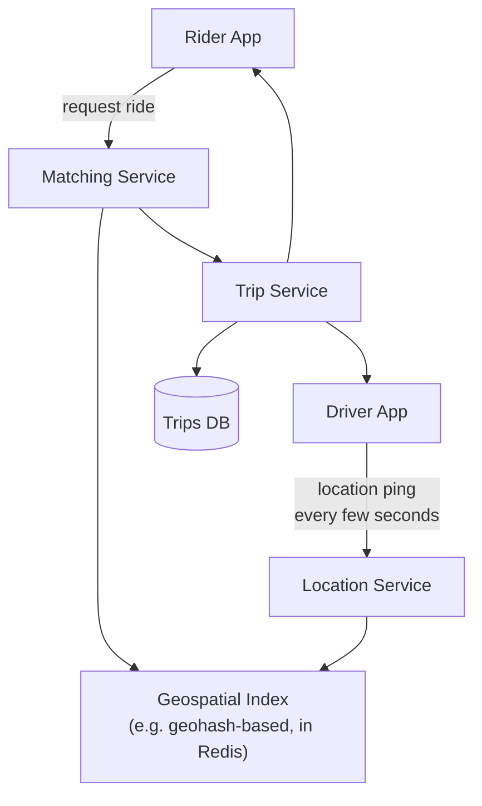
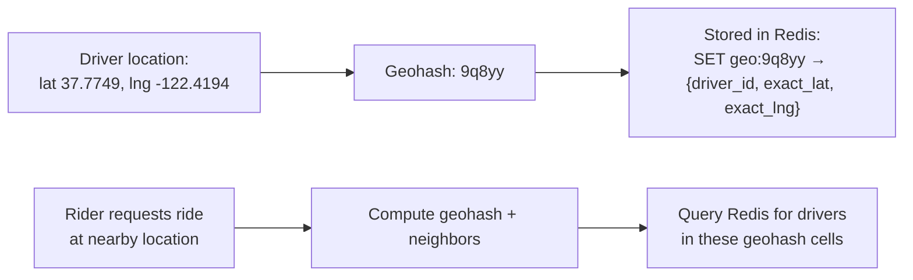
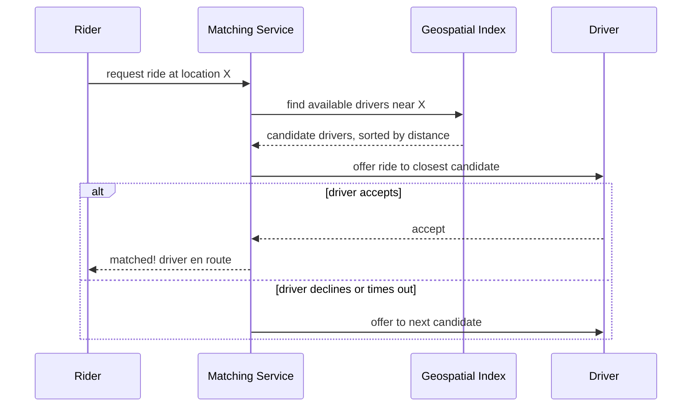

Uber introduces a problem this course hasn't covered yet: efficiently finding "who/what is near this location" at scale, combined with real-time, low-latency coordination between two parties (rider and driver) who both need to see the same evolving state.

## Requirements gathering

**Functional requirements**
- Riders can request a ride; the system finds and matches them with a nearby available driver.
- Both rider and driver see the other's live location and the trip's progress.
- Fare is calculated (including dynamic/surge pricing) and payment is processed.

**Non-functional requirements**
- **Low-latency matching** — riders expect a match within seconds, not tens of seconds.
- **Real-time location updates** — both parties need to see reasonably current position, not minutes-old data.
- **High availability** — this is a real-time, safety-adjacent service; downtime has immediate, real-world consequences.
- **Geographic locality** — most of the hard problems (finding nearby drivers) are inherently regional, not global, in scope.

## Capacity estimation

Assume: 5 million active drivers globally, each sending a location update every 4 seconds; 1 million ride requests per hour at peak.

- **Location updates/second**: 5,000,000 / 4 ≈ **1.25 million location updates/second** globally — an enormous, continuous write stream, dwarfing the actual ride-request volume.
- **Ride requests/second at peak**: 1,000,000 / 3600 ≈ **~280/second** globally, though heavily concentrated in specific cities at specific times (rush hour in a major city, not evenly spread worldwide).
- **Matching latency budget**: to feel "instant" to a rider, the whole match process (find nearby drivers, select one, notify them) needs to complete in well under 10 seconds, ideally 2-3.

The standout number is the location-update stream — this system needs to continuously ingest, index, and query location data at a rate and freshness far beyond what a general-purpose database handles well by default.

## API design

```
POST /rides/request           { pickup, dropoff }
                                → matches with a nearby driver, returns ride details
POST /drivers/:id/location      { lat, lng }
                                → driver's periodic location ping
GET  /rides/:id/status           → live trip status, driver location
POST /rides/:id/cancel
```

## Database design

- **Driver location (current)**: extremely high write volume, needs fast geospatial queries ("drivers within 3km of this point") — a poor fit for a traditional relational table scanned linearly; this needs a geospatial index (below).
- **Ride/trip records**: relatively low volume compared to location pings, relational in shape (rider, driver, fare, timestamps), well-suited to a conventional database.
- **Historical location trail** (for trip records, receipts, disputes): high-volume, append-only, well-suited to a wide-column store or object storage rather than the same store handling live location queries.

## High-level architecture



## Detailed architecture — geospatial indexing

Finding "the nearest available drivers to this point" efficiently is the core technical challenge, and it's solved with a **geohash** (or similar spatial indexing scheme): the world is divided into a grid of cells, each identified by a short string code (a geohash) — nearby locations tend to share a common prefix, letting "find drivers near me" become a simple prefix-based lookup rather than a full geographic distance calculation against every single driver.



Redis specifically supports geospatial commands (`GEOADD`, `GEORADIUS`) built on exactly this kind of indexing, making it a natural, widely-used choice for this specific problem.

## Matching algorithm (simplified)



Rather than blindly assigning the single nearest driver (who might be mid-trip-ending, or simply decline), the matching service typically offers to a ranked list of nearby candidates in sequence, with a short timeout per offer, until one accepts.

## Scaling strategy

- **Shard the geospatial index by region** — since matching is inherently local (a driver in Tokyo is never relevant to a rider in São Paulo), the geospatial index can be partitioned by geographic region rather than needing a single global structure, dramatically reducing the size of any individual index and the scope of any query against it.
- **Location updates are a natural fit for a message queue** ([Kafka](/docs/messaging/kafka)) between ingestion and the geospatial index update, smoothing out the continuous, very high-volume write stream.
- **Trip/ride records scale via conventional database techniques** (read replicas, sharding by region or rider ID) — a comparatively small, well-understood scaling problem next to the location-update stream.

## Bottlenecks

- **Geospatial index write throughput**: 1.25 million updates/second is a genuinely large sustained write rate — regional sharding (splitting the global index into many smaller, independent regional indexes) is essential to keep any single index instance's write load manageable.
- **Matching latency under high demand**: during a surge in ride requests (e.g. a big event ending), many riders may compete for the same, comparatively few, available nearby drivers — this is exactly when [dynamic/surge pricing](/docs/case-studies/uber) mechanisms kick in, both to balance supply/demand and to manage the increased matching contention.
- **Driver app connectivity**: mobile networks are unreliable; location updates and match offers need to tolerate brief connectivity gaps gracefully, typically via client-side retry logic and reasonable staleness tolerance in the matching algorithm.

## Failure scenarios

- **Geospatial index for a region becomes temporarily unavailable**: ride requests in that region degrade gracefully to a fallback (perhaps a coarser-grained or slightly stale index) rather than failing outright, if the architecture is designed with that redundancy in mind.
- **A driver accepts a ride but then goes offline/crashes**: the trip service needs a timeout-and-reassign mechanism, offering the ride to another nearby driver if the accepted one doesn't actually begin the trip within an expected window.
- **A region experiences a connectivity or infrastructure outage**: since regions are architecturally independent (sharded geospatial indexes, often regionally deployed infrastructure), an outage in one region shouldn't directly affect matching in unrelated regions.

## Improvements

- Predictive positioning — proactively suggesting drivers reposition toward areas of anticipated demand (based on historical patterns), reducing future match latency before requests even arrive.
- More sophisticated matching that considers not just distance but estimated time-to-arrival (accounting for traffic, one-way streets), which a naive straight-line distance calculation misses entirely.
- Batch matching during very high-demand periods — briefly holding a small batch of requests and drivers together to compute a more globally efficient set of matches, rather than purely greedy one-at-a-time matching.

## Summary

Uber's system design centers on two intertwined challenges: efficiently indexing and querying a constantly, rapidly changing stream of driver locations (solved via geohash-based geospatial indexing, regionally sharded for scale), and matching riders to nearby available drivers within a tight latency budget. Regional sharding is the key scalability insight throughout — since ride-matching is inherently local, the system can be decomposed by geography in a way that a globally interconnected system (like a social network's feed) fundamentally cannot.

<Quiz questions={[
  {
    q: "Why is geohashing (or a similar spatial indexing scheme) used instead of calculating exact distance to every driver for each ride request?",
    options: [
      "Exact distance calculations are actually faster",
      "Geohashing groups nearby locations under shared prefixes, letting 'find nearby drivers' become a fast, indexed lookup rather than an expensive distance calculation against every single driver in the system",
      "Geohashing is only used for historical trip records, not live matching",
      "Distance calculations are not possible in a geospatial system"
    ],
    answer: 1,
    explanation: "Without spatial indexing, finding nearby drivers would require calculating the distance from the rider to every single driver in the system - clearly infeasible at scale. Geohashing groups nearby locations into shared prefix buckets, turning 'find drivers near me' into an efficient, indexed lookup against just the relevant nearby cells."
  },
  {
    q: "Why is sharding Uber's geospatial index by geographic region a natural, effective scaling strategy?",
    options: [
      "Regional sharding provides no real benefit for this use case",
      "Ride matching is inherently local - a driver in one city is never a relevant match for a rider in a distant city - so the index can be split by region without needing any cross-region coordination for matching decisions",
      "Regional sharding is only useful for reducing storage costs, not query load",
      "Geospatial data cannot be sharded at all"
    ],
    answer: 1,
    explanation: "Unlike systems where any two users might need to interact regardless of location (like a social network), ride matching is fundamentally local - drivers and riders are only ever matched within the same city or region - making regional sharding a natural fit that reduces both the size of any individual index and the scope of every matching query."
  }
]} />
