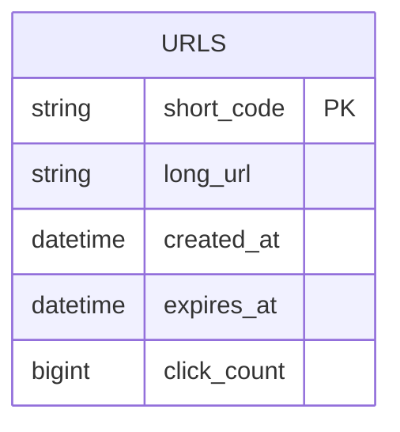
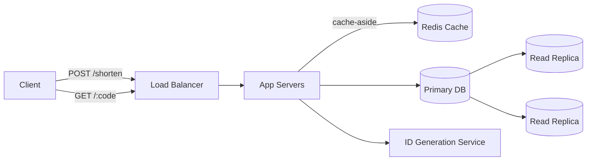
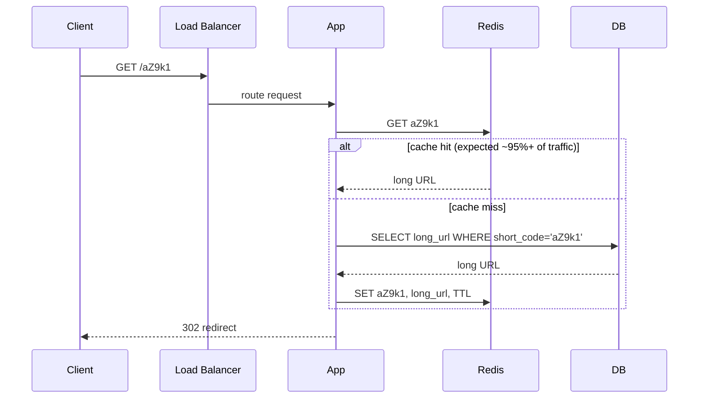

This is the "hello world" of system design interviews — small enough to fully design in 45 minutes, but it touches nearly every core concept: capacity estimation, database choice, caching, and read/write scaling.

## Requirements gathering

**Functional requirements**
- Given a long URL, generate a unique short URL (e.g. `sho.rt/aZ9k1`).
- Visiting the short URL redirects to the original long URL.
- Optionally: users can pick a custom alias, set an expiration date, and see click-count analytics.

**Non-functional requirements**
- **High availability** — a broken redirect service breaks every link shared anywhere (chat, email, social media), so downtime is highly visible.
- **Low latency** — the redirect must feel instant, ideally under 100ms.
- **Uniqueness** — no two long URLs accidentally collide on the same short code.
- Read-heavy: redirects (reads) vastly outnumber new-link creation (writes) — realistically over 100:1.

<Callout type="note" title="Always clarify scope first">
In an interview, explicitly state these assumptions before designing — e.g. "I'll assume we don't need user accounts, and links don't expire unless the interviewer wants that." It shows you understand that requirements drive architecture, not the other way around.
</Callout>

## Capacity estimation

Assume: 100 million new short links created per month, and a 100:1 read-to-write ratio.

- **Writes/sec**: 100,000,000 / (30 × 24 × 3600) ≈ **~39 writes/second** on average (plan for peak at ~5x average, so ~200/s).
- **Reads/sec**: 39 × 100 ≈ **~3,900 reads/second** average, peak maybe ~15,000-20,000/s.
- **Storage**: assume each record (short code, long URL, metadata) is ~500 bytes. Over 5 years: 100M/month × 60 months × 500 bytes ≈ **3 TB** — trivial for modern storage, but tells us we don't need to worry about running out of disk.
- **Short code length**: using base62 (a-z, A-Z, 0-9), 7 characters gives 62^7 ≈ 3.5 trillion possible codes — comfortably more than we'll ever need.

The key insight from this math: this system is **read-heavy and storage-light**, which immediately tells us caching will matter far more than database write-throughput optimization.

## API design

```
POST /api/v1/shorten
  body: { "longUrl": "https://example.com/very/long/path", "customAlias": "optional", "expiresAt": "optional" }
  response: { "shortUrl": "https://sho.rt/aZ9k1" }

GET /:shortCode
  response: 301/302 redirect to the original long URL

GET /api/v1/analytics/:shortCode
  response: { "clicks": 1042, "createdAt": "...", "lastAccessed": "..." }
```

A 301 (permanent) redirect lets browsers cache the redirect, reducing load on our service — but it means we lose the ability to count every click, since the browser won't hit our server again on repeat visits. A 302 (temporary) redirect always hits our server, letting us count clicks, at the cost of higher load. Most real systems use 302 specifically to preserve analytics.

## Database design



A single table is enough. The core access pattern is a **key-value lookup by short_code** — this looks less like a relational join-heavy workload and more like a key-value store's ideal use case, which is why many real implementations use a NoSQL store (e.g. DynamoDB) or a plain relational table with the short_code as a primary key and no joins at all.

**Generating the short code** — two common approaches:

1. **Hash + truncate**: MD5 or SHA-256 hash the long URL, base62-encode the first 7 characters. Simple, but hash collisions need a retry/salt strategy.
2. **Counter-based (recommended)**: maintain a globally unique, auto-incrementing counter (e.g. via a dedicated ID-generation service, or a database sequence), and base62-encode that number directly. This guarantees uniqueness with no collision handling needed at all, at the cost of needing a coordinated counter (solvable with pre-allocated ID ranges per server, so no single counter becomes a bottleneck).

## High-level architecture



- **Load balancer** distributes incoming requests across many stateless app servers.
- **App servers** handle both the create-link and redirect paths; they're stateless so any server can handle any request.
- **Cache (Redis)** sits in front of the database using a cache-aside strategy (see [Caching Strategies](/docs/caching/caching-strategies)) — since redirects vastly outnumber creates, a high cache hit rate removes almost all read load from the database.
- **Read replicas** absorb the (much smaller) remaining read traffic that misses the cache.
- **ID generation service** hands out unique ranges of IDs to app servers so short-code generation never becomes a single bottleneck.

## Detailed architecture — the redirect path



Given the 100:1 read-to-write ratio, and that short URLs are typically shared and clicked many times shortly after creation, a well-tuned cache should absorb the vast majority of redirect traffic — meaning the database mostly only sees new-link writes and the occasional cold cache miss.

## Scaling strategy

- **Horizontal scale app servers** behind the load balancer — since they're stateless, this is straightforward.
- **Cache** absorbs the read-heavy load; scale it horizontally (Redis Cluster) if a single cache node's memory or throughput becomes the limit.
- **Database read replicas** handle cache misses and analytics queries, keeping the primary free to handle writes.
- **Sharding** the primary database (e.g. by a hash of short_code) only becomes necessary at a much larger scale than our estimate above — worth mentioning as the next step, but not needed at 39 writes/second.

## Bottlenecks

- **Hot links**: a single viral link can receive a disproportionate share of all traffic. A per-key cache handles this well (that one key just stays hot in cache), but if using write-back counters for click analytics, a single hot key can still bottleneck a single cache node — mitigated by sharding counters across multiple keys and summing them periodically.
- **ID generation**: a naive single auto-increment counter becomes a bottleneck and single point of failure at high write volume — solved by handing out pre-allocated ID ranges to each app server instead of hitting a shared counter on every request.
- **Analytics writes**: incrementing a click counter on every redirect adds a write to a read-heavy path — usually solved by writing click events to a queue and aggregating them asynchronously, rather than synchronously incrementing a counter in the hot redirect path.

## Failure scenarios

- **Cache node fails**: cache-aside degrades gracefully — the app simply falls back to the database, redirects still work, just slower and with more DB load, until the cache recovers.
- **Database primary fails**: reads continue from replicas; writes (new link creation) fail or queue until a replica is promoted to primary — an acceptable trade-off since writes are a tiny fraction of total traffic.
- **ID generation service fails**: if app servers pre-fetch ID ranges in batches, they can continue creating new links using their already-allocated range for a while even if the ID service is briefly unavailable.
- **Entire region outage**: a multi-region deployment with DNS-based failover (see [DNS](/docs/networking/dns) and [CDN](/docs/networking/cdn)) prevents the redirect service — which is on the critical path for links shared anywhere on the internet — from having a single point of global failure.

## Improvements

- Add a **CDN** in front of redirects for globally distributed, low-latency responses close to the user.
- Add **rate limiting** on link creation to prevent abuse (spam link generation).
- Add **malicious URL detection** (checking against known phishing/malware lists) before accepting a long URL.
- Support **custom expiration** with a background job that periodically purges expired links, keeping storage bounded.
- Move click-count analytics to an asynchronous **event queue** (see [Messaging](/docs/messaging/queues)) so the hot redirect path never blocks on an analytics write.

## Summary

A URL shortener looks trivial but is a great teaching example because the requirements (read-heavy, low-latency, must never lose a link) directly imply the architecture: a cache-aside layer in front of a simple key-value-shaped database, stateless app servers behind a load balancer, and a decentralized ID-generation strategy to avoid a single bottleneck on writes. The interesting engineering is almost entirely in the read path optimization and graceful failure handling, not in the redirect logic itself.

<Quiz questions={[
  {
    q: "Why does this system favor a 302 redirect over a 301, despite 301 being cacheable by browsers?",
    options: [
      "302 is faster to generate",
      "301 doesn't support HTTPS",
      "302 forces the browser to hit the server every time, which is needed to count clicks for analytics",
      "301 is deprecated"
    ],
    answer: 2,
    explanation: "A 301 would let browsers cache the redirect and skip hitting the server on repeat visits, which breaks click analytics — so most real implementations trade some server load for accurate click counts with a 302."
  },
  {
    q: "Why is a counter-based short code generation approach generally preferred over hashing the long URL?",
    options: [
      "It's guaranteed unique with no collision handling required",
      "It produces shorter codes",
      "It doesn't require a database",
      "It's more secure"
    ],
    answer: 0,
    explanation: "A globally unique, incrementing counter base62-encoded directly avoids the possibility of collisions entirely, unlike hash-based approaches which need a retry or salting strategy when two different URLs hash to the same truncated value."
  }
]} />
