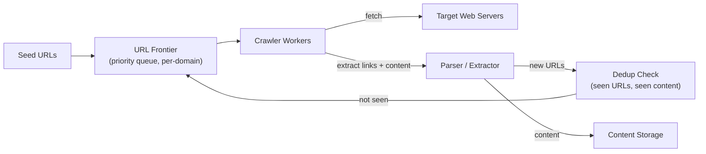
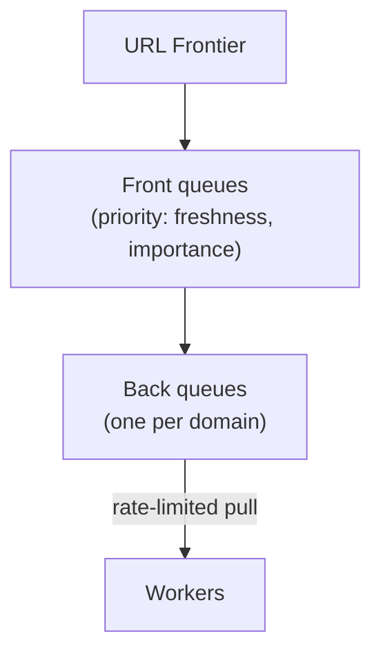
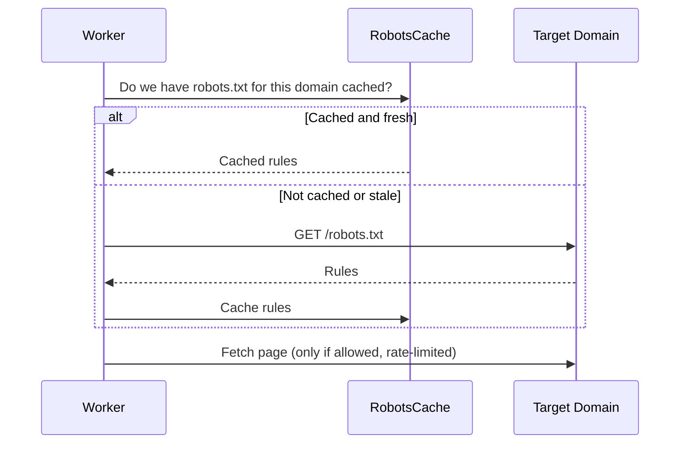
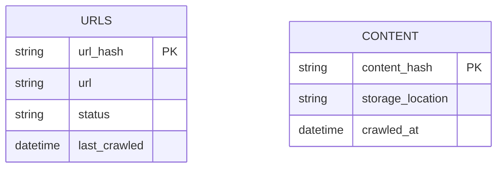

A web crawler is a distinctive system design question because the bottleneck isn't really storage or a single database — it's coordinating a huge, distributed fetch-and-discover loop politely, avoiding duplicate or infinite work, across a graph (the web) that's constantly changing and has no defined edges.

## Requirements gathering

**Functional requirements**
- Given a set of seed URLs, crawl pages, extract their content, and discover new URLs to crawl from links found on each page.
- Store crawled content for downstream use (e.g. indexing for a [Search Engine](/docs/case-studies/search-engine)).
- Recrawl pages periodically to catch updates.

**Non-functional requirements**
- **Politeness** — never overwhelm a single web server with a flood of concurrent requests; respect `robots.txt` and reasonable rate limits per domain.
- **Scalability** — the web is enormous (many billions of pages); the system must scale horizontally across many crawling workers.
- **No infinite loops** — must detect and avoid already-visited URLs, near-duplicate content, and deliberately or accidentally infinite link structures ("crawler traps").
- **Extensibility** — new content types and prioritization rules should be addable without redesigning the core loop.

<Callout type="note" title="Politeness is the requirement that shapes the whole architecture">
Unlike most crawling exercises, the binding constraint here usually isn't raw throughput — it's that hammering any single domain with too many concurrent requests is both bad practice and often explicitly disallowed. State this early: per-domain rate limiting is a first-class design constraint, not an afterthought.
</Callout>

## Capacity estimation

Assume: crawling 1 billion pages per month, average page size 100KB.

- **Pages/sec**: 1,000,000,000 / (30 × 86,400) ≈ **~385 pages/second** average, though actual concurrency is much higher than this since many requests are in-flight (waiting on slow remote servers) at any given moment.
- **Storage**: 1 billion pages × 100KB ≈ **100 TB per month** of raw crawled content — a clear case for [object storage](/docs/storage/object-storage) rather than a traditional file system or relational database.
- **URL frontier size**: the set of "discovered but not yet crawled" URLs can balloon into the billions given how densely linked the web is — this frontier itself needs to be a distributed, persistent structure, not something that fits in memory on one machine.

The key insight: the bottleneck is **coordination and politeness**, not raw compute — a single machine could theoretically issue far more requests per second than politeness constraints actually allow against any real set of target domains.

## High-level architecture

## URL frontier — the politeness-aware queue

The frontier is split into **front queues** (prioritizing which URLs matter most — e.g. high-authority pages, or pages due for a refresh) and **back queues**, where each back queue holds URLs for a *specific domain* and workers pull from a domain's back queue only as fast as that domain's politeness policy allows. This structure is what actually enforces per-domain rate limiting at scale: no matter how many workers exist globally, a single domain's queue can only be drained at the rate its own policy permits.

<Callout type="tip" title="Per-domain queues turn a global constraint into a local one">
Politeness needs to be enforced per domain, not globally — crawling many different domains fast is fine; crawling one domain fast is not. Structuring the frontier with one queue per domain, each independently rate-limited, means a worker fleet can scale up throughput overall simply by working across more domains in parallel, without ever violating any single domain's rate limit.
</Callout>

## Deduplication and crawler traps

- **URL-seen check**: before adding a discovered URL to the frontier, check whether it's already been crawled or queued — typically via a hash-based set (a Bloom filter is a common space-efficient choice when the seen-set is enormous, accepting a small false-positive rate in exchange for massive memory savings).
- **Content-seen check**: two different URLs can serve identical or near-identical content (mirrors, tracking-parameter variants of the same page) — a content hash (or a similarity hash for near-duplicates) avoids storing and re-processing the same content repeatedly under different URLs.
- **Crawler traps**: some sites generate effectively infinite URLs (e.g. a calendar page that always links to "next month," forever) — mitigated with limits like maximum crawl depth per domain, a cap on URLs crawled per domain within a time window, and heuristics detecting suspiciously repetitive URL patterns.

## Politeness and `robots.txt`

Before crawling any page on a domain, a worker checks that domain's `robots.txt` rules (cached, since fetching it fresh on every request would itself violate politeness) to confirm the path is allowed to be crawled, and respects any specified crawl-delay in addition to the system's own default per-domain rate limit.

## Data model

`URLS` tracks crawl status and scheduling metadata per URL (keyed by a hash of the normalized URL, to keep lookups fast and storage compact); `CONTENT` stores the actual fetched page bodies, deduplicated by content hash, in object storage.

## Scaling strategy

- **Crawler workers** scale horizontally, essentially embarrassingly parallel across different domains, since each domain's rate limit is independent of every other domain's.
- **URL frontier** is partitioned (e.g. by domain hash) across many nodes, so no single node has to hold the entire global frontier in memory.
- **Dedup structures** (seen-URL and seen-content sets) are sized and partitioned to handle billions of entries — Bloom filters specifically trade a small false-positive rate for the ability to fit an enormous seen-set in a fraction of the memory an exact set would require.
- **Content storage** scales via object storage's inherent near-limitless capacity, as with other large-scale content systems.

## Bottlenecks

- **Slow or unresponsive target servers**: a worker blocked waiting on one slow domain shouldn't stall crawling of other domains — solved with asynchronous, non-blocking fetches (or a large worker pool) so one slow domain's latency doesn't propagate into the whole system's throughput.
- **DNS resolution overhead**: resolving domain names for millions of distinct hosts is itself a meaningful cost at this scale — mitigated with a local, well-tuned DNS cache layer rather than resolving fresh on every single request.
- **Frontier hotspots**: an unusually link-rich domain can dominate the frontier with discovered URLs — capped per-domain queue sizes and fair-scheduling across domains (rather than strict FIFO globally) prevent one domain from starving crawl progress on all others.

## Failure scenarios

- **Worker crashes mid-fetch**: since URL state (queued, in-progress, done) is tracked durably in the frontier rather than only in worker memory, an in-progress URL that's never marked complete within a timeout is simply re-queued for another worker.
- **Target domain temporarily unreachable**: the domain's queue backs off (exponential backoff) rather than continuously retrying, and other domains' crawling proceeds unaffected in the meantime.
- **Dedup store node failure**: a replicated, partitioned dedup store (rather than a single node) ensures a failure doesn't either halt crawling entirely or silently allow mass re-crawling of already-seen content.

## Improvements

- **Priority-based recrawling**: frequently changing, high-authority pages (news sites) recrawled far more often than static, rarely-changing ones, using observed update frequency to inform scheduling rather than a fixed interval for everything.
- **Distributed, geographically diverse crawling**, fetching from locations closer to target servers to reduce latency and better distribute load across the wider internet's infrastructure.
- **Content classification during extraction** (language detection, spam/quality signals) to prioritize frontier scheduling toward genuinely valuable content rather than treating all discovered URLs equally.

## Summary

A web crawler's central design challenge is coordinating a massive, distributed fetch-and-discover loop while respecting per-domain politeness constraints and avoiding wasted or infinite work — solved with a domain-partitioned URL frontier that enforces rate limits locally per domain, Bloom-filter-backed deduplication that scales to billions of seen URLs and content hashes in a fraction of the memory an exact structure would need, and explicit safeguards against crawler traps. The genuinely hard engineering here is in queue structure and dedup at scale, not in the mechanics of fetching or parsing any individual page.

<Quiz questions={[
  {
    q: "Why does the URL frontier use a separate queue per domain rather than one global queue?",
    options: [
      "Per-domain queues are simpler to implement but serve no functional purpose",
      "Politeness limits must be enforced per domain, and giving each domain its own independently rate-limited queue lets the crawler scale total throughput by working across many domains in parallel, without ever exceeding any single domain's allowed rate",
      "A single global queue would run out of memory immediately",
      "Domains require different data formats that can't share a queue"
    ],
    answer: 1,
    explanation: "Politeness is a per-domain constraint — crawling many domains quickly is fine, crawling one domain too quickly is not. Per-domain back queues let workers pull from each domain only as fast as that domain's own rate limit allows, while overall system throughput still scales by crawling many domains concurrently."
  },
  {
    q: "Why is a Bloom filter often used for the seen-URL check instead of an exact set?",
    options: [
      "Bloom filters are always more accurate than exact sets",
      "A Bloom filter can represent an enormous seen-set (billions of URLs) in a fraction of the memory an exact set would require, at the cost of a small, tunable false-positive rate",
      "Exact sets cannot be implemented in a distributed system",
      "Bloom filters eliminate the need for any deduplication logic at all"
    ],
    answer: 1,
    explanation: "At the scale of billions of seen URLs, an exact set (e.g. a hash set storing every URL) would require prohibitive memory. A Bloom filter trades a small, controllable rate of false positives (occasionally treating an unseen URL as already seen) for dramatically lower memory usage, which is an acceptable trade-off at crawler scale."
  }
]} />
