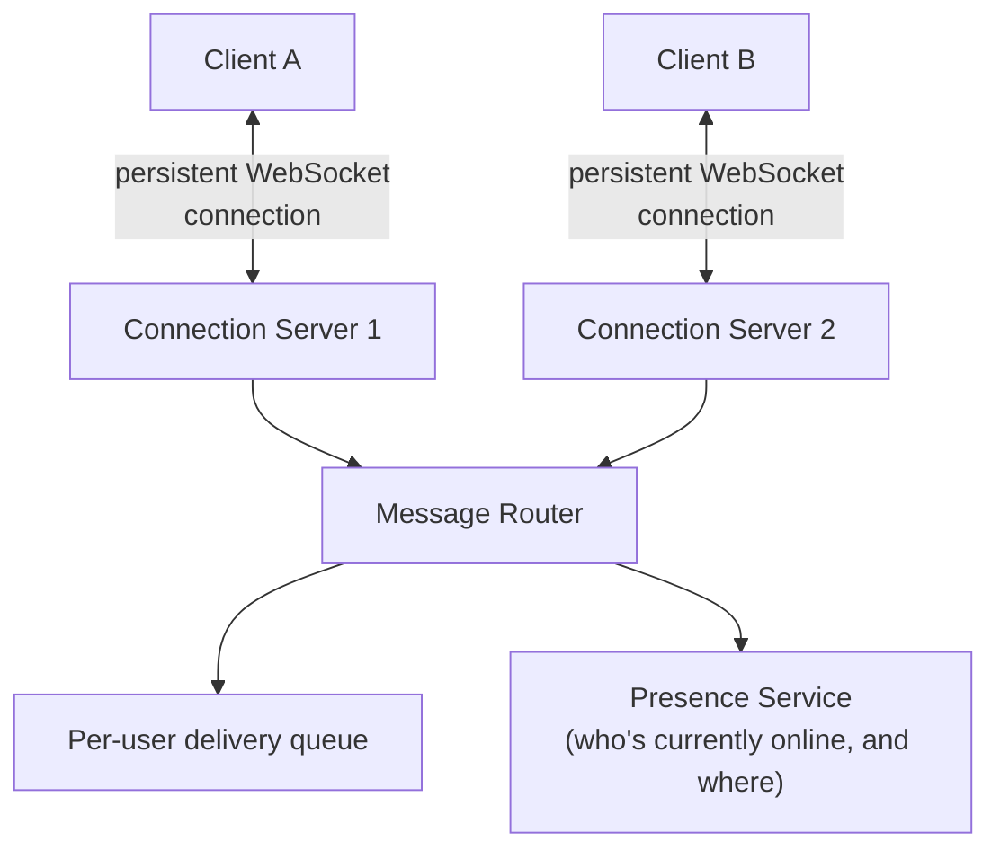
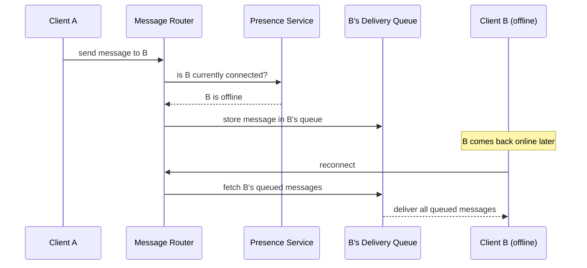

A messaging app looks simple on the surface — send a message, the other person receives it — but reliably delivering that message exactly once, in order, to a device that might be offline, online, or switching networks mid-conversation, is a genuinely rich distributed systems problem.

## Requirements gathering

**Functional requirements**
- Users can send text messages, photos, and other media to individual contacts or groups.
- Messages are delivered reliably, even if the recipient is temporarily offline.
- Delivery and read receipts ("sent," "delivered," "read") are shown to the sender.
- Messages are end-to-end encrypted.

**Non-functional requirements**
- **Low latency** — a message should arrive in near real time when both parties are online.
- **High reliability** — messages must not be silently lost, even across network interruptions or app restarts.
- **Massive scale** — billions of users, tens of billions of messages per day.
- **Efficient for mobile** — must work well on unreliable, low-bandwidth mobile connections, and minimize battery/data usage.

## Capacity estimation

Assume: 2 billion users, each sending an average of 40 messages per day.

- **Messages/day**: 2,000,000,000 × 40 = 80 billion messages/day ≈ **~925,000 messages/second** average, with significant peak multipliers (evenings, regional peaks) likely reaching several million/second.
- **Concurrent connections**: if even 20% of users are actively connected at any given peak moment, that's **400 million concurrent persistent connections** — this number, more than raw message throughput, is what shapes the connection-handling architecture.
- **Storage**: messages are typically not stored long-term server-side once delivered (a deliberate privacy and cost decision) — the server's storage need is closer to a transient delivery queue than a permanent message archive.

The standout number here is the connection count, not the message rate — this is fundamentally a **massive concurrent connection management problem**, which is why [WebSockets](/docs/networking/websockets) (or a similar persistent-connection protocol) rather than plain request-response HTTP is central to the design.

## API design (conceptually — real WhatsApp uses a custom binary protocol, not REST)

```
CONNECT (persistent connection, authenticated)
SEND_MESSAGE { to: userId, content: encrypted_payload }
  → ack: { status: "sent" }
DELIVER_MESSAGE (pushed from server to recipient's connection)
  → ack: { status: "delivered" }
READ_RECEIPT { messageId }
```

Real-time messaging platforms typically use a custom, compact binary protocol rather than JSON-over-HTTP specifically to minimize bandwidth and battery usage on mobile devices at this message volume.

## Database design

- **User & contact metadata**: relatively small, read-heavy, well-suited to a conventional database with caching.
- **Message delivery queue**: a per-user queue of undelivered messages, held only until the recipient's device confirms delivery — this is closer in shape to a [Queue](/docs/messaging/queues) than a permanent message store, since messages are typically deleted from servers once delivered (with the actual message content usually only persisted client-side, on-device).
- **Group membership**: which users belong to which groups — a straightforward relational shape, though group message fan-out (see below) is the more interesting architectural challenge.

## High-level architecture



Each client maintains a persistent connection to one specific connection server; when Client A sends a message to Client B, the message is routed (using the presence service to find which specific connection server Client B is currently attached to, if online at all) to the right server, which pushes it directly to Client B's open connection.

## Detailed architecture — handling offline recipients



If the recipient is offline, the message is held in their personal delivery queue rather than being lost — the moment they reconnect, the connection server checks their queue and delivers everything that accumulated while they were offline, in order.

## Scaling strategy

- **Horizontal scaling of connection servers**: each connection server holds a subset of all currently-connected clients; adding more servers increases total concurrent connection capacity.
- **Presence service as a lookup layer**: needs to be fast and horizontally scalable itself, since every message routing decision depends on it — commonly backed by an in-memory store like [Redis](/docs/caching/redis).
- **Group message fan-out**: sending a message to a group with many members means the router must deliver it to every member's respective connection (or queue, if offline) — for very large groups, this fan-out is done asynchronously and in parallel, rather than blocking the sender's "sent" acknowledgment on every single recipient's delivery.

## Bottlenecks

- **Presence service under connection churn**: mobile clients disconnect and reconnect frequently (switching networks, backgrounding the app) — the presence service needs to handle very high update rates, not just high read rates.
- **Large group fan-out**: a message to a group with thousands of members means thousands of individual delivery operations — handled asynchronously so it doesn't block the sender, and often batched for efficiency.
- **Connection server memory**: each open connection consumes some server memory — capacity planning for connection servers is about concurrent connection count, not request throughput, a very different sizing consideration (see [Storage](/docs/cloud/containers) and general [Scalability](/docs/fundamentals/scalability) principles).

## Failure scenarios

- **A connection server crashes**: every client attached to it loses their connection and must reconnect (typically automatically, handled by client-side retry logic) — landing on a different, healthy connection server, with any messages sent to them in the meantime safely held in their delivery queue rather than lost.
- **The presence service becomes briefly unavailable**: message routing might momentarily be unable to determine if a recipient is online — a reasonable fallback is to queue the message for later delivery rather than dropping it, erring toward eventual delivery over immediate real-time delivery when in doubt.
- **A message fails to reach the recipient's queue at all**: the sender's client, having not received a delivery acknowledgment within an expected time, can retry sending — this is exactly why message IDs and idempotent delivery handling matter, so a retried send doesn't result in a duplicate message to the recipient.

## Improvements

- End-to-end encryption (which WhatsApp implements via the Signal Protocol) ensures that even the delivery infrastructure itself can't read message content — only the sender and recipient's devices hold the necessary keys.
- Multi-device support (allowing a user to be logged in on phone, desktop, and web simultaneously) adds real complexity to the delivery and presence model, since a message may now need to reach several of a single user's devices.
- Read receipts and typing indicators are implemented as lightweight, low-priority signals layered on top of the same connection infrastructure, distinct from the core reliable-message-delivery path.

## Summary

WhatsApp's design is shaped by two dominant, related challenges: managing hundreds of millions of concurrent persistent connections (favoring WebSockets over plain HTTP), and guaranteeing reliable message delivery even to temporarily offline recipients (via per-user delivery queues and a presence service to route messages correctly). Group fan-out, connection-server capacity planning, and end-to-end encryption are the notable extensions on top of this core one-to-one messaging foundation.

<Quiz questions={[
  {
    q: "Why does WhatsApp's architecture use persistent connections (like WebSockets) rather than clients repeatedly polling a server with regular HTTP requests?",
    options: [
      "HTTP polling would actually be simpler and is generally preferred for messaging apps",
      "Persistent connections let the server push a message to a recipient the instant it arrives, avoiding both the latency of waiting for the next poll and the wasted overhead of frequent, mostly-empty polling requests at this massive scale",
      "WebSockets are required by law for messaging applications",
      "There's no real difference between the two approaches at this scale"
    ],
    answer: 1,
    explanation: "At the scale of hundreds of millions of concurrent users, repeated polling would be extremely wasteful (most polls finding nothing new) and would add real latency (waiting for the next poll interval); a persistent connection lets the server push messages the instant they arrive, which is essential for the real-time experience a messaging app needs."
  },
  {
    q: "What happens to a message sent to a recipient who is currently offline?",
    options: [
      "The message is immediately and permanently lost",
      "The message is stored in the recipient's personal delivery queue and delivered automatically once they reconnect",
      "The sender is required to manually resend it later",
      "Offline recipients cannot be messaged at all"
    ],
    answer: 1,
    explanation: "Rather than being lost, a message to an offline recipient is held in their delivery queue; when their client reconnects, the connection server checks and delivers everything that accumulated while they were offline, in order."
  }
]} />
