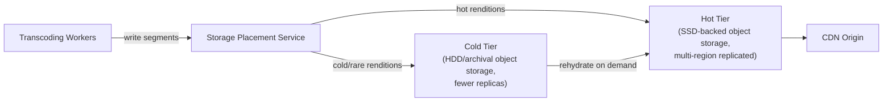
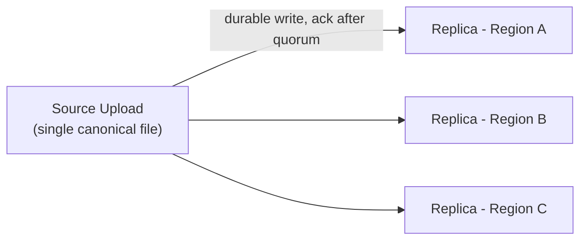
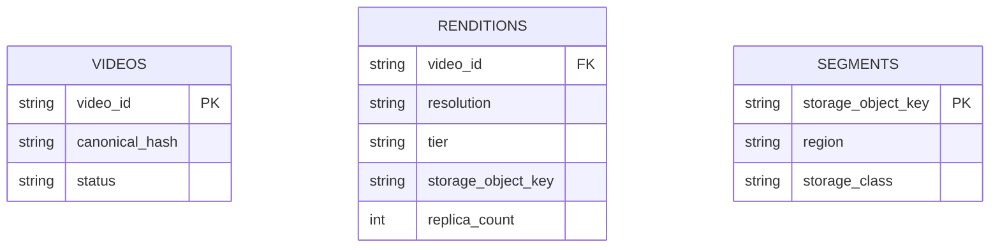

The [Design YouTube](/docs/case-studies/youtube) case study covers the full system end to end — upload, transcoding, and playback. This one zooms into a single piece of that system and treats it as its own interview question: **how do you actually store and serve exabytes of video durably, cheaply, and fast?** It's a useful variant because "design YouTube" and "design YouTube's storage layer" reward different things — the first rewards breadth across a pipeline, the second rewards depth on data placement, replication, and cost trade-offs.

## Requirements gathering

**Functional requirements**
- Durably store every uploaded video's raw source file and every transcoded rendition (multiple resolutions/bitrates/formats).
- Serve video segments to the playback path with low latency at massive read scale.
- Support deleting/re-processing videos without breaking already-issued playback manifests mid-stream.

**Non-functional requirements**
- **Durability above almost everything else** — losing a user's uploaded video is close to the worst possible failure for this subsystem specifically.
- **Cost efficiency at exabyte scale** — storage cost is one of the largest infrastructure line items for a video platform, so the design must actively exploit access-pattern differences (hot vs. cold content) rather than storing everything uniformly.
- **High read throughput and low latency**, though as discussed below, the storage layer itself is shielded from most of this by the CDN sitting in front of it.
- **Storage efficiency despite massive transcoding fan-out** — one upload becomes many stored renditions.

<Callout type="note" title="This is a storage-and-cost problem more than a raw-throughput problem">
Because a CDN absorbs the overwhelming majority of playback reads (see [Design YouTube](/docs/case-studies/youtube)), the origin storage layer itself mostly needs to handle CDN cache misses, not the full firehose of global playback traffic. That reframes the hard problem here as durability, capacity planning, and cost — not raw QPS.
</Callout>

## Capacity estimation

Assume: 500 hours of video uploaded per minute, an average bitrate that puts one hour of source video in the low single-digit gigabytes, and a transcoding ladder producing roughly 5-10 stored renditions per upload across resolutions and formats.

- **Raw ingest volume**: 500 hours/minute of source video is on the order of several petabytes of *new raw data per day* before any transcoding — already a massive and continuously growing base.
- **Transcoding fan-out multiplier**: storing 5-10 renditions per video (240p through 4K, multiple codecs for device compatibility) multiplies effective stored bytes several-fold over the raw upload volume — this fan-out, not the raw uploads themselves, is what actually drives total storage footprint.
- **Cumulative storage**: with years of continuously accumulating uploads and no natural expiration for most content, total stored video data reaches the exabyte range — meaning the system can't be designed around any single-machine or single-cluster storage assumption at all; it has to assume near-unlimited horizontal growth from day one.

The key insight: total stored bytes are dominated by the **transcoding fan-out** and by the fact that video, unlike most user data, essentially never gets deleted or shrinks — the storage layer has to be built for continuous, unbounded growth rather than a fixed working set.

## Storage architecture: chunking and placement

Video is never stored as one monolithic file — it's split into short segments at each resolution (the same chunking that enables adaptive playback), and each segment is an independent [object storage](/docs/storage/object-storage) object. This has two benefits specific to the storage layer: segments can be placed, replicated, and evicted independently of the rest of the video, and a corrupted or lost segment only requires re-deriving that one small piece from the source file rather than the entire video.

<Callout type="tip" title="The source file is the real source of truth; renditions are derived, disposable state">
Every transcoded rendition can, in principle, be regenerated from the original uploaded source file. That reframes renditions as an aggressively optimizable cache-like layer rather than irreplaceable data — it's reasonable to store fewer replicas of a rarely-watched rendition, or even evict and lazily regenerate it, in a way that would be unacceptable for the raw source itself.
</Callout>

## Hot/cold tiering and popularity skew

Video view counts follow a severe power-law distribution: a small fraction of uploads (recent, trending, or evergreen popular content) account for a large share of all views, while a long tail of older or niche uploads is watched rarely, if ever.

- **Hot tier**: popular and recently-uploaded content is kept on faster storage media (e.g. SSD-backed object storage) with full replication across regions, since it's read constantly and any added latency or availability risk is felt by a huge number of viewers.
- **Cold/archival tier**: content that hasn't been watched in a long time is migrated to cheaper, slower archival storage with fewer replicas and higher retrieval latency — acceptable because a cold video is, by definition, rarely requested, and a brief rehydration delay on the rare request is a reasonable trade-off for the storage cost savings at exabyte scale.
- **Tier migration** runs as a background process driven by access-frequency signals (views in the last N days), continuously moving content between tiers as its popularity naturally rises and fades over time.

<Callout type="warning" title="Tiering decisions must never risk losing data, only latency">
Moving content to cold storage should only ever change *how fast* it can be retrieved, never the durability guarantee itself. Conflating "infrequently accessed" with "less important to keep safe" is a common design mistake — cold-tier storage still needs strong durability guarantees, just optimized for cost over latency.
</Callout>

## Replication and durability

The original uploaded source file is replicated across multiple, geographically distinct storage locations before an upload is considered durably committed — this is non-negotiable, since it's the one artifact everything else can be regenerated from. Transcoded renditions, being derived and regenerable, can use lighter replication schemes: a popular rendition might still be fully multi-region replicated for latency and availability reasons, while a cold, rarely-hit rendition might use erasure coding (storing data plus parity fragments across nodes, reconstructable from a subset) to cut replication overhead well below the cost of full copies while still tolerating node failures.

## Deduplication and reference counting

Not every upload is unique bit-for-bit — re-uploads, minor re-edits, and identical content uploaded by different accounts (e.g. official content re-uploaded by fan accounts) create redundant storage opportunity. Content-based hashing (fingerprinting segments or whole files) lets the system detect exact or near-duplicate content and store the underlying bytes once with reference counts from multiple logical "videos" pointing at the same underlying storage objects — reclaiming meaningful storage at this scale without deleting any user's actual uploaded video record.

## Metadata and the storage index

The metadata layer answers "where does this exact segment live and in what state" separately from the (much larger) actual video bytes — kept in a fast, horizontally-scalable key-value or metadata store, since every playback manifest generation and every tiering decision depends on quick lookups against it, and it must scale independently of the bulk storage tier itself.

## Scaling strategy

- **Object storage** underlying both tiers scales near-limitlessly by design, which is exactly why chunked video segments are stored there rather than in a traditional file system or block store — see [Object Storage](/docs/storage/object-storage).
- **Tiering and rehydration** scale as background, asynchronous processes decoupled from the live playback path, so a surge in tier-migration work never competes with user-facing read latency.
- **Metadata store** scales separately from bulk storage — it's a much smaller, higher-QPS workload (structured lookups) than the underlying petabyte-scale object data, and benefits from different scaling techniques (sharding, caching) than the bulk storage tier does.
- **Replication factor** is tunable per content popularity rather than fixed globally, which is itself a scaling lever: uniformly replicating every byte at the same factor as the hottest content would be enormously wasteful at this scale.

## Bottlenecks

- **Transcoding fan-out storage cost**: pre-generating and fully replicating every resolution for every upload immediately is the single biggest avoidable cost — mitigated by generating and fully replicating only the most commonly requested renditions eagerly, and lazily generating rarer ones (or storing them cold) on demand.
- **Cold-tier rehydration latency**: a rarely-watched video suddenly going viral (e.g. resurfacing in a trend) can hit a slow, cold-storage retrieval path right when demand spikes — mitigated by fast-tracking a rehydration-to-hot-tier promotion the moment access frequency crosses a threshold, rather than waiting for the next scheduled tiering pass.
- **Deduplication correctness at scale**: reference-counting shared underlying bytes across many logical videos adds real complexity to deletion (bytes can only be reclaimed once no video references them) — getting this wrong risks either storage leaks or, far worse, deleting bytes still referenced by another video.

## Failure scenarios

- **Storage node or disk failure**: since data is replicated (or erasure-coded) across independent nodes and regions, a single node failure is absorbed transparently, with background repair regenerating the lost replica or reconstructing from parity fragments.
- **Regional outage**: multi-region replication of the canonical source file and hot renditions allows failover to a surviving region; cold-tier content in an affected region may see temporarily degraded (not lost) access if its replication factor is lower there.
- **Transcoding worker failure mid-job**: because the source file is durably stored and replicated before transcoding begins, a failed job simply retries — no data loss, only reprocessing time, as covered in the full [Design YouTube](/docs/case-studies/youtube) pipeline walkthrough.
- **Deduplication reference-count corruption**: a bug that undercounts references risks premature deletion of still-referenced bytes — mitigated by treating dereference-triggered deletes as soft-deletes with a grace period, rather than immediate, irreversible removal.

## Improvements

- **Predictive pre-warming**: using upload metadata and creator history (e.g. a channel with a history of videos going viral shortly after upload) to keep new content in the hot tier longer before it would otherwise be demoted.
- **Per-title storage optimization**: similar to per-title encoding, tuning replication factor and tier placement per video based on its actual observed access pattern rather than a one-size-fits-all popularity threshold.
- **Cross-region deduplication**: extending content-hash-based deduplication across regional storage boundaries, not just within a single region's storage pool.

## Summary

YouTube's storage layer is a story of exploiting two structural facts about video content: renditions are derived and regenerable from a durable source (so they can be replicated and tiered more aggressively than the source itself), and view popularity follows a severe power-law skew (so hot/cold tiering, not uniform storage, is what makes exabyte-scale storage affordable). Chunked, independently-placed segments; replication schemes that vary by content popularity; and a metadata layer that scales separately from bulk bytes are what let the system keep essentially every video ever uploaded, durably, at a cost that doesn't grow linearly with naive full replication.

<Quiz questions={[
  {
    q: "Why can transcoded renditions of a video use lighter replication (e.g. erasure coding, fewer copies) than the original uploaded source file?",
    options: [
      "Renditions are less important to users than the source file",
      "Renditions are derived data that can, in principle, be regenerated from the durably-stored source file, making them an optimizable, disposable layer rather than irreplaceable data the way the source is",
      "Renditions are always smaller and therefore need no redundancy at all",
      "There is no meaningful difference in how source files and renditions should be replicated"
    ],
    answer: 1,
    explanation: "Because every rendition can be regenerated from the original source through the transcoding pipeline, it's acceptable to replicate renditions more lightly (or even lazily regenerate rarely-used ones) in a way that would be unacceptable for the source file itself, which has no other copy to derive from."
  },
  {
    q: "Why does the storage layer migrate content between a hot tier and a cold/archival tier instead of storing everything uniformly?",
    options: [
      "Uniform storage would be simpler and is generally preferred at this scale",
      "Video popularity follows a severe power-law distribution, so keeping rarely-watched content on cheaper, slower storage while reserving fast, fully-replicated storage for popular and recent content significantly reduces cost without materially harming the experience for the vast majority of views",
      "Cold storage is required by law for older video content",
      "Tiering has no effect on cost, only on retrieval speed"
    ],
    answer: 1,
    explanation: "Since a small fraction of content accounts for most views, uniformly storing every video at the same replication and media-speed tier as the hottest content would be extremely wasteful — tiering lets cost scale with actual access patterns instead of total stored bytes."
  }
]} />
