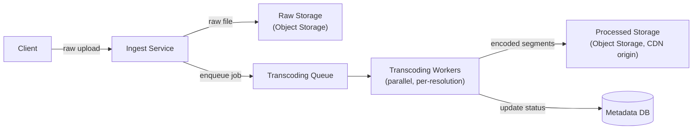
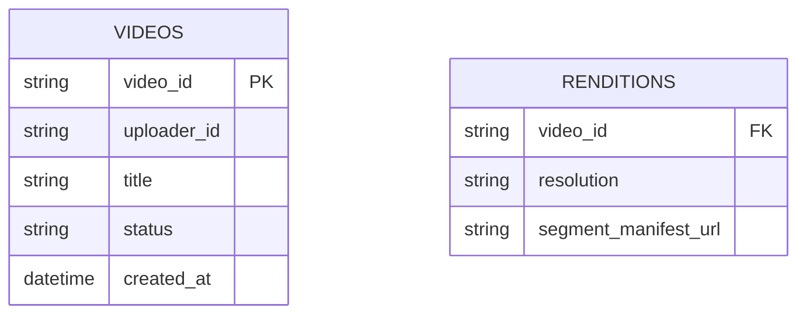
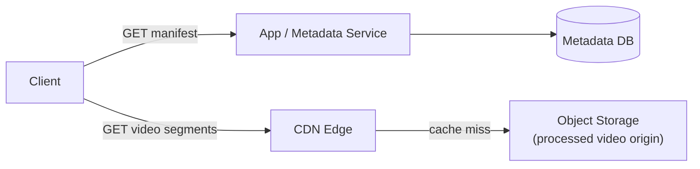

YouTube is a favorite system design interview question because it forces you to reason about two very different workloads at once: a relatively low-volume, heavy **write path** (video upload and processing) and a massive-scale, latency-critical **read path** (video playback) — and the architecture is really a story about decoupling those two almost entirely.

## Requirements gathering

**Functional requirements**
- Users can upload a video.
- Users can watch a video, with playback adapting to their network conditions.
- Optionally: comments, likes, subscriptions, recommendations.

**Non-functional requirements**
- **High availability** for playback — video watching is the core product experience and must stay up.
- **Low latency** playback start (buffering delay) and smooth adaptive streaming across varying network conditions.
- **Massive read scale** — views vastly outnumber uploads, often by many orders of magnitude.
- **Durability** — an uploaded video must never be silently lost.

<Callout type="note" title="Scope the interview deliberately">
This is a huge system. Explicitly narrow scope up front: "I'll focus on upload, transcoding, storage, and playback — I'll set aside recommendations, comments, and monetization unless you want to go there." Trying to design everything shallowly is worse than designing the core pipeline well.
</Callout>

## Capacity estimation

Assume: 500 hours of video uploaded per minute, and a view-to-upload ratio on the order of 1000:1 (reads vastly dominate).

- **Uploads**: 500 hours/minute of raw footage is a huge write volume in bytes, but a comparatively low *request* rate — uploads are large, infrequent, asynchronous operations, not a high-QPS API.
- **Views/sec**: with billions of daily views globally, average views/second are in the tens of thousands, with very uneven distribution — a small number of videos receive a disproportionate share of all views (a classic **hot key** / power-law problem).
- **Storage**: assuming multiple transcoded resolutions and formats per uploaded video (see below), stored video data is many times the size of the raw uploads themselves — storage growth is dominated by the transcoding fan-out, not the raw upload volume.

The key insight: this system is **read-massive and storage-heavy**, and the read path (playback) needs to be almost entirely decoupled from the write path (upload processing) to scale independently.

## API design

```
POST /api/v1/videos/upload
  body: multipart video file + metadata (title, description)
  response: { "videoId": "abc123", "status": "processing" }

GET /api/v1/videos/:videoId/manifest
  response: adaptive streaming manifest (available resolutions, segment URLs)

GET /api/v1/videos/:videoId/status
  response: { "status": "processing" | "ready" | "failed" }
```

Upload is deliberately asynchronous: the client gets an immediate acknowledgment and a `videoId`, then polls (or receives a push notification) for when transcoding completes — the user is never blocked waiting on the full processing pipeline synchronously.

## Video upload & transcoding pipeline



- The raw uploaded file is stored durably in [object storage](/docs/storage/object-storage) immediately, before any processing — so the original is never lost even if transcoding later fails and needs a retry.
- A message is placed on a [queue](/docs/messaging/queues), decoupling the fast upload acknowledgment from the slow, resource-intensive transcoding work.
- **Transcoding workers** pull jobs and encode the source video into multiple resolutions and bitrates (e.g. 240p through 4K) and formats, split into short segments (a few seconds each) — this is what enables **adaptive bitrate streaming**, where a player can switch resolution mid-playback as network conditions change, without re-buffering the whole video.
- Transcoding a single video into many resolutions is itself parallelized across workers (different resolutions, or different segments of the same resolution, processed concurrently) since it's CPU-intensive and would otherwise be a slow, serial bottleneck.

<Callout type="info" title="Chunked, resolution-ladder streaming is the core playback trick">
Video isn't served as one giant file. It's split into short segments (commonly a few seconds each) at each supported resolution — a "resolution ladder." The player requests segments one at a time and picks the resolution for the *next* segment based on currently measured network throughput, which is what lets playback adapt smoothly rather than stalling outright when bandwidth drops.
</Callout>

## Storage & metadata design



Video **bytes** live in object storage (raw and processed renditions); a metadata database holds video attributes, processing status, and pointers to where each rendition's segments live. This split matters: the metadata database stays small and fast (structured, relatively low-volume records) while the actual video bytes — the overwhelming majority of total data — live in storage purpose-built for exactly that access pattern.

## High-level architecture — the playback path



Playback is almost entirely a **CDN problem**, not an application-server problem: once a manifest tells the player which segment URLs to request, the actual video bytes are served from CDN edge caches close to the viewer, and the origin (object storage) is hit only on a cache miss. Since popular videos are requested extremely often, cache hit rates on hot content are very high, and the application/metadata layer is barely involved in the actual byte-serving hot path at all.

## Scaling strategy

- **CDN** absorbs the overwhelming majority of playback byte traffic — this is the single most important scaling lever in the whole system.
- **Transcoding workers** scale horizontally and independently of the playback path entirely, since upload volume and view volume are wildly different scales and shouldn't compete for the same resources.
- **Metadata database** is read-heavy (manifest lookups) but comparatively low-volume in bytes, and can use read replicas and caching (video metadata rarely changes once processing completes) rather than needing complex sharding for most workloads.
- **Object storage** scales near-limitlessly by design, which is exactly why it's used for the actual video bytes rather than a traditional file system or block store.

## Bottlenecks

- **Transcoding fan-out cost**: encoding one upload into many resolutions and formats is CPU-intensive and multiplies storage several-fold — mitigated by only pre-generating the most commonly requested resolutions immediately, and generating rarer ones (e.g. very high resolutions) lazily or on lower priority.
- **Hot videos (power-law traffic)**: a viral video can receive a disproportionate share of all traffic — the CDN's caching handles this well since one hot object simply stays cached at many edge locations, but the very first surge (before it's widely cached) can still stress the origin briefly.
- **Upload spikes**: a surge in uploads (e.g. during a major live event) is absorbed by the queue between ingest and transcoding — ingest and durable raw storage stay fast and available even if transcoding workers temporarily fall behind.

## Failure scenarios

- **Transcoding worker crashes mid-job**: since the raw file is already durably stored before transcoding starts, the job simply retries from the queue — no data is lost, only processing time.
- **CDN edge location failure**: requests fail over to another edge location or, in the worst case, to origin directly — the multi-location nature of a CDN is itself the redundancy mechanism.
- **Metadata database outage**: playback of *already-cached* segments at CDN edges can continue briefly even if fetching a fresh manifest is degraded, since the manifest itself can be cached at the edge with a reasonable TTL.
- **Object storage regional outage**: cross-region replication of processed video renditions (accepting extra storage cost for critical/popular content) allows failover to a backup region.

## Improvements

- **Pre-fetching**: predict and pre-generate the specific rendition a user is likely to request next based on typical viewing patterns, reducing perceived buffering further.
- **Per-title encoding optimization**: rather than a fixed bitrate ladder for every video, tune encoding parameters per-video based on its actual visual complexity, saving storage and bandwidth without a perceptible quality loss.
- **Regional pre-positioning**: proactively push newly popular content to CDN edge locations in regions where it's trending, ahead of organic cache warming.
- **Asynchronous view-count and analytics pipeline** (see [Event-Driven Architecture](/docs/messaging/event-driven-architecture)) so counting a view never sits on the critical playback path.

## Summary

YouTube's architecture is fundamentally a story of decoupling two very different workloads: an infrequent, heavy, asynchronous upload-and-transcode pipeline (queue-driven, parallelized across workers, tolerant of retries) and a massive-scale, latency-critical playback path that's almost entirely solved by a CDN serving pre-generated, chunked, multi-resolution video segments. Nearly every hard scaling problem in the system reduces to caching effectively at the edge and keeping the metadata layer thin and separate from the actual video bytes.

<Quiz questions={[
  {
    q: "Why is video split into short segments at multiple resolutions instead of served as one file at one resolution?",
    options: [
      "It reduces storage costs to zero",
      "It enables adaptive bitrate streaming — the player can switch resolution for upcoming segments based on current network conditions, avoiding hard stalls",
      "It's required by all video file formats",
      "It has no effect on playback quality or performance"
    ],
    answer: 1,
    explanation: "Chunked, multi-resolution encoding (a 'resolution ladder') lets the player request the next segment at whatever resolution current bandwidth supports, smoothly adapting quality instead of buffering hard when network conditions change."
  },
  {
    q: "Why is video upload processed asynchronously via a queue instead of synchronously during the upload request?",
    options: [
      "Synchronous processing is technically impossible",
      "Transcoding into multiple resolutions is CPU-intensive and slow, so decoupling it lets the upload request return quickly while processing happens independently and can be retried on failure",
      "Queues are required by all storage systems",
      "It has no real benefit over synchronous processing"
    ],
    answer: 1,
    explanation: "Transcoding a video into many resolutions is a slow, resource-intensive operation. Placing it on a queue lets the upload API respond immediately with an acknowledgment, decouples upload traffic from transcoding capacity, and makes failed jobs simple to retry without affecting the user-facing upload flow."
  }
]} />
