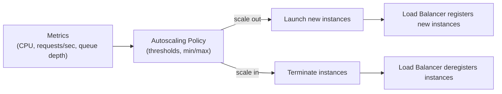

## Definition

Autoscaling is the automated adjustment of a system's compute capacity — adding instances or resources when demand increases and removing them when demand drops — based on defined metrics like CPU utilization, request rate, or queue depth.

## Why it exists

Provisioning for peak load means paying for idle capacity most of the time; provisioning for average load means falling over during spikes. Autoscaling exists to resolve this tension by adjusting capacity automatically and continuously, matching what's actually running to what's actually needed at any given moment.

## The problem it solves

A fixed number of servers is either wasteful (over-provisioned for typical load, sized for a peak that rarely occurs) or fragile (under-provisioned, unable to handle real traffic spikes). Autoscaling solves this by monitoring real-time signals and scaling capacity up or down automatically, aiming to track actual demand rather than a static guess made in advance.

## Real-world analogy

Autoscaling is like a restaurant that calls in extra staff when a rush is detected and sends people home when things quiet down, rather than always staffing for either the busiest possible Saturday night or the slowest Tuesday afternoon — matching staffing to the actual, moment-to-moment demand instead of a fixed guess.

## Simple explanation

A system watches a metric like CPU usage or request rate against defined thresholds, and automatically launches additional instances when the metric climbs too high, then terminates the extra instances again once the metric drops back down.

## Technical explanation

Autoscaling policies typically define a target metric and threshold (e.g. "keep average CPU near 60%"), a minimum and maximum instance count (bounding both cost and how far the system can scale), and a cooldown period between scaling actions to avoid reacting to short-lived noise. New instances need to register with a [Load Balancer](/docs/load-balancing/algorithms) before they receive traffic, and existing connections typically need to drain gracefully before an instance is terminated during scale-in.

## Internal working — reactive vs. predictive scaling

Most autoscaling is **reactive**: it responds to a metric crossing a threshold, which inherently means there's a lag between demand rising and new capacity actually coming online (instance boot time, application startup, health check warm-up). Some systems layer in **predictive** or **scheduled** scaling on top — scaling ahead of a known daily traffic pattern, or using historical trend forecasting — specifically to compensate for that reactive lag ahead of anticipated spikes rather than only after they've already started.

<Callout type="warning" title="Cooldown periods prevent scaling thrash">
Without a cooldown period between scaling actions, a system can oscillate — scaling out because of a brief spike, then immediately scaling back in once the metric dips, then scaling out again moments later. This "thrashing" wastes resources on constant instance churn and can actually make response times worse. A sensible cooldown period lets the system stabilize before making another scaling decision.
</Callout>

## Advantages

- Capacity automatically tracks real demand, avoiding both the cost of over-provisioning and the risk of under-provisioning.
- Reduces the need for manual, reactive capacity planning during traffic spikes.
- Pairs naturally with [Serverless](/docs/cloud/serverless) and container orchestrators like [Kubernetes](/docs/cloud/kubernetes), both of which build autoscaling in as a core capability.

## Disadvantages

- Reactive scaling has an inherent lag — new capacity takes real time to boot and become ready, so a very sudden spike can still cause degraded performance before scaling catches up.
- Poorly tuned thresholds or missing cooldown periods can cause scaling thrash, adding instability rather than removing it.
- Stateful workloads (databases, in-memory session state) don't autoscale as cleanly as stateless application servers, since new instances can't simply pick up where old ones left off without careful design.

## Trade-offs

Reactive autoscaling trades a small amount of response lag for simplicity and general applicability; predictive or scheduled scaling reduces that lag for predictable traffic patterns but requires accurate forecasting and adds configuration complexity that isn't worth it for genuinely unpredictable workloads.

## Complexity considerations

Autoscaling a simple, stateless web tier behind a load balancer is relatively straightforward. Autoscaling more complex systems — ones with stateful components, expensive instance startup times, or multiple interdependent tiers that need to scale in coordination — requires much more careful design and tuning.

## When to use

- Workloads with variable or unpredictable traffic, where fixed capacity would either waste money or risk falling over during spikes.
- Systems already built on stateless, horizontally scalable components (see [Horizontal vs Vertical Scaling](/docs/fundamentals/horizontal-vs-vertical-scaling)).

## When NOT to use

- Perfectly predictable, constant workloads, where the added complexity of autoscaling provides little benefit over a fixed, right-sized capacity.
- Tightly coupled stateful workloads that can't cleanly add or remove instances without significant data rebalancing or session-migration work.

## Common mistakes

- Setting scaling thresholds too aggressively (or omitting cooldown periods), causing scaling thrash that wastes resources and destabilizes performance.
- Not accounting for instance startup and warm-up time, assuming new capacity is available instantly when it actually takes real time to come online.
- Trying to autoscale genuinely stateful components the same way as stateless ones, without addressing how state gets rebalanced across the changing set of instances.

## Interview questions

- "What's the difference between reactive and predictive autoscaling, and when would you use each?"
- "Why is a cooldown period important in an autoscaling policy?"
- "What makes autoscaling harder for stateful workloads than stateless ones?"

## Practical example

An e-commerce site configures autoscaling on its web tier to add instances when average CPU utilization crosses 70% and remove them once it drops back below 40%, with a 5-minute cooldown between actions — automatically absorbing a traffic spike during a flash sale and scaling back down once the sale ends, without anyone manually provisioning servers.

## Production example

Nearly every major cloud provider (AWS Auto Scaling Groups, Google Cloud's Managed Instance Groups, Azure's VM Scale Sets) offers autoscaling as a core, widely used feature, and it's a foundational capability of [Kubernetes](/docs/cloud/kubernetes)'s Horizontal Pod Autoscaler for container workloads.

## Best practices

- Choose a metric that genuinely reflects load (request rate or queue depth is often more accurate than CPU alone for I/O-bound workloads).
- Set sensible minimum and maximum instance bounds, and a cooldown period, to avoid both under-provisioning and scaling thrash.
- Combine reactive scaling with scheduled scaling ahead of known traffic patterns (e.g. a daily peak), reducing the impact of reactive lag.

## Summary

Autoscaling automatically adjusts a system's capacity in response to real-time demand signals, avoiding both the waste of over-provisioning for peak load and the risk of under-provisioning for average load. Most autoscaling is reactive and therefore has some inherent lag, which well-tuned thresholds, cooldown periods, and (where traffic is predictable) scheduled scaling all help mitigate — while stateful workloads remain meaningfully harder to autoscale than stateless ones.

## References

- AWS documentation: What Is Amazon EC2 Auto Scaling?
- Google Cloud: Autoscaling groups of instances

<Quiz questions={[
  {
    q: "Why is a cooldown period important in an autoscaling policy?",
    options: [
      "It has no real purpose and can be safely ignored",
      "It prevents the system from making another scaling decision immediately after the last one, avoiding oscillation (thrashing) between scaling out and in on brief, noisy metric fluctuations",
      "It makes new instances boot faster",
      "It's required by cloud providers for billing purposes only"
    ],
    answer: 1,
    explanation: "Without a cooldown period, a brief metric fluctuation can trigger a scale-out immediately followed by a scale-in once the fluctuation passes, repeating indefinitely. A cooldown period gives the system time to stabilize after a scaling action before evaluating whether another one is needed."
  }
]} />
