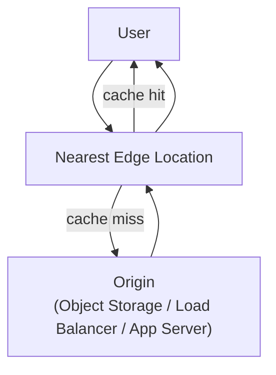

## Definition

A cloud CDN service (Amazon CloudFront, Google Cloud CDN, Azure CDN, Cloudflare) is a managed implementation of the [CDN](/docs/networking/cdn) model, offered as a configurable service that integrates directly with a cloud provider's storage, compute, and security offerings rather than requiring a team to operate distribution infrastructure themselves.

## Why it exists

The core CDN idea — cache content closer to users to cut latency and reduce origin load — requires actually operating points of presence around the world, which is infrastructure far beyond what any individual team would build. Managed cloud CDN services exist so teams get global content distribution as a configurable service layered on top of their existing origin (a storage bucket, a load balancer, an application server) rather than infrastructure they'd have to build themselves.

## The problem it solves

Serving a global user base fast from a single origin location means users far from that origin pay a real latency cost, and the origin has to absorb all traffic itself. A managed CDN solves this by sitting between users and the origin at many global points of presence, with configuration (cache rules, invalidation, edge behavior) exposed as a service rather than infrastructure the team has to run.

## Real-world analogy

If the general CDN idea is having local bakery outposts instead of one central bakery, a *managed cloud* CDN is like using a franchise service that already has outposts built in every city — you just tell them your recipe (origin) and stocking policy (cache rules), and they handle staffing, real estate, and logistics at every location globally.

## Simple explanation

A team points a cloud CDN service at an origin (often an [object storage](/docs/cloud/object-storage) bucket or a load balancer), configures cache rules (what to cache, for how long), and the provider automatically serves cached content from whichever edge location is closest to each user.

## Technical explanation

### Configuration surface

| Setting | Purpose |
|---|---|
| Cache behavior / TTL | How long content is cached at the edge before revalidating with origin |
| Origin | Where the CDN fetches content from on a cache miss |
| Invalidation | Explicitly purging cached content before its TTL expires |
| Edge compute | Running small pieces of logic (e.g. header rewriting, auth checks) at the edge itself |

## Internal working — invalidation and edge compute

Because content is cached at many distributed edge locations, updating or removing it isn't as simple as changing one origin file — an **invalidation** request has to propagate the change out to every relevant edge location, which typically takes some time and, on some providers, incurs a cost per invalidation. Many managed CDNs also now support **edge compute** (lightweight functions running directly at the edge location), letting logic like authentication checks, header rewriting, or A/B test routing happen without a round-trip to the origin — a step further from pure caching toward true [Edge Computing](/docs/cloud/edge-computing).

<Callout type="tip" title="Cache-busting via versioned URLs avoids invalidation entirely">
Rather than invalidating a cached asset when it changes, many teams instead give each version of a static asset a unique URL (e.g. embedding a content hash in the filename) — a new version is simply a new URL that was never cached, avoiding the delay and cost of invalidation altogether, and letting old cached versions expire naturally via TTL.
</Callout>

## Advantages

- No global points-of-presence infrastructure to build or operate — the provider's existing network handles it.
- Tight integration with the rest of the cloud provider's stack (origin storage, load balancers, certificate management, WAF/DDoS protection).
- Increasingly capable edge compute options let some application logic run at the edge, further reducing origin load and latency.

## Disadvantages

- Cache invalidation isn't instantaneous, and aggressive cache settings can serve stale content longer than intended if not carefully managed.
- Cost structure includes both data transfer and (on some providers) per-invalidation-request charges, which can be easy to underestimate.
- Choosing a specific provider's CDN, especially with its edge-compute features, is a further point of integration that increases lock-in with that provider's ecosystem.

## Trade-offs

Using a managed cloud CDN trades some configuration flexibility (compared to operating your own distribution network, which almost nobody does) for effectively zero infrastructure burden and tight integration with the rest of a cloud stack — an easy trade for nearly every team, given how substantial actually operating global points of presence would be.

## Complexity considerations

Fronting a simple static site with a CDN and default cache settings is straightforward. Fine-tuning cache behavior per content type, managing invalidation strategy, and using edge compute for dynamic logic all require more careful, deliberate configuration as needs grow more sophisticated.

## When to use

- Serving static assets (images, scripts, stylesheets) or largely static content to a geographically distributed user base.
- Offloading traffic from an origin server or storage service, both for latency and for cost/scalability reasons.

## When NOT to use

- Highly dynamic, per-user content that can't be meaningfully cached — though even here, some cloud CDNs' edge compute features can still help with logic like auth checks or routing.

## Common mistakes

- Setting overly long TTLs on content that changes frequently, leading to users seeing stale content longer than intended.
- Relying on invalidation for every content update instead of using versioned URLs, incurring unnecessary delay and (on some providers) cost.
- Not configuring the CDN's security features (WAF, DDoS protection) that are often available as part of the same managed service.

## Interview questions

- "How would you design a cache-invalidation strategy for a site with frequently updated static assets?"
- "What's the trade-off between using cache invalidation versus versioned URLs for updating cached content?"
- "What additional capabilities does a managed cloud CDN provide beyond pure content caching?"

## Practical example

A company serves its single-page application's static assets (JavaScript bundles, images) through a managed CDN, with each build producing uniquely hashed filenames — new deployments are immediately available at their new URLs with no invalidation needed, while old cached versions simply expire naturally once their TTL passes.

## Production example

Amazon CloudFront, Google Cloud CDN, Azure CDN, and Cloudflare are widely used managed CDN services, and Cloudflare in particular has expanded well beyond caching into a broader edge-compute and security platform built on the same distributed point-of-presence network.

## Best practices

- Prefer versioned URLs over relying on invalidation for content that changes on every deployment.
- Set cache TTLs deliberately per content type — long for immutable, versioned assets, short (or none) for frequently changing dynamic content.
- Take advantage of the CDN provider's integrated security features (WAF, DDoS protection) rather than treating the CDN purely as a caching layer.

## Summary

Managed cloud CDN services deliver the CDN model as a configurable service integrated tightly with a cloud provider's storage, compute, and security stack, removing the need to operate any distribution infrastructure directly. The main added complexity beyond the core CDN concept is managing cache invalidation and TTL strategy carefully — often best avoided altogether via versioned URLs — and increasingly, deciding how much logic to push out to edge compute rather than leaving purely at the origin.

## References

- AWS documentation: Amazon CloudFront overview
- Cloudflare Learning Center: What is edge computing?

<Quiz questions={[
  {
    q: "Why might a team prefer versioned URLs over cache invalidation when updating a static asset?",
    options: [
      "Versioned URLs are required by all CDN providers",
      "A new version gets a new URL that was never cached, so it's served fresh immediately without waiting for invalidation to propagate or incurring any invalidation cost",
      "Cache invalidation is faster than using versioned URLs",
      "Versioned URLs disable caching entirely"
    ],
    answer: 1,
    explanation: "Since a versioned URL (e.g. one containing a content hash) is brand new, the CDN has never cached it, so requests to it always miss through to origin the first time and get cached fresh from there — avoiding the propagation delay and potential per-request cost of explicitly invalidating a previously cached URL."
  }
]} />
