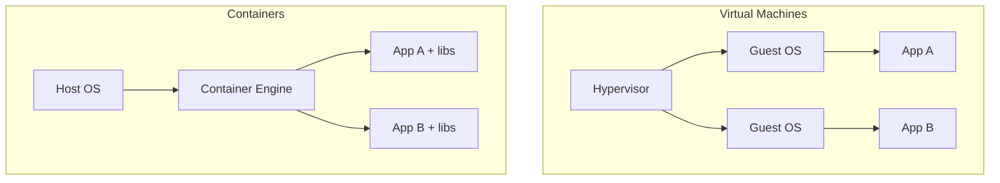

## Definition

A container is a lightweight, isolated unit that packages an application together with its code, runtime, libraries, and configuration, so it runs consistently across any environment that supports the container format — the foundational building block behind [Docker](/docs/cloud/docker) and orchestrators like [Kubernetes](/docs/cloud/kubernetes).

## Why it exists

"It works on my machine" is a real, recurring problem — an application that runs fine in development can fail in production because of a different OS version, a missing library, or a slightly different configuration. Containers exist to eliminate that gap by packaging the exact runtime environment an application needs alongside the application itself.

## The problem it solves

Before containers, deploying an application meant carefully replicating a server's entire environment — installing the right OS packages, runtime versions, and configuration by hand or through fragile scripts, and hoping production matched what was tested in staging. Containers solve this by bundling dependencies into a single portable image, so the same artifact runs identically everywhere.

## Real-world analogy

A container is like a shipping container in global freight: standardized on the outside so any ship, crane, or truck can move it without caring what's inside, while the contents (an application and its dependencies) stay isolated and self-contained. The standardization is what let global shipping scale — the same idea is why containers let software deployment scale.

## Simple explanation

A container packages an application's code, runtime, and dependencies into a single image that runs as an isolated process on any machine with a compatible container engine, without needing a full separate operating system per application.

## Technical explanation

Containers share the host machine's OS kernel but isolate processes, filesystem, and network from one another using kernel features like namespaces (isolation) and cgroups (resource limits) — this is what makes them dramatically lighter weight than virtual machines, which each run a complete, separate guest OS.

A container image is built in layers — a base layer (e.g. a minimal Linux distribution), then successive layers adding a runtime, dependencies, and application code. Layers are cached and shared across images, which is why pulling a new image with a familiar base is often fast.

## Internal working — isolation without a separate kernel

Two Linux kernel mechanisms do the heavy lifting: **namespaces** give a container its own isolated view of processes, network interfaces, and the filesystem (so it can't see or interfere with other containers), while **cgroups** (control groups) limit how much CPU, memory, and I/O a container can consume, preventing one container from starving the others on the same host.

<Callout type="note" title="Containers are not lightweight VMs">
A common misconception is that a container is just a "small VM." It isn't — a container shares the host's kernel directly, while a VM virtualizes hardware and runs a completely separate kernel. This is why containers start in milliseconds and VMs take seconds to minutes, but also why a container provides weaker isolation than a VM: a kernel-level vulnerability can potentially affect every container on a host, whereas a hypervisor-level VM boundary is a stronger security barrier.
</Callout>

## Advantages

- Consistent behavior across development, testing, and production, since the exact runtime and dependencies travel with the application.
- Far lighter weight than virtual machines — containers start in milliseconds and a single host can run many more containers than VMs.
- Portable across any infrastructure (a laptop, on-prem servers, any cloud provider) that supports the container runtime.

## Disadvantages

- Weaker isolation than virtual machines, since containers share the host kernel — a kernel exploit can potentially cross container boundaries.
- Persistent state doesn't fit naturally into containers, which are designed to be ephemeral and stateless — running databases in containers requires deliberate volume management.
- Running many containers at scale introduces real orchestration complexity (scheduling, networking, service discovery), which is exactly what [Kubernetes](/docs/cloud/kubernetes) exists to manage.

## Trade-offs

Containers trade some of a VM's isolation strength for dramatically better density and startup speed — the right trade for most stateless application workloads, but not necessarily for workloads with strict multi-tenant security requirements, where the stronger isolation of a VM (or a VM running containers inside it, as most cloud providers do) may still be warranted.

## Complexity considerations

A single container running a simple app is straightforward. Running many interdependent containers reliably at scale — with service discovery, networking between containers, rolling deployments, and automatic recovery from failures — is a substantial operational undertaking, which is why orchestrators like Kubernetes exist rather than managing containers by hand.

## When to use

- Packaging and deploying applications consistently across development, staging, and production environments.
- Microservices architectures, where each service benefits from being independently packaged, deployed, and scaled.

## When NOT to use

- Workloads with strict security or compliance requirements demanding the stronger isolation boundary of a full virtual machine, unless combined with additional isolation layers (e.g. gVisor, Kata Containers, or a dedicated VM per tenant).

## Common mistakes

- Treating a container like a lightweight VM and running multiple unrelated processes inside one container, instead of one process per container as intended.
- Storing persistent application state directly inside a container's writable layer, then losing it when the container is replaced — persistent data needs an external volume or managed storage service.
- Building bloated images with unnecessary packages, slowing down image pulls and increasing the attack surface unnecessarily.

## Interview questions

- "What's the actual difference between a container and a virtual machine, and when would you choose one over the other?"
- "Why shouldn't you store persistent state directly inside a container?"
- "What Linux kernel features make containers possible, and what do they each provide?"

## Practical example

A team packages a web API, its exact runtime version, and all its dependencies into a container image, then runs that identical image locally for development, in a staging environment for testing, and in production — eliminating an entire class of "it worked in staging" bugs caused by environment drift.

## Production example

Google is widely credited with pioneering large-scale container use internally (via its Borg system) years before Docker made the technology broadly accessible, and container-based deployment is now the default approach for most cloud-native companies, from startups to large enterprises.

## Best practices

- Follow the "one process per container" principle, keeping each container focused on a single responsibility.
- Keep images small and minimal, using slim base images and multi-stage builds to avoid shipping unnecessary build tooling in the final image.
- Treat containers as ephemeral and stateless, pushing any data that needs to persist out to a dedicated volume or managed storage/database service.

## Summary

Containers package an application with its exact runtime and dependencies into a portable, isolated unit that runs consistently across any compatible environment, using kernel namespaces and cgroups for isolation rather than a full separate OS. They're dramatically lighter weight than virtual machines, which makes them ideal for microservices and consistent deployment — but that shared-kernel design means weaker isolation than a VM, and running many containers at scale requires real orchestration, which is where tools like Kubernetes come in.

## References

- Docker documentation: What is a Container?
- Google Cloud: Containers 101

<Quiz questions={[
  {
    q: "Why do containers start in milliseconds while virtual machines take much longer?",
    options: [
      "Containers use faster hardware",
      "Containers share the host machine's kernel instead of booting a completely separate guest OS the way a VM does",
      "Containers don't actually run any code until requested",
      "There's no real difference in startup time"
    ],
    answer: 1,
    explanation: "A container reuses the host's existing kernel and just gets isolated via namespaces and cgroups, so there's no OS boot process — a VM has to boot an entire separate guest operating system on top of virtualized hardware, which takes much longer."
  }
]} />
