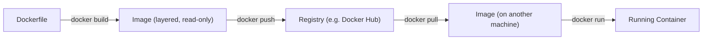

## Definition

Docker is a platform for building, distributing, and running [containers](/docs/cloud/containers) — it standardized the container image format and workflow, turning what was previously a niche Linux kernel feature into a mainstream, developer-friendly tool.

## Why it exists

Container primitives (namespaces, cgroups) existed in the Linux kernel long before Docker, but using them directly required deep systems expertise. Docker exists to make containers accessible to any developer through a simple command-line workflow and a standardized image format, which is a major reason containers went from a niche technique to an industry default.

## The problem it solves

Building and running an isolated, portable process using raw kernel primitives was hard enough that few teams did it. Docker solves this by providing a simple `Dockerfile` format for defining an image, a build process for creating it, and a runtime for running it — plus a registry model (like Docker Hub) for sharing images the same way a package manager shares libraries.

## Real-world analogy

If Linux's container primitives are the raw materials for building a shipping container, Docker is the factory and standardized process that turns those raw materials into a container anyone can build, label, ship, and load onto any compatible ship or truck without custom tooling.

## Simple explanation

Docker lets a developer write a `Dockerfile` describing an application's environment, build that into a portable image, and run that image as a container on any machine with Docker installed — with the same image behaving identically everywhere.

## Technical explanation

A `Dockerfile` specifies a base image, then a sequence of instructions (installing dependencies, copying application code, setting a start command) that Docker executes to build an image, layer by layer. Each instruction typically produces a new, cached layer, so unchanged layers can be reused across builds — which is why ordering instructions from least-to-most frequently changed (dependencies before application code, for instance) speeds up rebuilds significantly.

## Internal working — images, layers, and the container runtime

An image is an immutable, read-only stack of layers; a running container adds a thin writable layer on top for any runtime changes, which is discarded when the container stops (unless a volume is explicitly mounted for persistence). Docker uses a container runtime (historically `containerd`, built on the lower-level `runc`) to actually create the isolated namespaces and cgroups a running container needs — Docker itself is the developer-facing tooling layered on top of that runtime.

<Callout type="tip" title="Multi-stage builds keep production images lean">
A common pattern is a multi-stage `Dockerfile`: an early stage installs build tools and compiles the application, and a final stage copies only the compiled output into a minimal base image, discarding the build tools entirely. This keeps the final production image small and reduces its attack surface, without sacrificing a full-featured build environment during the build itself.
</Callout>

## Advantages

- A simple, standardized workflow (`Dockerfile`, `build`, `push`, `pull`, `run`) that made containers accessible to any developer, not just systems specialists.
- Image layer caching makes builds fast for incremental changes, and layer sharing across images reduces storage and transfer overhead.
- A massive existing ecosystem of pre-built images (via Docker Hub and other registries) for common software, reducing how much needs to be built from scratch.

## Disadvantages

- Docker alone doesn't manage running many containers across multiple machines reliably — that's the job of an orchestrator like [Kubernetes](/docs/cloud/kubernetes).
- Poorly written Dockerfiles (unordered instructions, unnecessary layers, large base images) easily produce bloated, slow-to-build images.
- Running Docker itself requires a daemon with elevated privileges on the host, which is a real security consideration in shared or multi-tenant environments.

## Trade-offs

Docker trades some of the fine-grained control of using kernel primitives directly for a dramatically simpler, more standardized developer workflow — the right trade for the vast majority of teams, who benefit far more from consistency and ease of use than from low-level customization they're unlikely to need.

## Complexity considerations

Writing a basic Dockerfile for a single application is simple. Optimizing image size and build speed (multi-stage builds, careful layer ordering, minimal base images) and managing images securely at scale (vulnerability scanning, registry access control) both require deliberate practice as usage grows.

## When to use

- Packaging any application to run consistently across development, testing, and production.
- Building a portable artifact that a team can hand off to an orchestrator (like Kubernetes) for production deployment.

## When NOT to use

- Extremely resource-constrained or highly specialized environments where even Docker's overhead isn't acceptable and a lower-level container runtime is used directly — a rare case for most application teams.

## Common mistakes

- Writing Dockerfiles with poor instruction ordering, causing unnecessary cache invalidation and slow rebuilds on every small code change.
- Using large, general-purpose base images (a full OS distribution) when a minimal base image would work just as well and produce a much smaller final image.
- Baking secrets (API keys, passwords) directly into an image layer, where they remain recoverable even if later "removed" in a subsequent layer.

## Interview questions

- "Walk through what happens from `docker build` to a running container — what are the layers doing?"
- "Why would you use a multi-stage Dockerfile, and what problem does it solve?"
- "What's the difference between what Docker provides and what Kubernetes provides?"

## Practical example

A team writes a Dockerfile that starts from a minimal base image, installs only the runtime dependencies their application needs, copies in the application code last (so code changes don't invalidate the dependency-installation cache layers), and builds a final image that's pushed to a private registry for their deployment pipeline to pull from.

## Production example

Docker's release in 2013 is widely credited with popularizing containers industry-wide, and Docker Hub remains one of the most widely used container image registries, hosting official images for a huge share of popular open-source software.

## Best practices

- Order Dockerfile instructions from least-to-most frequently changing, so the build cache is used effectively.
- Use multi-stage builds to keep production images minimal, excluding build-time-only tooling.
- Never bake secrets into an image; inject them at runtime via environment variables or a secrets manager instead.

## Summary

Docker standardized building, sharing, and running containers through a simple `Dockerfile`-based workflow, turning kernel-level container primitives into an accessible, everyday developer tool. It handles the single-machine build-and-run experience well, but managing many containers reliably across a fleet of machines is a separate problem — one that orchestrators like Kubernetes are built to solve.

## References

- Docker documentation: Get Started
- Docker documentation: Dockerfile best practices

<Quiz questions={[
  {
    q: "Why does instruction order matter in a Dockerfile?",
    options: [
      "It doesn't matter at all",
      "Docker caches each instruction as a layer, so putting frequently-changing instructions (like copying application code) after rarely-changing ones (like installing dependencies) lets more of the build reuse the cache",
      "Instructions must be alphabetized",
      "Only the last instruction in a Dockerfile actually runs"
    ],
    answer: 1,
    explanation: "Each Dockerfile instruction produces a cached layer, and a cache invalidation at one layer forces every subsequent layer to rebuild. Placing rarely-changing instructions (installing dependencies) before frequently-changing ones (copying application code) means small code changes don't force a full dependency reinstall on every build."
  }
]} />
