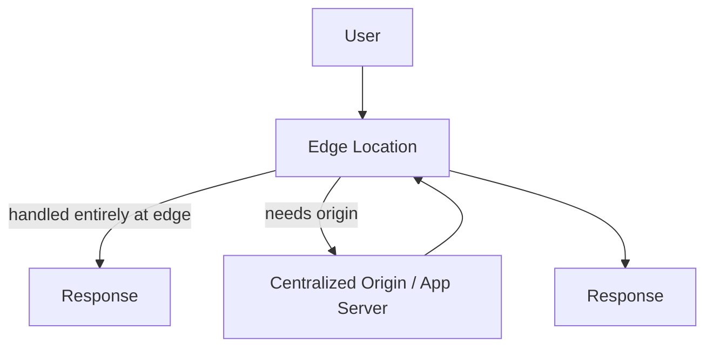

## Definition

Edge computing is the practice of running computation — not just caching static content — at distributed locations physically close to end users or data sources, reducing latency and origin load for logic that would otherwise require a round-trip to a centralized server or data center.

## Why it exists

A [CDN](/docs/cloud/cdn) solves latency for cacheable, static content, but plenty of request logic is dynamic and can't simply be cached — authentication checks, personalization, A/B test routing, or processing data from IoT sensors. Edge computing exists to extend the "run it close to the user" idea from pure content delivery into actual, if lightweight, computation.

## The problem it solves

Sending every request all the way to a centralized origin for even simple, cacheable-adjacent logic (checking a header, redirecting based on geography, validating a token) adds latency that's pure round-trip overhead for logic that doesn't actually need the origin's full compute environment. Edge computing solves this by running that logic at the same distributed points of presence a CDN already uses, avoiding the origin round-trip entirely for anything the edge function can fully handle.

## Real-world analogy

If a CDN is a local bakery outpost stocked with pre-made goods, edge computing is that same outpost also having a small kitchen that can handle simple, quick custom requests (toasting, cutting, light assembly) without needing to send the order back to the central bakery — genuinely fast for the requests it can handle, while anything requiring the full central kitchen still has to go back.

## Simple explanation

Instead of every request necessarily reaching a centralized application server, small, fast functions run directly at edge locations distributed globally, handling logic like authentication checks, header rewriting, or geographic routing locally and only forwarding to the origin when genuinely necessary.

## Technical explanation

Edge functions typically run in lightweight, sandboxed runtimes (often V8 isolates or similarly minimal environments rather than full container or VM startup) specifically so they can start and execute with very low overhead across a huge number of geographically distributed locations. This makes them well-suited to short, fast logic, but genuinely unsuited to anything requiring heavy compute, large dependencies, or persistent state beyond what a fast external store (often a globally distributed key-value store) can provide.

## Internal working — what belongs at the edge vs. the origin

The core design question in edge computing is deciding what logic genuinely benefits from running at every distributed location versus what should stay centralized. Logic that's stateless, fast, and needed on every request (auth token validation, geographic redirects, simple header manipulation) is a strong fit; logic requiring complex business rules, heavy computation, or access to a centralized, strongly consistent data store generally isn't, since replicating that data or logic to every edge location either isn't feasible or reintroduces the very consistency challenges edge computing is trying to avoid for cacheable-adjacent logic.

<Callout type="warning" title="Edge functions trade flexibility for speed and scale">
Edge compute runtimes are deliberately constrained — limited execution time, limited memory, and often no access to arbitrary native dependencies — specifically so they can run cheaply and quickly at a huge number of distributed locations. This isn't a temporary limitation to work around; it's an intentional trade-off. Trying to force heavy, general-purpose application logic into an edge function usually means fighting the platform rather than using it as intended.
</Callout>

## Advantages

- Cuts latency further than caching alone for logic that must run on every request but doesn't need the full origin environment.
- Reduces load on the centralized origin by handling suitable logic entirely at the edge.
- Well-suited to IoT and real-time data processing use cases, where processing data close to its source (rather than shipping it all to a distant central server) meaningfully reduces both latency and bandwidth.

## Disadvantages

- Edge runtimes are intentionally constrained (execution time, memory, available libraries), so not all application logic can move there.
- Debugging and observability across many distributed edge locations is genuinely harder than for a single centralized application.
- Data consistency for anything beyond simple state becomes a real challenge, since maintaining consistent state across many distributed edge locations reintroduces distributed-systems trade-offs (see [CAP Theorem](/docs/fundamentals/cap-theorem)) that a purely centralized system doesn't have to deal with.

## Trade-offs

Edge computing trades the flexibility and full capability of a centralized application environment for lower latency and reduced origin load on the subset of logic that's genuinely suited to running at the edge — the right trade for fast, stateless, per-request logic, but not a wholesale replacement for centralized application servers handling genuinely complex business logic.

## Complexity considerations

Moving a small, well-defined piece of logic (auth checks, redirects) to the edge is relatively straightforward. Deciding architecture-wide what belongs at the edge versus centrally, and managing any state that spans both, requires deliberate, ongoing design work as an application's edge footprint grows.

## When to use

- Fast, stateless, per-request logic needed globally: authentication/authorization checks, geographic routing, A/B test bucketing, header or URL rewriting.
- Real-time processing of data close to its source, such as IoT sensor data that benefits from local pre-processing before being sent to a central system.

## When NOT to use

- Complex business logic requiring heavy computation, large dependencies, or strongly consistent access to centralized data — this remains better suited to a centralized application server.

## Common mistakes

- Trying to run general-purpose application logic in edge functions despite their intentional runtime constraints, fighting the platform rather than using it for what it's designed for.
- Underestimating the difficulty of debugging and tracing issues across many distributed edge locations compared to a single centralized service.
- Introducing state at the edge without carefully considering the consistency trade-offs of replicating or synchronizing that state globally.

## Interview questions

- "What kinds of logic are well-suited to run at the edge, and what kinds aren't?"
- "Why are edge compute runtimes intentionally more constrained than a typical application server environment?"
- "How does maintaining state at the edge reintroduce distributed-systems consistency trade-offs?"

## Practical example

A global SaaS application runs authentication token validation as an edge function: invalid or expired tokens are rejected immediately at whichever edge location received the request, without ever reaching the centralized application servers, while requests with valid tokens are forwarded on for the actual, more complex business logic.

## Production example

Cloudflare Workers, AWS Lambda@Edge (and CloudFront Functions), and Fastly Compute@Edge are widely used edge computing platforms, commonly used for authentication checks, A/B testing logic, and request/response rewriting at global scale.

## Best practices

- Keep edge logic short, stateless, and fast — well within the platform's intentional constraints — rather than trying to replicate full application behavior there.
- Reserve the edge for logic genuinely needed on every request; keep complex business logic centralized.
- If state is genuinely needed at the edge, use a purpose-built globally distributed data store designed for that access pattern, rather than improvising synchronization across locations.

## Summary

Edge computing extends the CDN's "close to the user" principle from pure content caching into actual, lightweight computation, running fast, stateless logic (auth checks, routing, header rewriting) at distributed edge locations to cut latency and reduce origin load further than caching alone. Its intentionally constrained runtime is a deliberate trade-off, well suited to a specific class of fast, stateless logic — but not a wholesale replacement for centralized application servers handling genuinely complex business logic or strongly consistent data access.

## References

- Cloudflare Learning Center: What is edge computing?
- AWS documentation: Lambda@Edge

<Quiz questions={[
  {
    q: "What kind of logic is genuinely well-suited to run at the edge?",
    options: [
      "Any and all application logic, without exception",
      "Fast, stateless logic needed on every request — like authentication checks, geographic routing, or header rewriting — that doesn't require heavy computation or strongly consistent centralized data",
      "Only logic that involves a database write",
      "Nothing — edge computing is purely for static content caching"
    ],
    answer: 1,
    explanation: "Edge runtimes are intentionally constrained (limited execution time, memory, and dependencies) so they can run cheaply and quickly across many distributed locations — this makes them a great fit for fast, stateless, per-request logic, but a poor fit for heavy computation or logic needing strongly consistent centralized data."
  }
]} />
