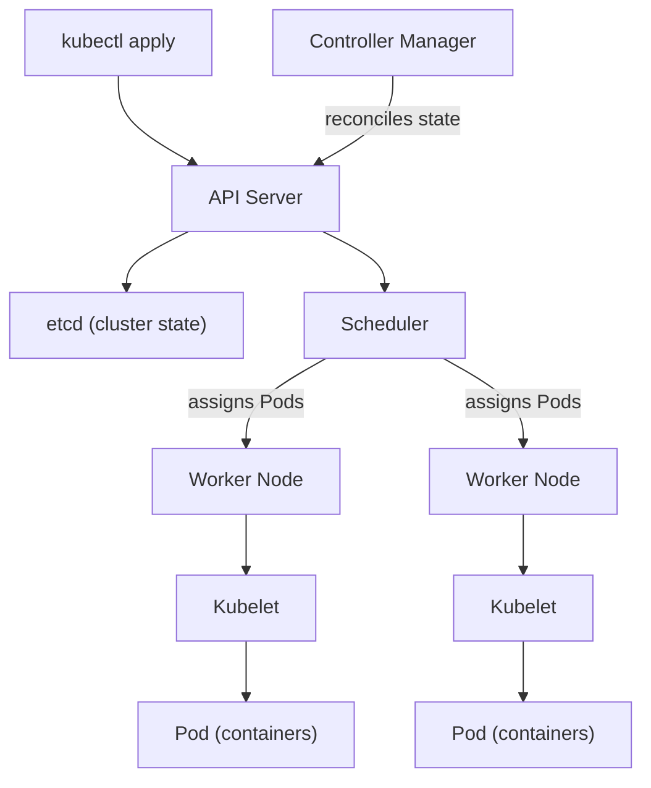

## Definition

Kubernetes (often abbreviated K8s) is an open-source container orchestration platform that automates the deployment, scaling, networking, and self-healing of containerized applications across a cluster of machines, so teams don't have to manage running containers on individual servers by hand.

## Why it exists

[Docker](/docs/cloud/docker) makes it easy to package and run a single container, but running hundreds of containers reliably across many machines — deciding which machine runs which container, restarting failed containers, routing traffic between them, and rolling out updates without downtime — is a genuinely hard distributed systems problem. Kubernetes exists to solve that problem so application teams don't have to solve it themselves.

## The problem it solves

Manually deciding which server runs which container, watching for crashed containers and restarting them, and coordinating rolling updates across a fleet of machines doesn't scale past a handful of containers. Kubernetes solves this by letting teams declare their desired state (how many replicas of a service should run, what resources they need) and continuously reconciling the actual cluster state to match it — automatically rescheduling, restarting, or scaling containers as needed.

## Real-world analogy

Kubernetes is like an air traffic control system for containers: individual pilots (containers) don't decide for themselves which runway to use or when to take off — a central coordinating system assigns resources, handles conflicts, and reroutes around problems, so the whole system stays healthy without every individual unit needing full visibility into everything else.

## Simple explanation

A team tells Kubernetes what they want running (e.g. "3 replicas of this container, each needing this much CPU and memory"), and Kubernetes continuously works to keep that exactly true — scheduling containers onto available machines, restarting ones that crash, and routing network traffic to healthy instances.

## Technical explanation

The **control plane** (API server, scheduler, controller manager, and `etcd` as the source of truth for cluster state) makes all scheduling and reconciliation decisions. Each **worker node** runs a `kubelet` that manages the actual containers on that machine, grouped into **Pods** — the smallest deployable unit in Kubernetes, typically one main container plus any tightly-coupled helper containers.

### Core building blocks

| Object | Purpose |
|---|---|
| Pod | Smallest deployable unit — one or more containers that share network and storage |
| Deployment | Manages a set of replica Pods, handling rolling updates and rollbacks |
| Service | A stable network endpoint that load-balances traffic across a Pod's replicas |
| ConfigMap / Secret | Externalized configuration and sensitive values, kept out of the container image |

## Internal working — the reconciliation loop

Kubernetes's core mechanism is the **control loop**: controllers continuously compare the cluster's actual state (what's really running) against the desired state (declared via YAML manifests, stored in `etcd`), and take action to close any gap — rescheduling a Pod that crashed, spinning up more replicas if the declared count says there should be more, or gradually replacing old Pods with new ones during a rolling update.

<Callout type="warning" title="Kubernetes adds real operational complexity">
Running Kubernetes yourself means operating a genuinely complex distributed system — `etcd` needs to stay healthy and consistent, the control plane needs its own high availability, and networking between Pods across nodes (via a CNI plugin) is a real piece of infrastructure. Most teams below a certain scale are better served by a managed Kubernetes offering (or, below that, no Kubernetes at all) than operating a self-managed cluster.
</Callout>

## Advantages

- Automatic self-healing — crashed containers are restarted and unhealthy ones are replaced without manual intervention.
- Declarative scaling — the number of running replicas can be adjusted (manually or via [Autoscaling](/docs/cloud/autoscaling)) simply by changing a desired count.
- Built-in rolling updates and rollbacks, letting deployments happen without downtime and be reverted quickly if something goes wrong.

## Disadvantages

- A genuinely steep learning curve — Pods, Deployments, Services, Ingress, ConfigMaps, and more all need to be understood to use Kubernetes well.
- Significant operational overhead to run reliably, especially self-managed — which is why most teams use a managed offering rather than operating the control plane themselves.
- Overkill for small applications or teams, where the orchestration Kubernetes provides isn't yet needed and its complexity is pure cost with no corresponding benefit.

## Trade-offs

Kubernetes trades simplicity for powerful, automated orchestration — a trade that pays off once an application or organization has genuinely outgrown manually managing a handful of containers, but one that adds substantial premature complexity for small-scale applications that don't yet need it.

## Complexity considerations

Even using a managed Kubernetes service, teams still need to understand core concepts (Pods, Deployments, Services, resource requests/limits) to configure and operate applications correctly. Networking (Services, Ingress), storage (persistent volumes for stateful workloads), and security (RBAC, network policies) each add further depth that takes real investment to learn well.

## When to use

- Running many containerized services that need reliable scheduling, scaling, self-healing, and rolling deployments across a fleet of machines.
- Organizations already operating at a scale where manual container management has become a genuine bottleneck.

## When NOT to use

- Small applications or early-stage products where a simpler deployment approach (a single server, a basic PaaS, or [Serverless](/docs/cloud/serverless)) meets the need without the orchestration overhead Kubernetes requires.

## Common mistakes

- Adopting Kubernetes before an application or team has actually outgrown simpler deployment options, taking on real operational complexity for no corresponding benefit yet.
- Not setting resource requests and limits on Pods, leading to unpredictable scheduling and one workload starving others on the same node.
- Treating Kubernetes Pods as durable, stateful entities rather than the ephemeral, replaceable units they're designed to be.

## Interview questions

- "What's the difference between a Pod, a Deployment, and a Service in Kubernetes?"
- "How does Kubernetes's control loop keep a cluster in its desired state?"
- "When would you recommend against using Kubernetes for a project?"

## Practical example

A team deploys their API as a Kubernetes Deployment with 5 replicas, fronted by a Service that load-balances incoming traffic across whichever replicas are currently healthy; when a Pod crashes, the Deployment's controller notices the replica count has dropped below 5 and schedules a replacement automatically, with no human intervention needed.

## Production example

Kubernetes originated at Google (based on its internal Borg system) and is now the de facto standard for container orchestration, offered as a managed service by every major cloud provider (Google Kubernetes Engine, Amazon EKS, Azure AKS) specifically because operating the control plane reliably is substantial work most teams would rather not do themselves.

## Best practices

- Use a managed Kubernetes offering rather than self-hosting the control plane, unless there's a specific, deliberate reason not to.
- Always set resource requests and limits on workloads, so the scheduler can make informed placement decisions and one workload can't starve others.
- Treat Pods as ephemeral and stateless; use persistent volumes and managed databases for anything that genuinely needs to survive a Pod being replaced.

## Summary

Kubernetes automates the scheduling, scaling, networking, and self-healing of containerized applications across a cluster, continuously reconciling actual cluster state against a declared desired state. It solves a genuinely hard distributed-systems problem, but that power comes with real complexity — a trade-off that pays off at meaningful scale but is often premature for small applications, which are usually better served by simpler deployment options.

## References

- Kubernetes documentation: Concepts
- Google Cloud: Kubernetes vs. Borg

<Quiz questions={[
  {
    q: "What is the core mechanism Kubernetes uses to keep a cluster healthy?",
    options: [
      "Manual intervention by an operator whenever something breaks",
      "A continuous control loop that compares actual cluster state against the declared desired state and takes action to close any gap",
      "A single upfront configuration that never changes",
      "Kubernetes doesn't monitor cluster state at all"
    ],
    answer: 1,
    explanation: "Kubernetes controllers continuously watch the actual state of the cluster and compare it to the desired state declared in manifests, automatically taking corrective action (like rescheduling a crashed Pod) whenever the two diverge — this reconciliation loop is what makes Kubernetes self-healing."
  }
]} />
