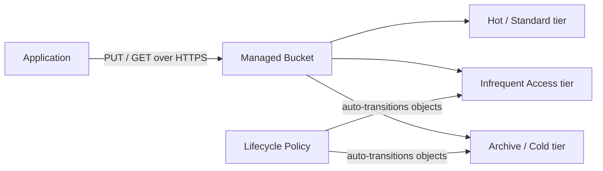

## Definition

Cloud object storage services (Amazon S3, Google Cloud Storage, Azure Blob Storage) are fully managed implementations of the [object storage](/docs/storage/object-storage) model, offered as a pay-as-you-go service with built-in durability guarantees, multiple storage classes for different access patterns, and deep integration with the rest of a cloud provider's ecosystem.

## Why it exists

The object storage model (flat namespace, HTTP API, keys instead of file paths) solves the technical scalability problem, but teams still need someone to actually run that infrastructure — replicating data for durability, handling hardware failures, and scaling storage capacity indefinitely. Managed cloud object storage exists so teams get the model's benefits without operating any of the underlying infrastructure themselves.

## The problem it solves

Running object storage yourself means managing physical or virtual storage infrastructure, replication for durability, and capacity planning — a significant undertaking mostly unrelated to a team's actual product. Managed object storage solves this by offering the same object model as a fully operated service: near-limitless capacity, extremely high durability (often 99.999999999% — "eleven nines" — in provider SLAs), and billing based purely on what's actually stored and transferred.

## Real-world analogy

Running your own object storage is like building and maintaining your own warehouse; using a managed cloud object storage service is like renting space in a professionally run, disaster-proofed logistics facility — you get the same "store it, retrieve it by ID" model, but someone else handles the building, the fire suppression, the redundancy, and the staffing.

## Simple explanation

A team creates a "bucket," uploads objects (files) into it under unique keys, and the cloud provider handles durability, availability, and scaling automatically — billing based on how much is stored, how often it's accessed, and how much data moves out of the service.

## Technical explanation

### Storage classes and lifecycle policies

Cloud object storage typically offers multiple **storage classes** trading retrieval speed and cost against storage cost: a standard/hot tier for frequently accessed data, an infrequent-access tier for data accessed occasionally but needed quickly when it is, and an archive/cold tier for rarely accessed data (backups, compliance retention) where retrieval can take hours in exchange for dramatically lower storage cost. **Lifecycle policies** automate moving objects between tiers (or deleting them) based on age or last-access time, without any application code needing to manage the transition.

## Internal working — durability through replication

Providers achieve their extremely high durability guarantees by automatically replicating each object across multiple physical devices, and often multiple availability zones within a region, so the failure of any single disk or even an entire data center doesn't lose data. This replication is transparent to the application — a `PUT` request returns success only once the object has been durably replicated according to the provider's guarantees.

<Callout type="warning" title="Durability and availability are not the same guarantee">
A provider might guarantee extremely high **durability** (your data won't be lost) while offering a separate, lower **availability** guarantee (the service might be briefly unreachable). Choosing a storage class or region setup should account for both numbers — a system with a strict uptime requirement needs to think about availability separately from whether the underlying data is safe.
</Callout>

## Advantages

- No infrastructure to operate — durability, replication, and scaling are entirely the provider's responsibility.
- Multiple storage classes let teams pay dramatically less for rarely accessed data without managing that trade-off manually.
- Deep integration with the rest of a cloud provider's ecosystem (serverless triggers on upload, CDN origin integration, IAM-based access control).

## Disadvantages

- Cost structure is more complex than a flat monthly fee — storage, requests, and especially data egress (transferring data out) can add up in ways that are easy to underestimate.
- Retrieval from cold/archive tiers can take hours, which is unsuitable for anything needing fast, unpredictable access.
- Choosing a provider means real integration with that provider's broader ecosystem, which is a factor in avoiding excessive vendor lock-in.

## Trade-offs

Managed object storage trades some cost efficiency at extreme, sustained scale (where self-hosting might theoretically be cheaper) for eliminating essentially all operational burden and getting durability guarantees that would be very hard for most teams to replicate on their own.

## Complexity considerations

Uploading and retrieving objects from a single storage class is simple. Designing an effective multi-tier lifecycle policy, controlling access precisely via IAM policies, and managing egress costs carefully all require deliberate design once usage grows.

## When to use

- Storing and serving unstructured data (images, videos, backups, logs, static assets) at any scale, without operating storage infrastructure.
- Data with predictable access-pattern changes over time (frequently accessed when new, rarely accessed later), where lifecycle policies can automatically reduce cost.

## When NOT to use

- Workloads needing fast, low-latency access to structured/relational data — object storage is not a substitute for a database.
- Extremely latency-sensitive retrieval on rarely-accessed data, where an archive tier's multi-hour retrieval time is unacceptable.

## Common mistakes

- Not configuring lifecycle policies, leaving old, rarely accessed data in an expensive hot tier indefinitely.
- Underestimating data egress costs, especially when serving large files directly rather than through a [CDN](/docs/cloud/cdn).
- Setting overly permissive bucket access policies, accidentally exposing data publicly.

## Interview questions

- "How would you design a storage-tiering strategy for a photo-sharing app where older photos are viewed much less often?"
- "What's the difference between durability and availability guarantees in cloud object storage, and why does the distinction matter?"
- "What cost factors beyond raw storage should you account for when choosing an object storage strategy?"

## Practical example

A media company stores newly uploaded videos in a standard/hot storage tier for fast access during their first weeks of high viewership, with a lifecycle policy that automatically moves them to an infrequent-access tier after 30 days and an archive tier after a year — cutting long-term storage costs significantly without any manual intervention as each video ages.

## Production example

Amazon S3, Google Cloud Storage, and Azure Blob Storage are the dominant managed object storage services, each underpinning a huge share of the internet's images, videos, backups, and static web assets, and each commonly paired with a CDN for fast global content delivery.

## Best practices

- Set up lifecycle policies proactively rather than manually managing storage-tier transitions.
- Use the provider's IAM system to grant the narrowest access actually needed, rather than broad or public bucket permissions.
- Pair object storage with a CDN for frequently accessed public content, reducing both latency and direct egress costs from the storage service itself.

## Summary

Managed cloud object storage delivers the object storage model as a fully operated service — near-unlimited capacity, extremely high durability through automatic replication, and multiple storage classes that let cost scale down as access frequency drops. It removes essentially all infrastructure burden from the team using it, but requires deliberate attention to storage-class selection, lifecycle policies, and egress cost to use cost-effectively at scale.

## References

- AWS documentation: Amazon S3 Storage Classes
- Google Cloud: Cloud Storage overview

<Quiz questions={[
  {
    q: "What is the main purpose of a lifecycle policy in cloud object storage?",
    options: [
      "To automatically delete all data after a fixed time regardless of use",
      "To automatically transition objects between storage classes (or delete them) based on age or access pattern, reducing cost without manual intervention",
      "To encrypt data automatically",
      "To increase the durability guarantee of stored objects"
    ],
    answer: 1,
    explanation: "Lifecycle policies automate moving objects to cheaper storage tiers (or removing them) as they age or are accessed less frequently, so cost naturally drops as data becomes less actively used, without requiring any application code to manage the transition."
  }
]} />
