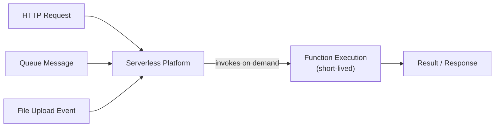

## Definition

Serverless computing is a cloud execution model where the provider fully manages the underlying servers, and application code runs in short-lived, automatically provisioned execution environments — typically triggered by events — with billing based on actual execution time rather than any always-on server capacity.

## Why it exists

Even with [Autoscaling](/docs/cloud/autoscaling), managing servers or containers still involves capacity planning, patching, and paying for some baseline of always-on infrastructure. Serverless exists to remove that entirely for suitable workloads — a developer writes a function, and the provider handles everything about where and how it runs, scaling from zero to many instances and back automatically.

## The problem it solves

Traditional deployments (even autoscaled ones) require thinking about server capacity, patching, and idle cost during low-traffic periods. Serverless solves this for event-driven or intermittent workloads by removing infrastructure management entirely and charging only for actual execution time — there's no cost at all when a function isn't running.

## Real-world analogy

Serverless is like paying for a taxi ride only when you actually take one, instead of owning a car that costs money to maintain and insure whether you drive it or not. You give up some control (you can't customize the taxi), but you also give up all the overhead of ownership for something you use intermittently.

## Simple explanation

A developer writes a function, deploys it to a serverless platform, and the platform automatically runs it in response to triggers (an HTTP request, a message on a queue, a file upload) — spinning up exactly as many instances as needed and charging only for the actual compute time used.

## Technical explanation

Serverless platforms manage the entire execution lifecycle: provisioning an execution environment on demand, running the function, and tearing the environment down afterward. Functions are typically stateless between invocations — any state that needs to persist has to live in an external store (a database, cache, or object storage), since the execution environment itself isn't guaranteed to survive between calls.

## Internal working — cold starts and the concurrency model

When a function hasn't run recently, the platform needs to provision a fresh execution environment before running it — a **cold start** — which adds latency compared to a **warm start**, where an existing, already-initialized environment can be reused. Providers mitigate cold starts through techniques like keeping a small pool of warm instances or offering "provisioned concurrency" for latency-sensitive functions, at an additional cost that offsets some of serverless's pay-per-use benefit.

<Callout type="info" title="Serverless still runs on servers">
"Serverless" doesn't mean there are no servers — it means the developer never has to think about them. The provider still runs and manages physical or virtual servers underneath; the entire point of the model is that this management is abstracted away completely from the person writing and deploying the function.
</Callout>

## Advantages

- Zero infrastructure management — no servers to patch, provision, or right-size.
- True pay-per-use billing — no cost at all during periods with no invocations, unlike an always-on server or container.
- Scales automatically from zero to a very high number of concurrent invocations without any manual capacity planning.

## Disadvantages

- Cold starts introduce latency variability that can be a real problem for latency-sensitive request paths.
- Execution time and resource limits (memory, duration) constrain what kinds of workloads fit well — long-running or resource-intensive tasks often don't fit the model.
- Vendor-specific APIs and behavior can create meaningful lock-in, and debugging/observability across many short-lived, distributed function invocations is genuinely harder than with a long-running server process.

## Trade-offs

Serverless trades infrastructure control and predictable latency for zero operational management and precise pay-per-use billing — an excellent trade for intermittent, event-driven, or highly variable workloads, but a poor one for steady, high-throughput workloads where an always-on, right-sized server would simply be cheaper and more predictable.

## Complexity considerations

A single, simple function responding to one trigger is easy to build and deploy. Complex applications built as many interacting functions introduce real challenges around debugging, tracing requests across function boundaries (see [Tracing](/docs/observability/tracing)), and managing shared state and configuration across a large number of independently deployed functions.

## When to use

- Event-driven workloads with intermittent or unpredictable traffic, where paying for always-on capacity would be wasteful.
- Short-lived, stateless tasks like processing an uploaded file, responding to a webhook, or handling a queue message.

## When NOT to use

- Steady, high-throughput, latency-sensitive workloads, where an always-on, right-sized server or container avoids both cold-start latency and the potentially higher per-invocation cost at high volume.
- Long-running processes that exceed a serverless platform's maximum execution duration.

## Common mistakes

- Using serverless for a steady, high-volume workload where an always-on server would actually be cheaper, without checking the cost crossover point.
- Not accounting for cold-start latency in latency-sensitive user-facing paths.
- Treating a function's local execution environment as durable storage, then losing data when a fresh instance is provisioned for the next invocation.

## Interview questions

- "What's a cold start, and what can be done to reduce its impact on latency-sensitive workloads?"
- "When would serverless actually cost more than a traditional always-on server?"
- "Why is debugging and tracing harder in a serverless architecture made of many small functions?"

## Practical example

An image-processing pipeline uses a serverless function triggered by file uploads to a storage bucket: the function resizes the image and writes the result back to storage, running only when a file is actually uploaded and incurring zero cost during the long stretches when no uploads occur.

## Production example

AWS Lambda, Google Cloud Functions, and Azure Functions are the major cloud providers' serverless platforms, widely used for event-driven processing pipelines, webhook handlers, and lightweight APIs where traffic is intermittent or highly variable.

## Best practices

- Reserve serverless for genuinely event-driven, intermittent, or bursty workloads, and compare cost against an always-on alternative for steady high-volume traffic.
- Keep functions stateless, pushing any state that needs to persist out to an external database, cache, or storage service.
- Use provisioned concurrency (or an equivalent warm-instance strategy) for latency-sensitive functions where cold starts would be unacceptable.

## Summary

Serverless computing lets code run in response to events without any server management, scaling automatically from zero and billing only for actual execution time. It's an excellent fit for intermittent, event-driven, stateless workloads, but cold-start latency, execution limits, and harder observability across many small functions mean it's not the right fit for every workload — particularly steady, high-throughput, latency-sensitive ones, where a traditional server or container often remains the better choice.

## References

- AWS documentation: What is Serverless Computing?
- Martin Fowler: Serverless Architectures

<Quiz questions={[
  {
    q: "What is a 'cold start' in a serverless platform?",
    options: [
      "A permanent failure of the serverless platform",
      "The added latency incurred when the platform has to provision a fresh execution environment for a function that hasn't run recently, as opposed to reusing an already-warm one",
      "A billing term with no effect on performance",
      "A feature that only affects database queries"
    ],
    answer: 1,
    explanation: "When there's no already-initialized environment available to reuse, the platform must provision one from scratch before running the function — this cold start adds latency compared to a warm start where an existing environment handles the invocation immediately."
  }
]} />
