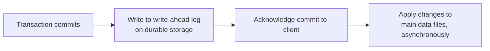

## Definition

ACID is an acronym describing four guarantees a database transaction should provide: **Atomicity** (all-or-nothing), **Consistency** (valid state before and after), **Isolation** (concurrent transactions don't interfere), and **Durability** (once committed, it survives a crash).

## Why it exists

Multiple operations often need to succeed or fail together as a single logical unit — transferring money means both debiting one account and crediting another, and having only one of those happen is a serious bug, not a minor glitch. ACID exists to give applications a formal, dependable guarantee about exactly this kind of multi-step correctness, so developers don't have to hand-roll fragile, error-prone consistency logic themselves.

## The problem it solves

Without ACID guarantees, a crash halfway through a multi-step operation, or two operations running concurrently, can leave a database in a subtly (or badly) corrupted state — money debited from one account but never credited to the other, or two concurrent updates silently overwriting each other. ACID transactions solve this by giving the database, not the application, responsibility for these guarantees.

## Real-world analogy

Think of a bank transfer as a single sealed instruction: "move $100 from Account A to Account B." ACID guarantees that instruction either fully happens (both the debit and credit) or doesn't happen at all (Atomicity) — never a state where the money vanished from A but never arrived at B, even if a power outage hits the bank's computer system exactly halfway through.

## Simple explanation

- **Atomicity**: a transaction's operations either all succeed, or none do — no partial completion.
- **Consistency**: a transaction takes the database from one valid state to another valid state, respecting all defined rules (constraints, foreign keys).
- **Isolation**: concurrent transactions behave as if they ran one at a time, even though they may actually be running simultaneously.
- **Durability**: once a transaction is confirmed committed, it survives a subsequent crash — the data is safely persisted.

## Technical explanation

### Atomicity in practice

```sql
BEGIN TRANSACTION;
UPDATE accounts SET balance = balance - 100 WHERE id = 'A';
UPDATE accounts SET balance = balance + 100 WHERE id = 'B';
COMMIT;
```

If the process crashes after the first UPDATE but before COMMIT, the database's transaction log ensures the entire transaction is rolled back on recovery — Account A's debit is undone, as if the transaction never started at all.

### Isolation levels

Isolation is actually a spectrum, not a single guarantee, because full isolation (as if every transaction ran completely alone) is expensive for performance. Common isolation levels, from weakest to strongest:

| Level | Prevents |
|---|---|
| Read Uncommitted | Nothing much — can read uncommitted changes from other transactions ("dirty reads") |
| Read Committed | Dirty reads |
| Repeatable Read | Dirty reads + non-repeatable reads (a value changing between two reads in the same transaction) |
| Serializable | All anomalies — behaves exactly as if transactions ran one at a time |

<Callout type="note" title="Stronger isolation costs performance">
Serializable isolation gives the strongest guarantee but usually requires more locking or conflict detection, reducing concurrency. Most production systems default to Read Committed as a practical middle ground, opting into stricter isolation only for specific operations that truly need it.
</Callout>

## Internal working — how durability is actually achieved



Databases typically use a **write-ahead log (WAL)**: changes are written to a durable, sequential log *before* being acknowledged as committed, so even if the database crashes before the main data files are updated, it can replay the log on recovery to reconstruct the correct final state.

## Advantages

- Removes an entire class of data corruption bugs (partial writes, lost updates from concurrent access) from application-level responsibility, pushing it into well-tested database internals.
- Makes reasoning about correctness of multi-step operations far simpler for application developers.

## Disadvantages

- Strong isolation and durability guarantees have a real performance cost — more locking, more logging, less raw throughput than weaker consistency models.
- ACID transactions across multiple, separately-owned databases (as in a microservices architecture, one database per service) are hard to achieve directly — this is why patterns like the [Saga Pattern](/docs/microservices/saga-pattern) exist for distributed transactions.

## Trade-offs

Stronger ACID guarantees (especially serializable isolation) cost throughput and concurrency; weaker guarantees allow more concurrent throughput at the risk of specific, well-understood anomalies (like non-repeatable reads) that the application must be designed to tolerate or avoid.

## Complexity considerations

ACID transactions within a single database are well-understood, mature technology. ACID-like guarantees *across* multiple independently-owned databases or services are a much harder distributed systems problem, generally addressed with different techniques (two-phase commit, sagas) rather than a direct extension of single-database ACID.

## When to rely heavily on ACID

- Financial transactions, inventory management, booking systems — anything where a partially-completed operation or a lost concurrent update causes real business or safety harm.

## When weaker guarantees are acceptable

- High-throughput analytics or logging systems where occasional minor inconsistency is a non-issue, and the performance cost of strict ACID guarantees isn't justified.

## Common mistakes

- Assuming ACID transactions automatically extend across multiple databases or microservices — they generally don't, without additional distributed transaction patterns.
- Using the strongest isolation level (Serializable) everywhere "to be safe," paying a real throughput cost even where a weaker level would have been entirely sufficient.
- Forgetting that "Consistency" in ACID refers to application-defined validity rules (like constraints), a different concept from "Consistency" in the [CAP theorem](/docs/fundamentals/cap-theorem), which refers to replicas agreeing on the latest value — a common and understandable point of confusion since both use the same word.

## Interview questions

- "Walk me through what atomicity actually guarantees if a transaction fails halfway through."
- "What's the trade-off between different isolation levels?"
- "How would you achieve transactional-like guarantees across multiple microservices, each with its own database?"

## Practical example

A hotel booking system uses a single ACID transaction to both mark a room as booked and charge the customer's payment method — atomicity guarantees these either both happen or neither does, preventing the specific (and business-critical) failure mode of charging a customer for a room that was never actually reserved.

## Production example

Traditional relational databases (PostgreSQL, MySQL with InnoDB) are widely chosen for financial and e-commerce systems specifically for their mature, well-tested ACID transaction support — Stripe's core ledger systems, for example, rely heavily on this kind of transactional integrity.

## Best practices

- Use transactions for any operation that involves multiple related writes that must succeed or fail together.
- Choose the isolation level deliberately based on the actual correctness needs of each specific operation, rather than defaulting blindly to the strongest (or weakest) option everywhere.
- For distributed transactions across multiple services, look at established patterns (Saga, two-phase commit) rather than assuming single-database ACID guarantees extend automatically.

## Summary

ACID (Atomicity, Consistency, Isolation, Durability) describes the guarantees a database transaction provides: all-or-nothing execution, valid state transitions, protection from concurrent interference, and durability against crashes. These guarantees remove a large class of data corruption risk from application code, at a real, tunable performance cost via isolation levels — and generally don't extend automatically across multiple, separately-owned databases without additional distributed transaction patterns.

## References

- Designing Data-Intensive Applications, Martin Kleppmann (Ch. 7)
- Gray, J. "The Transaction Concept: Virtues and Limitations" (1981)

<Quiz questions={[
  {
    q: "Why do databases typically write to a write-ahead log before acknowledging a transaction as committed?",
    options: [
      "To make the transaction run faster",
      "So that if the database crashes before applying changes to the main data files, it can replay the log to recover the correct state - guaranteeing durability",
      "It's purely a legacy convention with no real benefit",
      "To support the Isolation guarantee specifically"
    ],
    answer: 1,
    explanation: "The write-ahead log is durably persisted before commit is acknowledged, so even a crash immediately after doesn't lose the transaction — recovery replays the log to reach the correct final state, which is exactly what Durability guarantees."
  }
]} />
