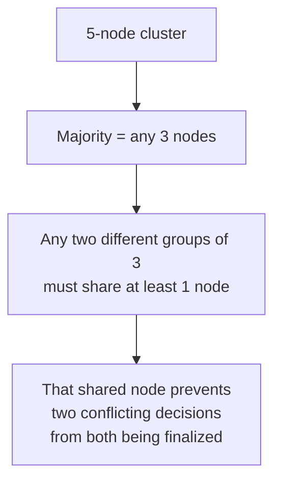
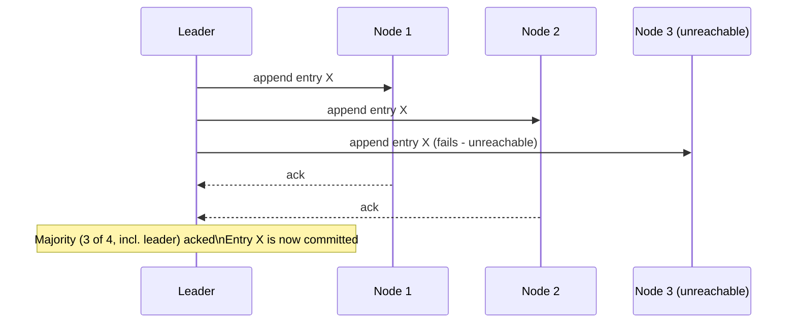

## Definition

Consensus is the problem of getting a group of distributed nodes — which can fail, and which communicate over an unreliable network — to agree on a single value or decision, in a way that all correctly-functioning nodes end up agreeing on the same outcome.

## Why it exists

Many distributed systems problems reduce to "everyone needs to agree on one thing": which node is the current leader, whether a transaction committed or aborted, what the next value in a replicated log is. Doing this correctly, when nodes can crash and messages can be delayed or lost, turns out to be a deep and non-obvious problem — consensus algorithms exist because getting this wrong silently (two nodes disagreeing about the "agreed" outcome) can corrupt an entire distributed system.

## The problem it solves

Without a rigorous consensus protocol, naive approaches to "everyone agree on X" break down under real failure conditions — a node might crash mid-vote, a message might arrive late and be mistaken for a new event, or a network partition might let two different groups of nodes each believe they've reached agreement on two different values (a serious correctness violation). Consensus algorithms like Raft and Paxos formally solve this, with proven correctness guarantees even under these failure modes.

## Real-world analogy

Imagine a group of people trying to agree, by shouting across a large, noisy room, on what time to meet tomorrow — some voices get lost in the noise, some people mishear a reply and act on the wrong information, and a couple of people briefly walk out of earshot entirely partway through. A working consensus protocol is like a carefully designed process (raise your hand, speak once confirmed by a majority, wait for enough confirmations before considering the decision final) that guarantees, despite all that chaos, everyone still ends up agreeing on the exact same meeting time — or, if agreement genuinely can't be reached yet, nobody prematurely acts as if it has been.

## Simple explanation

A consensus protocol lets a cluster of nodes agree on a value even if some nodes fail or messages are delayed, typically by requiring a **majority (quorum)** of nodes to agree before a decision is considered final — this way, even if some nodes are unreachable, the group can still make progress as long as a majority is available, and no minority group can independently reach a conflicting decision.

## Technical explanation

### Why "majority" matters

Requiring a majority (not just any two nodes, and not all nodes) to agree ensures that two different, conflicting majorities can never exist simultaneously in the same cluster — any two majority groups out of the same total set must overlap by at least one node, and that shared node prevents both groups from reaching contradictory decisions independently.

### Raft (a widely-used, more understandable consensus algorithm)

Raft breaks consensus into three sub-problems, specifically designed to be more approachable than the earlier Paxos algorithm:

- **Leader election**: nodes vote to elect a single leader for a given term; if the leader fails, a new election happens.
- **Log replication**: the leader appends new entries to a replicated log and confirms them once a majority of nodes have acknowledged the entry.
- **Safety**: rules ensuring that even after leader changes, a value once considered "committed" (acknowledged by a majority) can never be lost or overwritten.

See [Raft](/docs/distributed-systems/raft) for a deeper look at this specific algorithm.

## Internal working — the commit process

Even with one node unreachable, the entry is safely committed once a majority has acknowledged it — this is exactly what lets consensus-based systems keep making progress despite partial failures, as long as a majority remains available.

## Advantages

- Provides a formally proven way for a distributed system to make safe, agreed-upon decisions even when some nodes fail or the network is unreliable.
- Enables critical building blocks like reliable leader election and strongly consistent replicated logs.

## Disadvantages

- Requires a majority of nodes to be available and reachable to make any progress at all — a cluster that loses more than half its nodes (or is split by a partition into groups, none of which is a majority) can't make new decisions until enough nodes recover or reconnect.
- Consensus protocols add real latency (multiple round trips to gather a majority) compared to a naive, unsafe single-node decision.
- Correctly implementing a consensus algorithm from scratch is notoriously difficult and error-prone — nearly all production systems use a well-tested existing implementation (etcd, ZooKeeper) rather than building their own.

## Trade-offs

Consensus trades availability (a cluster can't make progress without a majority) for strong correctness guarantees — this is precisely why consensus-based systems are inherently CP, not AP, in [CAP theorem](/docs/fundamentals/cap-theorem) terms: they explicitly choose consistency over availability during a partition, by design.

## Complexity considerations

Implementing consensus correctly is genuinely one of the hardest problems in distributed systems — subtle bugs in a from-scratch implementation can cause rare but catastrophic correctness violations. This is why the strong, near-universal recommendation is to use a mature, battle-tested implementation (etcd, ZooKeeper, Consul) rather than building one.

## When to use

- Leader election in a distributed system (deciding, safely, which node is currently "in charge").
- Distributed configuration management and coordination (etcd and ZooKeeper are widely used specifically for this).
- Any scenario requiring a strongly consistent, agreed-upon single source of truth across a cluster of unreliable nodes.

## When NOT to use

- Data or decisions that can tolerate eventual consistency and don't need strict agreement — using a full consensus protocol where simpler eventual consistency would suffice adds unnecessary latency and availability constraints.

## Common mistakes

- Attempting to implement a consensus algorithm from scratch rather than using a mature, proven implementation — an extremely error-prone undertaking given how subtle the correctness requirements are.
- Not accounting for the availability trade-off — a system depending on consensus can't make progress if it loses majority availability, and this needs to be planned for (e.g. deploying an odd number of nodes across enough independent failure domains).
- Confusing consensus (agreeing on a single value/decision) with simple replication (copying data) — they're related but address different problems; leader-follower replication, for instance, doesn't require a full consensus protocol the way multi-node leader election does.

## Interview questions

- "Why does a consensus protocol typically require a majority, rather than just any two nodes, to agree?"
- "What happens to a consensus-based cluster if it loses more than half its nodes?"
- "Why would you use an existing implementation like etcd rather than building your own consensus protocol?"

## Practical example

A distributed system needing reliable leader election (e.g. deciding which node runs a specific singleton background job) typically uses etcd or ZooKeeper — both built on proven consensus algorithms — rather than attempting to implement leader election with simpler, ad-hoc coordination logic that could suffer from split-brain under real failure conditions.

## Production example

Kubernetes uses etcd (built on the Raft consensus algorithm) as its backing store for cluster state specifically because it needs a strongly consistent, reliably agreed-upon source of truth about the cluster's configuration, even as individual nodes in the etcd cluster itself may fail or become temporarily unreachable.

## Best practices

- Use a mature, widely-adopted consensus implementation (etcd, ZooKeeper, Consul) rather than building one from scratch.
- Deploy an odd number of nodes (3, 5, 7) across independent failure domains, so majority calculations are well-defined and a single failure domain's outage doesn't itself take out a majority.
- Reserve consensus specifically for decisions that genuinely require strong, agreed-upon correctness — not as a default coordination mechanism for data that could tolerate eventual consistency instead.

## Summary

Consensus is the formally hard problem of getting a group of unreliable, distributed nodes to agree on a single value or decision, typically solved by requiring a majority (quorum) to agree before a decision is final — guaranteeing no two conflicting decisions can both be reached. It's the foundation for reliable leader election and strongly consistent coordination, at the cost of requiring majority availability to make any progress, and should be built on mature, existing implementations rather than attempted from scratch.

## References

- Lamport, L. "The Part-Time Parliament" (Paxos, 1998)
- Ongaro & Ousterhout, "In Search of an Understandable Consensus Algorithm" (Raft, 2014)

<Quiz questions={[
  {
    q: "Why does a consensus protocol typically require a majority of nodes to agree, rather than a simple minority?",
    options: [
      "It's an arbitrary convention with no real reason",
      "Any two majority groups from the same set of nodes must overlap by at least one node, which prevents two conflicting decisions from both being finalized independently",
      "Majorities are always faster to coordinate",
      "It has nothing to do with correctness"
    ],
    answer: 1,
    explanation: "Requiring a majority guarantees that any two groups large enough to be considered a majority must share at least one common node — that overlap is exactly what prevents the cluster from ever finalizing two different, conflicting decisions simultaneously."
  }
]} />
