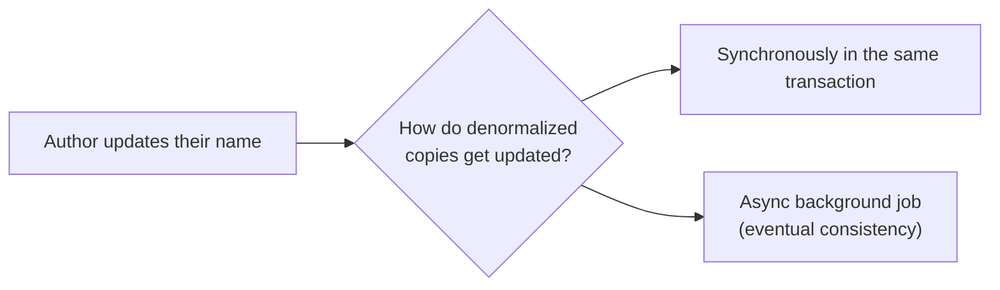

## Definition

Denormalization is the deliberate practice of introducing redundant data (duplicating information across tables, or combining what would normally be separate tables) to make reads faster, at the cost of the write-safety benefits [Normalization](/docs/databases/normalization) provides.

## Why it exists

A fully normalized schema can require many joins to reconstruct commonly needed views of data, and joins across large tables have a real performance cost. Denormalization exists to trade some of that normalized write-safety for meaningfully faster, simpler reads — worthwhile specifically when a system is heavily read-dominant and the redundant data's update frequency is manageable.

## The problem it solves

A read-heavy application repeatedly joining the same five tables to render a single page (e.g. "show a blog post with its author's name and their follower count") pays that join cost on every single request. Denormalization solves this by pre-computing or duplicating the needed data into a single, flatter structure, so a common read becomes a single lookup instead of a multi-table join.

## Real-world analogy

Instead of looking up an author's name in a separate reference book every single time you read one of their articles, a denormalized approach is like printing the author's name directly on every article page — a bit of redundant information (their name appears on every one of their articles) in exchange for never needing to flip to a separate book to find out who wrote it.

## Simple explanation

Denormalization intentionally stores the same piece of data in more than one place, or combines related data into a single table, specifically so a common read query doesn't need to join across multiple tables to get its answer.

## Technical explanation

### A denormalization example

**Normalized:**
```
posts:   post_id, title, author_id (FK)
authors: author_id, name, follower_count
```
Reading a post with its author's name requires a join.

**Denormalized:**
```
posts: post_id, title, author_id, author_name, author_follower_count
```
The author's name and follower count are duplicated directly onto each post — reading a post is now a single-table lookup, at the cost of needing to update every post row if the author's name or follower count changes.

## Internal working — keeping denormalized data in sync

The central challenge of denormalization is that duplicated data must be kept consistent whenever the source of truth changes — typically handled via:

- **Application-level updates**: the application explicitly updates all denormalized copies whenever the source changes.
- **Database triggers**: automatically propagate a change to denormalized copies within the database itself.
- **Asynchronous background jobs**: eventually reconcile denormalized copies, often used when perfect real-time consistency across the copies isn't required.



## Advantages

- Dramatically faster reads for common access patterns, since the needed data is already assembled in one place.
- Reduces load on the database for read-heavy workloads by avoiding repeated expensive joins.

## Disadvantages

- Reintroduces the update anomaly risk normalization was designed to prevent — the same fact now exists in multiple places and must be kept in sync.
- Adds real complexity in keeping denormalized copies consistent, especially as more places contain the duplicated data.
- Increases storage usage, since the same data now exists redundantly.

## Trade-offs

Denormalization directly trades write simplicity and data integrity (normalization's strengths) for read performance — a clearly worthwhile trade for heavily read-dominant workloads with a manageable rate of change to the duplicated data, and a poor trade for write-heavy data or data that changes so frequently that keeping copies in sync becomes a constant burden.

## Complexity considerations

Denormalizing a small number of specific, well-understood read paths (e.g. one materialized view for a dashboard) is manageable. Broadly denormalizing an entire schema significantly increases the surface area of "things that must be kept in sync," and can become a genuine maintenance burden if not carefully scoped.

## When to use

- Read-heavy systems where the same expensive join is executed extremely frequently, and the underlying data doesn't change often enough to make keeping copies in sync a significant burden.
- Reporting/analytics systems, which often use deliberately denormalized (or fully flattened, star-schema) structures specifically optimized for read performance over write efficiency.

## When NOT to use

- Data that changes frequently, where keeping many denormalized copies in sync would itself become a significant, ongoing engineering and correctness burden.
- Systems where data correctness (no risk of denormalized copies drifting out of sync) matters more than read performance.

## Common mistakes

- Denormalizing prematurely, before actually measuring that normalized joins are a real performance bottleneck.
- Not building a reliable mechanism to keep denormalized copies in sync, leading to silently stale or contradictory duplicated data over time.
- Denormalizing broadly across an entire schema rather than scoping it to the specific, measured read paths that actually benefit.

## Interview questions

- "You have a normalized schema and a specific read query is too slow due to joins — how would you denormalize to address it, and what does that cost you?"
- "How would you keep a denormalized copy of data in sync with its source of truth?"
- "When would you choose caching instead of denormalization to solve a similar read-performance problem?"

## Practical example

A social media feed pre-computes and stores a denormalized "feed item" containing the post text, author name, and author avatar URL together, rather than joining posts, authors, and profile-image tables on every single feed render — a common technique (sometimes as a materialized view, sometimes as an explicitly maintained denormalized table) for feed-heavy applications.

## Production example

Many large-scale systems maintain deliberately denormalized "read models" specifically for high-traffic read paths, often built and kept up to date via the [CQRS pattern](/docs/messaging/cqrs) — separating a normalized write model from one or more denormalized, read-optimized models updated asynchronously from the same underlying events.

## Best practices

- Denormalize deliberately, scoped to specific, measured read bottlenecks — not preemptively across an entire schema.
- Build a reliable, well-tested mechanism (synchronous update, trigger, or async job) to keep denormalized copies in sync, and monitor for drift.
- Consider caching as an alternative or complement to denormalization when the goal is purely reducing repeated computation, rather than restructuring the schema itself.

## Summary

Denormalization deliberately reintroduces data redundancy to speed up reads, trading away some of normalization's write-safety and consistency guarantees. It's a worthwhile, targeted trade for specific, measured read-heavy bottlenecks — and a real maintenance burden if applied broadly or to data that changes too frequently to keep the redundant copies reliably in sync.

## References

- Designing Data-Intensive Applications, Martin Kleppmann (Ch. 3, on derived data)

<Quiz questions={[
  {
    q: "What's the main risk introduced by denormalizing data?",
    options: [
      "Slower read queries",
      "The duplicated data can drift out of sync with its source of truth if not carefully maintained",
      "It makes the database unable to store data at all",
      "It has no real risk"
    ],
    answer: 1,
    explanation: "Since denormalization stores the same fact in multiple places, keeping all those copies consistent whenever the underlying data changes becomes a real, ongoing engineering responsibility — miss an update path, and the copies silently diverge."
  }
]} />
