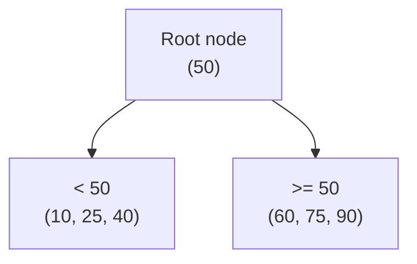
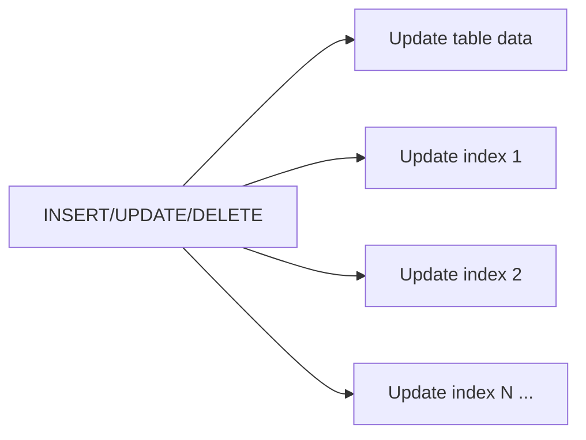

## Definition

A database index is a separate data structure that lets the database find specific rows quickly, without scanning every row in a table — trading some extra storage and write overhead for dramatically faster reads on the indexed columns.

## Why it exists

Without an index, finding a specific row requires a **full table scan** — checking every single row to see if it matches — which is fine for a table with a hundred rows and prohibitively slow for one with a hundred million. Indexing exists to let a database jump close to directly to the relevant rows, the same way a book's index lets you jump to the right page instead of reading the whole book to find a topic.

## The problem it solves

As tables grow, query performance for anything relying on a full scan degrades linearly (or worse) with table size — a query that took 10ms on a small table might take 10 seconds on a table 1000x larger. Indexing solves this by maintaining a structure that keeps lookup time close to constant (or logarithmic) regardless of table size.

## Real-world analogy

A book's index (the actual paper kind) lets you find every mention of "consistent hashing" by looking up one entry and jumping straight to the relevant pages, instead of reading the entire 400-page book cover to cover. The book's index took extra work to compile and takes extra pages in the book (overhead) — but it makes a specific kind of lookup (find a topic) vastly faster.

## Simple explanation

A database index is built on one or more columns, and lets the database look up rows matching a value in those columns quickly, instead of scanning the whole table. It doesn't speed up every query — only ones that can actually use it (typically, filtering or sorting on the indexed columns).

## Technical explanation

### B-tree indexes (the most common type)

Most relational databases default to a **B-tree** index — a balanced tree structure that keeps values sorted and allows lookups, range queries, and sorted retrieval in logarithmic time relative to table size.

A lookup for value 75 starts at the root, immediately knows to go right (since 75 ≥ 50), and continues narrowing down — reaching the target in a small number of steps even across millions of rows, rather than checking every one.

### Other index types

- **Hash index**: extremely fast for exact-match lookups, but doesn't support range queries or sorting.
- **Composite index**: an index across multiple columns together, useful for queries filtering on that specific combination.
- **Full-text index**: optimized for searching within text content, rather than exact or range matches.

## Internal working — the write cost of an index

Every index has to be updated whenever a row is inserted, updated, or deleted — so **each additional index adds write overhead**, since the database must maintain that structure in sync with the actual table data on every write.

This is the central trade-off of indexing: more indexes make reads faster but writes slower, since every write now has more structures to keep in sync.

## Advantages

- Turns full-table-scan queries (O(n)) into near-instant, logarithmic-time lookups (O(log n)) for indexed columns.
- Enables efficient sorting and range queries when the index matches the query's ordering/filtering needs.

## Disadvantages

- Every index adds write overhead (slower inserts/updates/deletes) and storage overhead.
- An index that doesn't match how the data is actually queried provides no benefit while still incurring its write cost — a common source of wasted overhead.
- Too many indexes on a heavily-written table can noticeably degrade write throughput.

## Trade-offs

Indexing is fundamentally a read/write trade-off: more indexes, faster reads on those specific columns, slower writes overall. The right number and choice of indexes depends entirely on the actual read/write ratio and query patterns of a specific table — a write-heavy table with rarely-used complex queries needs far fewer indexes than a read-heavy one.

## Complexity considerations

Adding a straightforward single-column index is simple. Designing the *right* composite indexes for a table with many different query patterns — deciding column order, which combinations of filters actually benefit, and whether an index is even being used by the query planner — requires real analysis (often via the database's query execution plan output) rather than guesswork.

## When to add an index

- Columns frequently used in WHERE clauses, JOIN conditions, or ORDER BY clauses on tables large enough that a full scan is measurably slow.
- Foreign key columns, which are very commonly joined on.

## When NOT to add an index

- Columns rarely queried, or on very small tables where a full scan is already fast enough that an index provides negligible benefit while still costing write overhead.
- Tables with extremely high write volume and low read volume, where the write cost of maintaining many indexes may outweigh any read benefit.

## Common mistakes

- Indexing every column "just in case," adding unnecessary write overhead for indexes that queries never actually use.
- Not checking the query planner's actual execution plan, and assuming an index is being used when it isn't (e.g. due to a function applied to the column in the WHERE clause, which can prevent standard index usage).
- Forgetting that a composite index's column order matters — an index on `(a, b)` doesn't help a query filtering only on `b` alone nearly as much as one filtering on `a`, or on both `a` and `b` together.

## Interview questions

- "This query is slow on a large table — what would you check first?" (Good answer: check the query plan for a full table scan, then consider adding an index on the filtered/joined columns.)
- "What's the cost of adding an index, and why wouldn't you just index every column?"
- "How would you decide the column order for a composite index?"

## Practical example

In the [URL Shortener case study](/docs/case-studies/url-shortener), an index on `short_code` (the primary access pattern for redirects) is essential — without it, every redirect would require scanning the entire URLs table, which becomes catastrophically slow as the table grows to billions of rows.

## Production example

Most production relational databases (Postgres, MySQL) provide `EXPLAIN` / `EXPLAIN ANALYZE` commands specifically so engineers can inspect whether a given query is actually using an index or falling back to a full table scan — a standard, essential tool in diagnosing slow queries in real systems.

## Best practices

- Index columns used in frequent WHERE, JOIN, and ORDER BY clauses on tables large enough to matter.
- Regularly review query execution plans on slow queries rather than guessing at what indexes are needed.
- Avoid indexing columns that are rarely queried or on tables small enough that a full scan is already fast, since every index has an ongoing write cost.

## Summary

An index is a separate structure (typically a B-tree) that lets a database find rows quickly without a full table scan, at the cost of extra storage and slower writes (since every index must be kept in sync on every insert/update/delete). The right indexing strategy depends on actual query patterns and read/write ratio — index what's frequently queried, and avoid indexing what isn't.

## References

- Designing Data-Intensive Applications, Martin Kleppmann (Ch. 3)
- Use the Index, Luke! (use-the-index-luke.com)

<Quiz questions={[
  {
    q: "Why doesn't it make sense to add an index to every column in a table?",
    options: [
      "Databases only allow one index per table",
      "Every index adds write overhead (it must be updated on every insert/update/delete) and storage cost, which isn't worth paying for columns that are rarely queried",
      "Indexes only work on numeric columns",
      "Indexes make reads slower"
    ],
    answer: 1,
    explanation: "Indexing is a read/write trade-off — each additional index speeds up reads on that column but slows down every write to the table, since the index must be kept in sync with the actual data."
  }
]} />
