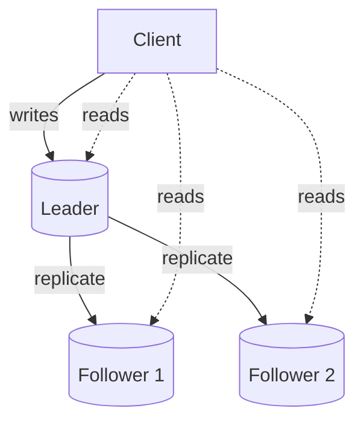
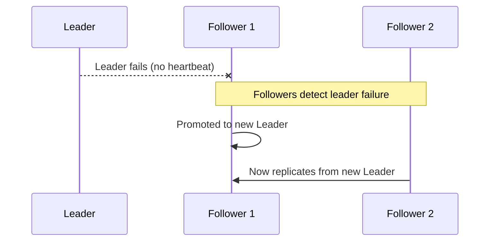

## Definition

Leader-follower (also called primary-replica or master-slave) is a replication topology where a single node — the leader — accepts all writes, and one or more follower nodes replicate the leader's data and can serve read traffic.

## Why it exists

Coordinating writes across multiple nodes that could each independently accept writes is a genuinely hard distributed systems problem (see [Multi-leader](/docs/databases/multi-leader) replication for what that entails). Leader-follower sidesteps most of that difficulty by having exactly one node responsible for deciding the order of all writes — a much simpler model to reason about and implement correctly.

## The problem it solves

If any node could accept writes independently, two nodes might accept conflicting writes to the same piece of data at nearly the same moment, requiring some way to resolve the conflict afterward. By having a single leader as the sole source of truth for write ordering, leader-follower replication avoids that conflict entirely — there's only ever one authoritative sequence of writes.

## Real-world analogy

A single air traffic control tower coordinating all planes landing at an airport (the leader) is far simpler to reason about than multiple independent towers all trying to coordinate the same runways simultaneously. The single tower doesn't do all the physical work itself — other systems (followers) can watch and relay information — but it alone decides the authoritative sequence of events.

## Simple explanation

`Client writes → Leader → replicated to Followers`. `Client reads → can go to Leader or any Follower`. The leader is the single source of truth for write order; followers are (typically asynchronously) kept in sync and can offload read traffic from the leader.

## Technical explanation

Followers typically replicate the leader's **write-ahead log** (see [ACID](/docs/databases/acid)) — replaying the same sequence of changes the leader itself applied, keeping their data consistent with the leader (subject to replication lag, if replication is asynchronous — see [Replication](/docs/databases/replication)).

## Internal working — failover

If the leader fails, one of the followers must be promoted to become the new leader — this process needs careful handling:

A robust failover process must: detect the failure reliably (not too eagerly, or a temporary network blip could trigger an unnecessary failover), ensure only one follower is promoted (avoiding "split brain," where two nodes both believe they're the leader), and redirect write traffic to the new leader.

## Advantages

- Simple, well-understood model — a single authoritative write path avoids write-conflict resolution entirely.
- Scales read throughput by adding more followers.
- Improves availability and durability, since data exists on multiple nodes.

## Disadvantages

- Write throughput is still limited by a single leader's capacity — leader-follower replication scales reads, not writes (for that, see [Sharding](/docs/databases/sharding)).
- The leader remains a single point of failure for writes until a follower is promoted — there's a real window of write unavailability during failover.
- Failover, if not automated and well-tested, can be risky — a botched failover can cause data loss (if the promoted follower was behind) or split-brain (if the old leader comes back online and both nodes think they're in charge).

## Trade-offs

Leader-follower trades write scalability (still bottlenecked by one node) for simplicity and safety compared to multi-leader alternatives — a good default choice for the vast majority of systems, where read scaling (not write scaling) is the more common and pressing need.

## Complexity considerations

Basic leader-follower replication is supported natively and well-understood in most production databases. The harder part in practice is building (and regularly testing) reliable, automated failover — an untested manual failover process is a common source of extended outages when the leader actually does fail in production.

## When to use

- The default choice for the vast majority of systems needing replication — read-heavy workloads where a single leader can still handle the actual write volume comfortably.

## When it's not sufficient

- Workloads where write throughput itself (not just reads) needs to scale past a single machine's capacity — this requires [Sharding](/docs/databases/sharding) instead (or in addition).
- Systems requiring writes to be accepted in multiple, geographically distant regions simultaneously with low latency in each — this pushes toward [Multi-leader](/docs/databases/multi-leader) replication instead, accepting its added complexity.

## Common mistakes

- Not automating and regularly testing failover, leading to a risky, slow, manual process during an actual production incident.
- Routing all reads to followers without accounting for replication lag, causing users to see stale data shortly after their own writes (see [Replication](/docs/databases/replication) for this specific issue).
- Assuming leader-follower solves write scaling — it doesn't; it only distributes read load, while all writes still funnel through one leader.

## Interview questions

- "What happens to write availability during the window between the leader failing and a follower being promoted?"
- "How would you avoid split-brain during failover?"
- "Why doesn't leader-follower replication help with write throughput scaling?"

## Practical example

In the [URL Shortener case study](/docs/case-studies/url-shortener), the primary database (leader) handles all new-link-creation writes, while read replicas (followers) absorb the read traffic that misses the cache — a textbook leader-follower setup matched to that system's heavily read-skewed workload.

## Production example

PostgreSQL's built-in streaming replication, and MySQL's replication, both default to a leader-follower (primary-replica) model — the standard, most common replication topology across nearly all major relational (and many non-relational) database systems in production today.

## Best practices

- Automate failover and test it regularly (not just configure it and assume it works) — a botched, first-time-under-pressure manual failover is a common cause of extended outages.
- Be explicit about replication lag's implications for any read traffic served from followers, and route a user's own immediate post-write reads back to the leader when needed.
- Reach for sharding, not just more followers, when write throughput — not read throughput — is the actual bottleneck.

## Summary

Leader-follower replication designates a single node as the authoritative source for all writes, with one or more followers replicating its data and serving read traffic — a simple, well-understood model that avoids the write-conflict problems of multi-leader setups, at the cost of write throughput still being capped by a single machine, and requiring careful, automated failover to handle leader failure safely.

## References

- Designing Data-Intensive Applications, Martin Kleppmann (Ch. 5)
- PostgreSQL documentation: Streaming Replication

<Quiz questions={[
  {
    q: "Does leader-follower replication help scale write throughput?",
    options: [
      "Yes, writes are distributed across all followers",
      "No - all writes still go through the single leader; only read throughput scales with more followers",
      "Only if there are more than 3 followers",
      "It eliminates the need for writes entirely"
    ],
    answer: 1,
    explanation: "In leader-follower replication, only one node (the leader) accepts writes — adding followers helps distribute read load, but does nothing to increase the write capacity of the single leader."
  }
]} />
