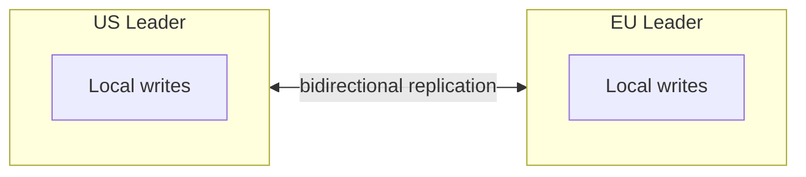
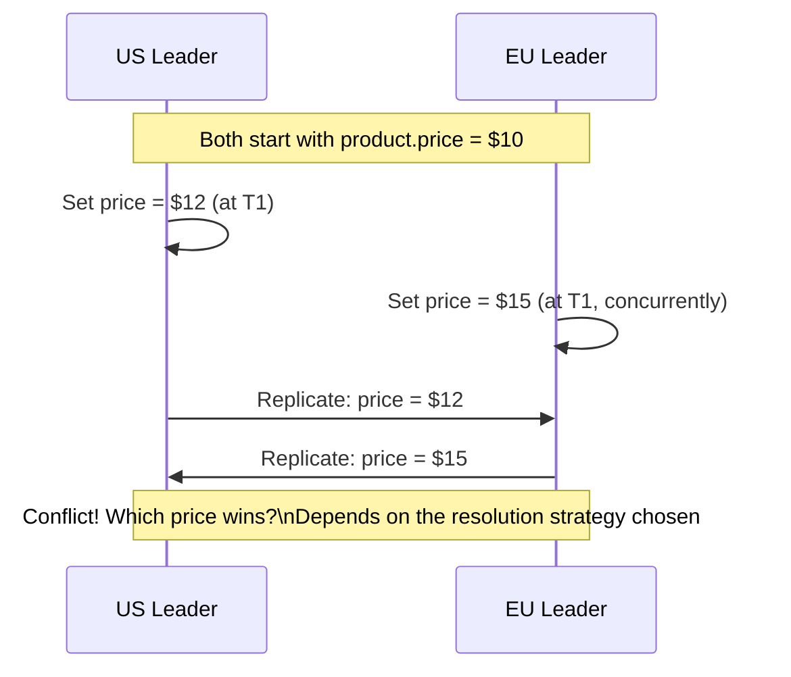

## Definition

Multi-leader replication (also called master-master) is a topology where more than one node can accept writes independently, with each leader replicating its changes to the others — unlike [Leader-Follower](/docs/databases/leader-follower) replication, where only one node ever accepts writes.

## Why it exists

Leader-follower replication funnels all writes through a single node — fine for most systems, but a real problem for globally distributed applications where users in, say, Tokyo and São Paulo both need low-latency writes. Routing every write across the globe to a single leader adds real, unavoidable latency for users far from it. Multi-leader replication exists to let each region accept writes locally, and reconcile them across regions afterward.

## The problem it solves

A single-leader system serving a global user base forces distant users to pay a round-trip-to-the-other-side-of-the-world latency cost on every write. Multi-leader replication solves this by letting each region's leader accept writes locally and fast, propagating them to other regions asynchronously — at the cost of needing to handle the case where two regions' leaders both accept conflicting writes to the same piece of data before they've synced with each other.

## Real-world analogy

Imagine two branch offices of the same company, each authorized to update the same shared customer record independently, without checking with each other first — fast for each office, but if both offices update the same customer's phone number within the same few minutes, before their systems have synced, whose update wins? Someone (or something) needs an explicit policy for resolving that conflict — this is exactly the central challenge of multi-leader replication.

## Simple explanation

Each leader accepts writes for its own users/region, then propagates those writes to all other leaders — most of the time, this works fine (different leaders are usually modifying different data). The genuinely hard part is what to do when two leaders modify the *same* piece of data concurrently, before either has heard about the other's change.

## Technical explanation

### Conflict resolution strategies

- **Last-write-wins (LWW)**: whichever write has the latest timestamp wins, and the other is discarded. Simple, but can silently lose a legitimate concurrent update.
- **Vector clocks**: track causal relationships between writes across nodes, so the system can detect when two writes were genuinely concurrent (rather than one causally following the other) and handle that case explicitly (e.g. by surfacing the conflict to the application, or to the user, rather than silently picking one).
- **Application-level merge**: custom logic specific to the data (e.g. merging two concurrently-edited shopping carts by taking the union of items, rather than picking one cart and discarding the other entirely).
- **CRDTs (Conflict-free Replicated Data Types)**: data structures specifically designed so that concurrent updates can always be merged automatically and deterministically, without losing information or needing manual conflict resolution.

## Internal working — a concrete conflict example

Without a well-designed conflict resolution strategy, this scenario can silently produce different final values on each node, or lose one of the two legitimate updates entirely.

## Advantages

- Enables low-latency writes in multiple geographic regions simultaneously — each region's users write to their local leader, without a round trip to a distant, single global leader.
- Improves availability compared to single-leader — if one region's leader fails, other regions can continue accepting writes independently.

## Disadvantages

- Requires genuine, often complex conflict resolution logic — a much harder problem than single-leader replication's simple, unambiguous write ordering.
- Conflict resolution strategies each have real trade-offs (last-write-wins can silently lose data; application-level merge requires custom logic per data type).
- Debugging is harder — understanding "what actually happened" to a piece of data that was concurrently modified across regions requires tracking causality, not just a simple linear history.

## Trade-offs

Multi-leader replication trades leader-follower's simplicity (one authoritative write order, no conflicts possible) for lower write latency across distant regions — a trade worth making specifically when geographic write latency is a real, measured problem, and a significant unforced complexity cost otherwise.

## Complexity considerations

Multi-leader replication is genuinely one of the harder topics in distributed systems — correctly handling concurrent conflicting writes, especially for data with real business meaning (not just "last write wins" being acceptable), often requires careful, data-specific design (as with CRDTs or explicit application-level merge logic), not a generic, one-size-fits-all solution.

## When to use

- Genuinely global applications where users in multiple distant regions need low-latency writes, and where the specific data involved has a reasonable conflict resolution strategy (or can tolerate last-write-wins semantics).

## When NOT to use

- Systems without a real geographic-latency requirement — the added complexity of conflict resolution isn't worth taking on without a specific problem it's solving.
- Data where losing a legitimate concurrent update (as last-write-wins can do) is unacceptable, unless a more sophisticated conflict resolution approach (vector clocks, CRDTs, application-specific merge) is deliberately implemented.

## Common mistakes

- Adopting multi-leader replication without a real geographic-latency need, taking on significant unforced conflict-resolution complexity for no real benefit.
- Defaulting to last-write-wins without considering whether it's actually acceptable to silently lose legitimate concurrent updates for the specific data involved.
- Underestimating how genuinely hard correct conflict resolution is — treating it as an afterthought rather than a core design decision from the start.

## Interview questions

- "Why might a globally distributed system choose multi-leader replication over single-leader?"
- "Two regions concurrently update the same record — walk me through how your system resolves that conflict."
- "What's the risk of using last-write-wins conflict resolution, and when would you choose a more sophisticated approach instead?"

## Practical example

A collaborative document editor (or shopping cart) allowing edits from multiple regions might use CRDTs specifically so concurrent edits (two users adding different items to a shared cart from different regions) merge automatically and correctly — taking the union of both changes — rather than one region's changes overwriting the other's.

## Production example

CouchDB and Cassandra both support multi-leader (multi-master) style replication topologies, and are commonly used specifically for globally distributed applications needing low-latency local writes in multiple regions, accepting the conflict-resolution complexity as a deliberate trade-off for that latency benefit.

## Best practices

- Only adopt multi-leader replication when there's a real, measured geographic-latency requirement driving it — not as a default replication choice.
- Choose a conflict resolution strategy deliberately based on the actual data and business requirements, rather than defaulting to last-write-wins without considering what it might silently lose.
- Consider CRDTs specifically for data types (counters, sets, collaborative documents) where automatic, correct merging is well-understood and available, rather than building custom conflict resolution from scratch.

## Summary

Multi-leader replication allows more than one node to accept writes independently, solving the geographic write-latency problem single-leader replication can't — at the real cost of needing genuine conflict resolution for concurrent writes to the same data. It's a deliberate, advanced trade-off worth making specifically when low-latency writes across distant regions are a measured, real requirement, not a default replication choice.

## References

- Designing Data-Intensive Applications, Martin Kleppmann (Ch. 5)
- Shapiro et al., "Conflict-free Replicated Data Types" (2011)

<Quiz questions={[
  {
    q: "What is the core new problem multi-leader replication introduces that leader-follower replication doesn't have?",
    options: [
      "Multi-leader replication is always slower",
      "Two leaders can accept conflicting writes to the same data concurrently, requiring genuine conflict resolution logic",
      "Multi-leader systems can't have followers at all",
      "There's no meaningful difference between the two"
    ],
    answer: 1,
    explanation: "Because more than one node can independently accept writes in multi-leader replication, two nodes can concurrently modify the same data before either knows about the other's change - a problem that simply doesn't exist in leader-follower, where there's only ever one authoritative write path."
  }
]} />
