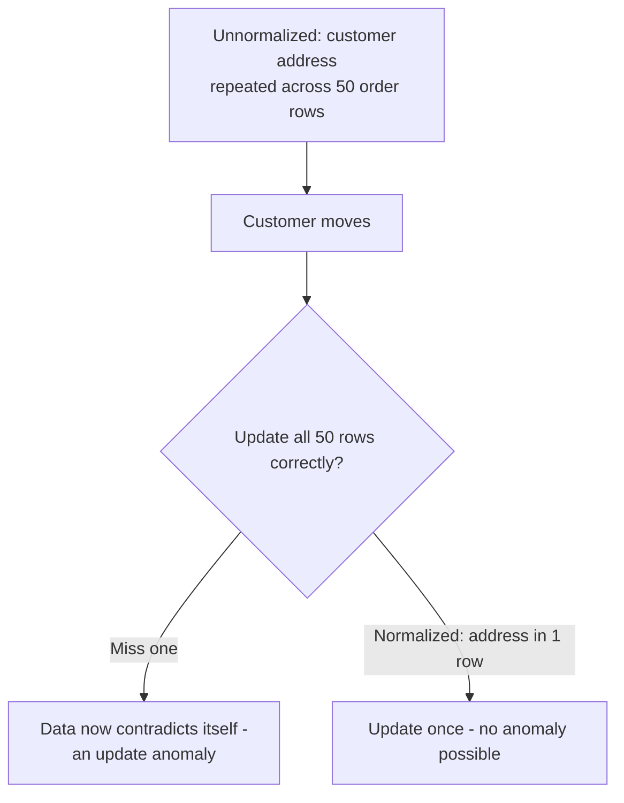

## Definition

Normalization is the process of organizing relational database tables to reduce data redundancy and avoid update anomalies, typically by splitting data into multiple related tables connected via foreign keys, following a series of formal rules called "normal forms."

## Why it exists

Storing the same piece of information in multiple places creates a real risk: when that information changes, every copy must be updated consistently, or the data becomes contradictory. Normalization exists to structure data so each fact is stored in exactly one place, eliminating that risk at the schema design level rather than relying on application code to keep duplicated copies in sync.

## The problem it solves

Consider a single, unnormalized `orders` table that repeats the customer's full name and address on every single order row. If a customer moves, updating their address requires finding and updating every one of their order rows — miss one, and you now have contradictory addresses for the same customer. Normalization solves this by storing the customer's address once, in a `customers` table, referenced (not duplicated) by every order.

## Real-world analogy

Imagine a company that stores each employee's home address separately, written out fully, on every single expense report, timesheet, and performance review they've ever filed. When an employee moves, someone has to hunt down and update every single document — and if even one is missed, the company now has conflicting records about where that employee lives. A normalized approach stores the address once, in the employee's personnel file, and every other document just references "employee #123."

## Simple explanation

Normalization typically means: don't repeat the same fact in multiple rows or tables — store it once, and reference it via a foreign key wherever it's needed.

## Technical explanation

### The normal forms (simplified)

- **First Normal Form (1NF)**: each column holds a single, atomic value (no lists or repeating groups crammed into one field).
- **Second Normal Form (2NF)**: every non-key column depends on the *entire* primary key, not just part of it (relevant for tables with composite keys).
- **Third Normal Form (3NF)**: every non-key column depends *only* on the primary key, not on other non-key columns (eliminating "transitive" dependencies).

### Before and after normalization

**Unnormalized:**
```
orders: order_id, customer_name, customer_address, product_name, product_price
```

**Normalized:**
```
customers: customer_id, name, address
products:  product_id, name, price
orders:    order_id, customer_id (FK), product_id (FK)
```

The normalized version stores each customer's name/address and each product's name/price exactly once, referenced by ID wherever needed — a customer's address update now touches exactly one row, not every order they've ever placed.

## Internal working — update anomalies normalization prevents



Normalization doesn't just save storage space — its main purpose is preventing these anomalies (update, insert, and delete anomalies) that arise specifically from redundant data.

## Advantages

- Eliminates data redundancy, and with it, the risk of contradictory duplicated data.
- Makes updates simpler and safer — change a fact in exactly one place.
- Enforces clearer, more logical data modeling, with explicit relationships via foreign keys.

## Disadvantages

- More tables means more joins are needed to reconstruct a full picture of related data, which can hurt read performance, especially at scale.
- Highly normalized schemas can be less intuitive to query directly for reporting or analytics use cases, which often want a flatter, more denormalized view.

## Trade-offs

Normalization optimizes for write safety and data integrity at some cost to read performance and query simplicity — this is the mirror-image trade-off to [Denormalization](/docs/databases/denormalization), which does the opposite. Real systems often normalize the primary "source of truth" schema, then selectively denormalize specific read paths for performance.

## Complexity considerations

Normalizing to 3NF is a reasonable, common default for most transactional schemas. Going further (4NF, 5NF) addresses increasingly rare and subtle anomalies, and most production systems don't need to go beyond 3NF/Boyce-Codd Normal Form in practice.

## When to normalize heavily

- Transactional systems where write correctness and avoiding data contradiction matters most — order systems, financial records, most traditional business data.

## When to relax normalization

- Read-heavy systems (especially analytics/reporting) where join-heavy normalized queries become a performance bottleneck — see [Denormalization](/docs/databases/denormalization) for the deliberate trade in the other direction.

## Common mistakes

- Under-normalizing early, leading to repeated data and the update anomalies that come with it, especially in systems that will need to support frequent updates to shared data (like customer info).
- Over-normalizing far beyond what's practically needed, resulting in an excessive number of tables and joins for simple, common queries.
- Confusing normalization (a data modeling / correctness concern) with performance optimization — normalization can actually hurt raw read performance, even as it helps write correctness.

## Interview questions

- "Why might storing a customer's address on every order row be a problem?"
- "What's the difference between 2NF and 3NF, conceptually?"
- "When would you deliberately denormalize a normalized schema, and why?"

## Practical example

An e-commerce database normalizes customer information into a single `customers` table, referenced by `customer_id` from an `orders` table — so updating a customer's shipping address is a single-row update, rather than requiring updates across every historical order that customer has ever placed.

## Production example

Traditional relational database schemas for financial and order-management systems (as widely used at companies like Stripe and most e-commerce platforms) are typically normalized to 3NF for their core transactional data, precisely because avoiding update anomalies in financial and order data is critical to correctness.

## Best practices

- Normalize transactional, write-heavy data to at least 3NF as a solid default, to avoid update anomalies.
- Use foreign keys to enforce the relationships normalization creates, rather than relying on application code alone.
- Selectively denormalize specific read paths (via caching, materialized views, or a separate read-optimized schema) once join-heavy normalized queries become a measured performance bottleneck — rather than avoiding normalization altogether from the start.

## Summary

Normalization organizes relational data to store each fact exactly once, eliminating the data redundancy that causes update anomalies (contradictory duplicated data after a partial update). It trades some read-query simplicity and performance (more joins needed) for write correctness and data integrity — a trade-off usually worth making for transactional data, and one that's often selectively reversed (denormalized) for specific read-heavy paths.

## References

- Codd, E.F., "Further Normalization of the Data Base Relational Model" (1971)
- Designing Data-Intensive Applications, Martin Kleppmann (Ch. 2)

<Quiz questions={[
  {
    q: "What specific problem does normalization primarily prevent?",
    options: [
      "Slow queries in general",
      "Update anomalies - contradictory data resulting from redundant copies of the same fact not all being updated together",
      "Running out of disk space",
      "SQL injection attacks"
    ],
    answer: 1,
    explanation: "Normalization's core purpose is eliminating redundant storage of the same fact across multiple rows, which is what causes update anomalies when only some copies get updated."
  }
]} />
