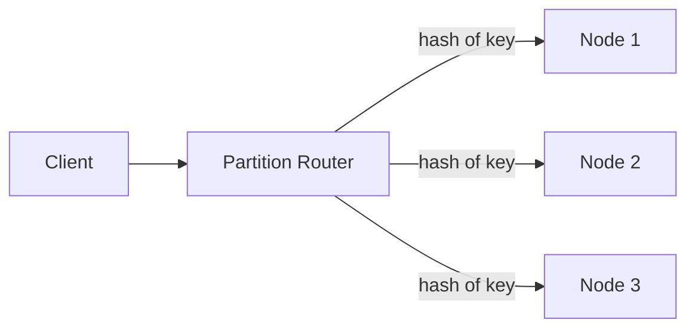

## Definition

NoSQL ("not only SQL") is an umbrella term for databases that don't use the traditional relational model — no fixed schema of tables and joins. It covers several genuinely different data models: **document**, **key-value**, **column-family**, and **graph** stores, each optimized for different access patterns.

## Why it exists

Relational databases, while powerful, weren't originally designed for the horizontal scale, flexible/evolving schemas, or specific access patterns (extremely fast key lookups, deeply nested documents, huge sparse tables) that many modern, internet-scale applications need. NoSQL systems emerged specifically to make different trade-offs — usually relaxing some relational guarantees (joins, fixed schema, strong consistency) in exchange for easier horizontal scaling or a better fit for a specific data shape.

## The problem it solves

Forcing certain kinds of data — deeply nested, variably-structured documents; simple, massive-scale key-value lookups; highly interconnected graph relationships — into a rigid relational schema is often awkward and can hurt performance at scale. NoSQL databases solve this by matching the storage model to the actual shape and access pattern of the data, rather than forcing everything through one general-purpose relational model.

## Real-world analogy

If a relational database is a set of precisely labeled filing cabinets with strict cross-referencing rules, a NoSQL document store is more like a set of complete, self-contained folders — each folder (document) has everything relevant to one entity bundled together, so you don't need to cross-reference other cabinets to get the full picture, at the cost of some duplication between folders.

## Simple explanation

NoSQL isn't one thing — it's four genuinely different data models, each suited to different problems:

- **Document** (MongoDB, Couchbase): stores flexible, often nested JSON-like documents.
- **Key-value** (Redis, DynamoDB): the simplest model — a key maps to an opaque value, optimized for extremely fast lookups.
- **Column-family** (Cassandra, HBase): optimized for very wide tables with many columns, often sparse, and huge scale.
- **Graph** (Neo4j): optimized for data that's primarily about relationships/connections — social networks, recommendation graphs.

## Technical explanation

### Document model example

```json
{
  "userId": "123",
  "name": "Ada",
  "orders": [
    { "orderId": "A1", "total": 42.50 },
    { "orderId": "A2", "total": 17.00 }
  ]
}
```

A user and their orders are stored together in one document — no join needed to retrieve a user with their recent orders, unlike a relational model where this would require joining two tables. The trade-off: if order data needs to be queried independently at scale (e.g. "all orders over $1000 across all users"), this embedded structure is less convenient than a proper relational table.

## Internal working — why NoSQL often scales horizontally more easily

Many NoSQL databases were designed from the ground up around horizontal partitioning (sharding) and eventual consistency, rather than having it bolted on later:



By avoiding cross-node joins (a document typically contains everything needed for a common query) and often relaxing strict consistency requirements, these systems can distribute data across many nodes more straightforwardly than a relational database built around join-heavy queries.

## Advantages

- Schema flexibility — documents in the same collection don't need identical structure, easing iteration as data models evolve.
- Many NoSQL systems are designed for horizontal scale and high availability from the ground up.
- Data models (especially document and key-value) that map naturally onto how many applications actually access data — fetch one thing, with everything relevant bundled together.

## Disadvantages

- Weaker (or absent) support for complex, ad-hoc queries across many related entities — no general-purpose joins the way relational databases provide.
- Many NoSQL systems relax strong consistency by default (see [CAP Theorem](/docs/fundamentals/cap-theorem)), which the application must be designed to tolerate.
- Schema flexibility can become a liability without discipline — inconsistent document shapes across a collection can create real maintenance headaches.

## Trade-offs

NoSQL trades relational rigor (joins, enforced schema, and often strong consistency) for horizontal scalability and flexibility matching specific access patterns — the right trade for the specific data shapes and scale each NoSQL type targets, and not automatically "better" than relational for data that's genuinely relational in nature.

## Complexity considerations

Choosing the right NoSQL type for the actual access pattern matters enormously — a document store used like a relational database (constantly needing to join across documents in application code) fights against its own design, while a document store used for genuinely document-shaped, self-contained data plays to its strengths.

## When to use

- **Document**: content management, user profiles with variable/nested attributes, catalogs.
- **Key-value**: caching, session storage, extremely high-throughput simple lookups.
- **Column-family**: time-series data, huge-scale write-heavy workloads (e.g. IoT sensor data).
- **Graph**: social networks, recommendation engines, fraud detection — anything primarily about relationships between entities.

## When NOT to use

- Data with complex, evolving relationships that benefit from ad-hoc relational queries and strong consistency guarantees, such as financial ledgers or systems requiring multi-entity transactional integrity — a relational database is often still the better fit.

## Common mistakes

- Choosing a NoSQL database simply because "it scales better," without evaluating whether the actual data and access pattern fit its specific model.
- Ending up needing application-level "joins" (multiple round trips) constantly with a document or key-value store, when the data was actually relational in nature and would have been served better by SQL.
- Assuming all NoSQL databases make the same trade-offs — they don't; document, key-value, column-family, and graph databases are genuinely different tools solving different problems.

## Interview questions

- "Why might you choose a document database over a relational one for this specific use case?"
- "What are you giving up by choosing a NoSQL store here, compared to a relational one?"
- "Which NoSQL data model — document, key-value, column-family, or graph — best fits this specific access pattern, and why?"

## Practical example

A product catalog with highly variable attributes per category (a shirt has size/color, a laptop has RAM/storage, and forcing both into one rigid relational schema is awkward) is a natural fit for a document database, where each product document simply contains whatever attributes are relevant to it.

## Production example

Amazon's DynamoDB (a key-value/document hybrid) powers their shopping cart service specifically because of its horizontal scalability and availability characteristics, deliberately trading strict consistency (see the [CAP Theorem](/docs/fundamentals/cap-theorem) and [PACELC](/docs/fundamentals/pacelc) pages) for always-on availability at massive scale.

## Best practices

- Choose the specific NoSQL data model (document, key-value, column-family, graph) based on the actual shape of your data and access pattern, not just "NoSQL vs. SQL" as a binary choice.
- Design document/key structures around your application's actual query patterns, since NoSQL databases generally support far fewer flexible, ad-hoc query capabilities than SQL.
- Be explicit about what consistency model your chosen NoSQL database provides, and make sure your application logic can tolerate it (e.g. handling eventual consistency gracefully).

## Summary

NoSQL is an umbrella term covering document, key-value, column-family, and graph databases — genuinely different data models, each trading some relational capabilities (joins, strict schema, sometimes strong consistency) for horizontal scalability or a better natural fit to a specific data shape and access pattern. The right choice depends entirely on matching the database type to your actual data and query needs, not a blanket "NoSQL is more scalable" assumption.

## References

- Designing Data-Intensive Applications, Martin Kleppmann (Ch. 2)
- MongoDB, DynamoDB, Cassandra, Neo4j documentation

<Quiz questions={[
  {
    q: "Why might a document database avoid needing a 'join' for a common query, unlike a relational database?",
    options: [
      "Document databases don't support queries at all",
      "Related data is often embedded together in a single document, so retrieving it doesn't require combining data from separate tables",
      "Document databases are always faster regardless of data shape",
      "Joins are illegal in NoSQL by definition"
    ],
    answer: 1,
    explanation: "A document often bundles an entity and its closely related data together (e.g. a user and their recent orders), avoiding the need to combine separate tables the way a relational join would — at the cost of some data duplication and less flexibility for independent queries across that embedded data."
  }
]} />
